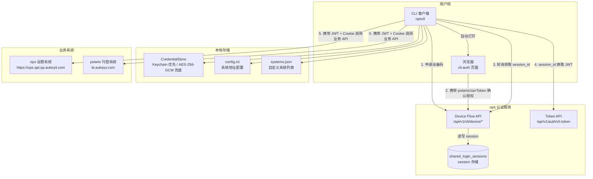
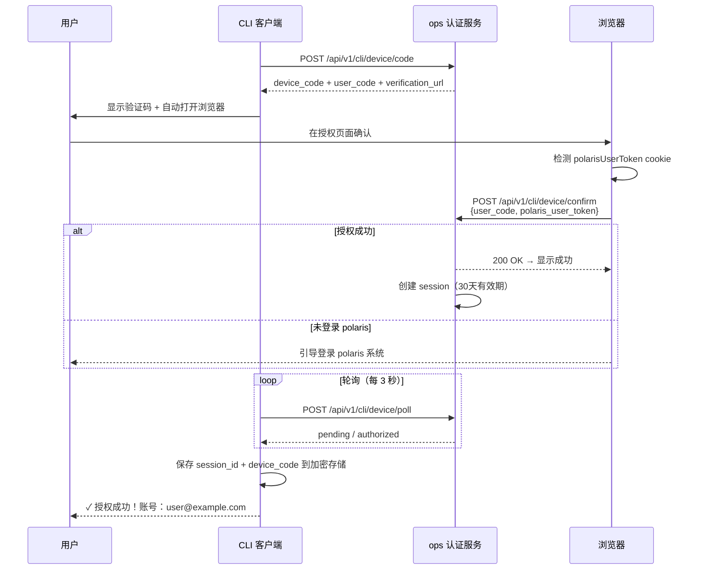
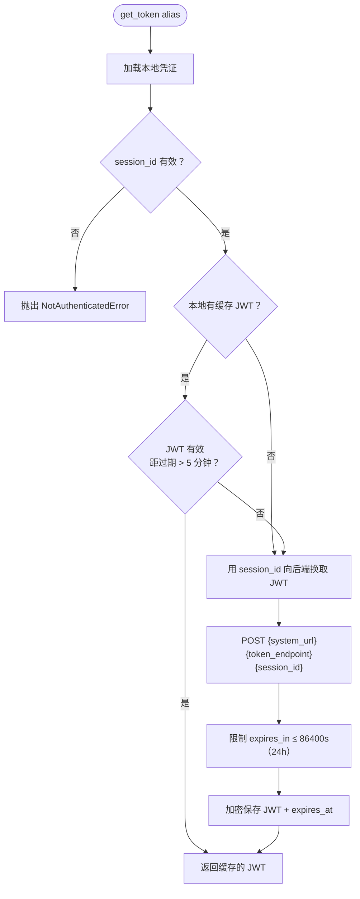
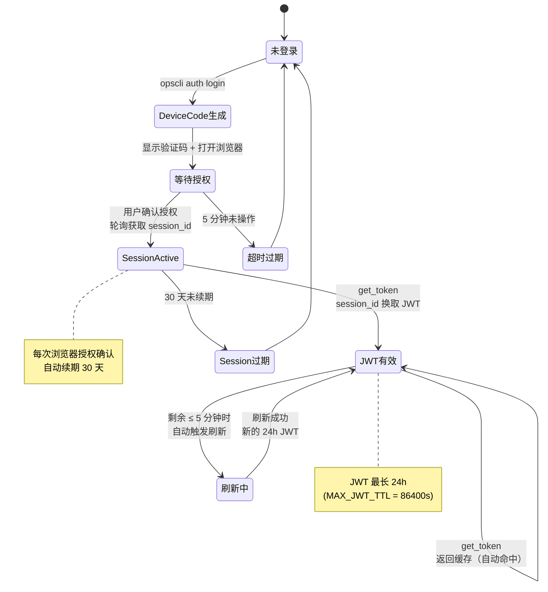
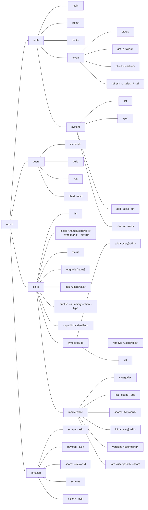
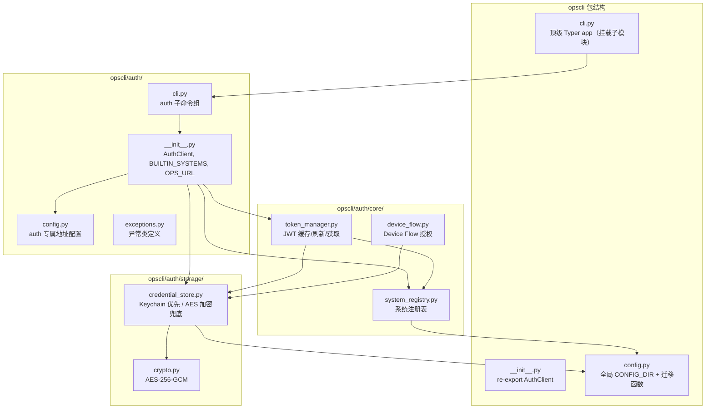
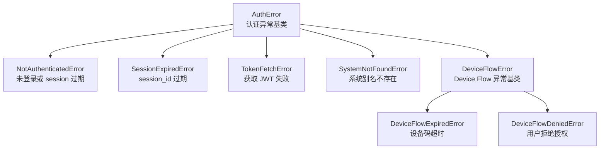

# opscli

Aukeys 运营 CLI 工具集

> 当前模块：auth（认证授权）、query（数据查询）、skills（Skill 生命周期管理）、amazon（Amazon 数据采集）、seller-sprite（卖家精灵关键词与 Listing 分析材料采集）、collector-monitor（采集任务监控、提醒与受控链路测试）；后续可扩展更多模块（deploy、notify 等）
>
> 说明：本文档中涉及 `aukeys-opscli[amazon]`、`opscli-core`、独立模块包、动态插件化等内容，部分属于预留设计或未来演进方向。**截至当前仓库版本，请以单包 `aukeys-opscli` + 仓库内静态注册模块为准，不要将这些内容视为已落地的发布承诺。**

## 功能概述

### auth 模块

- **Device Flow 授权**：通过浏览器完成 CLI 登录认证
- **多系统 Token 管理**：统一获取和管理 ops/polaris 系统的 JWT
- **三态 Token 状态**：`valid / needs_refresh / expired`，过期前 5 分钟自动刷新
- **Keychain 优先存储**：macOS 钥匙串 → AES-256-GCM 文件双层兜底
- **并发安全**：线程锁 + 跨进程文件锁，防止多进程并发重复换取 JWT
- **Scope 权限展示**：`status` 命令自动解析 JWT 显示各系统已授权权限
- **Session 30 天有效期**：每次浏览器授权确认自动续期
- **可配置地址**：支持通过配置文件覆盖系统地址，无需改代码

### skills 模块

- **Skill 安装**：支持安装内置模板（`ops-dataset-query` 等），也支持通过 `username@skill_name` 从技能广场远程安装
- **Skill 扫描**：自动扫描 `--skills-dir`、`OPSCLI_SKILLS_DIR`、`.claude/skills`、`.openclaw/skills`
- **Skill 升级**：从远端拉取 `manifest`、字段 CSV、数据集 CSV、查询元数据
- **统一 JSON 输出**：默认适合脚本消费，`--pretty` 可切换可读格式
- **数据查询支持**：通过 `opscli skills` 与 `opscli query` 组合完成元数据读取、构造 payload 与远端执行
- **Amazon Skill 模板**：支持安装 `ops-amazon`，指导 AI 使用 `opscli amazon` 完成抓取和字段取样
- **技能广场**：通过 `opscli skills marketplace` 子命令浏览、搜索、查看技能详情、评分；`marketplace categories` 查看所有分类；支持 `publish` / `unpublish` / `edit` 将本地 Skill 发布或编辑元数据，发布/编辑时若未指定 `--category` 则自动匹配最合适的分类；远程安装时自动解压到 `~/.opscli/skills/` 并软链接到全局 AI 工具目录
- **市场同步**：`opscli skills install --sync-market` 将市场安装记录一键同步到本地（补装缺失 + 升级旧版），支持 `--dry-run` 预览，通过 `sync-exclude` 子命令管理不同步黑名单
- **Skill 元数据编辑**：`opscli skills edit` 在线修改已发布技能的标题、摘要、分享范围等，无需重新打包发布

### query 模块

- **元数据读取**：支持按 `dataset_alias` 或 `table_id` 读取 query metadata
- **查询构造**：支持通过维度、指标、筛选、排序等参数生成标准 query payload
- **即时执行**：支持直接转发 payload 到远端查询服务
- **图表查询**：通过 `chart_uuid` 获取图表查询结构，支持多 query 并行执行与结果合并
- **JSON 优先输出**：默认适合 Skill 和脚本消费

### amazon 模块

- **商品页抓取**：抓取 Amazon 商品页价格、评分、评论数、配送位置等快照
- **搜索结果抓取**：抓取关键词搜索结果页，沉淀竞品结果集
- **标准 payload 预留**：输出未来提交给 ops API 的标准请求体
- **本地历史存档**：商品抓取结果可落本地 JSONL，便于趋势分析和后续补数

### seller-sprite 模块

- **关键词材料采集**：围绕显式关键词采集卖家精灵高频词和关键词挖掘数据
- **Listing 分析证据**：围绕 ASIN 和关键词保存接口 JSON、截图、HTML、Markdown 与标准化结果
- **默认 50 条**：关键词挖掘默认采集 50 条，支持通过 `--limit` 控制
- **验证码预留**：一期检测并留痕验证码，后续可接入超级鹰图形验证码 provider
- **浏览器运行时**：`browser-route` 默认使用 Patchright，安装 `aukeys-opscli[seller-sprite]` 后执行 `python -m patchright install chromium`；现有 Playwright 页面、定位、路由和 request API 无需替换，可通过 `OPSCLI_SELLER_SPRITE_BROWSER_RUNTIME=playwright` 回退

### collector-monitor 模块

- **独立监督服务**：与 Collector MCP 分进程运行，严格只读 SellerSprite 任务库，监控私有状态写入独立 SQLite
- **任务与队列健康**：综合业务进度、执行租约、runtime 心跳、Generic/Listing 精确容量和领取活动，识别 `stalled`、`orphaned`、`queue_starved`、`worker_unavailable`
- **网页、API 与 CLI**：提供本机监督台、Collector 状态、活动/已恢复事故历史、健康探针、JSON API 和 `opscli collector-monitor` 查询命令
- **企业微信提醒**：支持事故首次告警、升级、冷却提醒和恢复通知；Webhook 只从受保护文件读取
- **安全边界**：一期不修改已有任务状态，不提供取消、重试、重新入队或浏览器控制；仅显式开关允许固定关键词反查链路测试

---

## 系统架构



---

## 安装

```bash
# 从 PyPI 安装（正式环境）
pip install aukeys-opscli

# 以下 extra 安装写法来自预留拆分设计，当前不作为正式发布承诺
# pip install "aukeys-opscli[amazon]"
# playwright install chromium

# 从 TestPyPI 安装（测试环境）
# ⚠️ 必须加 --extra-index-url，否则依赖解析会失败回退到旧版本
pip install \
    --index-url https://test.pypi.org/simple/ \
    --extra-index-url https://pypi.org/simple/ \
    aukeys-opscli

# 从源码开发模式安装
git clone <repo-url> opscli
cd opscli
pip install -e .

# 以下 extra 安装写法来自预留拆分设计，当前不作为正式发布承诺
# pip install -e ".[amazon]"
# playwright install chromium
```

> 发行包名为 `aukeys-opscli`，安装后仍使用 `opscli` 作为命令入口。
>
> 当前现状说明：仓库代码仍按单包方式维护与发布，文档中若出现 extras、拆包或插件化表述，请优先按“设计预留”理解。

---

## 升级

```bash
opscli self-update
```

一条命令完成 CLI 升级与 Skills 同步。详见 [docs/guide/CLI升级指南.md](docs/guide/CLI升级指南.md)。

---

## 快速开始

```bash
# 1. 登录授权
opscli auth login

# 2. 查看状态
opscli auth token status

# 3. 获取 ops 运营系统 JWT
opscli auth token get --system ops

# 4. 获取 polaris 刊登系统 JWT
opscli auth token get --system polaris

# 5. 安装 ops-dataset-query Skill
opscli skills install ops-dataset-query

# 6. 拉取真实数据
opscli skills upgrade ops-dataset-query

# 7. 抓取 Amazon 商品页
opscli amazon scrape --asin B09LCJPZ1P --include-raw --pretty

# 8. 输出预留给 ops API 的标准 payload
opscli amazon payload --asin B09LCJPZ1P --pretty

# 9. 抓取 Amazon 搜索结果
opscli amazon search --keyword "usb c cable" --limit 5 --pretty

# 10. 查看卖家精灵字段契约
opscli seller-sprite schema --pretty

# 11. 保存卖家精灵命名账号（密码通过终端隐藏输入）
opscli seller-sprite account save --name default --username <USERNAME>

# 12. 采集卖家精灵关键词材料；未登录时使用命名账号在同一窗口登录后继续采集
opscli seller-sprite collect --keyword bed --account default --site us --period 30d --limit 50 --output-dir ./seller_sprite_runs --pretty

# 13. 手动登录和状态检查仍可用于调试
opscli seller-sprite login
opscli seller-sprite login-status --output-dir ./seller_sprite_runs --pretty

# 14. 退出登录
opscli auth logout
```

### Collector Monitor 快速开始

Collector Monitor 是独立长运行服务，默认监听 `127.0.0.1:8767`：

```bash
# 启动服务
opscli collector-monitor serve
# 或使用独立入口
opscli-collector-monitor

# 查询缓存状态
opscli collector-monitor status
opscli collector-monitor tasks --health stalled
opscli collector-monitor show <JOB_ID>
opscli collector-monitor incidents
opscli collector-monitor probe --target collector
opscli collector-monitor probe --target queue-source
```

浏览器访问 `http://127.0.0.1:8767/`。SellerSprite 和 Monitor 共用 `OPSCLI_SELLER_SPRITE_QUEUE_DB_PATH`，默认读取 `~/.config/opscli/seller_sprite/task_queue.sqlite3`；Monitor 使用 SQLite `mode=ro` 与 `query_only`，不会迁移或修改业务任务。兼容变量 `OPSCLI_COLLECTOR_MONITOR_QUEUE_DB_PATH` 可保留，但同时配置时必须一致。Monitor 自有事故状态写入 `~/.config/opscli/collector_monitor/state.sqlite3`，不能与业务库指向同一物理文件。页面会接收 API Key，因此 Monitor URL 仅允许 HTTPS 或明确回环 HTTP。

页面和 CLI 提供固定目标的手动探测，单目标只允许一个并发、完成后冷却 10 秒、总超时不超过 5 秒。Collector Tab 可输入 MCP API Key；默认仅用于下一次探测并在发送后清空，也可主动选择以明文保存到当前浏览器的 `localStorage`，取消选择会立即删除。无论是否保存，Key 都不会写入 Monitor 服务端配置、缓存或状态；页面 7 秒自动刷新只读取缓存，不会自动调用 Collector，也不会提交或重试业务任务。

页面另有“场景测试”Tab，可在显式设置 `OPSCLI_COLLECTOR_MONITOR_SCENARIO_TEST_ENABLED=true` 后提交固定 `keyword-reverse`（关键词反查）真实任务，用于验证 API Key、入队与调度链路。该操作会消耗额度，必须填写页面 API Key 并勾选确认；服务端不接受任意工具或场景，不自动重试，也不会借用服务端 Key 文件，成功返回 `job_id` 供任务 Tab 跟踪。启用时必须同时配置 `OPSCLI_COLLECTOR_MONITOR_COLLECTOR_MCP_URL`，该地址必须使用 HTTPS 或明确回环 HTTP。

Collector Monitor 默认读取项目内随包分发的企业微信机器人文件；`OPSCLI_COLLECTOR_MONITOR_WEBHOOK_FILE` 可覆盖该路径，显式空值可禁用。服务端持久 Collector MCP API Key 仍必须放在权限受限文件中，并通过 `OPSCLI_COLLECTOR_MONITOR_COLLECTOR_MCP_API_KEY_FILE` 配置。页面 `localStorage` 选项只适合受控运维终端，会以当前页面同源脚本可读取的明文形式保存在浏览器 Profile 中，不替代生产 Key 文件。配置 API Key 文件或启用场景测试时，Collector MCP 地址必须使用 HTTPS，仅明确回环地址允许 HTTP；携带密钥的调用不跟随重定向。容量按任务类型计算，并扣除 SQLite 全局运行任务和本实例活跃尝试中的 Generic、Listing、专属任务及其他调度器共享账号占用。默认服务没有应用层认证，不应直接暴露公网；非回环部署必须使用 HTTPS 与运维认证后才能输入或保存页面 Key。

完整配置、部署和判定合同见：

- [采集任务监控服务设计](docs/design/采集任务监控服务设计.md)
- [Collector Monitor 运维说明](docs/release/Collector%20Monitor运维说明.md)

---

## 核心流程图

### Device Flow 授权登录



### Token 获取与自动刷新



### Token 生命周期



---

## CLI 命令参考

### 命令树总览



### 授权管理

#### `opscli auth login` - Device Flow 授权登录

```bash
opscli auth login
```

触发 Device Flow 授权流程：CLI 申请设备码 → 自动打开浏览器 → 用户确认授权 → CLI 获取 session。

**输出示例**：
```
请在浏览器打开： http://ops.cm/cli-auth
输入验证码：   AB12-CD34
等待授权中...（300 秒内完成）

✓ 授权成功！账号：user@example.com
```

#### `opscli auth logout` - 退出登录

```bash
opscli auth logout
```

清除本地所有凭证（session_id + 全部系统 JWT）。

#### `opscli auth token status` - 查看登录状态

```bash
opscli auth token status
```

**输出示例**：
```
已登录  user@example.com
Session 过期：2026-05-17T10:00:00

┏━━━━━━━━━┳━━━━━━━━━━━━━━┳━━━━━━━━━━━━┳━━━━━━━━━━━━━┓
┃ 别名    ┃ System Key   ┃ Token 状态 ┃ 剩余时间(s) ┃
┡━━━━━━━━━╇━━━━━━━━━━━━━━╇━━━━━━━━━━━━╇━━━━━━━━━━━━━┩
│ ops     │ ops          │ 有效       │ 82800       │
│ polaris │ polaris      │ 有效       │ 82800       │
└─────────┴──────────────┴────────────┴─────────────┘
  权限（3 项）：read write admin
  权限（2 项）：read write
```

---

### Token 管理

#### `opscli auth token get` - 获取 JWT（纯文本输出，适合脚本）

```bash
# 获取 ops 系统 JWT
opscli auth token get --system ops
opscli auth token get -s ops

# 获取 polaris 系统 JWT
opscli auth token get --system polaris
opscli auth token get -s polaris
```

| 参数       | 简写 | 必需 | 说明                      |
| ---------- | ---- | ---- | ------------------------- |
| `--system` | `-s` | 是   | 系统别名（ops / polaris） |

**脚本集成示例**：
```bash
# Shell 脚本中获取 token 并调用 API
TOKEN=$(opscli auth token get -s ops)
curl -s -H "Authorization: Bearer $TOKEN" \
    "https://https://ops.api.qa.aukeyit.com/api/v1/some-endpoint"

# Python 脚本中调用
python3 -c "
import httpx
from opscli import AuthClient
token = AuthClient().get_token('ops')
resp = httpx.get('https://https://ops.api.qa.aukeyit.com/api/v1/resource',
                  headers={'Authorization': f'Bearer {token}'})
print(resp.json())
"
```

#### `opscli auth token check` - 检测 Token 有效性

```bash
opscli auth token check --system ops
opscli auth token check -s polaris
```

#### `opscli auth token refresh` - 刷新 Token

```bash
# 刷新单个系统
opscli auth token refresh --system ops

# 刷新全部系统
opscli auth token refresh --all
```

---

### 系统管理

#### `opscli auth system list` - 列出所有已注册系统

```bash
opscli auth system list
```

#### `opscli auth system sync` - 从 ops 同步系统列表

```bash
opscli auth system sync
```

#### `opscli auth system add` - 手动添加系统

```bash
opscli auth system add --alias 数据分析 --url http://analytics.cm
opscli auth system add --alias 财务系统 --url http://finance.cm --key finance
```

| 参数      | 必需 | 说明                            |
| --------- | ---- | ------------------------------- |
| `--alias` | 是   | 系统别名（用于 CLI 调用）       |
| `--url`   | 是   | 系统 base URL                   |
| `--key`   | 否   | 存储键（默认从 alias 自动生成） |

#### `opscli auth system remove` - 移除手动添加的系统

```bash
opscli auth system remove --alias 数据分析
```

> 内置系统（ops/polaris）不可移除，仅能移除 `local` 来源的系统。

---

### 诊断工具

#### `opscli auth doctor` - 环境检查

```bash
opscli auth doctor
```

**输出示例**：
```
opscli auth 环境检查

✓ 已登录
✓ ops 可访问
✓ polaris 可访问
```

#### `opscli --version` - 显示版本

```bash
opscli --version
opscli -V
```

**输出示例**：
```
opscli v0.0.4
```

---

## Python SDK

作为 Python SDK 在其他项目中调用：

```python
# 两种导入方式均可
from opscli import AuthClient
from opscli.auth import AuthClient

client = AuthClient()
```

### 方法列表

| 方法                           | 返回值              | 说明                                                  |
| ------------------------------ | ------------------- | ----------------------------------------------------- |
| `is_authenticated()`           | `bool`              | 是否已登录                                            |
| `get_token(alias)`             | `str`               | 获取 JWT（自动缓存+刷新）                             |
| `get_session(alias)`           | `str`               | 获取当前登录态对应的 `session_id`                     |
| `get_device_code()`            | `str \| None`       | 获取当前登录态对应的 `device_code`                    |
| `build_request_auth(alias)`    | `tuple[dict, dict]` | 构造业务接口请求所需的 `headers` 和 `cookies`         |
| `build_session_headers(alias)` | `dict`              | 构造 ops session 型接口所需的 `X-Session-Id` 请求头   |
| `check_token(alias)`           | `dict`              | 检测有效性，返回 `{"valid": bool, "expires_in": int}` |
| `refresh_token(alias)`         | `str`               | 强制刷新 JWT                                          |

### 使用示例

```python
import httpx
from opscli import AuthClient

client = AuthClient()

# 检查登录状态
if not client.is_authenticated():
    print("未登录，请先执行: opscli auth login")
    exit(1)

# 获取统一认证参数并调用业务 API
headers, cookies = client.build_request_auth("ops")
resp = httpx.get(
    "https://https://ops.api.qa.aukeyit.com/api/v1/operation-reminder/list",
    headers=headers,
    cookies=cookies,
)
print(resp.json())

# 获取 polaris 系统统一认证参数
headers, cookies = client.build_request_auth("polaris")
resp = httpx.get(
    "https://bi.aukeys.com/api/some-endpoint",
    headers=headers,
    cookies=cookies,
)
print(resp.json())
```

其中 `build_request_auth()` 返回的认证参数形如：

```python
headers = {"Authorization": "Bearer <jwt>"}
cookies = {
    "polarisUserToken": "<session_id>",
    "opscliDeviceCode": "<device_code>",  # 本地存在时自动附带
}
```

### 异常处理

```python
from opscli import AuthClient
from opscli.auth.exceptions import (
    NotAuthenticatedError,
    TokenFetchError,
    SystemNotFoundError,
)

client = AuthClient()

try:
    token = client.get_token("ops")
except NotAuthenticatedError:
    print("未登录，请运行: opscli auth login")
except SystemNotFoundError:
    print("系统别名不存在，用 system list 查看可用系统")
except TokenFetchError as e:
    print(f"获取 JWT 失败: {e}")
```

### 在 pyproject.toml 中声明依赖

```toml
[project]
dependencies = [
    "opscli",
]
```

---

## 模块架构



---

## 配置文件

### 存储目录

凭证优先存入系统 **Keychain**（macOS 钥匙串），Keychain 不可用时自动降级到本地加密文件。

```
~/.config/opscli/
├── config.ini         # 系统地址配置（可选，覆盖默认值）
├── credentials.bin    # 加密凭证兜底（Keychain 不可用时启用）
├── .key               # AES 加密密钥（权限 600，Keychain 兜底时使用）
├── .lock_<key>        # 跨进程并发文件锁（运行时临时文件）
└── systems.json       # 用户自定义系统列表
```

### 系统地址配置

代码中内置生产环境默认地址。如需覆盖（如本地开发），创建 `~/.config/opscli/config.ini`：

```ini
[systems]
# ops 认证服务地址
ops_url = http://localhost/api
# ops 运营系统地址
ops_system_url = http://ops.cm
ops_token_endpoint = /api/v1/auth/cli-token
# polaris 刊登系统地址
polaris_system_url = http://po2.cm
polaris_token_endpoint = /api/auth/cli-token
```

**配置优先级**：`config.ini` 用户配置 > 代码默认值（生产环境）

### Token 生命周期

| 类型        | 有效期      | 说明                                                  |
| ----------- | ----------- | ----------------------------------------------------- |
| Session ID  | **30 天**   | 登录后签发，浏览器授权确认时自动续期                  |
| JWT Token   | **24 小时** | 用 session_id 换取，三态管理（过期前 5 分钟自动刷新） |
| Device Code | **5 分钟**  | login 时生成，超时需重新执行 login                    |

---

## 打包与发布

详见 [打包发布指南](docs/opscli-publish-guide.md)。

### 一键发布（推荐）

使用 `publish.sh` 脚本自动完成版本号升级、构建、校验和上传：

```bash
# 默认发布到 TestPyPI（patch 升版）
./publish.sh

# 指定升版类型，发布到 TestPyPI
./publish.sh patch          # 0.0.53 → 0.0.54
./publish.sh minor          # 0.0.53 → 0.1.0
./publish.sh major          # 0.0.53 → 1.0.0

# 发布到正式 PyPI（需二次确认）
./publish.sh patch prod
```

### 手动发布

```bash
# 1. 修改 pyproject.toml 中的 version 字段
# 2. 构建并上传
rm -rf dist/ build/ && python -m build
twine check dist/*
twine upload --repository testpypi dist/*   # TestPyPI
twine upload dist/*                          # 正式 PyPI
```

### TestPyPI 安装验证

> **重要**：TestPyPI 上缺少部分依赖包（如 cryptography、httpx 等），安装时必须加 `--extra-index-url` 指向正式 PyPI，否则 pip 解析依赖失败后会回退到旧版本。

```bash
# 从 TestPyPI 安装（指定版本号）
pip install \
    --index-url https://test.pypi.org/simple/ \
    --extra-index-url https://pypi.org/simple/ \
    aukeys-opscli==<版本号>

# 从 TestPyPI 安装（最新版）
pip install \
    --index-url https://test.pypi.org/simple/ \
    --extra-index-url https://pypi.org/simple/ \
    aukeys-opscli

# ❌ 错误：只用 TestPyPI 做索引源，依赖解析会失败或回退到旧版本
pip install -i https://test.pypi.org/simple/ aukeys-opscli
```

验证安装：

```bash
opscli --version
python -c "from opscli import AuthClient; print('SDK OK')"
```

### 常见问题

| 问题                  | 原因                            | 解决方式                                          |
| --------------------- | ------------------------------- | ------------------------------------------------- |
| `File already exists` | PyPI 不允许覆盖同版本号         | 修改 `pyproject.toml` 中的 `version` 后重新构建   |
| `Invalid API Token`   | `~/.pypirc` 中 token 过期或错误 | 重新生成 token 并更新 `~/.pypirc`                 |
| TestPyPI 安装到旧版本 | 缺少 `--extra-index-url`        | 加上 `--extra-index-url https://pypi.org/simple/` |

---

## 错误处理

| 场景           | 错误信息                                    | 处理方式                                |
| -------------- | ------------------------------------------- | --------------------------------------- |
| 未登录         | `未登录，请运行: opscli auth login`         | 执行 login                              |
| session 过期   | `登录已过期，请重新运行: opscli auth login` | 重新 login                              |
| Token 过期     | `已过期或未获取`                            | 执行 token refresh 或自动刷新           |
| 系统别名不存在 | `系统 'xxx' 未注册`                         | 用 system list 查看，或 system add 添加 |
| 目标系统不可达 | `获取 xxx JWT 失败`                         | 用 doctor 检查连通性                    |

### `skills` 常见错误

| 场景               | 典型提示                                 | 处理方式                                                             |
| ------------------ | ---------------------------------------- | -------------------------------------------------------------------- |
| 未登录 ops         | `未登录 ops，请先执行 opscli auth login` | 先执行 `opscli auth login`                                           |
| 远端环境未部署接口 | `远端环境未部署该 Skill 接口`            | 检查 `~/.config/opscli/config.ini` 中的 `ops_url` 是否指向已部署环境 |
| 远端接口鉴权失败   | `远端 Skill 接口鉴权失败`                | 重新登录后重试                                                       |
| 远端返回坏 JSON    | `远端接口返回了无法解析的 JSON`          | 检查目标环境接口返回内容                                             |
| 本地未安装 Skill   | `未找到已安装 Skill: ops-dataset-query`  | 先执行 `opscli skills install ops-dataset-query`                     |

### 异常类



---

## 依赖

- Python >= 3.10
- typer >= 0.12
- httpx >= 0.27
- cryptography >= 38, < 42
- rich >= 13
- keyring >= 25（Keychain 存储，macOS 钥匙串优先）

## 新增模块规范

在 `opscli/cli.py` 中追加一行注册：

```python
from opscli.{module_name}.cli import app as {module_name}_app
app.add_typer({module_name}_app, name="{module_name}")
```

新模块配置统一存放在 `~/.config/opscli/` 下，通过 `opscli.config.CONFIG_DIR` 获取。

## 图表查询

### `opscli query chart` - 通过 chart_uuid 获取查询结构并执行

```bash
# 仅查看图表查询结构
opscli query chart --uuid 32f660fd-f62a-45c4-a443-e21f2edb0779 --pretty

# 获取并执行所有查询（多 query 结果自动合并）
opscli query chart --uuid 32f660fd-f62a-45c4-a443-e21f2edb0779 --run --pretty

# 仅生成 SQL，不执行
opscli query chart --uuid 32f660fd-f62a-45c4-a443-e21f2edb0779 --run --dry-run --pretty
```

| 参数        | 必需 | 说明                         |
| ----------- | ---- | ---------------------------- |
| `--uuid`    | 是   | 图表 UUID                    |
| `--run`     | 否   | 获取后立即执行所有查询       |
| `--dry-run` | 否   | 仅生成 SQL（需配合 `--run`） |
| `--pretty`  | 否   | 格式化 JSON 输出             |

**返回结构（--run 时）**：

```json
{
  "chart_uuid": "xxx",
  "queries": [
    {"index": 0, "table_id": 1, "data_source": "doris", "result": {...}, "error": null}
  ],
  "merged": {
    "rows": [{"_query_index": 0, ...}],
    "meta": {"rowCount": 150, "queryCount": 3, "successCount": 3}
  }
}
```

> 每个 query 独立执行，失败不影响其他 query；合并结果中每行附加 `_query_index` 标识来源。

### `opscli query chart-doc` - 通过 chart_uuid 生成图表 API 调用 Markdown 文档

```bash
# 生成图表 API 调用文档
opscli query chart-doc --uuid 32f660fd-f62a-45c4-a443-e21f2edb0779 --pretty

# 将 Markdown 文档写入指定文件
opscli query chart-doc --uuid 32f660fd-f62a-45c4-a443-e21f2edb0779 --output chart-doc.md --pretty
```

| 参数       | 必需 | 说明                             |
| ---------- | ---- | -------------------------------- |
| `--uuid`   | 是   | 图表 UUID（chart_uuid）          |
| `--output` | 否   | 将 Markdown 文档写入指定文件路径 |
| `--pretty` | 否   | 格式化 JSON 输出                 |

**返回结构**：

```json
{
  "success": true,
  "command": "query chart-doc",
  "data": {
    "chart_uuid": "32f660fd-f62a-45c4-a443-e21f2edb0779",
    "markdown": "# 图表查询 API 开发文档\n...",
    "query_count": 3,
    "dataset_aliases": ["sales_order_d"],
    "dataset_count": 1,
    "output_path": "/path/to/chart-doc.md"
  },
  "error": null
}
```

> 生成的 Markdown 文档包含七大章节：使用方式、关键术语、图表概览、API 调用流程、字段明细表、过滤规则、查询拆解与样例。

## Skills 使用

### `opscli skills list`

列出当前扫描到的已安装 Skill。

```bash
opscli skills list
opscli skills list --pretty
opscli skills list --skills-dir ~/.claude/skills
```

### `opscli skills install`

安装 Skill — 支持内置模板和远程技能广场两种来源；也支持通过 `--sync-market` 将市场安装记录一键同步到本地。

```bash
# 安装内置模板
opscli skills install ops-dataset-query
opscli skills install ops-dataset-query --skills-dir ~/.claude/skills
opscli skills install ops-dataset-query --skills-dir ~/.claude/skills --force

# 从技能广场远程安装（username@skill_name 格式）
opscli skills install pengjianchao@ops-auth
opscli skills install pengjianchao@ops-auth --force
opscli skills install pengjianchao@ops-auth --runtime claude

# 隔离安装：只装到指定目录，不碰 ~/.claude、~/.codex 等任何运行时目录
opscli skills install pengjianchao@ops-auth --skills-dir /path/to/private/skills

# 市场同步：补装缺失 + 升级旧版（换机/多设备场景）
opscli skills install --sync-market --pretty

# 预览同步计划，不实际执行
opscli skills install --sync-market --dry-run --pretty
```

**安装目标的优先级**（三选一，从高到低，对内置模板与广场远程安装同样适用）：

| 参数 | 语义 |
|---|---|
| `--skills-dir DIR` | **只**装到 `DIR` 这一个目录；跳过运行时探测，不写入 `~/.claude`、`~/.codex` 等其他任何目录。适用于自带独立 `CODEX_HOME` 的隔离场景。同时传 `--runtime` 时 `--runtime` 被忽略，并在 stderr 打印一行提示。 |
| `--runtime NAME` | 只装到指定运行时的全局 skills 目录（`claude` / `openclaw` / `codex` / `opencode` / `workbuddy` / `trae-cn` / `agents` / `auwork`，可逗号分隔；`all` 表示全部运行时）。 |
| 都不传 | 探测本机已安装的 AI 工具，安装到**全部**检测到的运行时目录（默认行为）。 |

远程安装流程：
1. 从广场获取元数据与下载地址
2. 下载 zip 包，解压到 `~/.opscli/skills/<skill_name>/`
3. 按上表确定安装目标，软链接过去（不传 `--skills-dir` / `--runtime` 时即 `~/.claude/skills/`、`~/.openclaw/skills/` 等全部全局 AI 工具目录）
4. 回调广场记录安装次数

> 注意：技能实体始终落在中央存储 `~/.opscli/skills/<name>`，各目标目录只放指向它的链接。
> 因此 `--skills-dir` 隔离的是「哪些目录能看到这个技能」，中央存储本身仍是全机共享的——
> 若某个运行时目录已有指向同一中央副本的旧链接，一次隔离安装仍会让它跟着看到新版本内容。

市场同步流程（`--sync-market`）：
1. 从服务端拉取当前用户的市场安装队列（自动排除同步黑名单中的技能）
2. 与本地已安装版本对比：本地未安装 → 补装；版本落后 → 升级；版本相同或更新 → 跳过
3. 配合 `--dry-run` 仅打印计划，不写入任何文件

### `opscli skills status`

查看本地安装状态，并附带远端 manifest 摘要。

```bash
opscli skills status
opscli skills status --pretty
```

返回结果中会包含：
- `installed`
- `remote_manifest`
- `remote_summary`
- `remote_error`

### `opscli skills upgrade`

从远端拉取最新的 `ops-dataset-query` 数据文件。远端数据只拉取一次，自动分发写入到所有检测到的安装目录。

```bash
opscli skills upgrade
opscli skills upgrade ops-dataset-query
opscli skills upgrade ops-dataset-query --force
opscli skills upgrade ops-dataset-query --pretty
```

> **优化说明**：`upgrade` 会检测所有安装目录（如 `~/.claude/skills`、`~/.openclaw/skills` 等），但远端数据仅拉取一次，再原子替换到所有目录，避免重复请求。

### `ops-dataset-query` 典型工作流

推荐统一通过 `opscli` 正式命令入口完成 metadata 读取、payload 构造与执行，不直接调用 Skill 脚本：

```bash
opscli auth login
opscli skills install ops-dataset-query
opscli skills upgrade ops-dataset-query --pretty
opscli query metadata --dataset sales_order_d
opscli query build --dataset sales_order_d --dimension date_id --metric gmv --output payload.json
opscli query run --payload payload.json
```

### `opscli skills publish` - 发布 Skill 到技能广场

将本地 Skill 目录打包（zip）上传至广场。首次发布自动创建，再次发布追加新版本。

```bash
# 发布当前目录下的 Skill（个人可见）
opscli skills publish

# 指定目录，设置摘要和分享范围
opscli skills publish --dir /path/to/my-skill --summary "一句话摘要" --share-type company

# 附带变更说明
opscli skills publish --changelog "修复了某个 bug，新增了某个功能"
```

| 参数           | 必需 | 说明                                                              |
| -------------- | ---- | ----------------------------------------------------------------- |
| `--dir` / `-d` | 否   | Skill 目录，默认当前目录                                          |
| `--title`      | 否   | 技能标题（覆盖 SKILL.md frontmatter）                             |
| `--summary`    | 否   | 一句话摘要，显示在列表卡片                                        |
| `--desc`       | 否   | 技能详细简介                                                      |
| `--tags`       | 否   | 标签，逗号分隔                                                    |
| `--category`   | 否   | 分类 ID；未指定时自动根据技能名称/标题/标签关键词匹配最合适的分类 |
| `--share-type` | 否   | 分享范围：`personal`（默认）/ `department` / `company`            |
| `--changelog`  | 否   | 本次版本变更说明                                                  |
| `--json`       | 否   | 输出原始 JSON                                                     |

技能目录须包含 `SKILL.md` 和 `data/VERSION.json`，发布前自动打包整个目录为 zip。

### `opscli skills unpublish` - 下架技能

```bash
opscli skills unpublish pengjianchao@ops-auth
opscli skills unpublish pengjianchao@ops-auth --force   # 跳过确认
```

---

## 技能广场 (Skills Marketplace)

通过 `opscli skills marketplace` 子命令浏览和搜索广场上的公开技能，支持按范围筛选、评分等操作。

### `opscli skills marketplace categories` - 查看所有技能分类

```bash
# 富文本表格展示（含 ID、slug、中文名称）
opscli skills marketplace categories

# JSON 模式
opscli skills marketplace categories --json
```

> 发布（`publish`）或编辑（`edit`）技能时，若未传 `--category`，opscli 会自动调用此接口进行关键词匹配，自动填充最合适的分类。

---

### `opscli skills marketplace list` - 浏览技能列表

```bash
# 默认列表
opscli skills marketplace list

# 按范围筛选：查看我的个人技能
opscli skills marketplace list --scope personal

# 只看我自己创建的
opscli skills marketplace list --scope personal --sub mine

# 浏览全公司广场技能
opscli skills marketplace list --scope all --sort downloads --order desc

# 分类 + 排序
opscli skills marketplace list --category 1 --limit 10
opscli skills marketplace list --official
```

| 参数         | 必需 | 默认值      | 说明                                            |
| ------------ | ---- | ----------- | ----------------------------------------------- |
| `--scope`    | 否   | -           | `personal`（个人相关）/ `all`（广场公开）       |
| `--sub`      | 否   | -           | `personal` 子筛选：`mine` / `shared_with_me`    |
| `--category` | 否   | -           | 按分类 ID 筛选                                  |
| `--sort`     | 否   | `downloads` | 排序字段：`downloads` / `rating` / `created_at` |
| `--order`    | 否   | `desc`      | 排序方向：`asc` / `desc`                        |
| `--page`     | 否   | `1`         | 页码                                            |
| `--limit`    | 否   | `20`        | 每页条数                                        |
| `--official` | 否   | -           | 只显示官方技能                                  |
| `--json`     | 否   | -           | 输出原始 JSON                                   |

### `opscli skills marketplace search <keyword>` - 搜索技能

```bash
opscli skills marketplace search ops-auth
opscli skills marketplace search "数据查询" --limit 5
```

### `opscli skills marketplace info <identifier>` - 查看技能详情

```bash
opscli skills marketplace info pengjianchao@ops-auth
opscli skills marketplace info pengjianchao@ops-auth --json
```

### `opscli skills marketplace versions <identifier>` - 查看版本列表

```bash
opscli skills marketplace versions pengjianchao@ops-auth
```

### `opscli skills marketplace rate <identifier>` - 评分

```bash
opscli skills marketplace rate pengjianchao@ops-auth --score 5
opscli skills marketplace rate pengjianchao@ops-auth --score 4 --comment "功能完善，文档清晰"
```

### `opscli skills edit <identifier>` - 编辑技能元数据

在线修改已发布技能的标题、摘要、分享范围等，无需重新打包发布版本。

```bash
# 修改摘要和分享范围
opscli skills edit pengjianchao@ops-auth --summary "新摘要" --share-type company

# 仅更新标签
opscli skills edit pengjianchao@ops-auth --tags "auth,jwt,ops"
```

### `opscli skills sync-exclude` - 管理同步黑名单

控制哪些技能不参与 `--sync-market` 自动同步。

```bash
# 查看当前黑名单
opscli skills sync-exclude list

# 加入黑名单
opscli skills sync-exclude add pengjianchao@ops-auth

# 移出黑名单
opscli skills sync-exclude remove pengjianchao@ops-auth
```

### 技能广场完整使用示例

```bash
# 1. 查看所有分类（了解可用分类）
opscli skills marketplace categories

# 2. 浏览广场公开技能
opscli skills marketplace list --scope all

# 3. 查看我的个人技能
opscli skills marketplace list --scope personal

# 4. 搜索特定技能
opscli skills marketplace search ops-auth

# 5. 查看详情与版本
opscli skills marketplace info pengjianchao@ops-auth
opscli skills marketplace versions pengjianchao@ops-auth

# 6. 远程安装
opscli skills install pengjianchao@ops-auth

# 7. 评分
opscli skills marketplace rate pengjianchao@ops-auth --score 5

# 8. 发布自己的技能
#    未传 --category 时自动根据技能名称/标题/标签匹配最合适的分类
cd my-skill/
opscli skills publish --summary "一句话描述" --share-type company --changelog "初始版本"

# 9. 编辑元数据（无需重新发布版本）
#    未传 --category 时同样会自动匹配分类
opscli skills edit pengjianchao@my-skill --share-type department

# 10. 市场同步到本地（换机 / 多设备）
opscli skills install --sync-market --pretty
```

---

### `skills` 联调建议顺序

```bash
# 基础数据查询流程
opscli auth login
opscli skills install ops-dataset-query
opscli skills status --pretty
opscli skills upgrade ops-dataset-query --pretty
opscli query metadata --dataset sales_order_d

# 市场同步流程（换机 / 新环境）
opscli auth login
opscli skills install --sync-market --dry-run --pretty   # 预览
opscli skills install --sync-market --pretty             # 执行
```

### `skills` 相关配置

可以通过配置文件覆盖后端地址：

```ini
[systems]
ops_url = https://https://ops.api.qa.aukeyit.com/api
ops_system_url = https://https://ops.api.qa.aukeyit.com
ops_token_endpoint = /api/v1/auth/cli-token
```

如果 `skills status` 返回 404，通常意味着 `ops_url` 指向的环境还没有部署这些 Skill 接口。

## Amazon 使用

`amazon` 模块依赖 Playwright 浏览器环境。下面这组 `pip install "opscli[amazon]"` 文案来自早期预留设计，**当前不应作为正式安装说明**；如果后续要恢复为正式能力，请以实际发布说明为准。

```bash
# 预留设计示例，当前不作为正式发布承诺
# pip install "opscli[amazon]"
# playwright install chromium
```

### `opscli amazon scrape`

抓取单个商品页，并可选输出原始字段镜像。

```bash
opscli amazon scrape --asin B09LCJPZ1P
opscli amazon scrape --asin B09LCJPZ1P --zip-code 10001 --include-raw --pretty
opscli amazon scrape --asin B09LCJPZ1P --no-save-history
```

| 参数                               | 必需 | 说明                           |
| ---------------------------------- | ---- | ------------------------------ |
| `--asin`                           | 是   | 目标商品 ASIN                  |
| `--zip-code`                       | 否   | 配送邮编，默认 `10001`         |
| `--save-history/--no-save-history` | 否   | 是否将快照落本地历史，默认保存 |
| `--include-raw`                    | 否   | 是否返回 `raw` 原始抓取字段    |
| `--pretty`                         | 否   | 是否格式化 JSON 输出           |

返回结构包含：

- `snapshot`：标准化商品快照
- `history_path`：本地历史 JSONL 路径
- `submit_result`：当前保留字段，本期默认为 `null`

### `opscli amazon payload`

抓取商品页，并输出预留给 ops API 的标准 payload。

```bash
opscli amazon payload --asin B09LCJPZ1P
opscli amazon payload --asin B09LCJPZ1P --zip-code 10001 --pretty
```

| 参数                               | 必需 | 说明                           |
| ---------------------------------- | ---- | ------------------------------ |
| `--asin`                           | 是   | 目标商品 ASIN                  |
| `--zip-code`                       | 否   | 配送邮编，默认 `10001`         |
| `--save-history/--no-save-history` | 否   | 是否将快照落本地历史，默认保存 |
| `--pretty`                         | 否   | 是否格式化 JSON 输出           |

返回结构包含：

- `payload.source`：当前固定为 `opscli.amazon`
- `payload.snapshot`：未来提交到 ops API 的商品快照对象
- `history_path`：本地历史 JSONL 路径

### `opscli amazon search`

抓取 Amazon 搜索结果页，适合做竞品池样本采集。

```bash
opscli amazon search --keyword "usb c cable"
opscli amazon search --keyword "usb c cable" --zip-code 10001 --limit 10 --pretty
```

| 参数         | 必需 | 说明                               |
| ------------ | ---- | ---------------------------------- |
| `--keyword`  | 是   | 搜索关键词                         |
| `--zip-code` | 否   | 配送邮编，默认 `10001`             |
| `--limit`    | 否   | 最大结果数，默认 `10`，范围 `1-50` |
| `--pretty`   | 否   | 是否格式化 JSON 输出               |

返回结构包含：

- `keyword`
- `zip_code`
- `count`
- `results`

说明：

- 搜索结果页的 `review_count_value` 来自页面展示口径，可能是近似值
- 商品页 `scrape` 的 `review_count_value` 更适合作为精确快照值

### `opscli amazon schema`

输出当前 `amazon` 模块的字段契约，便于后端设计接口和表结构。

```bash
opscli amazon schema
opscli amazon schema --pretty
```

| 参数       | 必需 | 说明                 |
| ---------- | ---- | -------------------- |
| `--pretty` | 否   | 是否格式化 JSON 输出 |

### `opscli amazon history`

读取某个商品的本地历史快照。

```bash
opscli amazon history --asin B09LCJPZ1P
opscli amazon history --asin B09LCJPZ1P --pretty
```

| 参数       | 必需 | 说明                 |
| ---------- | ---- | -------------------- |
| `--asin`   | 是   | 目标商品 ASIN        |
| `--pretty` | 否   | 是否格式化 JSON 输出 |

默认历史路径位于 `~/.config/opscli/amazon/history/<ASIN>.jsonl`。

## 许可证

MIT
