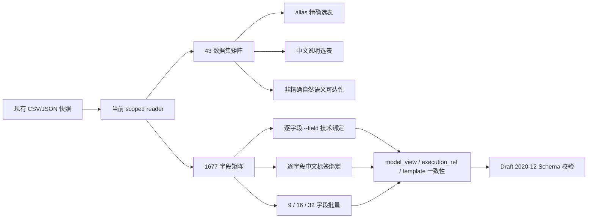
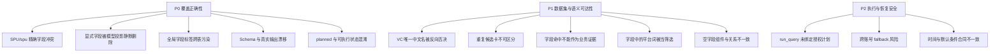

# ops-dataset-query 全量覆盖第一轮基线报告

> 日期：2026-07-16  
> 阶段：优化前只读基线  
> 目标：验证现有数据集、字段、规划合同和执行边界的真实覆盖情况  
> 数据约束：只读取既有 `.csv/.json`，未新增任何索引文件

## 1. 执行摘要

本轮由主线程和三个独立子 Agent 并行完成：

- 数据集选表覆盖审计；
- 字段绑定、公式策略和批量字段覆盖审计；
- Schema、状态机、权限、时间和执行器合同审计；
- 主线程交叉复现和统计校准。

结论是：当前规划器的**单数据集、单技术字段主链路已经接近可用**，但还不能证明“所有数据集、所有字段在规划期均正常覆盖”。真实快照暴露了多项确定性缺陷，其中 5 项会造成错误规划或安全边界不清，必须优先修复。

### 核心统计

| 项目 | 结果 |
|---|---:|
| 数据集 | 43 |
| normal 数据集 | 35 |
| query_component | 8 |
| 原始字段行 | 1721 |
| 合并等语义重复注册后字段 | 1677 |
| normal 字段 | 1648 |
| 组件字段 | 29 |
| 筛选组件关系 | 411 |
| 公式字段 | 304 |
| 快照标记字段 | 0 |
| 空中文字段名 | 0 |

### 当前覆盖率

| 测试维度 | 通过 | 说明 |
|---|---:|---|
| 选表层 alias 唯一命中 | 43/43 | 仅验证 candidate selection |
| 完整模型规划 alias | 42/43 | 部门组件无字段导致异常 |
| 中文说明选表层 | 40/43 | VC 报告 1 个、重名 2 个失败/澄清 |
| 中文说明完整模型规划 | 39/43 | 再叠加部门组件无字段 |
| normal 单技术字段 guidance | 1646/1648 | `SPU` / `spu` 大小写冲突 |
| 全部单技术字段 guidance | 1675/1677 | 同上；29 个组件字段策略正确 |
| 公式策略 | 304/304 | 均识别为公式且不带普通聚合 |
| normal 自然语义稳定可达 | 23/35 | 12 个数据集无法靠非精确自然语义选中 |
| 9 字段批量模型规划 | 22/48 组全覆盖 | 25 组静默丢字段，1 组合同超限 |
| 16～32 字段批量模型规划 | 0/51 组全覆盖 | 49 组超限，2 组静默丢字段 |

## 2. 数据源判定

仓库模板和 `build/lib` 中的三个 CSV 均只有表头，`VERSION.json` 为 `data_state=placeholder`，不能用于真实全量覆盖测试。

本轮唯一可用的现有就绪快照为：

```text
/Users/mask/.opscli/skills/ops-dataset-query/data
```

该目录：

- `VERSION.json`：`v1.1.2`；
- `datasets.csv`：43 个数据集；
- `dataset_fields.csv`：1721 条原始字段；
- `dataset_select_columns.csv`：411 条关系；
- 与仓库当前规划器脚本和 `intent_rules.json` 内容一致。

注意：现有 `query_metadata.json` 虽包含 43 个 datasets，但顶层 `fields=[]`。当前规划器以 CSV 为字段权威，因此本轮不受影响；其他消费者若把该 JSON 当字段源会得到 0 字段，这是现有数据合同漂移。

## 3. 验证方法



所有测试均使用：

- `auto_upgrade=False`；
- `auto_enum=False`；
- 不调用真实远端查询；
- 临时内存或标准输出统计；
- 不生成任何新的索引文件。

现有相关回归测试结果：

```text
43 passed
```

通过的测试覆盖公式、快照夹具、平台枚举、刷新恢复、时间、默认条件、重复字段合并和执行器基础预检，但没有覆盖本轮发现的关键合同矩阵。

## 4. 数据集覆盖结果

### 4.1 技术 alias

选表层 43/43 均能唯一命中目标卡片。进入完整模型规划后为 42/43，唯一异常是：

```text
ds_1n8a4K0d7yBB / 查询组件部门数据集
error = dataset_has_no_fields
```

该组件自身字段表为空，但被 21 条 `dataset_select_columns.csv` 关系引用；当前代码只检查组件 alias 是否存在，因此会对业务表宣称 `component_available`，直接枚举时却失败。

### 4.2 中文说明

选表层 40/43 符合预期，三个非通过样本：

1. `VC报告【Manufacturing】`：唯一中文说明已命中，但标题中的 `VC` 被抽取为 `amazon_vc`，数据集画像没有对称的平台 description pattern，最终错误进入 `dataset_constraints`。
2. `用户仪表盘分享明细`：两个数据集中文说明和 dataset name 完全相同，进入澄清。
3. 另一张同名 `用户仪表盘分享明细`：同上。

重名本身应当澄清，但当前两张候选卡的 `name_zh` 和 `reason_zh` 完全相同，用户无法选择，会形成不可回答的澄清循环。

### 4.3 自然语义可达性

排除完整说明和技术标识后，只有 23/35 个 normal 数据集可通过现有 domain、slot 和字段残差稳定选中。

12 个不可稳定自然到达的数据集包括：

- 模板使用排行榜；
- 查询组件渠道数据集（CSV 却标记 normal）；
- 用户仪表盘创建类型；
- 爬虫 listing 数据；
- VC 报告【Manufacturing】；
- Listing 详情变化记录；
- 部门使用情况统计；
- 用户仪表盘分享以及使用统计；
- 用户仪表盘分享明细 × 2；
- 运营建议提醒数据集；
- 物控库存周转（与另外两张库存周转表无法稳定拉开）。

典型过度澄清包括：

```text
查销售额
查广告费和 ACOS
查退款金额
查发货量
查 ASIN 变动情况
查 Listing 变化记录
查库存周转
```

主要原因：

- `metric_terms` 只有少量固定词；
- 指标词 span 会屏蔽 domain 证据；
- 没有 domain/slot 时，即使真实字段已经命中也被 `business_scope` 守卫拒绝；
- 中文残差按连续块处理，包含已匹配词时可能整块被丢弃，例如“即时销售额”中的“即时”无法保留。

### 4.4 数据类别异常

`table_id=7 / query_channel_set / 查询组件渠道数据集` 的 `dataset_category` 是 `normal`。规划器以 category 为权威，会把它当业务结果表。

这是现有 CSV 元数据问题。客户端至少需要增加健康检查和明确降级，不能只凭名称猜测后静默改类别。

## 5. 字段覆盖结果

### 5.1 单技术字段

逐个调用完整 `dataset_guidance.build_guidance()`：

- 1677 个合并后字段中 1675 个成功；
- normal 1648 个字段中 1646 个成功；
- 304 个公式字段全部保持公式策略；
- 29 个组件字段的 permission-enum 行为正常；
- 没有真实 `snapshot_metric=1`，快照策略只能依赖合成测试，无法用当前真实数据证明。

仅两个失败字段位于即时综合数据集：

```text
field_name = SPU
field_name = spu
verbose_name 均为 SPU
```

字段解析先做 NFKC + casefold，二者都归一为 `spu`，即使用户传精确技术字段名也无法唯一绑定。

### 5.2 中文标签与全局污染

当前模型投影会收集当前账号**全部数据集**的中文字段标签，不按已选数据集隔离。

定向 70 个跨表标签测试中有 59 个出现：

- `model_view` 声称已选择外表字段；
- `execution_ref` 没有对应技术字段；
- `query_template` 字段为空或不一致。

真实例子是发货数据集请求 `ACOS`：展示层可出现 `ACOS`，但执行层没有该字段。

另有 10 个爬虫表维度标签因账号全局同名 metric 标签参与跨类型吞并，被错误删除或注入。

### 5.3 平台词误触发

两个库存周转数据集含 16 个合法指标：

- `walmart可售库存`、`walmart仓当日仓租` 等 8 个；
- `wayfair可售库存`、`wayfair仓30天预估仓租` 等 8 个。

字段名中的 Walmart/Wayfair 被语义层解释为“平台筛选诉求”，随后因平台规则只支持 Amazon 语义而进入 `block_platform_scope_unsupported`。这不是字段不存在，而是字段标签 span 与平台 slot 没有区分。

### 5.4 多字段批量

参数层声明最多允许 32 个 `requested_fields`，但真实输出体积和模型投影无法兑现：

| 每批字段数 | 组数 | 全覆盖 | 主要失败 |
|---:|---:|---:|---|
| 9 | 48 | 22 | 25 组静默丢 1～3 字段，1 组超限 |
| 16～32 | 51 | 0 | 49 组超限，2 组静默丢字段 |

静默丢字段的主要原因不是 guidance 的显式字段上限，而是模型投影的 `_longest_unique_labels()` 和跨类型包含吞并仍会删除 `selection_source=explicit` 字段。

合同超限的主要原因是：即使已有显式字段，guidance 仍补齐最多 8 个维度和 8 个指标；库存周转 SQL 数据集还带 6 个默认条件，单字段合同已经达到约 5872 bytes，增加第二个字段即可突破 6000-byte 上限。

## 6. 合同与执行边界结果

### 6.1 JSON Schema 漂移

运行时会输出：

- `model_view.default_filters_zh`；
- `execution_ref.default_filters`。

现有 Schema 设置 `additionalProperties=false`，但未声明二者。三个含默认条件的真实数据集全部 Schema 校验失败，每个稳定出现 2 条错误。

### 6.2 没有统一的可执行门槛

21 个真实 normal 数据集在平台权限尚未枚举时仍返回：

```text
status = planned
next_action = query_platform_permission_enum
platform_filter_state = requires_permission_enum
query_template = 已生成
```

默认时间和推荐字段也会提前进入 planned/template，只靠 Skill 文档要求 Agent 先确认。

### 6.3 执行器未绑定规划结果

当前 `run_query._precheck()` 接受：

- 任意 table ID；
- 任意未授权字段；
- 空 dimensions + 空 metrics；
- 任意筛选字段；
- CLI `--table-id` 与 payload `tableId` 不一致。

执行器只检查占位符、对比期、公式 expr+aggregation 和排序形态，没有使用现有 CSV 对最终 payload 做授权绑定。

### 6.4 跨目录 fallback 无法证明账号同源

备用目录接管只验证 VERSION 和 CSV 有数据行，当前现有 JSON/CSV 没有账号归属信息。不同账号留下的 ready 目录理论上可以被接管。

在“不新增索引文件”的约束下，可选方案是：

1. 取消无法证明同源的跨目录 fallback；或
2. 在现有 `VERSION.json` / `query_metadata.json` 增加不可逆账号作用域指纹后再允许接管。

### 6.5 其他合同漂移

- 非平台筛选只有组件引用，没有机读枚举 gate；
- 显式 alias 可绕过 domain/ad_type/grain 兼容校验；
- 默认条件的 Skill 文案仍写“冲突 AND”，执行器实际已改为服务端权威覆盖；
- 9 个默认配置中有 2 个 required 条件没有任何值；
- 显式日期范围、季度、年度、过去 N 天等都会回落默认近 30 天；
- `executor_error` 指引允许绕过执行器直连，与 Skill 主合同冲突。

## 7. 第一轮问题优先级



## 8. 后续优化轮次

### 第二轮：字段与静态合同正确性

- 修复技术字段大小写精确优先级；
- 显式字段按 field_name 保留，不参与标签吞并；
- 授权标签按已选 dataset alias 隔离；
- 显式字段场景减少无关 fallback，解决合同超限；
- 更新现有 JSON Schema 并加入运行时合同测试。

### 第三轮：数据集与自然语义

- 修复 VC 描述与 query term 不对称；
- 重名候选卡加入从现有字段 CSV 即时生成的中文差异摘要；
- 让真实字段命中成为受控业务证据；
- 按匹配 span 提取残差，避免中文整块丢失；
- 区分字段标签中的平台词与真正筛选诉求；
- 对无字段组件从现有关联 CSV 推导枚举列或明确 degraded。

### 第四轮：状态机、执行与时间

- 增加机读执行 gate；
- 平台和非平台枚举未完成时禁止生成可执行业务模板；
- `run_query` 使用现有 CSV 校验表、字段、筛选和 table ID；
- 扩展绝对日期、季度、年度和过去 N 天；
- 统一默认条件语义和错误指引；
- 处理跨目录元数据归属问题。

每一轮完成后将生成独立报告，记录：修改原因、代码变更、全量覆盖数据、回归结果、剩余风险和回滚方式。

## 9. 第一轮结论

当前 Skill 不能以现有 43 个回归测试通过来证明全量覆盖。真实批量测试表明：

- 单 alias 选表和单技术字段绑定基础较好；
- 公式策略可靠；
- 自然语言选表、中文字段投影、多字段合同和执行边界仍有系统性缺口；
- 大多数问题可以只消费现有 CSV/JSON 修复，无需新增索引；
- 账号归属是唯一无法从当前文件内容直接证明的事项，必须选择阻断或扩展现有 JSON。

本报告作为后续优化的不可变基线。所有改动均应以提高上述覆盖率、消除静默错误和强化执行门槛为验收标准。
