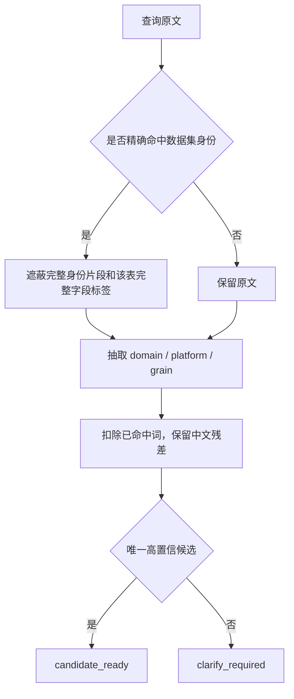

# ops-dataset-query 第三轮选表语义与组件优化报告

> 日期：2026-07-16  
> 原则：所有推断只来自当前 `datasets.csv`、`dataset_fields.csv`、`dataset_select_columns.csv` 和现有规则 JSON；没有新增索引文件

## 一、本轮目标

本轮处理“字段已正确，但查询在选表前被错误解释”的问题：数据集名中的 VC、字段名中的 Walmart/Wayfair 被当成平台筛选，连续中文残差被整体丢弃，空权限组件无法枚举，同名候选缺少区分信息。

## 二、核心改进

### 2.1 身份 span 与筛选语义分离

当 alias、英文名或完整中文说明已经命中候选后，规划器先遮蔽候选的数据集身份和完整字段标签，再做槽位抽取。因此：

- `VC报告【Manufacturing】` 中的 `VC` 只属于数据集身份；
- `Walmart可售库存` 中的 `Walmart` 只属于完整字段标签；
- 名称之外另写“只看 Walmart”仍会保留并触发平台范围校验。

### 2.2 连续中文改为“扣词留残差”

旧实现遇到“查即时销售额”时，因为整段含“销售额”而删除整个 token。本轮只扣除已经识别的“销售额”，保留“即时”，从而能够以现有 description 唯一定位“即时综合数据集”。

### 2.3 无类型词时允许确定性卡片匹配

当查询没有 domain/slot，但残差能在现有 description 或字段 CSV 中形成唯一领先候选，分差达到既有澄清阈值才自动定表；分差不足继续澄清。该策略提升低频管理类数据集可达性，同时不引入模型猜表。

### 2.4 空查询组件从关系 CSV 内存派生字段

部门查询组件在字段 CSV 中为 0 行，但被 21 条 `select_columns` 关系引用。本轮只对 `query_component` 从入站关系的 `column_name` 和 `verbose_name` 派生最小维度，来源标记为 `dataset_select_columns.csv`。普通业务表为空时仍硬失败。

### 2.5 同名候选增加即时字段摘要

候选卡片增加“维度数、指标数、代表字段”摘要，全部由当前字段 CSV 进程内统计。两个“用户仪表盘分享明细”不再返回完全相同、无法选择的卡片。

### 2.6 同标签多物理字段禁止静默择一

自然语言 `SPU` 同时对应 `SPU` 与 `spu` 时，规划器改为 `clarify_required` 并输出中文歧义标签；使用精确 `--field` 时仍能分别绑定。这样把原来的错误成功改为安全失败。

## 三、真实快照验证

| 验证项 | 结果 |
|---|---:|
| 业务数据集完整中文说明 | **35 / 35 符合预期** |
| 查询组件指导 | **8 / 8** |
| 空部门组件关系派生 | **1 / 1** |
| 中文自然字段正确 planned | **1,646 / 1,648** |
| 同标签安全澄清 | **2 / 1,648** |
| 自然字段错误静默绑定 | **0** |
| 本轮聚焦回归 | **43 / 43** |

35 个数据集去除“数据集/表/统计/记录/报告”等通用后缀后做压力测试，21 个可以唯一直达；其余主要是“发货”“广告费”“ASIN”“库存周转”等确实对应多表的宽泛表述，以及两个完全同名表。此处保留澄清是正确行为，不应为追求直达率强行选表。

## 四、仍需继续处理

- 默认时间和推荐字段尚未确认时，输出状态仍可能过早表现为 planned；
- 平台权限枚举未完成时仍可能提前生成查询模板；
- `run_query` 尚未强制绑定规划器 table_id 与授权字段集合；
- 真实 CSV 中快照标志仍为 0，属于上游元数据质量问题；
- `query_metadata.json` 顶层字段为空与 CSV 存在漂移，需要明确其废弃或同步策略。

## 五、结论

第三轮把平台误触发、空组件、连续中文和同名字段错误绑定四类高风险问题闭环。规划器现在能够区分“身份文本”“字段文本”和“用户额外筛选”，并在证据不足时保持可解释澄清。
