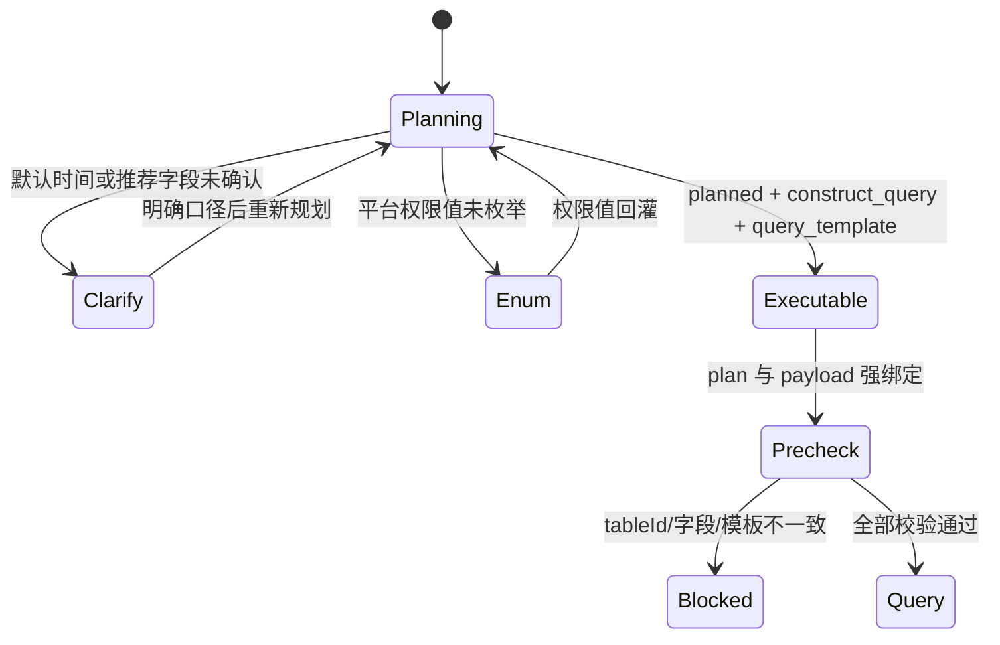

# ops-dataset-query 第四轮执行安全与状态优化报告

> 日期：2026-07-16  
> 版本：1.3.7  
> 范围：规划状态、时间解析、执行绑定、Skill 合同

## 一、目标

前三轮已经解决“选对表、找对字段”。本轮解决最后一公里的执行安全：什么时候可以生成模板、执行器如何证明 payload 来自同一份规划、默认时间和推荐字段如何阻断过早执行。

## 二、主要改动

### 2.1 planned 不再等同于“选到表”

- 默认近30天未确认：`clarify_required`，无 `query_template`；
- 只有系统推荐字段：`clarify_required`，无 `query_template`；
- 平台权限枚举未收敛：保留枚举下一步，但不生成 `query_template`；
- 只有内部下一步为 `construct_query` 才下发模板。

### 2.2 时间解析补齐确定性周期

新增绝对日期范围、指定季度、本季度、上季度、指定年份、今年和去年；所有结果都转成 Asia/Shanghai 的绝对起止日，避免模型心算。

### 2.3 run_query 强制绑定规划器合同

正式执行新增必填 `--plan-file` 或 `--plan-json`，执行前验证：

1. 合同类型为 `query_plan_model_contract_v2`；
2. `status=planned`；
3. `execution_ref.query_template` 已下发；
4. CLI、payload、plan 三方 tableId 一致；
5. dimensions、metrics、filters、dataComparison 只引用 plan 授权字段。

这关闭了“任意 tableId、任意字段、空规划上下文也能执行”的旁路。

### 2.4 精确数据集仍执行外部约束

alias 或中文名精确定表只决定身份；名称之外明确提出的不兼容业务域、广告类型或粒度仍需满足数据集画像，否则进入 `dataset_constraints` 澄清。平台范围继续交给专门的权限解析层处理。

### 2.5 Skill 文档与默认条件语义同步

主流程改为保存规划器合同并传给执行器；默认条件统一为服务端权威应用、用户同字段条件覆盖，客户端只披露不重复注入；删除了执行器异常后绕过直连的旧建议。

## 三、验证结果

| 状态矩阵 | 通过 |
|---|---:|
| 明确字段 + 明确时间 → planned + template | **35 / 35** |
| 默认时间 → clarify + 无 template | **35 / 35** |
| 仅推荐字段 → clarify + 无 template | **35 / 35** |
| 澄清合同严格 Schema | **35 / 35** |
| 规划器绑定接受同源 payload | **通过** |
| 注入未授权字段被拒绝 | **通过** |
| 本轮聚焦测试 | **51 / 51** |

最终字段回归仍保持：1,648/1,648 单字段、73/73 个 32 字段批次完整通过。

扩大执行 `tests/skills`（排除既有 packaging 聚合测试）结果为 148 passed、6 failed；失败均为本任务之外的旧版本断言、缺失其他 Skill 模板/资产及其他 Skill manifest/frontmatter 问题。

## 四、结论

规划器从“给建议的选表工具”提升为可被执行器验证的授权合同。现在即使调用方手工篡改 tableId 或字段，也会在真正调用 opscli 前被本地拒绝。
