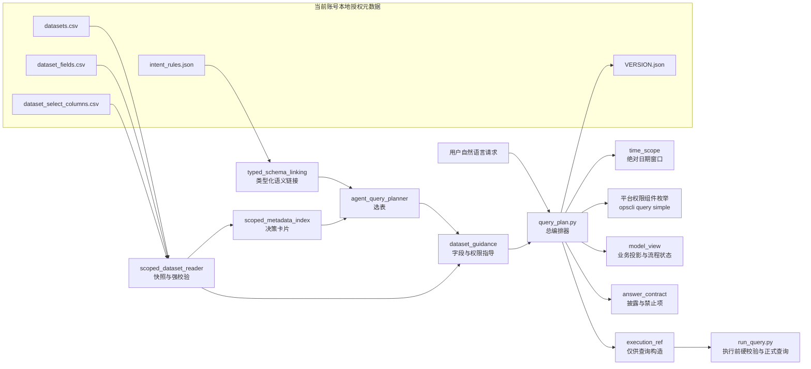
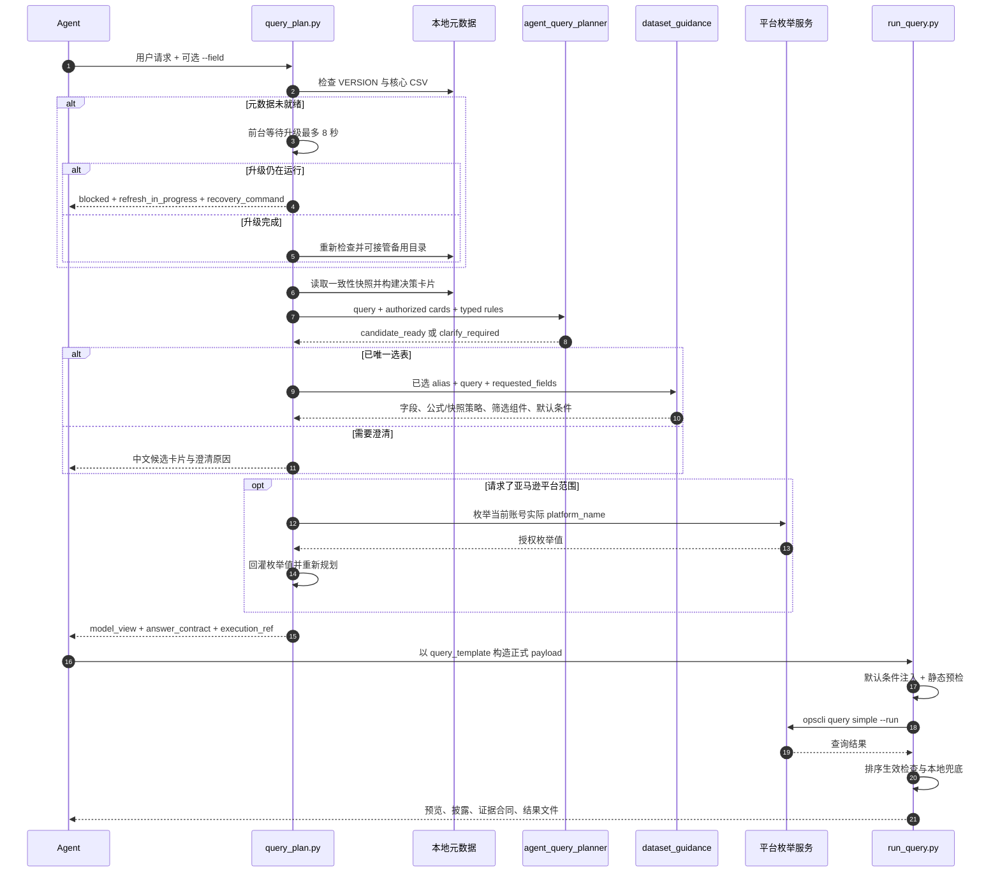
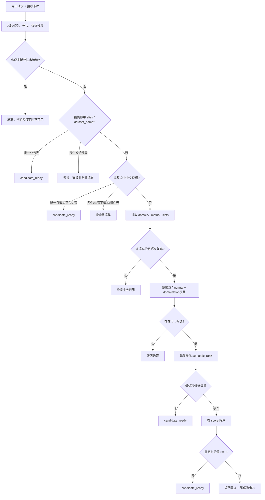
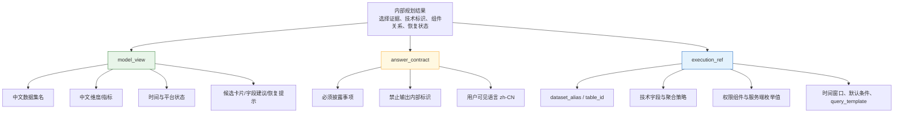
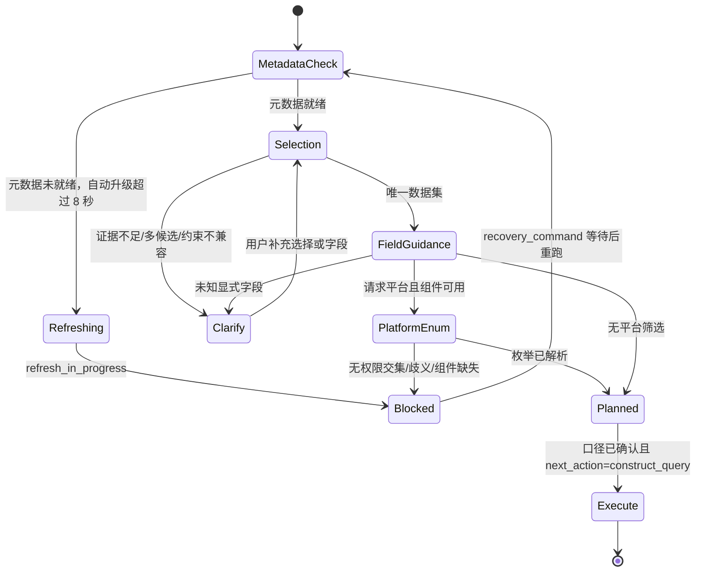

# ops-dataset-query 规划器实现逻辑深度分析报告

> 分析日期：2026-07-15  
> 分析对象：`opscli/skills/templates/ops-dataset-query`  
> 代码基线：`master_pjc` / `016a875`  
> 核心入口：`scripts/query_plan.py`

## 1. 结论摘要

当前 `ops-dataset-query` 的规划器并不是由大模型自由生成查询计划，而是一套运行在本地、由规则和授权元数据驱动的**确定性语义编译器**。它把自然语言请求逐步编译成三类产物：

1. `model_view`：面向对话层的业务投影，以中文结论为主，同时保留少量流程状态码供 Agent 判断；
2. `answer_contract`：约束 Agent 必须披露什么、禁止输出什么；
3. `execution_ref`：保存技术字段、表 ID、权限枚举组件和查询模板，仅用于构造正式查询。

其核心设计可以概括为：

> **先用当前账号授权元数据缩小可选空间，再用类型化规则建立硬约束，以语义排序和分数解决候选竞争，最后通过合同投影隔离用户表达与执行细节。**

整体实现的主要优点是：选表不依赖模型记忆、权限枚举不接受客户端猜值、公式与快照指标有独立聚合策略、日期窗口由代码计算、元数据刷新适配 30 秒命令窗口，并且正式执行前还有二次硬校验。

当前最值得关注的实现风险有六项：

- **高**：备用数据目录接管只检查数据是否就绪，没有验证元数据所属账号，和“仅使用当前账号授权元数据”的核心不变量之间存在缺口。
- **高**：`status=planned` 不等价于“可直接执行”；平台枚举、默认时间和推荐字段的确认门槛分散在多个字段与 Skill 文档中，查询模板却已提前生成，消费方若只检查 `status` 可能越过确认门槛。
- **中**：运行时已新增 `default_filters_zh` 和 `default_filters`，但 `query_plan.schema.json` 尚未声明，静态合同已发生漂移。
- **中**：授权字段标签兜底按账号全量字段收集，而不是按已选数据集收集，可能把其他数据集的字段标签投影进当前规划结果。
- **中**：自然语言中点名但不存在的字段，只有在 Agent 同时传入 `--field` 时才会进入未知字段澄清；仅靠查询原文不能完整识别这一类错误。
- **中**：元数据文件逐个原子替换，而快照校验不包含统一代际标识，极短并发窗口内仍可能读到跨版本混合快照。

## 2. 分析范围与依据

本报告重点阅读和追踪了以下实现：

| 层次 | 文件 | 主要职责 |
|---|---|---|
| 总编排 | `scripts/query_plan.py` | 元数据就绪检查、选表、字段指导、权限枚举、模型合同投影 |
| 选表 | `scripts/agent_query_planner.py` | 候选过滤、语义排序、评分、澄清决策 |
| 规则与类型 | `scripts/typed_schema_linking.py` | 规则强校验、自然语言语义抽取、数据集画像 |
| 字段与权限 | `scripts/dataset_guidance.py` | 字段选择、公式/快照口径、筛选组件、默认条件 |
| 元数据读取 | `scripts/scoped_dataset_reader.py` | CSV 校验、文件快照、字段结构约束 |
| 决策卡片 | `scripts/scoped_metadata_index.py` | 把授权元数据编译成轻量数据集卡片 |
| 时间 | `scripts/time_scope.py` | Asia/Shanghai 日期窗口、环比、同比 |
| 执行 | `scripts/run_query.py` | 查询前校验、默认条件注入、排序验证与兜底 |
| 数据合同 | `data/intent_rules.json`、`data/query_plan.schema.json` | 意图词典、封闭类型、模型输出 Schema |

验证时执行了规划器及默认条件相关的回归测试，共 **38 项全部通过**：

```text
pytest -q \
  tests/skills/test_dataset_query_planner.py \
  tests/skills/test_dataset_guidance_default_filters.py \
  tests/skills/test_scoped_reader_filter_config.py \
  tests/skills/test_run_query_default_filters.py

38 passed in 0.09s
```

## 3. 总体架构

### 3.1 组件关系



### 3.2 端到端流程

`query_plan.py` 的内部流程在模块说明中已经明确写成：版本检查 → 规则校验 → 构建授权卡片 → 选表 → 字段指导 → 平台权限枚举解析 → 模型合同投影。实际调用链如下：



## 4. 规划器的核心原理

### 4.1 它是“编译器”，不是“生成器”

规划器不让模型直接决定数据集、字段和筛选值，而是把用户请求视为源语言，经过以下编译阶段得到查询中间表示：

| 编译阶段 | 输入 | 输出 | 约束方式 |
|---|---|---|---|
| 词法/语义抽取 | 用户请求 | domain、metric term、platform/ad_type/grain slot | 封闭词典与最长匹配 |
| Schema linking | 语义 + 授权卡片 | 可覆盖候选集合 | 领域与槽位硬约束 |
| 候选消歧 | 可覆盖候选 | 唯一数据集或澄清卡片 | 语义秩优先、分数次优 |
| 字段绑定 | 已选数据集 + 请求 | 维度、指标、日期字段 | 精确标识/中文名/匹配分 |
| 权限绑定 | 请求平台 + 组件数据集 | 服务端真实筛选值 | 当前账号在线枚举 |
| 查询 IR 生成 | 表、字段、时间、默认条件 | `query_template` | 公式/快照/比较规则 |
| 视图投影 | 内部规划结果 | 三层模型合同 | 用户视图与技术引用隔离 |

因此，模型的职责被压缩成：读取规划结果、按合同澄清或披露、补充排序和行数等用户参数、调用统一执行器。模型不应重新推断规划器已经确定的事实。

### 4.2 授权范围先于语义推断

选表候选只来自本地当前授权元数据构建的卡片。`load_authorized_cards()` 不读取静态知识库中的全局数据集列表，而是调用 `scoped_metadata_index.build_cards()`，从三个 CSV 快照内存编译出卡片。

每张卡片只保留选表需要的摘要：

- 数据集 alias、名称、类别、中文说明和备注；
- 维度字段名与中文名；
- 指标字段名与中文名；
- 可筛选列字段名与中文名；
- 可筛选列数量。

这种做法的关键意义是：**语义匹配空间天然等于授权空间**，不需要在选表结束后再做一次“是否有权访问该数据集”的补救判断。

### 4.3 规则采用封闭世界模型

`typed_schema_linking.validate_rules()` 对 `intent_rules.json` 做全量精确校验：

- 根键必须精确匹配；
- `schema_version` 必须等于 3；
- domain 必须精确覆盖 sales、advertising、inventory、traffic、refund、logistics、product、finance；
- slot 必须精确覆盖 platform、ad_type、grain；
- 平台成员、别名和广告类型兼容矩阵必须互相闭合；
- 规则词条禁止引用 `ds_*`、`f_*` 等内部标识。

这意味着新增业务域或槽位时不能只改一部分词表后静默生效，必须同步修改代码允许集合和完整规则结构。它牺牲了一部分热配置灵活性，换取规则漂移时的 fail-fast。

### 4.4 语义抽取的两个关键去歧义机制

第一，ASCII 词条按单词边界匹配，避免 `sc` 命中 `scale`；中文词条按子串匹配。

第二，重叠槽位采用“最长覆盖优先”。例如“亚马逊 VC”会同时命中 `amazon` 和 `amazon_vc`，短匹配区间被长匹配区间完全覆盖后，只保留 `amazon_vc`。

领域抽取还有一层特殊保护：如果领域词的命中区间完全被通用指标词覆盖，就不把它当成领域证据。例如“销售额”可以被识别为指标词，但不会仅凭其中的“销售”直接认定 sales 领域。这会让“只说销售额”的请求倾向于澄清，而不是贸然选表。

## 5. 选表算法详解

### 5.1 三级优先路径



第一级显式标识拥有最高优先权：alias 得分 100，dataset name 得分 90。唯一命中时直接定表。它相当于用户对自然语言语义匹配的显式覆盖。

第二级是完整中文说明命中，得分 80。这里会额外检查平台槽位是否被该数据集覆盖。

第三级才进入真正的类型化语义选择。它先做证据充分性和兼容性检查，再建立 eligible 候选集合。

### 5.2 硬约束先于分数

候选必须同时满足：

- `dataset_category == normal`；
- 数据集画像覆盖请求中的全部 domain；
- 数据集画像覆盖全部 slot；
- fixed 槽位要求数据集口径与请求完全一致；
- filterable 槽位允许数据集支持集合是请求集合的超集；
- 广告类型与平台组合满足兼容矩阵。

这里最重要的实现细节是：**分数不是全局排序的第一依据**。

通过硬约束的候选先计算 `_semantic_rank`，这是一个按以下顺序比较的五元组：

1. 多余的广告类型和粒度数量；
2. 用户未请求的槽位特异性；
3. 多余的平台覆盖数量；
4. 需要依赖筛选实现请求口径的惩罚；
5. 多余业务域数量。

只有 `_semantic_rank` 完全相同的候选才进入分数竞争。也就是说，“口径更贴近”优先于“文本命中更多”。

### 5.3 分数的用途

同一语义秩内，分数用于选择文本证据更充分的候选：

| 证据 | 分值 |
|---|---:|
| alias 精确命中 | 100 |
| dataset name 精确命中 | 90 |
| 中文说明完整命中 | 80 |
| 每个领域命中 | 40 |
| 数据集说明/槽位固定口径命中 | 15 |
| 字段词或可筛选槽位命中 | 8 |
| 默认广告报表特例 | 15 |
| query component 惩罚 | -50 |

查询中的残差词会先剥离常见前后缀、停用词和已被规则消费的词，再分别匹配数据集说明与字段词表，避免同一证据重复计分。

若最优语义秩下只有一个候选，直接定表；若有多个候选，前两名分差至少为 8 才自动定表，否则进入澄清。

### 5.4 `query_component` 的隔离

权限枚举组件不是业务结果数据集，因此在语义打分中会被扣 50 分，并且一般只允许在用户明确请求“枚举值、可选值、权限值”等场景下被直接选择。

这一设计把组件表定位成“查询构造依赖”，而不是“业务答案来源”，避免渠道、部门、国家等字典表被误选为结果表。

## 6. 字段规划与聚合口径

### 6.1 字段选择优先级

选表完成后，`dataset_guidance.build_guidance()` 只按 alias 精确定位数据集。字段匹配优先级为：

1. `--field` 显式点名字段，固定 1000 分并必选；
2. 技术字段名完整命中，100 分；
3. 中文完整名命中，90～99 分；
4. 去括号后的中文基础名命中，80～89 分；
5. 中文二元组和 ASCII token 交集数量；
6. 仍不足输出上限时按元数据原顺序兜底。

所有进入指导结果的字段都带 `selection_source`：`explicit`、`query` 或 `fallback`。在模型投影层，如果用户没有点名字段，则最多取 3 个指导层字段作为 `recommended`，要求 Agent 采用前说明其来源。

### 6.2 公式和快照指标

规划器对两类非普通指标进行硬区分：

- 公式指标：`formula_expression_without_extra_aggregation`，查询模板不再添加普通 `SUM`；
- 快照指标：`latest_snapshot_no_period_aggregation`，禁止跨期累加。

普通指标才在查询模板中默认填充 `aggregation=SUM`。这一策略随后还会被 `run_query.py` 的执行前检查再次守卫，避免公式表达式和普通聚合同时出现。

### 6.3 日期字段无条件携带

日期维度不依赖用户是否点名，只要字段技术名含 `date/time` 或中文名含“日期/时间”，就最多输出 5 个日期字段引用。原因是时间过滤和 `dataComparison` 必须绑定授权字段，而用户通常只说“近 7 天”，不会说具体日期字段名。

### 6.4 默认条件

当前 1.4.0 代码已把字段级 `filter_config` 接入规划器：

- 从目标数据集自身字段和关联组件字段聚合已启用默认条件；
- 投影为 `execution_ref.default_filters`；
- 转成 `model_view.default_filters_zh`；
- 加入 `answer_contract.required_disclosures_zh`；
- required 且非 having 的条件预填进 `query_template.filters`；
- `run_query.py` 执行前再次注入缺失条件并处理去重、冲突 AND 与披露。

这形成了“规划期预填 + 执行期补漏”的双保险。

## 7. 权限筛选规划

### 7.1 非平台筛选

`dataset_select_columns.csv` 描述业务数据集字段到权限枚举组件数据集的关系。只有组件 alias 也存在于当前授权数据集列表中时，规划器才标记 `component_available` 并输出组件 table ID。

如果组件缺失，只阻断对应筛选，不自动扩大查询范围。默认范围始终为 `current_authenticated_account`，并显式设置：

- `client_may_expand_scope = false`；
- `default_filter_invention_allowed = false`；
- `explicit_filter_requires_component_validation = true`。

### 7.2 亚马逊平台语义展开

本地规则只表达平台语义，不直接决定服务端过滤值：

- “亚马逊”展开为 `amazon_sc + amazon_vc`；
- “亚马逊 SC”只展开为 `amazon_sc`；
- “亚马逊 VC”只展开为 `amazon_vc`。

随后用当前账号组件查询返回的真实 `platform_name` 枚举值进行别名匹配。枚举解析有五种内部状态：

- `not_applicable`：无可支持的平台语义；
- `required`：还未取得当前账号枚举；
- `resolved`：已确定服务端真实值；
- `no_authorized_overlap`：请求范围与当前账号无交集；
- `ambiguous`：同一枚举值命中多个语义成员，禁止猜测。

### 7.3 自动枚举与回灌

默认模型路径会自动调用一次 `opscli query simple` 枚举平台值，超时为 7 秒。成功后把枚举值作为 `authorized_platform_values` 回灌，再完整运行一次内部规划，最终标记 `platform_enum_source=auto_enum_service`。

若自动枚举失败或超时，不会让整个规划命令超出窗口，而是保留首版合同，并提供可直接执行的 `platform_enum_command` 走手动路径。

## 8. 时间口径

`time_scope.py` 固定使用 `Asia/Shanghai`，支持：

- 近 N 天、近 N 周；
- 近 N 个月，按 N×30 天近似；
- 今天、昨天；
- 本周、上周；
- 本月、上月；
- 环比：紧邻上一个等长周期；
- 同比：去年同期，2 月 29 日回退到 2 月 28 日。

未识别到时间表达时，规划器返回默认近 30 天且 `is_default=true`。Skill 规定此时必须向用户披露并等待确认，避免模型把默认窗口当成用户已确认口径。

当前解析器不支持任意绝对日期区间、季度、年度等表达，详见风险章节。

## 9. 双层内部规划与三层模型合同

### 9.1 内部合同

`build_query_plan()` 先形成 `query_plan_contract_v1`，包含完整选表结果、字段指导、平台范围和内部下一步动作。其 `query_execution_allowed` 永远是 `false`，强调规划与执行分离。

### 9.2 模型合同

`build_model_contract()` 将内部结果投影为 `query_plan_model_contract_v2`：



这三个分区构成了一个“能力最小化”边界：模型可以用 `model_view` 和 `answer_contract` 组织对话，用 `execution_ref` 构造命令，但不能把技术引用当成业务事实展示给用户。需要注意，`model_view` 仍包含 `platform_filter_state`、`clarification_reason_codes` 和 `next_action` 等英文流程码，因此它是“供 Agent 组织用户表达的投影”，并不是可以整段原样展示的纯中文对象。

### 9.3 状态机

模型层只暴露三态：`planned`、`clarify_required`、`blocked`。内部 `next_action` 负责表达更细的动作。



需要特别强调：当前实现中“平台待枚举”也可能被归一为 `planned`，因此执行门槛实际是复合条件，而不是只看 `status`。

## 10. 元数据刷新与 30 秒窗口适配

模板数据为 placeholder 时，规划器会尝试自动升级。该流程专门适配平台约 30 秒的单命令窗口：

1. 启动 `opscli skills upgrade ops-dataset-query --force`；
2. 前台最多等待 8 秒；
3. 未完成时不终止进程，而是通过 `start_new_session=True` 让其后台继续；
4. 在系统临时目录写入 PID 标记；
5. 立即返回 `blocked + refresh_in_progress`；
6. `recovery_command` 用 `sleep 25 && 重跑规划器` 把等待和重试合成一次命令。

若主 Skill 目录是只读挂载，升级结果写入 `.claude/skills` 后，规划器会搜索备用就绪数据目录并接管。`metadata_source` 会记录 `published_bundle`、`upgraded_local`、`skill_local` 以及 `+fallback_dir`，便于审计来源形态。

这是一套“有界前台等待 + 后台续跑 + 幂等重入”的恢复机制，解决了同步升级经常被工具窗口杀死的问题。

## 11. 正式执行边界

规划器只生成 `query_template`，正式执行必须经过 `run_query.py`。执行器会：

- 拒绝未替换占位符；
- 校验 `dataComparison` 同时存在主周期日期条件；
- 拒绝公式表达式与普通聚合并存；
- 归一化 `orderBy` 形态；
- 注入缺失的 required 默认条件；
- 查询后验证服务端排序是否真的生效；
- 排序失效且有 limit 时，放大窗口重查后本地排序取 Top N；
- 输出截断、排序兜底、总行数和证据合同。

因此完整系统是“两段式防线”：

> 规划器负责生成受约束的查询意图，执行器负责拒绝危险或不完整的最终 payload。

## 12. 当前实现的优势

### 12.1 确定性和可测试性较强

规则、分数、阈值、状态转换均在代码中显式定义，同一份请求与元数据会产生稳定结果，便于回归测试和问题复现。

### 12.2 权限与业务语义分离

本地规则只判断“用户说的是亚马逊 SC 还是 VC”，最终过滤值必须来自当前账号在线枚举，避免把配置别名误当成服务端真实值。

### 12.3 业务口径被编码为数据合同

公式指标、快照指标、默认条件、时间比较不再只靠提示词提醒，而是进入 `execution_ref` 和执行器预检。

### 12.4 面向 Agent 的可恢复性设计成熟

错误输出、刷新阻断和枚举回落都携带可执行下一步命令，减少 Agent 遇到异常后扫描目录、读源码或自行拼旁路命令的倾向。

### 12.5 输出体积有多层护栏

选表结果、字段指导、模型合同、stdout 预览均有字节上限和候选/字段数量上限，避免异常元数据撑爆上下文。

## 13. 风险与改进建议

### 13.1 P1：备用数据目录缺少账号所有权校验

**现象**：`_fallback_ready_data_dir()` 只检查候选目录的 `VERSION.json` 和 CSV 是否含数据行，没有验证该目录是否由当前认证账号刷新，也没有账号指纹、租户标识或刷新会话标识。

**影响**：同一机器或沙箱中若存在其他账号留下的已就绪目录，理论上可能被接管，破坏“规划只依据当前账号授权元数据”的最核心安全边界。

**建议**：升级时在 `VERSION.json` 写入不可逆账号作用域指纹、租户/环境标识和生成批次 ID；接管备用目录时必须与当前认证上下文匹配。若无法证明所有权，应返回 blocked，不应接管。

### 13.2 P1：`planned` 状态不等于可执行，执行门槛分散

**现象**：`_status()` 只把 ask、block 和 refresh 映射为非 planned；`query_platform_permission_enum` 会保留为 `planned`。同时 `build_model_contract()` 在 `status=planned` 时生成 `query_template`，而模型合同没有内部合同中的 `query_execution_allowed=false`。

另外两类尚未确认的值也会提前进入模板：

- 未识别时间时，默认近 30 天已进入 `time_scope` 和日期 filters，是否等待确认只靠 `is_default=true`、中文提示和 Skill 文档约束；
- 系统推荐字段会进入 `execution_ref`，并被直接用于生成 `query_template`，是否先确认只靠 `selection_source=recommended` 和 Skill 文档约束。

**影响**：消费方若只判断 `status=planned`，可能出现三类越权执行：漏掉平台筛选、未经用户确认采用默认时间、未经用户确认采用推荐字段。这里的“越权”指越过查询口径确认门槛，不一定是账号数据权限越权。

当前真正的执行前置条件是一个分散谓词：

```text
status == planned
AND next_action == construct_query
AND platform_filter_state in {not_requested, resolved}
AND (time_scope.is_default == false OR 用户已确认默认时间)
AND (不存在 recommended 字段 OR 用户已确认推荐字段)
```

但合同中没有一个字段直接表达上述最终结果，也没有记录用户确认后的状态迁移。

**建议**：

1. 增加独立状态 `permission_enum_required`；或
2. 在模型合同中加入强制布尔字段 `query_execution_allowed`；并
3. 只有 `next_action=construct_query`、平台状态为 `resolved/not_requested`、时间和推荐字段均已确认时才输出最终 `query_template`；或把模板拆成 `draft_query_template` 与 `executable_query_template`。

### 13.3 P1：静态 JSON Schema 与运行时合同漂移

**现象**：当前运行时会输出：

- `model_view.default_filters_zh`；
- `execution_ref.default_filters`。

但 `data/query_plan.schema.json` 对 `model_view` 和 `execution_ref` 都设置了 `additionalProperties=false`，又没有声明上述字段。仓库中也没有代码或测试实际用该 Schema 校验规划结果。

**影响**：任何严格按 Schema 消费 1.4.0 输出的客户端都会拒绝含默认条件的合法规划结果；Schema 当前只能充当未同步的文档，不能作为可执行合同。用当前回归 fixture 生成含默认条件的结果后执行 Draft 2020-12 校验，可稳定得到 2 个错误：`model_view.default_filters_zh` 与 `execution_ref.default_filters` 均被判定为不允许的额外属性。

**建议**：补齐两个字段的 Schema 定义，新增 `jsonschema.validate()` 回归测试，并在 CI 中对 planned、clarify、blocked、default filters 四类样本做合同校验。

### 13.4 P2：字段标签兜底超出已选数据集范围

**现象**：`build_model_query_plan()` 收集 `authorized_fields` 时遍历账号内全部数据集字段，而 `_selected_fields()` 和 `_field_suggestions()` 使用这份全量标签列表。

**影响**：其他数据集的字段可能：

- 出现在当前数据集的 `model_view.dimensions/metrics`；
- 成为未知字段的近似建议；
- 因缺少当前数据集的 `field_name` 而无法进入 `execution_ref`，造成展示层与执行层不一致。

**建议**：标签索引按 `dataset_alias` 分组，只把已选数据集的字段传给模型投影；澄清候选尚未定表时，应按每张候选卡片分别提供字段建议，不能用账号全局字段池。

### 13.5 P2：未知自然语言字段依赖 Agent 正确传 `--field`

**现象**：`dataset_guidance` 只把 `requested_fields` 中无法精确解析的项目放入 `unknown_requested_fields`。查询原文里出现但未命中任何授权字段的词，不会自动进入 unknown 列表。

**影响**：如果 Agent 没有把用户明确点名字段逐项转换为 `--field`，规划器可能忽略该字段并给出系统推荐指标，形成“用户要 A，规划器建议 B”的口径漂移。

**建议**：保留 `--field` 的强确定性入口，同时增加受控的自然语言字段声明抽取；至少在存在“按 X 看 Y、查询 X 指标”等明确结构而 X/Y 无法绑定时进入澄清，而不是推荐兜底。

### 13.6 P2：元数据快照缺少统一代际一致性

**现象**：升级器对多个文件逐个执行原子替换；读取器在一次读取前后比较各文件 identity，但没有统一 generation ID。若读取恰好发生在文件替换序列中间，可能把新 `dataset_fields.csv` 与旧 `datasets.csv`、`dataset_select_columns.csv` 作为一个稳定快照接受。

此外，选表卡片和字段指导本身各读取一次独立快照，也没有比较二者 fingerprint。

**影响**：极短并发窗口内可能出现跨代选表与字段绑定，轻则报错重试，重则同 alias 下使用了不同版本的说明和字段。

**建议**：

- 优先把完整 `data/` 目录作为一个版本目录生成后整体切换软链接/目录指针；或
- 给所有导出文件写入统一 generation ID，并在快照读取后校验一致；
- 选表与 guidance 复用同一 `SourceSnapshot`，或至少比较 fingerprint 后再投影。

### 13.7 P2：显式选表路径没有完整复核业务语义约束

**现象**：alias / dataset name 唯一命中后会直接 `candidate_ready`，不再检查 domain、ad_type、grain 是否与该表画像兼容；中文说明精确命中路径也只额外复核了 platform 槽位。

**影响**：用户明确点名一个数据集同时又提出该表不支持的粒度或广告类型时，选表层可能视为已定表。后续 guidance 只做字段绑定和权限组件检查，不会重新验证 grain/ad_type，最终可能进入推荐字段或生成无法满足原请求的模板。

**建议**：保留显式点名的高优先级，但把它解释为“锁定候选”，而不是“跳过兼容性校验”。显式表不满足请求硬约束时，应返回针对该表的约束冲突说明，让用户选择修改数据集或修改查询口径。

### 13.8 P2：时间解析覆盖范围有限

**现象**：当前不识别 `2026-07-01 至 2026-07-15`、`2026 年 Q2`、`今年`、`去年`、`最近 12 个月自然月`等表达；“近 N 个月”固定按 N×30 天。

**影响**：明确时间请求可能被标记为“未识别”，回落默认近 30 天。现有 Skill 要求默认口径必须确认，因此通常不会静默执行，但会增加澄清轮次，也无法满足部分常见查询。

**建议**：优先支持 ISO/中文绝对日期区间、季度和自然年；把“滚动 30 天月”与“自然月”拆成不同口径，不要共用一个表达。

### 13.9 P2：版本标识不一致

**现象**：`SKILL.md` frontmatter 当前仍是 `version: 1.3.5`，而 `data/VERSION.json` 为 `1.4.0` 且 `data_state=placeholder`。

**影响**：模板代码、Skill 文档版本和远端元数据版本属于不同版本空间，但当前文件没有明确区分，使用者容易误判能力版本；默认条件 1.4.0 代码已落地，而 Skill 文档仍显示旧版本。

**建议**：分别命名 `skill_contract_version` 与 `metadata_version`，或至少同步 frontmatter 并在 VERSION 说明版本语义。

### 13.10 P3：后台刷新重试上限依赖外部 Agent

**现象**：Skill 文档规定连续 3 次未就绪后反馈并停止，但代码只记录 PID，没有重试计数、启动时间或进程启动指纹。PID 被系统复用时也可能把无关进程误判为仍在刷新。

**影响**：不遵循 Skill 文档的消费方可能无限等待或重复启动刷新；失败原因因 stdout/stderr 被丢弃而难以诊断。

**建议**：标记文件记录 PID、启动时间、请求目录、尝试次数和最近退出摘要；代码本身实现三次上限，而不是只依赖提示词。

### 13.11 P3：测试更偏组合链路，核心排序性质覆盖不足

**现象**：当前回归覆盖了公式、快照、平台阻断、刷新恢复、时间窗口、自动枚举、候选卡片、默认条件和执行器，但没有直接覆盖大量 `plan_query()` 边界：

- semantic rank 与 score 冲突时必须由 rank 胜出；
- 分差 7/8 的阈值边界；
- fixed 与 filterable 的集合覆盖差异；
- domain 词被 metric span 吞并；
- 多平台、多广告类型兼容矩阵；
- query component 的显式枚举例外；
- 模型输出与 JSON Schema 的一致性。

**建议**：增加表驱动测试和性质测试，重点验证“未授权卡片永不出现”“技术标识永不进入 model_view”“未解析平台永不可执行”“同一输入结果稳定”等不变量。

## 14. 建议的改造优先级

| 优先级 | 改造项 | 目标 |
|---|---|---|
| P0 | 模型合同加入明确执行门槛 | 防止 planned 被误当成可执行 |
| P0 | 备用数据目录绑定账号作用域 | 守住授权边界 |
| P0 | 更新 JSON Schema 并启用 CI 校验 | 消除合同漂移 |
| P1 | 字段标签按已选数据集隔离 | 保持展示层与执行层一致 |
| P1 | 显式选表后复核业务约束 | 防止点名数据集绕过粒度/广告类型兼容性 |
| P1 | 元数据引入 generation ID | 消除跨文件、跨阶段混合快照 |
| P1 | 扩展绝对日期/季度/年度解析 | 降低默认时间澄清率 |
| P2 | 代码化刷新重试上限与诊断 | 降低恢复流程对 Agent 遵约的依赖 |
| P2 | 增强选表算法性质测试 | 稳定后续规则和权重演进 |

## 15. 关键实现定位

| 主题 | 代码位置 |
|---|---|
| 总体内部规划 | `scripts/query_plan.py:565-655` |
| 元数据就绪与备用目录 | `scripts/query_plan.py:325-404` |
| 8 秒宽限与后台续跑 | `scripts/query_plan.py:407-529` |
| 模型合同投影 | `scripts/query_plan.py:1071-1257` |
| 自动平台枚举回灌 | `scripts/query_plan.py:1260-1400` |
| 三级选表主逻辑 | `scripts/agent_query_planner.py:472-630` |
| 语义秩与打分 | `scripts/agent_query_planner.py:289-438` |
| 规则强校验与语义抽取 | `scripts/typed_schema_linking.py:142-277` |
| 数据集画像 | `scripts/typed_schema_linking.py:280-332` |
| 字段匹配与聚合策略 | `scripts/dataset_guidance.py:94-221` |
| 权限组件范围 | `scripts/dataset_guidance.py:337-445` |
| guidance 主流程 | `scripts/dataset_guidance.py:479-604` |
| 元数据快照与 CSV 校验 | `scripts/scoped_dataset_reader.py:114-200` |
| 时间窗口 | `scripts/time_scope.py:58-132` |
| 查询模板 | `scripts/query_plan.py:940-986` |
| 执行前校验 | `scripts/run_query.py:92-176` |
| 排序兜底 | `scripts/run_query.py:250-294` |

## 16. 最终评价

这套规划器的总体方向是正确且成熟的：它主动把高风险的“模型自由推断”收缩为“规则驱动、授权范围内、可审计的编译流程”，并通过执行器形成第二道硬防线。尤其是类型化槽位覆盖、权限枚举回灌、模型/执行视图隔离、公式与快照口径、30 秒窗口恢复机制，都是针对真实 Agent 取数失败模式做出的有效工程化收敛。

它当前的主要矛盾不是选表分数是否足够精细，而是少数关键安全不变量仍然存在“代码实现一半、靠 Skill 文档补另一半”的情况。下一阶段应优先把**账号所有权、可执行状态、Schema 一致性、元数据代际一致性**进一步代码化。完成这些改造后，规划器才会从“强约束的 Agent 辅助规划器”升级为“可被不同客户端可靠复用的稳定查询编译内核”。
