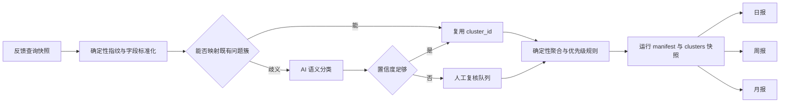

# 反馈洞察系统优化调研

> 调研日期：2026-08-06
> 调研范围：GitHub Issues/Projects、Atlassian Jira/Jira Service Management、Linear、Sentry、Zendesk 的官方文档
> 目标：为当前 feedback insight 的日报、中间产物和后续周报/月报选择可落地机制，而不是复制一套完整工单系统

## 一、结论摘要

当前实现最值得保留的边界是：**大模型负责语义分类和建议草稿，计数、趋势、影响人数和优先级由确定性代码计算**。Sentry 同样把“问题分组”和“优先级更新”作为不同机制，并按事件等级、可行动性及事件量变化调整优先级；人工改写后还会停止自动调整。这说明严重度、行动优先级和人工覆盖必须分开记录，而不是让模型直接给一个不可解释的 P0-P4。[S1][S2]

建议按以下顺序演进：

1. **先补结构化运行产物和 canonical 问题簇台账**：原始 feedback 是 occurrence，同一根因的问题簇才是 Problem；同时报告“问题数”和“发生次数”。JSM 告警去重会把相同 alias 的事件累计到 canonical alert 的 Count，Zendesk 也把多个 Incident 关联到一个 Problem。[A5][Z5]
2. **再补影响范围、优先级理由、owner 和行动项**：其中 owner 只能来自模块归属配置或人工分派，不能由模型猜测。GitHub 用 assignee 明确谁在处理，Sentry 用 ownership rules 自动路由到正确 owner。[G3][S3]
3. **新增独立周报和月报**：周报关注重复、回归和处置推进；月报关注结构性质量、积压和治理效果。Linear Insights 的做法也是对 issue 数据按 measure、slice、segment 分析趋势，而不是拼接多份日视图。[L5]
4. **最后再接 SLA/状态流转**：只有后端能够提供 owner、状态变更时间和解决时间时，SLA 才可审计。JSM 和 Zendesk 的 SLA 都是基于明确目标、时钟条件、响应/解决时间，而不是由报告推断。[A2][A3][Z2]

不建议把本地报告服务扩成 Jira/JSM 的替代品。当前项目应定位为“洞察与决策层”，事实状态仍由反馈服务或后续接入的 issue 系统持有。

## 二、当前实现与关键缺口

根据当前代码，系统已经具备以下基础：

- 模型逐条产生 `module/problem_key/problem_category/problem_summary/recommended_work/confidence`，稳定键会被校验。
- 相同周期和上一等长周期按 `module + problem_key` 聚合，计算次数、变化率、影响用户数和样本反馈 UUID。
- 严重度取问题簇内最高值；P0-P4 由严重度、频次、影响用户和趋势的确定性规则计算。
- 低置信度问题标记 `needs_review`，报告保留 Critical/High 明细和全部问题明细。

主要缺口不在“再让模型总结一次”，而在以下数据链路：

| 缺口 | 当前风险 | 应补机制 |
|---|---|---|
| 问题 taxonomy 仅在单次批处理内向后传递 | 跨日报、跨批次可能产生同义 `problem_key`；结果受批次顺序影响 | 持久化问题簇台账；规则指纹优先，AI 仅处理歧义；记录 merge/split 历史 |
| Markdown 是主要可见产物 | 无法可靠复算周报/月报，也难追查某个数字如何产生 | 每次运行保存版本化 `manifest.json` 和 `clusters.json`，Markdown 仅作为视图 |
| 报告未展示已有 `affected_users`、样本 UUID、优先级分值 | 优先级看起来像模型结论，影响范围不透明 | 展示影响人数、频次、趋势、最高严重度和优先级理由 |
| 建议工作没有 owner、接受状态、期限 | 建议容易停留在文字层 | 增加 action item：建议、owner、状态、目标日期、关联 issue |
| 状态只有当前值，没有状态事件 | 无法计算首次响应、处理时长、解决时长或 SLA | 从上游取得状态变更事件；没有事件前不展示伪 SLA |
| AI 仅记录 provider/model | 无法确认使用了哪版 prompt、taxonomy、规则和输入 | 保存 prompt/rule/schema 版本、输入清单、证据样本、模型参数、重试和人工复核结果 |

## 三、可引入的市场机制及项目取舍

### 3.1 严重度与优先级必须分离

Jira 将 priority 定义为工作的重要性/紧迫性排序，并允许独立配置；JSM 进一步区分 impact（业务影响）和 urgency（距离显著影响发生的时间），用二者计算 priority。Linear 也把 priority 定义为“哪些 issue 应先完成”。Sentry 则根据事件等级或可行动性形成优先级，并在事件量激增时自动升档。[A1][A6][L1][S2]

适用于本项目的定义：

- `severity`：单条反馈描述的客观损害上限，例如数据错误、服务不可用、安全风险。来源是反馈记录或经人工确认的事实。
- `urgency`：问题是否正在扩大、是否回归、是否临近业务节点或 SLA；必须由可验证信号计算或人工确认。
- `priority`：问题簇当前的行动顺序，由严重度、当前频次、影响人数、趋势、回归和时效共同计算。
- `priority_override`：人工覆盖值及原因。覆盖后不应继续静默自动改写，除非人工明确恢复自动模式；这与 Sentry 的人工调整行为一致。[S2]

因此“bug 优先级高”不应实现为所有 bug 自动 P0/P1。单个低影响 bug 可以低优先级；频繁发生、影响多人或回归的普通严重度 bug 可以升高；高频功能建议也可能比孤立 bug 更值得先做。建议在报告中展示：

`P1（规则）= high 严重度 + 12 次 + 8 个受影响用户 + 较上期增长 100%`

需新增的结构字段：

```json
{
  "severity": "high",
  "priority": "P1",
  "priority_score": 78,
  "priority_source": "rule",
  "priority_reasons": ["severity:high", "frequency:12", "affected_users:8", "trend:+100%"],
  "priority_override": null,
  "priority_rule_version": "v2"
}
```

### 3.2 重复问题不是“相同标题”，而是稳定问题簇

Sentry 使用 grouping algorithm 和 fingerprint 将相同根因的事件归并为 issue，并允许通过 fingerprint/grouping rules 调整分组；Linear 明确支持 duplicate/related/blocking 关系；Zendesk 则明确区分 canonical Problem 和关联的多个 Incident。[S1][L2][Z5]

当前 `problem_key` 方向正确，但建议升级为两层：

1. **确定性指纹层**：优先使用 `system_alias + operation + error_code/标准化失败信号`。完全相同的机器信号无需重复消耗模型。
2. **语义归并层**：只有规则无法判断时才让模型建议映射到既有 taxonomy 或提出新问题簇，输出匹配理由和候选，低置信度进入人工复核。Linear 的 AI triage 也允许查看建议理由并接受或拒绝，而不是只给不可复核结果。[L7]

问题簇台账至少保存：

```text
cluster_id / module / problem_key / canonical_summary
first_seen / last_seen / occurrence_count / affected_user_count
sources / affected_versions / severities / sample_feedback_uuids
status / owner / linked_issue / merged_into / taxonomy_version
```

Linear Customer Requests 可按 customer count、客户属性和重要标记筛选、排序问题，说明“重复次数”应与“影响客户结构”同时保留，而不是只看总条数。[L3]

项目取舍：首期不做向量数据库或全量 embedding 检索。现有每日量级先采用规则指纹、持久 taxonomy 和少量 AI 歧义判断；当问题簇数量显著增长且误归并率可测后，再评估向量召回。

### 3.3 影响范围要比“次数”多一层，但不能暴露个人信息

推荐的影响维度：

- `occurrence_count`：反馈/失败出现次数。
- `affected_user_count`：去重用户数，只展示计数，不在报告展示身份。
- `affected_sources`：CLI、MCP、Skill、API。
- `affected_systems/modules/operations`：具体功能面。
- `affected_versions`：是否集中于某版本或回归窗口。
- `failed_call_count`：失败调用总量。
- `active_days`：周期内出现天数，区分集中爆发与持续问题。

Linear 把客户数量、状态、层级、收入、规模作为识别高影响工作的过滤维度；Sentry 优先级会根据事件等级、历史相似问题和事件量变化判断可行动性。[L3][S2] 对本项目而言，不应引入收入等当前拿不到的数据，也不应让模型估计影响人数；只使用查询结果中可确定计算的维度。

### 3.4 状态流转和 SLA 依赖上游事实，不应在 Markdown 中模拟

Linear 允许团队配置 issue 流经的状态；Zendesk 支持管理 ticket statuses；JSM SLA 使用目标和时钟条件，且可按 priority 组织不同目标；Zendesk SLA 明确度量响应和解决时间。[L4][Z3][A2][A3][Z2]

本项目可采用的最小状态模型：

```text
new -> triaged -> in_progress -> resolved
                  \-> blocked
new/triaged -> ignored（必须填写原因）
resolved -> reopened
```

状态事件至少包含 `from/to/changed_at/changed_by/reason`。只有这些事件存在后，才计算：

- `time_to_triage`
- `time_to_first_action`
- `time_to_resolve`
- `age_in_status`
- `reopen_count`
- `sla_due_at / sla_breached`

首期 SLA 只覆盖 P0/P1，例如 P0 的认领和缓解目标、P1 的分诊和行动计划目标；不要为所有反馈建立复杂日历和暂停规则。JSM/Linear/Zendesk 的完整 SLA 引擎适用于实际服务台，本地洞察层只消费其结果或实现极少数确定性目标。[A2][L6][Z2]

### 3.5 owner 和行动项是建议能否闭环的关键

GitHub 明确用 assignee 表示谁在处理 issue；Sentry ownership rules 可按规则自动分配正确 owner。[G3][S3] 因此建议：

- `owner_team` 优先来自 `module -> team` 受控映射。
- `owner_user` 来自人工分派或外部 issue 系统同步。
- 大模型只能给 `recommended_work`，不能生成 owner。
- 每个 P0/P1 必须有一个可验证行动项：`action/owner/status/due_at/linked_issue`。
- P2-P4 可批量进入 backlog，不强制逐项建工单。

建议工作还需区分状态：`proposed -> accepted/rejected -> in_progress -> done`。否则周报无法回答“上周建议做了什么、是否有人接、是否完成”。

### 3.6 周报和月报应分别回答不同问题

Linear Insights 将 issue 数据作为可分析数据集，按计数、周期时间等 measure 以及不同 slice/segment 生成图和表，用于发现趋势和阻塞；Zendesk Ticket Metrics 也把首次回复、解决、等待和重开次数保存为独立指标。[L5][Z6] 本项目应直接从结构化运行快照和问题簇台账重新聚合，**不能读取七份/三十份 Markdown 相加**。

#### 日报：今天要处理什么

- 首屏先列“需要行动”，分布图后置：`优先级 / canonical 问题 / 为什么现在处理 / 次数与人数 / owner / 下一步 / 截止时间 / 证据`。
- P0/P1 问题簇及可解释的升优先级原因。
- 今日新问题簇、回归问题簇、突然增长问题簇。
- 未分派、待复核、即将超时问题。
- 影响范围、样本反馈 UUID、建议行动。
- 全量明细放折叠区，分布图保持紧凑。

#### 周报：本周问题是否在收敛

- 7 天与前 7 天对比；新增、持续、已解决、重开问题簇。
- 高频 Top 10 和 Pareto 累计占比，避免只展示平均值。
- 模块趋势、影响用户、活跃天数、版本分布。
- backlog 年龄、状态停留、owner 覆盖率、行动项完成率。
- P0/P1 的 SLA 达标率（有状态事件后才启用）。
- AI 待复核率、taxonomy 新增/合并数，监控洞察质量。

#### 月报：哪里存在结构性质量问题

- 自然月与上一自然月对比，不使用滚动 30 天冒充月报。
- 模块 × 问题类别热力图、长期 Top 问题簇、重复贡献度。
- 解决后复发率、重开率、跨版本持续问题。
- backlog 年龄分层和净增量。
- 建议行动完成率及完成后问题频次变化。
- 数据覆盖率、分类置信度、人工修正率和规则版本变化。

项目取舍：首期周报/月报继续输出 Markdown，并复用本地 HTTP 浏览；图表优先采用趋势折线、Top 问题横向条形图、模块热力图。饼图仅用于少类别的组成，不用于时间趋势或长尾 Top 问题。

### 3.7 AI 洞察必须可审计、可复核，而不是只留下成稿

Atlassian Intelligence 生成 PIR 时会使用事件及可访问的 Slack channel 数据，并明确要求用户 review、再加入描述、按需编辑；Sentry Seer 允许展开支撑根因分析的事件、代码和 telemetry；Zendesk ticket events 会保留由人员或业务规则产生的更新和通知。[A4][S4][Z4] 对当前系统的直接启示是：AI 文本必须能追溯输入证据、版本和人工结果。

每次运行建议生成：

```text
output/feedback-query/runs/2026-08-06-daily/
├── manifest.json       # 时间窗、运行状态、输入数量、版本、耗时、错误与重试
├── clusters.json       # 问题簇、指标、priority reasons、证据 UUID、行动项
└── report.md           # 面向人的最终视图
```

`manifest.json` 最少包含：

- `run_id/report_type/period/comparison_period/generated_at`
- `schema_version/generator_version/priority_rule_version/taxonomy_version`
- `model/provider/temperature/batch_size/prompt_version/prompt_hash`
- 输入反馈 UUID 清单或其受控哈希、每批引用映射、批次响应状态。
- `classification_confidence/needs_review/reviewer/reviewed_at/correction`。
- `source_snapshot_id`、报告文件哈希、降级原因。

隐私取舍：长期保存 UUID、指标和哈希，不在报告保存邮箱、用户 ID、原始 payload 或凭据。若为了复现 AI 分类需要短期保留脱敏输入，应放在权限受限目录并设置短保留期；不应把完整反馈正文重复复制到长期产物。

## 四、建议的目标数据流



关键约束：

- 模型不计算次数、影响人数、趋势、SLA 或最终优先级。
- 每个问题簇必须能回到样本反馈 UUID。
- 每个 P0/P1 必须显示规则理由、owner 状态和行动项状态。
- 周/月聚合使用原始结构化指标；报告样式变化不影响统计。
- 同一 `report_type + period + schema_version` 应幂等，失败运行不得覆盖上一份成功产物。

## 五、实施优先级与不采用项

### 第一阶段：立即可做

1. 报告增加 `affected_users`、优先级分值/理由、样本 UUID、首次/最后出现时间。
2. 每次日报写 `manifest.json + clusters.json`，Markdown 从该结构渲染。
3. taxonomy 跨运行持久化，并记录别名、合并和人工修正。
4. 新增 7 天周报和自然月月报，沿用同一聚合函数和指标定义。
5. 对 P0/P1 增加“owner 未设置/行动项未确认”提示，先不伪造 owner。

### 第二阶段：需要反馈服务配合

1. 增加状态事件、owner、关联 issue、解决时间和重开事件的数据契约。
2. 按模块归属自动推荐 owner team，由人工或上游系统确认具体 owner。
3. P0/P1 启用最小 SLA 和超时提醒。
4. 周报/月报增加 owner 覆盖率、状态停留、MTTA/MTTR、SLA 达标率和复发率。

### 暂不采用

- 不建设完整工单编辑、评论、权限、通知和工作流引擎；优先对接现有 issue/工单系统。
- 不让大模型直接决定优先级、严重度、SLA 或 owner。
- 不按“bug 类型”硬编码高优先级，应按实际损害、影响、频次和趋势排序。
- 不以每日 Markdown 作为周报/月报的数据源。
- 不在量级和误归并指标尚未证明需要前引入向量数据库。
- 不把所有 AI 原始输入永久留存；可审计性与隐私保留期分别设计。

## 六、验收指标

优化是否有效，应通过下列指标而非“报告更长”判断：

| 目标 | 建议指标 |
|---|---|
| 聚类稳定 | 同一已知问题跨日复用 `cluster_id` 的比例；人工拆分/合并率 |
| 优先级可信 | P0/P1 显示规则理由比例 100%；人工覆盖均有原因 |
| 洞察可审计 | 问题簇带证据 UUID 比例 100%；运行产物含版本/哈希比例 100% |
| 建议可执行 | P0/P1 owner 覆盖率、行动项接受率、按期完成率 |
| 问题在收敛 | 高频问题周环比、解决后复发率、backlog 净增量 |
| AI 质量 | 低置信度率、人工修正率、跨批次同义 key 率、降级率 |

## 七、官方来源

以下页面均于 **2026-08-06** 访问。

| 编号 | 官方来源 | 用于本报告的事实 |
|---|---|---|
| [G1] | [GitHub Docs：About single select fields](https://docs.github.com/en/issues/planning-and-tracking-with-projects/understanding-fields/about-single-select-fields) | Projects 可用独立单选字段表达受控属性 |
| [G2] | [GitHub Docs：Managing labels](https://docs.github.com/en/issues/using-labels-and-milestones-to-track-work/managing-labels) | label 用于分类 issue、PR 和 discussion |
| [G3] | [GitHub Docs：Assigning issues and pull requests](https://docs.github.com/en/issues/tracking-your-work-with-issues/using-issues/assigning-issues-and-pull-requests-to-other-github-users) | assignee 用于明确谁在处理具体 issue |
| [A1] | [Atlassian Support：Manage priorities](https://support.atlassian.com/jira-cloud-administration/docs/manage-priorities/) | Jira priority 是可配置的工作优先次序 |
| [A2] | [Atlassian Support：What are SLAs?](https://support.atlassian.com/jira-service-management-cloud/docs/what-are-slas/) | JSM SLA 用于度量服务团队提供的服务水平 |
| [A3] | [Atlassian Support：Use priority to group SLA goals](https://support.atlassian.com/jira-service-management-cloud/docs/use-priority-to-group-sla-goals/) | SLA 目标可按 priority 分组配置 |
| [A4] | [Atlassian Support：Create a PIR using Atlassian Intelligence](https://support.atlassian.com/jira-service-management-cloud/docs/create-a-post-incident-review-using-atlassian-intelligence/) | AI PIR 可使用事件/Slack 数据，生成内容需 review 后加入并可编辑 |
| [A5] | [Atlassian Support：What is alert deduplication?](https://support.atlassian.com/jira-service-management-cloud/docs/what-is-alert-deduplication/) | 相同 alias 的告警累计到 canonical alert 的 Count，并记录去重活动 |
| [A6] | [Atlassian Support：How impact and urgency calculate priority](https://support.atlassian.com/jira-service-management-cloud/docs/how-impact-and-urgency-are-used-to-calculate-priority/) | impact 与 urgency 是计算 priority 的不同输入 |
| [L1] | [Linear Docs：Priority](https://linear.app/docs/priority) | priority 表示哪些 issue 应优先完成 |
| [L2] | [Linear Docs：Issue relations](https://linear.app/docs/issue-relations) | issue 支持 duplicate、related、blocking 关系 |
| [L3] | [Linear Docs：Customer Requests](https://linear.app/docs/customer-requests) | 可按客户数量和客户属性识别高影响产品工作 |
| [L4] | [Linear Docs：Configuring workflows](https://linear.app/docs/configuring-workflows) | 团队配置 issue 流转状态 |
| [L5] | [Linear Docs：Insights](https://linear.app/docs/insights) | issue 数据可按指标和维度分析趋势与阻塞 |
| [L6] | [Linear Docs：SLAs](https://linear.app/docs/sla) | 可对需在一定时间完成的 issue 自动应用 SLA |
| [L7] | [Linear Docs：Triage Intelligence](https://linear.app/docs/triage-intelligence) | AI 可建议 team、assignee、label 和重复关系，并展示理由供接受或拒绝 |
| [S1] | [Sentry Docs：Issue Grouping](https://docs.sentry.io/concepts/data-management/event-grouping/) | 使用默认 grouping algorithm、fingerprint 和规则归并错误事件 |
| [S2] | [Sentry Docs：Issue Priority](https://docs.sentry.io/product/issues/issue-priority/) | priority 基于等级/可行动性，并随事件量激增自动升降；支持人工覆盖 |
| [S3] | [Sentry Docs：Ownership Rules](https://docs.sentry.io/product/issues/ownership-rules/) | ownership rules 将 issue 自动分配给正确 owner |
| [S4] | [Sentry Docs：Seer](https://docs.sentry.io/product/ai-in-sentry/seer/) | 根因分析可关联支撑事件、代码与 telemetry |
| [Z1] | [Zendesk Help：About ticket fields](https://support.zendesk.com/hc/en-us/articles/4408886739098-About-ticket-fields) | ticket 使用标准/自定义字段捕获结构化请求信息 |
| [Z2] | [Zendesk Help：About SLA policies and how they work](https://support.zendesk.com/hc/en-us/articles/5600997516058-About-SLA-policies-and-how-they-work) | SLA policy 定义并度量响应和解决时间 |
| [Z3] | [Zendesk Help：Managing ticket statuses](https://support.zendesk.com/hc/en-us/articles/4412575941402-Managing-ticket-statuses) | ticket 状态可被集中管理 |
| [Z4] | [Zendesk Help：Viewing all events for ticket updates](https://support.zendesk.com/hc/en-us/articles/4408829602970-Viewing-all-events-for-ticket-updates) | ticket events 展示由人员或业务规则产生的更新和通知 |
| [Z5] | [Zendesk Help：Working with problem and incident tickets](https://support.zendesk.com/hc/en-us/articles/4408835103898-Working-with-problem-and-incident-tickets) | 多个 incident 可关联一个 canonical problem |
| [Z6] | [Zendesk Developers：Ticket Metrics API](https://developer.zendesk.com/api-reference/ticketing/tickets/ticket_metrics/) | 独立记录首次回复、解决、等待时间和重开次数 |
