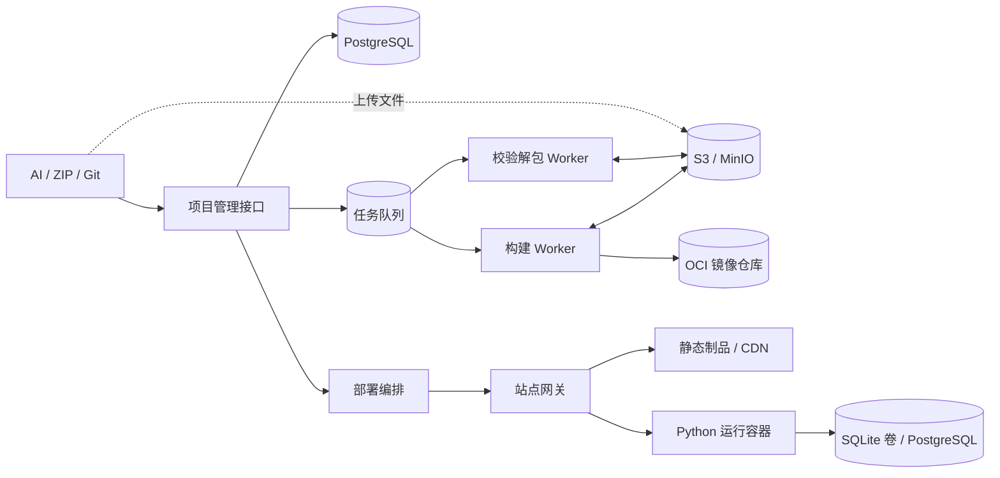
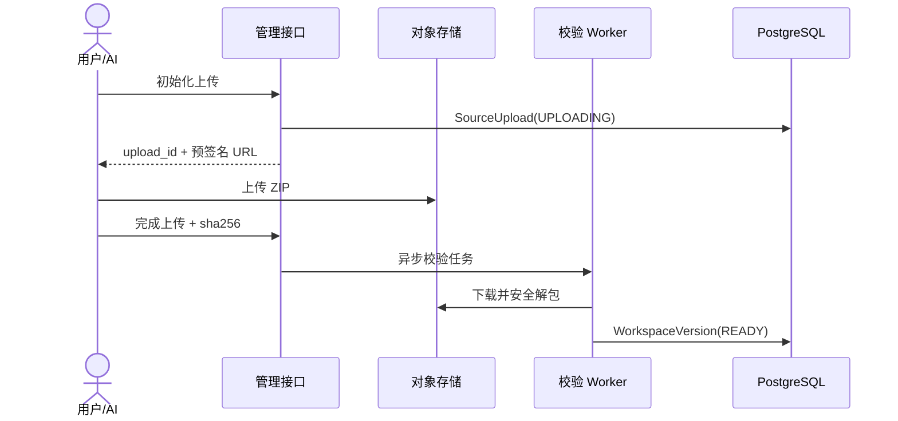
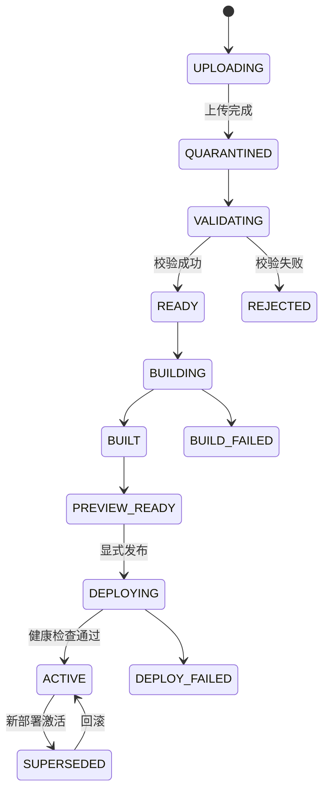
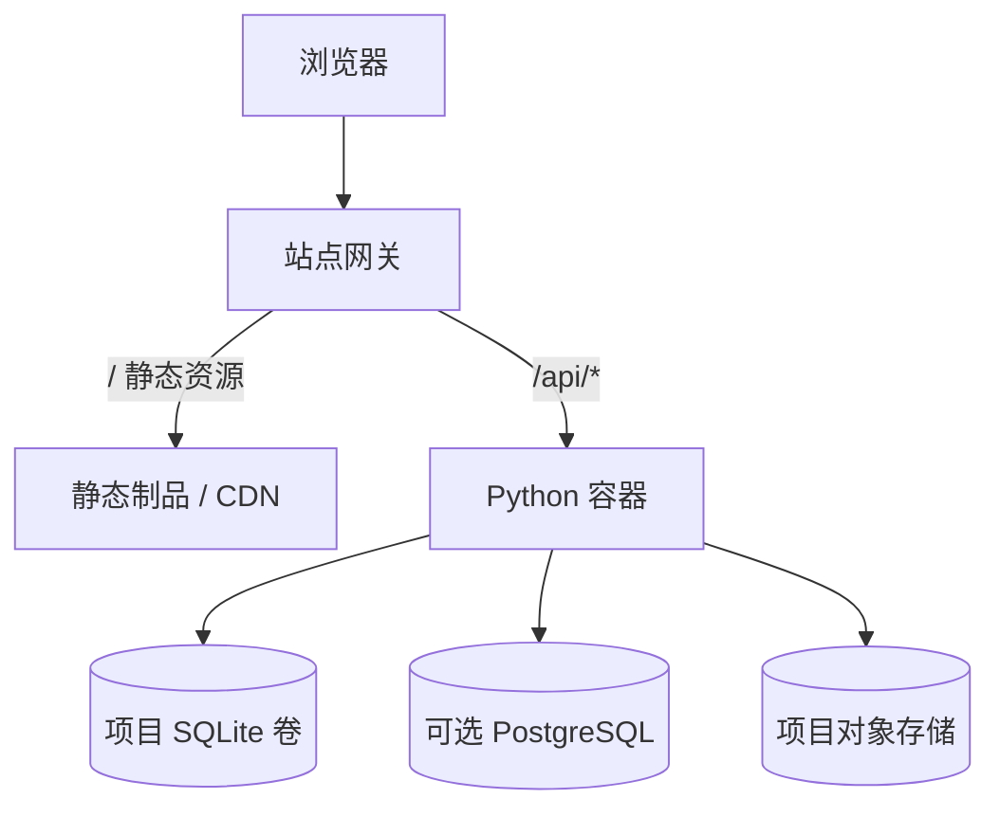

# AI 站点生成与部署系统设计

> 状态：方案草案 | 日期：2026-08-21

本文面向类似 ChatGPT Sites 的站点系统：用户通过 AI、ZIP 或 Git 创建项目，平台负责版本、预览、部署、接口和数据管理。

## 1. 核心结论

系统的核心对象是：

```text
Project -> WorkspaceVersion -> Build -> PreviewSession -> Deployment
```

- ZIP、AI 生成、Git 是不同输入，统一转换为不可变 `WorkspaceVersion`；
- 原始包、源码快照和静态文件放对象存储；Python 应用构建为 OCI 镜像；
- PostgreSQL 保存项目、版本、构建、部署、路由和数据绑定；
- 服务器不互相同步项目目录，worker 按版本从统一存储拉取输入；
- 预览与生产分离，只有显式发布才切换生产路由；
- 前端制品、后端镜像、配置和数据绑定由同一个 `Deployment` 绑定；
- SQLite 运行数据独立于代码版本，代码回滚不自动回滚数据库；
- 用户 Python 必须在独立容器或更强沙箱中运行，不能加载进平台主进程。

## 2. 项目包结构

```text
site-package/
├── site.yaml                 # 必须，项目清单
├── frontend/                 # HTML、CSS、JS、图片、静态 JSON
│   └── index.html
├── backend/                  # 可选，Python 接口
│   ├── app/main.py
│   ├── requirements.lock
│   ├── migrations/
│   └── tests/
├── seed/                     # 可选，只用于初始化数据
│   └── initial.sqlite
└── README.md
```

运行数据不能放在源码包内：

```text
runtime-data/{project_id}/site.db
objects/{project_id}/...
```

### `site.yaml` 示例

```yaml
version: 1
name: request-dashboard

frontend:
  directory: frontend
  index: index.html

backend:
  runtime: python3.12
  application: app.main:app
  server: asgi
  port: 8000
  healthcheck: /health

routes:
  - path: /api/*
    target: backend

storage:
  database: {type: sqlite, binding: DB, mount: /data, filename: site.db}
  files: {type: object_storage, binding: FILES}
```

清单只声明运行约定，不允许保存密钥、宿主路径、Docker Socket、特权参数或任意端口映射。

## 3. 总体架构



控制面只管理状态和意图；worker 负责校验和构建；网关负责静态文件与 `/api/*` 分流。

## 4. 文件打包与上传

### 4.1 客户端步骤

1. 检查根目录存在 `site.yaml`；
2. 排除 `.git`、虚拟环境、缓存、日志、`.env`、运行数据库和 `node_modules`；
3. 生成 ZIP，计算 SHA-256、文件数和大小；
4. 调用上传初始化接口，获得 `upload_id` 和预签名 URL；
5. 直接上传对象存储；
6. 调用完成接口，服务端异步校验并创建版本。

### 4.2 上传流程



### 4.3 服务端校验

- 拒绝绝对路径、`../`、符号链接、硬链接和设备文件；
- 限制压缩包大小、解压大小、文件数、目录深度和压缩比；
- 规范化路径后检查重复文件；
- 校验 SHA-256、清单、MIME 和扩展名；
- 在低权限临时目录中扫描和解包，完成后销毁；
- 原始 ZIP 不覆盖，规范化源码按哈希保存。

## 5. 版本、构建与同步

### 5.1 状态机



### 5.2 统一事实源

| 数据 | 存储 |
|---|---|
| 原始 ZIP、源码快照、静态制品、日志 | S3/MinIO |
| Python 镜像 | OCI Registry |
| 项目和部署状态 | PostgreSQL |
| 构建任务 | Redis/RabbitMQ/NATS 等队列 |
| SQLite 运行数据 | 项目专属持久卷 |
| 密钥 | KMS/Vault/加密存储 |

不要用 `rsync` 或共享 FTP 目录作为多服务器同步方案。worker 根据不可变 key 拉取输入，部署模块只切换路由指针。

推荐 key：

```text
sources/{tenant}/{project}/{sha256}.zip
workspaces/{tenant}/{project}/{version_sha256}.tar.zst
artifacts/{tenant}/{project}/{artifact_sha256}/...
```

## 6. 构建、预览与部署

### 6.1 静态站点

```text
WorkspaceVersion -> 校验 frontend/ -> 固定构建器（可选）
                 -> 内容哈希文件清单 -> 静态 Artifact -> CDN
```

预览和生产必须使用不同域名，例如：

```text
控制台：console.example.com
预览：{preview_id}.preview.example-sites.net
生产：{site}.example-sites.net
```

### 6.2 Python 后端

一期只允许平台固定的 Python 版本、依赖文件和 `module:attribute` 入口，不允许自定义 Dockerfile 或 Compose。

构建 worker 必须具备：非 root、无生产密钥、网络限制、CPU/内存/磁盘/PID/时间限制、依赖和镜像扫描。构建结束后销毁。

### 6.3 发布步骤

1. 创建不可变 `Deployment`，冻结前端 digest、后端 image digest、配置和数据绑定；
2. 挂载数据并执行向前迁移；
3. 启动后端，检查 `/health`；
4. 检查静态制品；
5. 原子更新 `Route.active_deployment_id`；
6. 旧部署保留，回滚时直接重新激活，不重新构建。



## 7. 接口设计

### 7.1 平台管理接口

| 方法 | 路径 | 作用 |
|---|---|---|
| `POST` | `/api/v1/projects` | 创建项目 |
| `GET` | `/api/v1/projects/{id}` | 查询项目和当前部署 |
| `POST` | `/api/v1/projects/{id}/source-uploads` | 初始化 ZIP 上传 |
| `POST` | `/api/v1/source-uploads/{id}/complete` | 完成上传并校验 |
| `GET` | `/api/v1/projects/{id}/versions` | 查询版本 |
| `POST` | `/api/v1/versions/{id}/builds` | 请求构建 |
| `GET` | `/api/v1/builds/{id}` | 查询构建和日志 |
| `POST` | `/api/v1/builds/{id}/previews` | 创建预览 |
| `POST` | `/api/v1/projects/{id}/deployments` | 发布版本 |
| `POST` | `/api/v1/projects/{id}/rollbacks` | 回滚部署 |
| `PUT` | `/api/v1/projects/{id}/environment` | 更新环境变量版本 |
| `GET` | `/api/v1/projects/{id}/data-bindings` | 查询数据绑定 |

上传、构建和部署均为异步任务，返回 `202` 和稳定 ID；重复请求必须幂等。

### 7.2 站点后端约定

- 监听平台提供的 `HOST` 和 `PORT`；
- 提供无需生产依赖的 `GET /health`；
- 业务接口放在 `/api/*`；
- 数据绑定和密钥从环境变量读取；
- 文件写入对象存储，不写镜像文件系统；
- 日志输出 stdout/stderr，并携带 request ID；
- 前端使用相对路径：`fetch('/api/tasks')`。

## 8. 数据库与文件管理

| 数据 | 位置 | 是否随版本发布 | 回滚 |
|---|---|---|---|
| HTML、Python、配置 JSON、迁移脚本 | `WorkspaceVersion` | 是 | 切换历史部署 |
| 构建生成文件 | 静态 Artifact | 是 | 切换历史部署 |
| 初始化 SQLite | `seed/initial.sqlite` | 首次初始化 | 不覆盖运行库 |
| 线上可写 SQLite | 项目持久卷 | 否 | 独立快照恢复 |
| 图片和附件 | 对象存储 | 否 | 对象版本恢复 |
| 平台元数据 | PostgreSQL | 不适用 | 平台备份恢复 |
| 密钥 | KMS/Vault | 通过版本绑定 | 重新绑定旧版本 |

### SQLite 规则

- 只支持单副本、低并发、应用与数据库同节点；
- `site.db`、`-wal`、`-shm` 必须在同一持久卷；
- 首次部署可从 `seed/initial.sqlite` 初始化，后续不得覆盖；
- migration 使用递增版本号和项目级租约；
- 发布前备份，代码回滚不自动恢复数据库；
- 需要多副本、高并发、读副本或高可用时迁移 PostgreSQL；
- 不使用 FTP、Git、对象存储挂载或普通 NFS 同步运行中的 SQLite。

### 用户附件

数据库只保存 `object_key`、所有者、MIME、大小、哈希和时间；容器通过短期凭证或平台文件接口访问对象存储。

## 9. 最小元数据模型

```text
projects(id, tenant_id, owner_id, name, status)
source_uploads(id, project_id, object_key, sha256, size, status)
workspace_versions(id, project_id, source_type, source_ref, parent_id, manifest_json)
builds(id, version_id, status, config_hash, log_key, started_at, finished_at)
artifacts(id, build_id, type, digest, object_key, image_ref)
preview_sessions(id, build_id, url, status, expires_at)
deployments(id, project_id, version_id, frontend_artifact_id, backend_artifact_id, status)
routes(id, project_id, host, active_deployment_id, access_policy)
data_bindings(id, project_id, type, binding_name, locator_ciphertext, status)
secret_versions(id, project_id, version, ciphertext, created_at)
```

关键约束：同一项目同一哈希不重复上传；成功构建按版本和构建配置去重；一个路由只能有一个活动部署；数据绑定名称在项目内唯一。

## 10. 安全基线

- ZIP 解包拒绝路径穿越、链接文件、设备文件和压缩炸弹；
- 控制台与用户站点使用不同可注册域，避免 Cookie 和 Service Worker 污染；
- 网关删除客户端伪造的内部身份头，不转发平台 Cookie；
- 构建和运行使用不同凭证、网络和资源配额；
- 不挂载 Docker Socket，不注入生产密钥到构建 worker；
- 对用户 HTML/JS 设置准确 MIME、`nosniff` 和 CSP；
- 外部不可信租户逐步采用 gVisor、Kata 或 microVM 隔离。

## 11. 分阶段实施

### 一期：静态站点

ZIP 预签名上传、安全解包、版本、静态构建、预览、正式域名、回滚、PostgreSQL 元数据和 MinIO/S3。此阶段不需要 FTP、Git 服务或 Python 运行时。

### 二期：受控 Python 与 SQLite

固定 Python runtime、独立构建 worker、OCI Registry、Python 容器、`/api/*` 路由、SQLite 卷、迁移、备份、密钥和对象文件绑定；再接入 Git webhook。

### 三期：多租户应用平台

多节点调度、PostgreSQL 数据服务、强沙箱、自动扩缩容、组织 RBAC、审计、自定义域名和经审核的 Dockerfile。FTP/SFTP 仅作为遗留系统适配器。

## 12. 一期验收标准

1. 两次 ZIP 上传生成两个可追溯版本；
2. 重复回调和重复构建不会产生重复活动部署；
3. 非法路径、链接文件和超限压缩包会被拒绝；
4. 构建失败不影响线上版本；
5. 预览不会自动发布；
6. 发布和回滚不重新构建且不覆盖运行数据库；
7. `/api/*` 正确转发到对应 Python 服务；
8. 源码、制品、日志和部署可通过稳定 ID 追溯；
9. 删除无状态控制面实例不会丢失项目版本。

## 参考

- [用户站点上传与构建发布方案调研](../analysis/用户站点上传与构建发布方案调研.md)
- [OWASP 文件上传安全清单](https://cheatsheetseries.owasp.org/cheatsheets/File_Upload_Cheat_Sheet.html)
- [SQLite 适用场景](https://sqlite.org/whentouse.html)
- [Netlify Atomic Deploys](https://docs.netlify.com/site-deploys/overview/#how-atomic-deploys-work)
