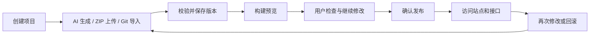
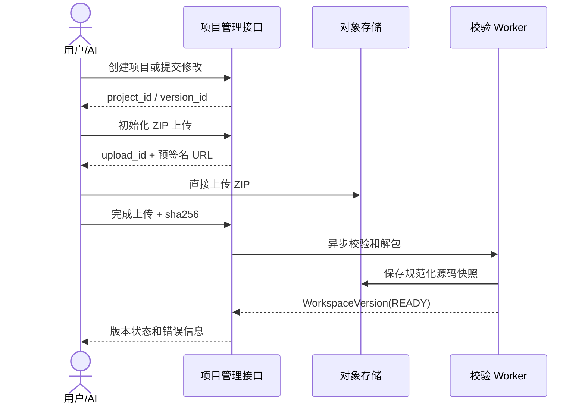
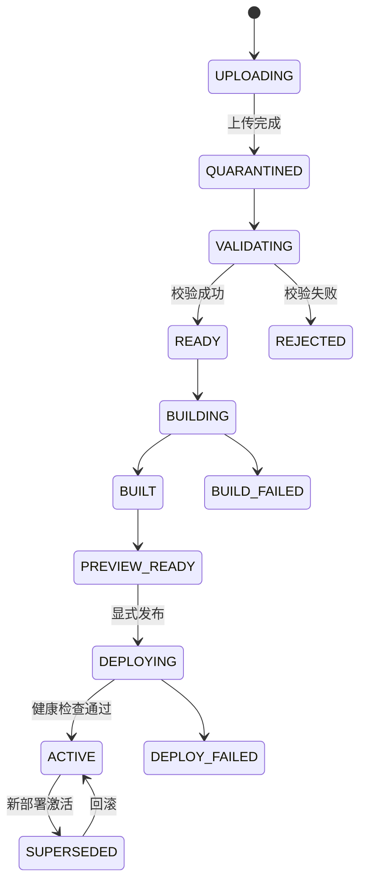

# AI 站点生成与部署系统设计

> 状态：方案草案 | 日期：2026-08-21

本文说明一个类似 ChatGPT Sites 的站点系统：用户通过 AI 对话、ZIP 或 Git 创建项目，平台负责保存版本、生成预览、部署站点，并为项目提供 Python 接口和数据存储。

## 1. 先看整体流程

用户看到的是一条连续流程：



平台内部对应 5 个核心对象：

```text
Project -> WorkspaceVersion -> Build -> PreviewSession -> Deployment
```

重要规则：

- 每次上传或 AI 修改都形成一个可追溯版本；
- 预览不会自动变成生产版本；
- 发布是显式动作，回滚是重新激活历史部署；
- 前端、后端、配置和数据绑定属于同一个部署快照；
- 运行数据独立于代码版本。

## 2. 用户与系统的交互流程

### 2.1 创建项目

用户可以：

- 直接描述需求，让 AI 创建站点；
- 上传一个 ZIP 作为现有项目；
- 连接 Git 仓库导入项目。

系统返回 `project_id`，后续所有版本、构建和部署都归属于该项目。

### 2.2 上传或生成版本



上传失败时不会生成可构建版本；重复完成回调只返回原任务状态，不重复创建版本。

### 2.3 构建和预览

用户点击“预览”后：

1. 平台读取指定 `WorkspaceVersion`；
2. 构建前端静态文件；
3. 如果有 Python，则构建独立后端运行包；
4. 启动临时预览环境；
5. 返回预览 URL、构建日志和健康状态。

预览环境默认使用测试数据，不使用生产密钥和生产 SQLite。

### 2.4 发布和回滚

用户确认发布后：

1. 平台创建不可变 `Deployment`；
2. 启动后端并检查 `/health`；
3. 检查静态文件和接口；
4. 将域名指向新部署；
5. 保留旧部署，便于回滚。

```text
预览 URL：preview-xxx.preview.example.com
生产 URL：project-name.sites.example.com

发布：active_deployment_id = 新部署
回滚：active_deployment_id = 历史部署
```

## 3. 项目由哪些部分组成

### 3.1 项目包结构

```text
site-package/
├── site.yaml                 # 项目清单，必须存在
├── frontend/                 # HTML、CSS、JS、图片、静态 JSON
│   └── index.html
├── backend/                  # 可选，Python 接口
│   ├── app/main.py
│   ├── requirements.lock
│   ├── migrations/
│   └── tests/
├── seed/                     # 可选，只用于首次初始化
│   └── initial.sqlite
└── README.md
```

源码包不包含运行中的数据库和用户附件：

```text
runtime-data/{project_id}/site.db
objects/{project_id}/...
```

### 3.2 项目清单

```yaml
version: 1
name: request-dashboard

frontend:
  directory: frontend
  index: index.html

backend:
  runtime: python3.12
  application: app.main:app
  healthcheck: /health

routes:
  - path: /api/*
    target: backend

storage:
  database: {type: sqlite, binding: DB}
  files: {type: object_storage, binding: FILES}
```

清单只声明项目运行约定，不保存密钥、宿主路径、Docker Socket、特权参数或任意端口映射。

## 4. 接口如何管理和访问

### 4.1 两类接口

| 类型 | 示例 | 作用 |
|---|---|---|
| 平台管理接口 | `console.example.com/api/v1/projects` | 项目、版本、构建、发布、数据绑定管理 |
| 用户项目接口 | `project-name.sites.example.com/api/tasks` | 用户 Python 应用提供的业务接口 |

平台不需要把每个业务接口单独注册到公共服务。平台注册的是“项目后端服务”和“当前活动部署”：

```text
project_id: prj_123
deployment_id: dep_456
service: backend-prj-123-dep-456
internal_address: backend-prj-123-dep-456:8000
healthcheck: /health
```

### 4.2 公共网关路由

推荐生产访问方式：

```text
https://{site-slug}.sites.example.com/
https://{site-slug}.sites.example.com/api/tasks
```

网关按 Host 找到项目和活动部署：

```text
/{静态路径}  -> 当前部署的前端制品
/api/*        -> 当前部署的 Python 服务
```

MVP 也可以使用：

```text
https://sites.example.com/p/{project_id}/api/tasks
```

正式产品更推荐项目子域名，便于 Cookie、Service Worker、缓存和自定义域名隔离。

### 4.3 平台管理接口

| 方法 | 路径 | 作用 |
|---|---|---|
| `POST` | `/api/v1/projects` | 创建项目 |
| `POST` | `/api/v1/projects/{id}/source-uploads` | 初始化 ZIP 上传 |
| `POST` | `/api/v1/source-uploads/{id}/complete` | 完成上传并校验 |
| `GET` | `/api/v1/projects/{id}/versions` | 查询版本历史 |
| `POST` | `/api/v1/versions/{id}/builds` | 请求构建 |
| `POST` | `/api/v1/builds/{id}/previews` | 创建预览 |
| `POST` | `/api/v1/projects/{id}/deployments` | 发布版本 |
| `POST` | `/api/v1/projects/{id}/rollbacks` | 回滚部署 |
| `GET` | `/api/v1/projects/{id}/data-bindings` | 查询数据库和文件绑定 |

上传、构建和部署均为异步任务，返回 `202` 和稳定 ID，重复请求必须幂等。

### 4.4 用户后端接口约定

用户 Python 服务必须：

- 监听平台提供的 `HOST` 和 `PORT`；
- 提供无需生产依赖的 `GET /health`；
- 将业务接口放在 `/api/*`；
- 从环境变量读取数据绑定和密钥；
- 文件写入对象存储，不写容器文件系统；
- 日志输出 stdout/stderr；
- 前端使用相对地址，例如 `fetch('/api/tasks')`。

## 5. 数据、版本和发布如何协作

### 5.1 数据分类

| 数据 | 管理方式 | 是否随版本发布 |
|---|---|---|
| HTML、Python、配置 JSON、迁移脚本 | 源码版本 | 是 |
| 构建生成的静态文件 | 静态制品 | 是 |
| 初始化 SQLite | `seed/initial.sqlite` | 仅首次初始化 |
| 线上可写 SQLite | 项目持久卷 | 否 |
| 图片和附件 | 项目对象存储 | 否 |
| 平台项目和部署元数据 | PostgreSQL | 不适用 |
| 密钥和环境变量 | KMS/Vault/加密存储 | 通过版本绑定 |

### 5.2 SQLite 规则

- 适合单副本、低并发、应用与数据库同节点；
- `site.db`、`-wal`、`-shm` 必须在同一持久卷；
- 首次部署可从 `seed/initial.sqlite` 初始化，后续不得覆盖运行库；
- migration 使用递增版本号和项目级租约；
- 代码回滚不自动恢复数据库；
- 需要多副本、高并发或高可用时迁移 PostgreSQL；
- 不使用 FTP、Git、对象存储挂载或普通 NFS 同步运行中的 SQLite。

### 5.3 一次发布包含什么

```json
{
  "project_id": "prj_123",
  "version_id": "ver_456",
  "frontend_artifact": "sha256:...",
  "backend_image": "sha256:...",
  "secret_version": "sec_008",
  "data_bindings": ["DB", "FILES"]
}
```

前端和后端可以分别构建，但必须由同一个发布快照绑定，避免页面和接口版本不一致。

## 6. 关键技术栈建议

| 能力 | 一期建议 | 后续可替换方案 |
|---|---|---|
| 管理接口 | 现有后端框架 + PostgreSQL | 拆分为项目、版本、部署模块 |
| 大文件 | S3/MinIO 预签名上传 | 分片和断点续传 |
| 异步任务 | Redis/RabbitMQ/NATS | Kubernetes Job 或云队列 |
| 静态发布 | 对象存储 + CDN | 多区域 CDN |
| Python 构建 | 固定基础镜像 | Buildpacks/Nixpacks |
| Python 运行 | 单项目容器、单副本 | Kubernetes、gVisor、Kata、microVM |
| SQLite | 项目专属持久卷 | PostgreSQL 托管服务 |
| 路由 | 网关 + `active_deployment_id` | Ingress、服务网格或边缘函数 |
| 密钥 | 加密存储 | KMS/Vault |

## 7. 技术实现附录

### 7.1 统一存储与同步

不要用 `rsync` 或共享 FTP 目录作为多服务器事实源。worker 按不可变 key 拉取输入：

```text
sources/{tenant}/{project}/{sha256}.zip
workspaces/{tenant}/{project}/{version_sha256}.tar.zst
artifacts/{tenant}/{project}/{artifact_sha256}/...
```

| 数据 | 事实源 |
|---|---|
| 原始包、源码快照、静态制品、日志 | S3/MinIO |
| Python 镜像 | OCI Registry |
| 项目、构建、部署、路由状态 | PostgreSQL |
| 构建任务 | Redis/RabbitMQ/NATS |
| SQLite 运行数据 | 项目专属持久卷 |

### 7.2 版本状态机



### 7.3 安全底线

- ZIP 解包拒绝路径穿越、链接文件、设备文件和压缩炸弹；
- 用户站点与控制台使用不同可注册域；
- 网关删除客户端伪造的内部身份头，不转发平台 Cookie；
- 构建 worker 不注入生产密钥，不挂载 Docker Socket；
- 构建和运行限制 CPU、内存、磁盘、PID、网络和时间；
- 外部不可信租户逐步采用 gVisor、Kata 或 microVM。

### 7.4 分阶段实施

1. **一期：静态站点** - ZIP 上传、安全解包、版本、静态构建、预览、发布和回滚。
2. **二期：受控 Python** - 固定 Python runtime、独立 worker、容器、`/api/*` 路由、SQLite 卷、迁移和备份。
3. **三期：多租户平台** - 多节点调度、PostgreSQL 数据服务、强沙箱、RBAC、审计和自定义域名。

## 8. 一期验收标准

1. 用户可以从 AI、ZIP 或 Git 创建项目；
2. 每次修改都能生成可追溯版本；
3. 用户可以查看预览并明确确认发布；
4. `/api/*` 能路由到当前项目后端；
5. 发布失败不会影响线上版本；
6. 历史部署可以直接回滚；
7. 代码回滚不会覆盖运行数据库；
8. 源码、制品、日志和部署可以通过稳定 ID 追溯。

## 参考

- [用户站点上传与构建发布方案调研](../analysis/用户站点上传与构建发布方案调研.md)
- [OWASP 文件上传安全清单](https://cheatsheetseries.owasp.org/cheatsheets/File_Upload_Cheat_Sheet.html)
- [SQLite 适用场景](https://sqlite.org/whentouse.html)
- [Netlify Atomic Deploys](https://docs.netlify.com/site-deploys/overview/#how-atomic-deploys-work)
