# opscli CLI 与 MCP 模式授权流程深度分析报告

> 文档生成时间：2025-04-27
> 分析范围：opscli 项目 CLI 模式与 MCP 模式下的完整授权流程、业务逻辑及架构差异

---

## 一、总体架构差异

| 维度 | CLI 模式 | MCP 模式 |
|------|----------|----------|
| **运行形态** | 本地命令行工具，用户直接执行 | 服务器进程（stdio / sse / http / both） |
| **用户模型** | 单用户，用户即凭证所有者 | 可多用户共享，支持凭证目录隔离 |
| **状态设计** | **强状态**：凭证自动持久化到本地 | **无状态**：服务器不保存 OAuth 凭证，由调用方传入 |
| **交互方式** | 阻塞式命令执行 | 异步 Tool 调用，AI Agent 控制节奏 |
| **传输协议** | 本地进程 | stdio、SSE、Streamable HTTP |

---

## 二、CLI 模式授权流程详解

### 2.1 完整登录流程

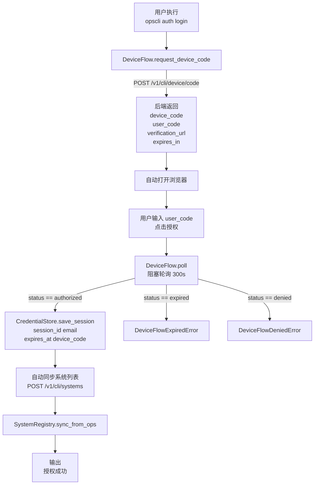

### 2.2 核心组件职责

#### 2.2.1 DeviceFlow（`opscli/auth/core/device_flow.py`）
- **`request_device_code()`**：向后端申请设备码，返回验证信息
- **`poll()`**：**阻塞式轮询**，最长等待 300 秒，授权成功后自动调用 `store.save_session()`
- **`poll_once()`**：单次非阻塞查询，主要用于 MCP 场景
- **异常处理**：`DeviceFlowExpiredError`（超时）、`DeviceFlowDeniedError`（用户拒绝）

#### 2.2.2 TokenManager（`opscli/auth/core/token_manager.py`）
- **Token 三态判断**：
  - `valid`：剩余有效期 > 300 秒
  - `needs_refresh`：0 < 剩余 ≤ 300 秒
  - `expired`：已过期或无 token
- **双层并发锁**（防止多进程/多线程重复换取 JWT）：
  - **Layer 1**：`threading.Lock`（同进程多线程）
  - **Layer 2**：`fcntl.flock()`（跨 CLI 进程，Windows 自动跳过）
- **`get_token(alias)`**：带缓存的智能获取，自动判断三态并刷新
- **`get_token_by_session(session_id, alias)`**：无状态接口，不读本地存储

#### 2.2.3 CredentialStore（`opscli/auth/storage/credential_store.py`）
- **双层存储策略**：
  1. **系统 Keychain**（macOS 钥匙串 / Linux Secret Service）— 优先
  2. **AES-256-GCM 加密文件**（`credentials.bin`）— 兜底
- **密钥管理**：首次使用时自动生成 256-bit 密钥，存储在 `.key` 文件（权限 600）
- **存储结构**：
  ```json
  {
    "session_id": "...",
    "device_code": "...",
    "email": "...",
    "session_expires_at": "...",
    "tokens": {
      "ops": {"jwt": "...", "expires_at": "...", "saved_at": 123}
    }
  }
  ```
- **安全特性**：账号切换时自动清空旧 JWT，避免跨账号泄露

#### 2.2.4 AuthClient（`opscli/auth/__init__.py`）
- **SDK 入口**：供 Skill 和 Python 代码调用
- **`build_request_auth(alias)`**：统一构造认证参数
  - `Authorization: Bearer {jwt}`
  - `Cookie: polarisUserToken={session_id}`
  - `Cookie: opscliDeviceCode={device_code}`（如有）
- **`build_session_headers()`**：构造 `X-Session-Id` 请求头
- **`is_authenticated()`**：检查 session_id 存在且未过期

### 2.3 Token 刷新机制

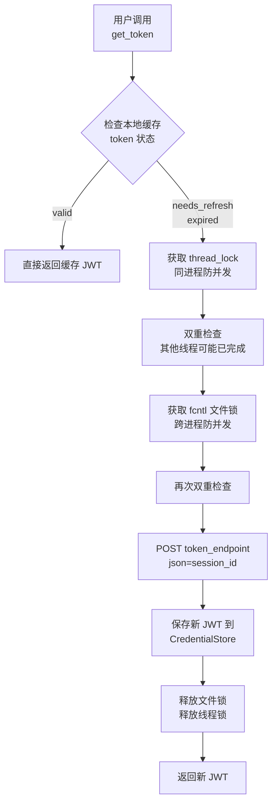

### 2.4 系统注册管理

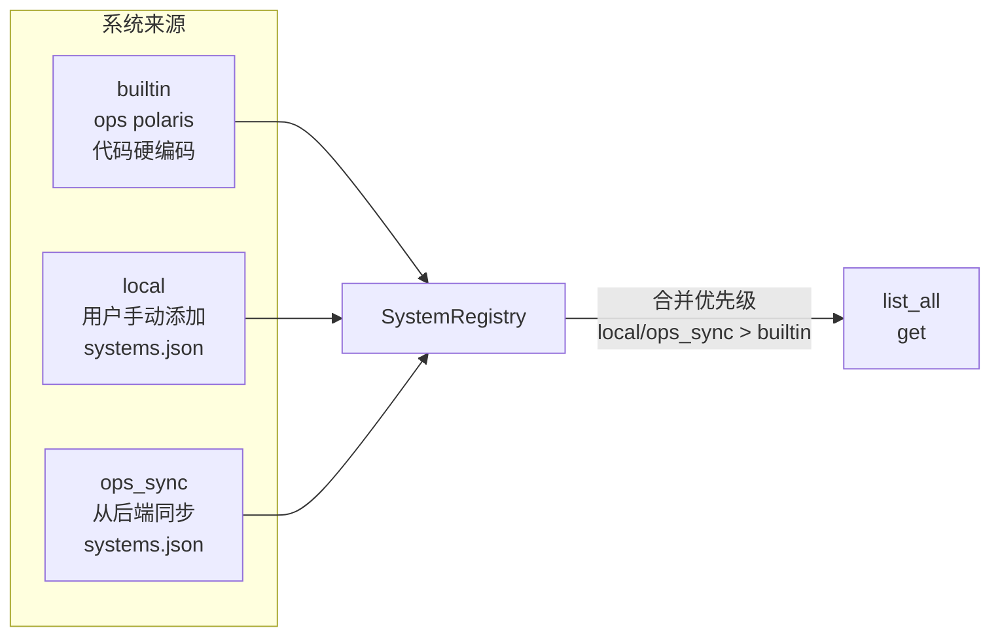

- **内置系统**：ops、polaris（不可删除）
- **local 系统**：用户手动添加，持久化到 `systems.json`
- **ops_sync 系统**：从 ops 后端同步
- **合并优先级**：`local/ops_sync > builtin`（同名时用户配置覆盖内置）

---

## 三、MCP 模式授权流程详解

### 3.1 完整登录流程

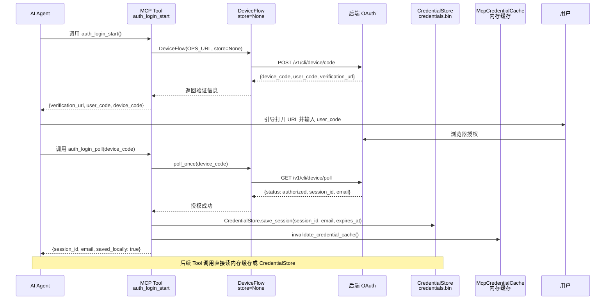

### 3.2 核心组件职责

#### 3.2.1 MCP Server（`opscli/mcp/server.py`）
- **FastMCP 实例**：注册 auth / query / skills / chatgpt / amazon 工具集
- **传输模式**：
  - `stdio`：本地 AI 工具集成（默认）
  - `sse`：`GET /sse` + `POST /messages/`，兼容 Cursor / Claude Desktop
  - `http`：`POST /mcp`，Streamable HTTP，ChatGPT 推荐
  - `both`：同时暴露 /sse 和 /mcp
- **API Key 管理**：`_load_or_create_api_key()`，持久化到 `mcp_api_key` 文件

#### 3.2.2 API Key 鉴权中间件（`opscli/mcp/auth_middleware.py`）
- **作用**：SSE/HTTP 连接层的基础访问控制（与业务 OAuth 鉴权解耦）
- **校验方式**：
  1. `?api_key=xxx` Query Param（优先）
  2. `Authorization: Bearer <api_key>` Header
- **失败响应**：401 + `WWW-Authenticate: Bearer realm="opscli-mcp"`
- **特殊处理**：SSE 长连接关闭时补发终止帧，避免 uvicorn 报错

#### 3.2.3 MCP Auth Tools（`opscli/mcp/tools/auth.py`）
暴露 13 个工具：

| 工具名 | 功能 | 是否需 session |
|--------|------|---------------|
| `auth_login_start` | 发起 Device Flow | 否 |
| `auth_login_poll` | 单次轮询授权状态 | 否 |
| `auth_get_token` | 获取系统 JWT | 是 |
| `auth_check_token` | 本地检测 JWT 有效性 | 否（可传 jwt） |
| `auth_is_authenticated` | 检查 session 有效性 | 可选 |
| `auth_token_refresh` | 刷新 JWT | 是 |
| `auth_system_list` | 列出系统 | 否 |
| `auth_system_add/remove` | 管理自定义系统 | 否 |
| `auth_system_sync` | 从 ops 同步系统 | 是 |
| `auth_build_request_auth` | 构造请求头/Cookie | 可选 |
| `auth_logout` | 清除本地凭证 | 否 |
| `auth_doctor` | 诊断连通性 | 可选 |

#### 3.2.4 McpCredentialCache（`opscli/mcp/credential_cache.py`）
- **设计目的**：为高频 Tool 调用提供零开销凭证读取，避免每次请求都 AES-256-GCM 解密
- **工作方式**：
  - MCP Server 启动时（或首次访问）从 `CredentialStore` 加载凭证到内存
  - 后续 Tool 调用直接读内存，单次读取约 **0.45 微秒**
  - 凭证变更时调用 `invalidate_credential_cache()` 刷新
- **线程安全**：内部使用 `threading.Lock` 保护缓存数据
- **多用户隔离**：支持 `base_dir` 参数，按用户 `credential_dir` 分配独立缓存实例

#### 3.2.5 CredentialStore（共用存储层）
- **说明**：2025-04-27 重构后，MCP 不再使用独立的 `mcp_sessions.json`，
  而是与 CLI **共用** `opscli/auth/storage/credential_store.py`
- **存储位置**：`~/.config/opscli/credentials.bin`（AES-256-GCM 加密）
- **数据结构与 CLI 完全一致**：全局 `session_id` + 各系统 JWT 缓存
- **`mcp_sessions.json` 已废弃并删除**：原文件已移除，不再维护

#### 3.2.6 MCPUserStore（`opscli/mcp/user_store.py`）
- **用途**：团队共享 MCP Server 时的多用户隔离
- **存储**：`mcp_users.json`，只保存 API Key **哈希**（SHA256 + HMAC compare_digest）
- **安全**：原始 API Key 仅在创建/轮换时展示一次，服务端不保存明文
- **隔离**：每个用户有独立的 `credential_dir`（`users/<user_id>/`）
- **CLI 管理**：`opscli mcp user add/remove/rotate/list`

### 3.3 凭证获取优先级（Helpers）

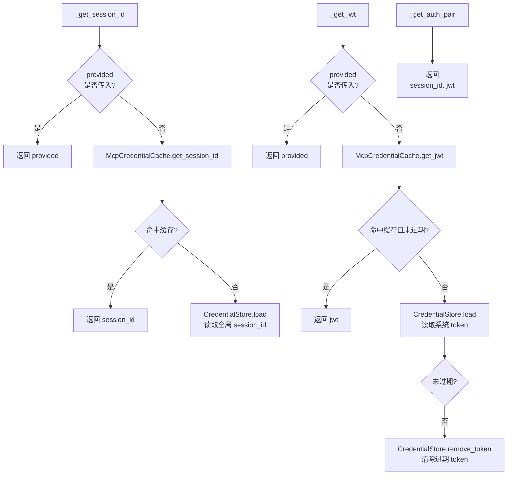

### 3.4 Token 管理差异

| 特性 | CLI TokenManager | MCP Auth Tools |
|------|------------------|----------------|
| **获取方式** | 读取本地存储 + 自动刷新 | `get_token_by_session(session_id)` 实时换取 |
| **自动刷新** | ✅ 300秒阈值自动触发 | ❌ 需显式调用 `auth_token_refresh` |
| **并发保护** | ✅ 双层锁 | ❌ 无状态实时请求 |
| **JWT 缓存** | CredentialStore（加密） | **CredentialStore（加密）+ McpCredentialCache（内存）** |
| **刷新范围** | 支持单系统 / 全部系统 | 支持单系统 / `__all__` |

---

## 四、核心差异深度对比

### 4.1 授权流程差异

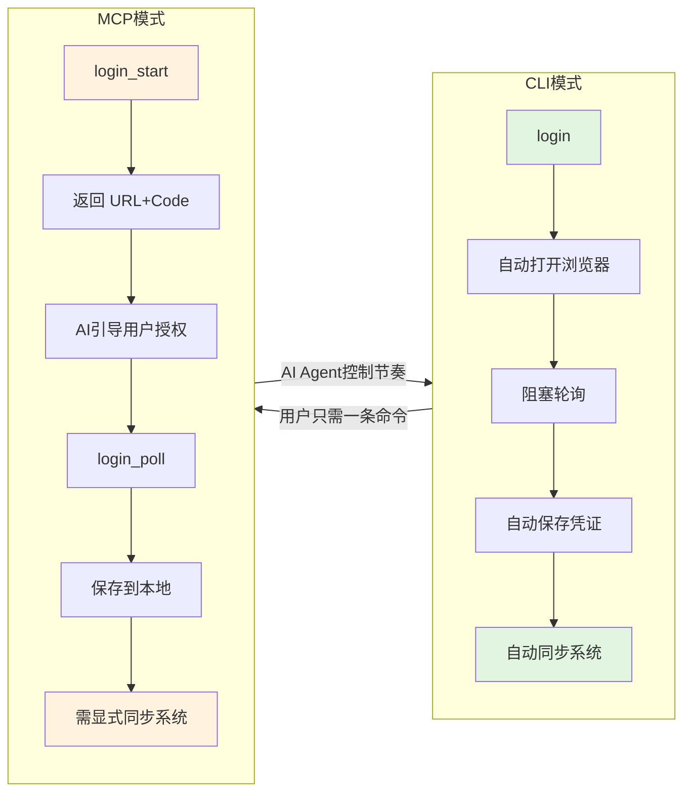

### 4.2 凭证存储安全对比

```mermaid
flowchart TD
    subgraph CLI凭证存储
        A1[CredentialStore] --> B1{Keychain<br/>可用?}
        B1 -->|是| C1[macOS Keychain<br/>Linux Secret Service]
        B1 -->|否| D1[AES-256-GCM<br/>credentials.bin]
        D1 --> E1[256-bit 密钥<br/>.key 文件]
    end

    subgraph MCP凭证存储（重构后）
        A2[McpCredentialCache] --> B2[内存缓存<br/>0.45 µs/读]
        B2 --> C2[CredentialStore.load<br/>启动时加载]
        C2 --> D2[AES-256-GCM<br/>credentials.bin]
    end

    subgraph MCP多用户隔离
        E2[MCPUserStore] --> F2[mcp_users.json]
        F2 --> G2[API Key SHA256<br/>仅存哈希]
        G2 --> H2[独立 credential_dir<br/>users_user_id]
    end
```

| 层面 | CLI 模式 | MCP 模式（重构后） |
|------|----------|-------------------|
| **存储介质** | Keychain / AES-256-GCM 加密文件 | **AES-256-GCM 加密文件（与 CLI 共用）** |
| **密钥管理** | 自动生成 256-bit 密钥，权限 600 | 与 CLI 共用同一密钥 |
| **文件权限** | 600（所有者可读写） | 600 |
| **内存缓存** | 无（每次读取解密） | **McpCredentialCache（0.45 µs/读）** |
| **多用户隔离** | 不支持（单用户） | 支持（独立 credential_dir + 独立缓存实例） |
| **连接层鉴权** | 无（本地进程） | API Key（Bearer / Query） |

### 4.3 状态管理哲学

| | CLI | MCP |
|--|-----|-----|
| **设计原则** | 强状态、自动化 | 无状态、显式传递 |
| **session_id 位置** | 封装在 CredentialStore 内部 | 由调用方传入或从本地 JSON 加载 |
| **Token 生命周期** | 自动透明管理 | 调用方显式控制 |
| **适用场景** | 个人终端长期使用 | 远程共享服务 / AI Agent 调用 |

### 4.4 系统同步时机

- **CLI**：`login` 成功后**自动**同步系统列表（`opscli auth login` 第 82-92 行）
- **MCP**：`auth_login_poll` 后**不自动同步**，需显式调用 `auth_system_sync(session_id)`

### 4.5 异常处理差异

| 场景 | CLI | MCP |
|------|-----|-----|
| 未登录 | 抛出 `NotAuthenticatedError`，CLI 退出码 1 | 返回 `_err(ValueError("无 session_id..."))` |
| Token 过期 | 自动刷新，用户无感知 | 需 AI 调用 `auth_token_refresh` 或重新 `auth_get_token` |
| 设备码超时 | `DeviceFlowExpiredError`，CLI 退出码 1 | 返回 `_err(DeviceFlowExpiredError)` |
| 系统不存在 | `SystemNotFoundError`，CLI 退出码 1 | 返回 `_err(SystemNotFoundError)` |

---

## 五、数据流对比图

### 5.1 CLI 模式数据流

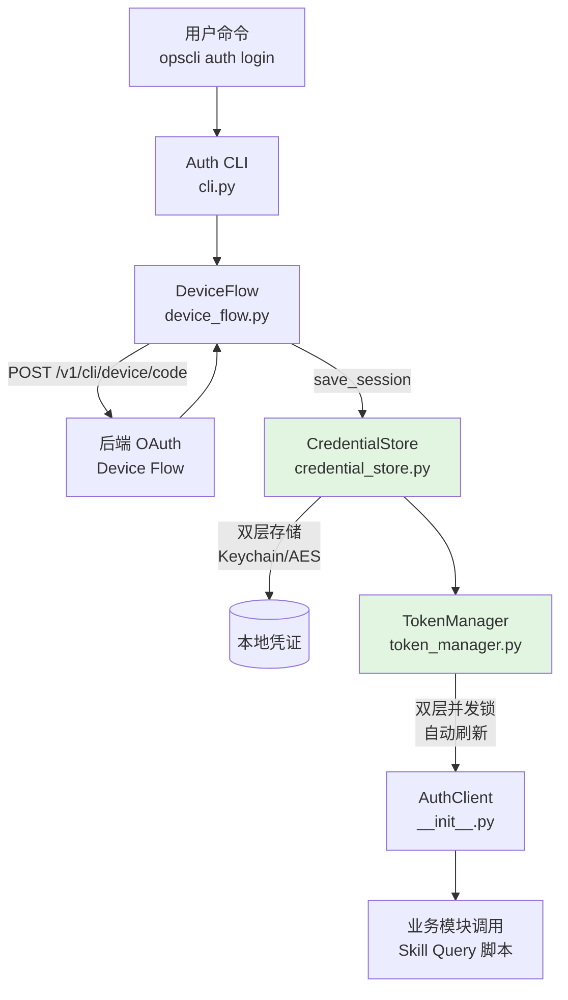

### 5.2 MCP 模式数据流

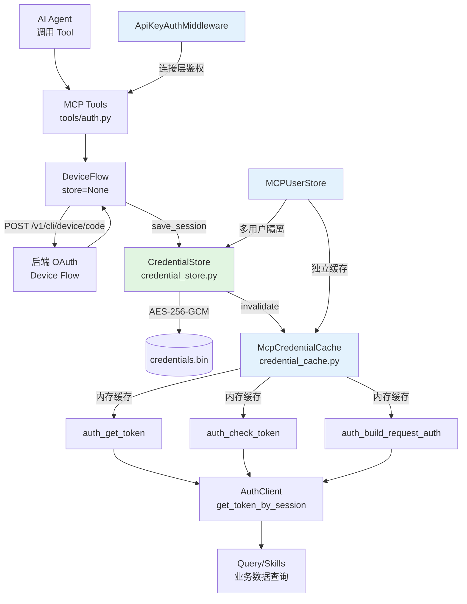

---

## 六、安全设计要点

### 6.1 CLI 安全

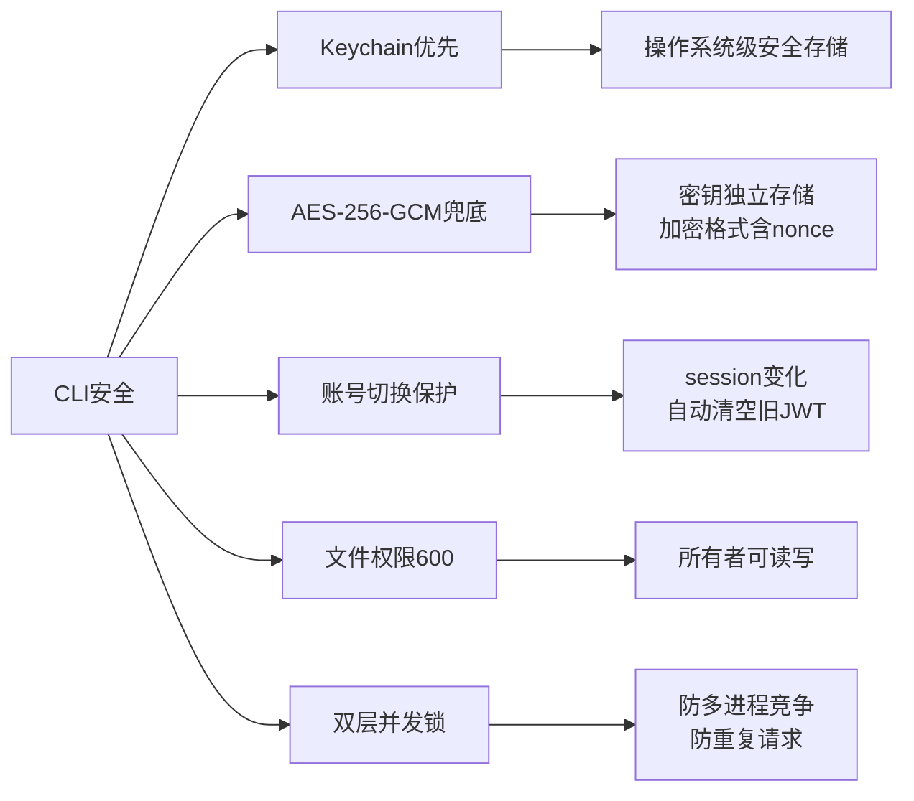

1. **Keychain 优先**：利用操作系统级安全存储
2. **AES-256-GCM 兜底**：密钥独立存储，加密格式含 nonce
3. **账号切换保护**：`save_session()` 检测到 session 变化时自动清空旧 JWT
4. **文件权限 600**：密钥文件和加密文件均限制为所有者可读写
5. **双层并发锁**：防止多进程竞争导致凭证泄漏或重复请求

### 6.2 MCP 安全

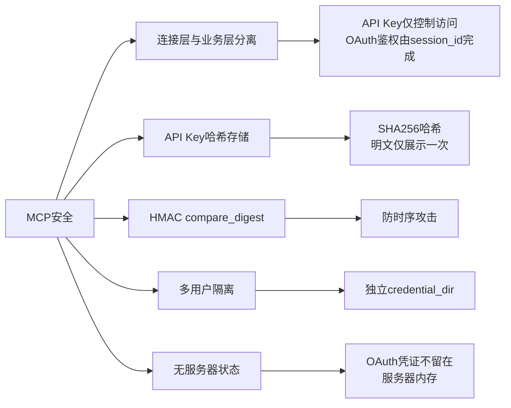

1. **连接层与业务层分离**：API Key 仅控制能否访问 MCP Server，OAuth 鉴权由 session_id/jwt 完成
2. **API Key 哈希存储**：`mcp_users.json` 只存 SHA256 哈希，明文 Key 仅展示一次
3. **HMAC compare_digest**：防时序攻击的哈希比较
4. **多用户隔离**：每个用户的 session/JWT 存储在独立目录
5. **无服务器状态**：OAuth 凭证不留在服务器内存，降低服务端泄露风险

### 6.3 安全 trade-off

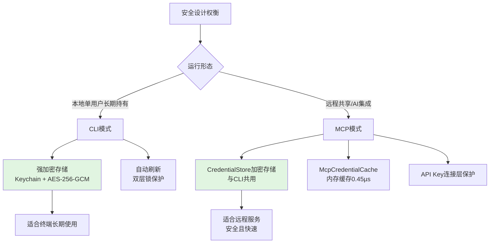

- **CLI** 使用强加密存储，适合单用户长期持有凭证
- **MCP** 重构后与 CLI **共用 AES-256-GCM 加密存储**，通过 **McpCredentialCache 内存缓存** 解决高频读取性能问题：
  - 凭证统一加密存储，安全水位与 CLI 一致
  - 内存缓存单次读取仅 **0.45 微秒**，性能是明文 JSON 的 **30 倍**
  - 远程场景下 API Key 仍提供连接层保护
  - 文件权限 600 提供基础 OS 级保护

---

## 七、典型使用场景

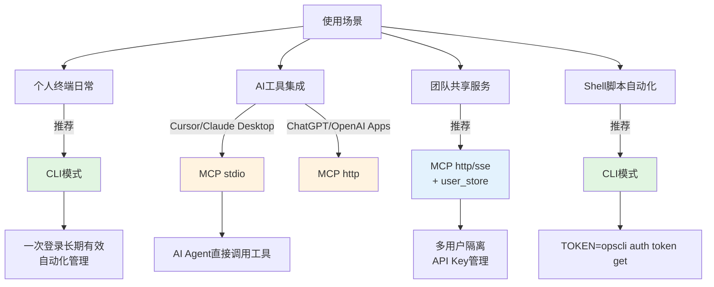

| 场景 | 推荐模式 | 原因 |
|------|----------|------|
| 个人开发终端日常使用 | **CLI** | 自动化管理，一次登录长期有效 |
| Cursor / Claude Desktop 集成 | **MCP stdio** | AI Agent 可直接调用工具 |
| 团队共享远程服务 | **MCP http/sse + user_store** | 多用户隔离，API Key 管理 |
| ChatGPT / OpenAI Apps | **MCP http** | Streamable HTTP 协议兼容 |
| Shell 脚本自动化 | **CLI** | `TOKEN=$(opscli auth token get -s ops)` |

---

## 八、总结

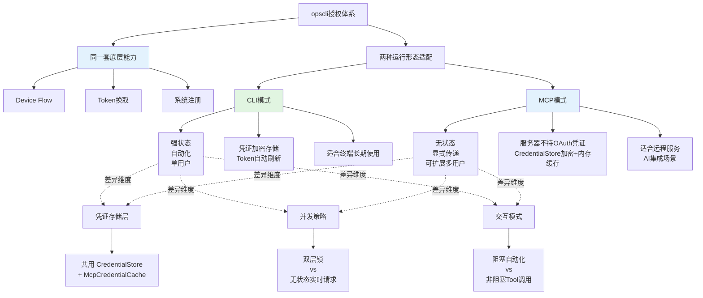

opscli 的两种授权模式是**同一套底层能力**（Device Flow、Token 换取、系统注册）在不同运行形态下的适配：

- **CLI 模式**采用**强状态、自动化、单用户**设计，凭证加密存储，Token 自动刷新，适合终端长期使用。
- **MCP 模式**采用**无状态、显式传递、可扩展多用户**设计，服务器不持有 OAuth 凭证，凭证统一存储在 `CredentialStore`（与 CLI 共用），高频读取通过 `McpCredentialCache` 内存缓存优化，适合远程服务和 AI 集成场景。

两者共享 `AuthClient`、`DeviceFlow`、`SystemRegistry`、`CredentialStore` 等核心模块，差异主要体现在**并发策略**（双层锁 vs 无状态实时请求）、**交互模式**（阻塞自动化 vs 非阻塞 Tool 调用）两个维度，**凭证存储层已完全统一**。

---

*文档结束*
