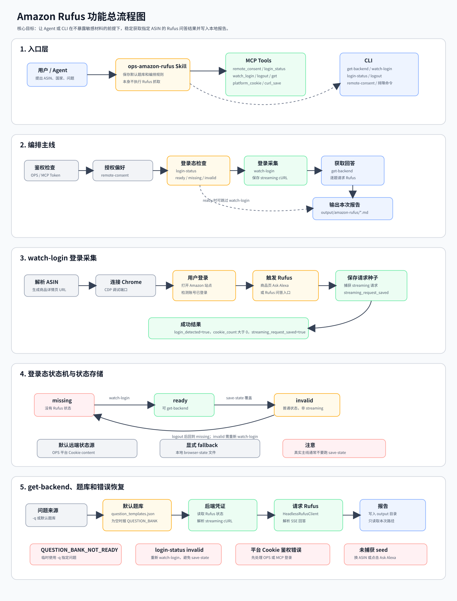

# Amazon Rufus 功能流程图

本文用流程图梳理 `opscli amazon-rufus`、`amazon_rufus_*` MCP Tool、`ops-amazon-rufus` Skill、登录态保存、题库读取、报告生成和常见错误恢复之间的关系。

> 说明：当前 IDE 的 Mermaid 预览已接管代码块但没有渲染内容，所以本文改为嵌入普通 SVG 图片。SVG 不依赖 Mermaid 插件，Markdown 预览应该可以直接显示。



如果预览器没有自动缩放，可以直接打开图片文件：[amazon-rufus-flow-overview.svg](assets/amazon-rufus-flow-overview.svg)。

## 快速阅读

- 想跑通一次真实获取：看图中的“编排主线”和“watch-login 登录采集”。
- 想理解 Agent 为什么这么调：看图中的“入口层”和“编排主线”。
- 想排查 `missing`、`invalid`、`QUESTION_BANK_NOT_READY`：看图中的“登录态状态机”和“错误恢复”。
- 想避免覆盖 Rufus 状态：重点看“save-state 覆盖为普通状态”这一条。

## 推荐实操流程

```powershell
uv run opscli amazon-rufus watch-login B0B1MLVMY5 US --close-browser --pretty
uv run opscli amazon-rufus login-status US --pretty
uv run opscli amazon-rufus get-backend B0B1MLVMY5 US -q "Is this kettle good for pour over coffee?"
```

## 关键结论

- `watch-login` 是真实主线，它会捕获并保存 Rufus streaming 请求态。
- `login-status=ready` 才表示可以走 `get-backend`。
- `save-state` 只保存普通浏览器状态，可能把 `watch-login` 保存的 Rufus streaming 状态覆盖成 `invalid`。
- 默认题库为空时，`get-backend --skills-dir ".agents/skills"` 会报 `QUESTION_BANK_NOT_READY`；临时用 `-q` 指定问题即可绕过。
- 页面上的入口可能叫 `Ask Alexa`，不一定显示 `Rufus`。只要底层捕获到 `/rufus/cl/streaming`，工具就认为采集成功。

