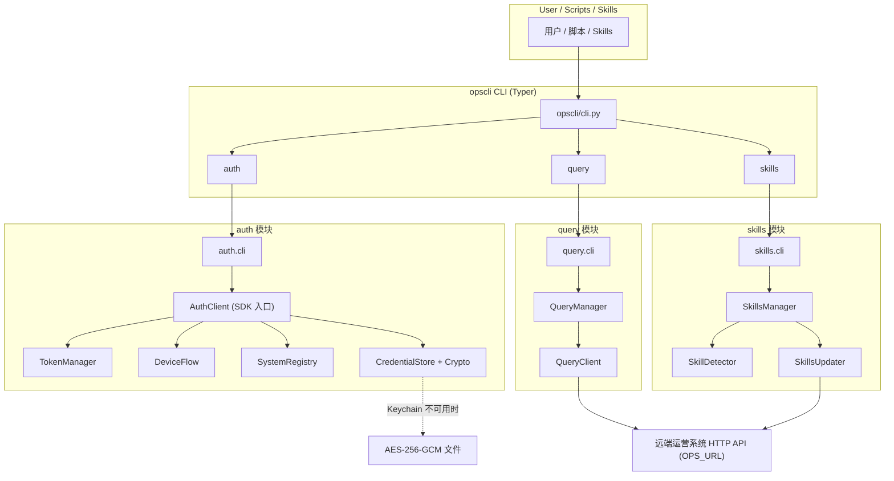
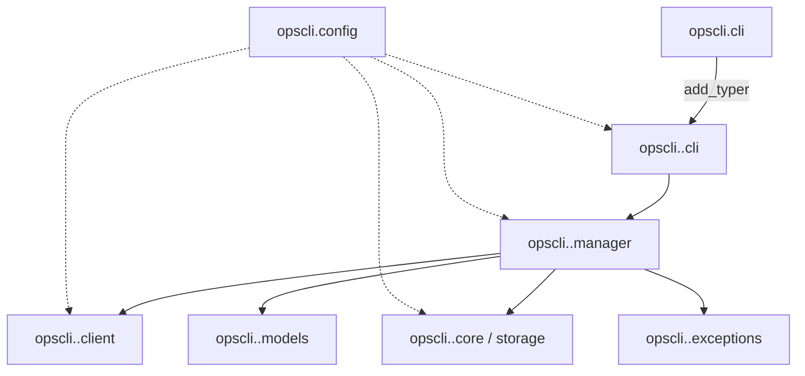
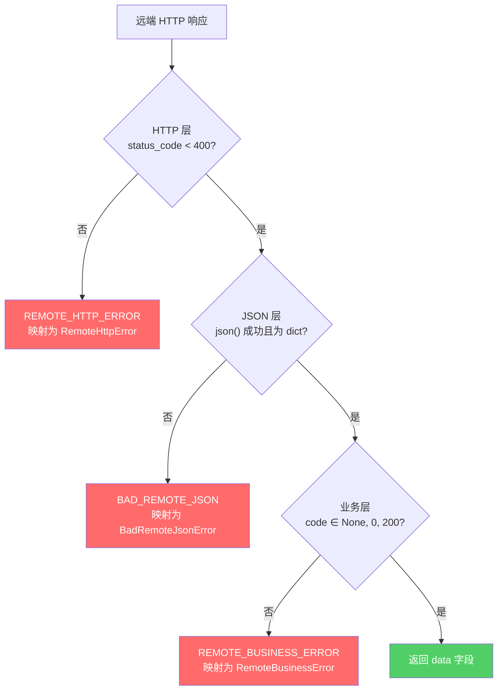
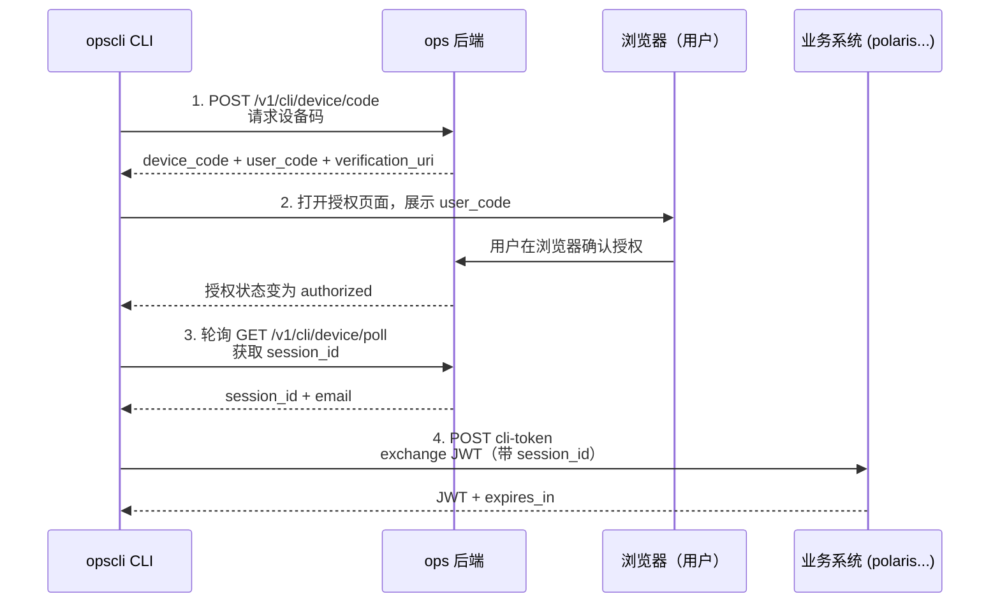
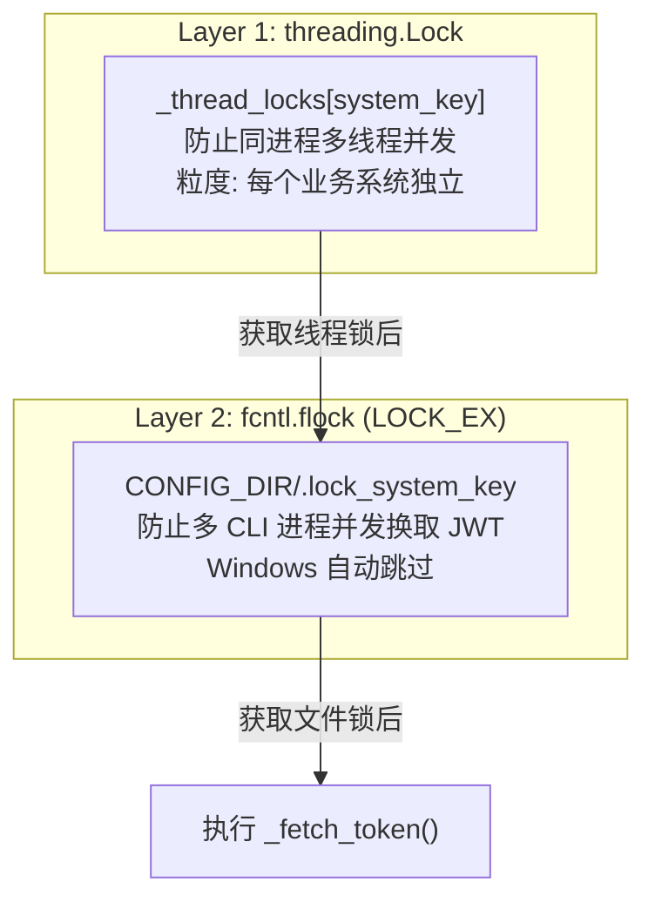
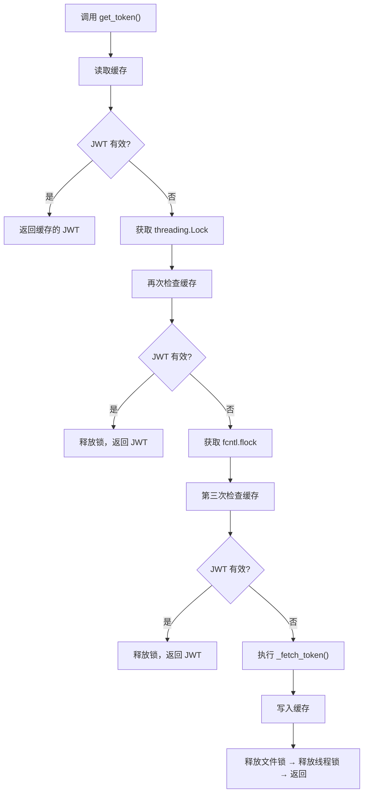
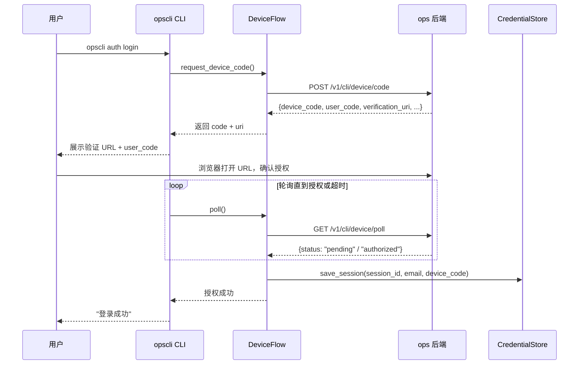
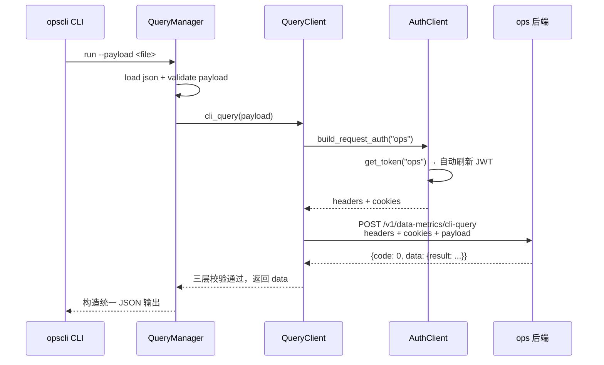
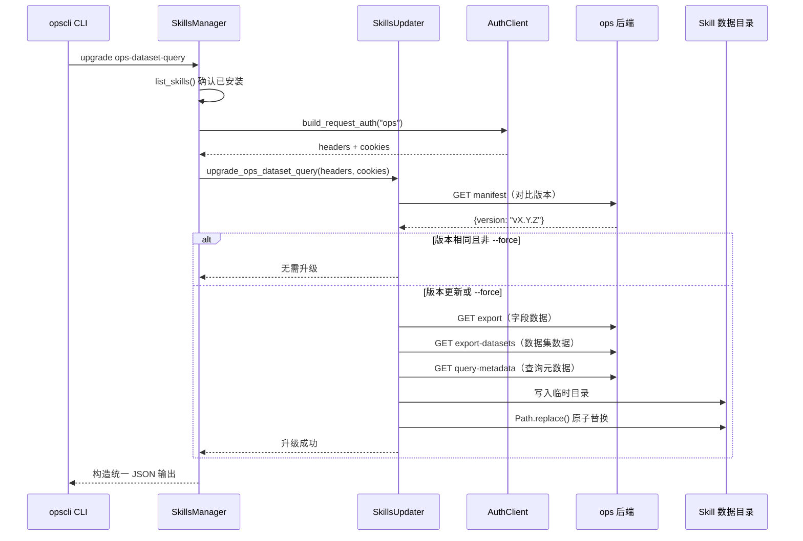

# opscli 开发规范

> 基于当前仓库实现深度分析整理，适用于 `opscli` 主仓库后续模块扩展、CLI 命令新增、Skill 接入、查询能力演进及外部调用集成。
>
> 文档版本：v3
> 最近一次基于代码的全量盘点：2026-04-22

---

## 0. 阅读向导

本文档由以下章节构成，按工作链路顺序组织：

| 章节 | 主题 | 面向角色 |
|------|------|----------|
| 1 | 项目架构规范 | 所有成员 |
| 2 | 目录规范 | 所有成员 |
| 3 | 模块分层与依赖规范 | 后端/CLI 作者 |
| 4 | CLI 接入规范 | CLI 作者 |
| 5 | 编码规范 | 所有成员 |
| 6 | API Request 规范 | 后端集成作者 |
| 7 | API Response 规范 | 后端集成作者 |
| 8 | 异常与错误码规范 | 所有成员 |
| 9 | 鉴权规范 | 所有成员 |
| 10 | 配置与存储规范 | 所有成员 |
| 11 | Skill 接入规范 | Skill 作者 |
| 12 | 并发与锁规范 | 核心模块作者 |
| 13 | 测试规范 | 所有成员 |
| 14 | 版本与发布规范 | 维护者 |
| 15 | 新模块接入模板 | 扩展者 |
| 附录 A | 典型调用时序示例 | 所有成员 |

凡是规范章节与代码实现不一致，必须在一个迭代内将两者对齐（修改文档或修改代码，二选一）。

---

## 1. 项目架构规范

### 1.1 一句话定位

`opscli` 是 Aukeys 内部运营 CLI 工具集，以 Python 包分发，命令入口为 `opscli`，基于 `Typer` 构建多子模块命令树，提供认证、数据查询、Skill 生命周期管理等能力。

### 1.2 总体架构图



### 1.3 三大子模块职责边界

| 模块 | 核心职责 | 禁止承担 |
|------|----------|----------|
| `auth` | 登录态、session、JWT、系统注册表、凭证存储 | 数据查询逻辑、Skill 管理 |
| `query` | 本地 metadata、query payload 构造、远端查询转发 | 认证实现、写入凭证、Skill 升级 |
| `skills` | Skill 发现、安装、状态、升级、模板管理 | 直接发起数据查询、管理 JWT 生命周期 |

### 1.4 顶级 CLI 仅做注册

[`opscli/cli.py`](/Users/mask/python3/opscli/opscli/cli.py) 只允许：
- `add_typer` 挂载子模块
- 顶级全局 Option（如 `--version`）
- 顶级 `callback` 预处理

**禁止**：
- 在 `opscli/cli.py` 内写任何业务代码
- 跨模块导入具体业务函数

---

## 2. 目录规范

### 2.1 顶层目录布局

```text
opscli/
├── opscli/                 # Python 包源码（与项目同名）
│   ├── __init__.py         # 仅做 re-export（AuthClient）
│   ├── cli.py              # Typer 顶级入口，只注册子命令
│   ├── config.py           # CONFIG_DIR（唯一）
│   ├── auth/
│   ├── query/
│   └── skills/
├── tests/                  # 测试代码，按模块拆分
│   ├── auth/
│   ├── query/
│   └── skills/
├── docs/                   # 用户文档、设计文档、规范文档
├── output/                 # 分析产物 / 生成数据
├── dist/                   # 构建产物（git 忽略）
├── pyproject.toml
├── README.md
├── AGENTS.md               # 给其他 AI Agent 的项目指南
└── CLAUDE.md               # 给 Claude Code 的项目指南
```

强制约束：
- 运行期数据、用户配置**禁止**写入仓库目录，必须落到 `CONFIG_DIR`
- 新增设计类、规范类文档**必须**放入 `docs/` 并按类型分类（铁律 14），文件名必须使用中文
- 新增测试**必须**按模块放入 `tests/<module>/`，不得堆积到根目录

### 2.2 模块目录标准布局

新增一级模块必须采用以下骨架（缺失项可省略，但文件职责必须匹配）：

```text
opscli/<module>/
├── __init__.py        # 公开导出（可选）
├── cli.py             # Typer 子命令定义（必选）
├── exceptions.py      # 模块异常基类及子类（有业务异常时必选）
├── models.py          # dataclass / 结构化对象（有外部序列化时必选）
├── manager.py         # 业务编排层（有多步逻辑时必选）
├── client.py          # 远端 HTTP 客户端（有远端调用时必选）
└── core/              # 底层核心逻辑（细分组件时使用）
    └── __init__.py
```

职责划分（严禁混淆）：

| 层 | 能做 | 不能做 |
|----|------|--------|
| `cli.py` | 命令定义、参数解析、JSON/终端输出、异常映射 | 直接发 HTTP、直接读写凭证 |
| `manager.py` | 业务编排、多组件组合、参数验证 | 终端展示、直接发 HTTP |
| `client.py` | HTTP 请求、响应解析、网络异常包装 | 参数校验业务层、终端输出 |
| `core/` | 底层协议实现（Device Flow、Token 生命周期等） | Typer/Rich 输出 |
| `storage/` | 本地持久化 | 业务编排 |
| `models.py` | 结构化数据 + `to_dict()` | 业务逻辑 |
| `exceptions.py` | 异常类与错误码 | 其他 |

### 2.3 Skill 模板目录规范

内置 Skill 模板统一放在：

```text
opscli/skills/templates/<skill-name>/
├── SKILL.md                # 必须，AI Agent 使用指南
├── data/
│   └── VERSION.json        # 必须，SkillDetector 识别标志
├── scripts/                # 可选，辅助脚本
└── references/             # 可选，参考资料
```

- 目录名称必须以 `ops-` 为前缀（铁律 11）
- `VERSION.json` 格式：`{"name": "ops-xxx", "version": "vX.Y.Z"}`
- 脚本只能本地处理 + `opscli` 转发，**禁止直连后端**（铁律 10）

---

## 3. 模块分层与依赖规范

### 3.1 合法依赖方向



### 3.2 跨模块依赖许可清单

当前仓库允许的跨模块引用：

| 引用方 | 被引用方 | 目的 |
|--------|----------|------|
| `opscli.query.client` | `opscli.auth` | 通过 `AuthClient` 注入认证 |
| `opscli.skills.updater` | `opscli.auth` | 升级接口需带 ops 鉴权 |
| `opscli.query.manager` | `opscli.skills.detector` | 使用 Skill 发现机制定位 metadata |

**禁止**的跨模块引用：

- `auth` 引用 `query` / `skills`
- `query` 内部从 `skills` 写入文件
- `skills` 内部调用 `query` 的业务逻辑

如需扩展新的跨模块引用，必须在 PR 描述中声明并更新本清单。

### 3.3 顶级 re-export 规范

当前仅 `AuthClient` 被 re-export。两种导入必须同时可用（铁律 3）：

```python
from opscli import AuthClient
from opscli.auth import AuthClient
```

未来若新增顶级 re-export：

- 必须在 `opscli/__init__.py` 的 `__all__` 中声明
- 必须补充对两种导入路径的测试
- 一旦对外暴露，不允许随意改名或删除

---

## 4. CLI 接入规范

### 4.1 子模块注册

在 `opscli/cli.py` 中：

```python
from opscli.<module>.cli import app as <module>_app
app.add_typer(<module>_app, name="<module>")
```

- 顶级入口**只写注册**
- 新模块接入只允许 `+` 新行，不修改既有注册
- 模块名使用名词（`auth` / `query` / `skills`），子命令使用动词（`login` / `run` / `install`）

### 4.2 命令输出风格二元化

CLI 命令被严格分为两类：

| 类型 | 定义 | 示例 | 输出 |
|------|------|------|------|
| 交互型 | 面向人类，强调可读 | `opscli auth login`、`opscli auth doctor` | Rich 表格/彩色文本 |
| 机器型 | 面向脚本/AI，强调稳定 JSON | `opscli query run`、`opscli skills list` | 单行 JSON（`--pretty` 可格式化） |

强制约束：

- **机器型命令禁止混入非 JSON 文字**（否则脚本无法解析）
- **不允许同一个命令同时输出 JSON 和终端装饰文本**
- **交互型命令若之后需要脚本消费，必须新增独立子命令**，不要改写原命令

### 4.3 统一 JSON 输出函数

所有机器型命令必须通过模块内的 `_emit(payload, pretty)` 函数输出，实现应为：

```python
def _emit(payload: dict, pretty: bool) -> None:
    if pretty:
        typer.echo(json.dumps(payload, ensure_ascii=False, indent=2))
    else:
        typer.echo(json.dumps(payload, ensure_ascii=False))
```

失败时仍必须输出 JSON，再以 `raise typer.Exit(1)` 表达退出码。

### 4.4 参数命名规范

- CLI 参数使用 `kebab-case`：`--table-id`、`--order-by`
- 短选项只在高频参数上提供：`--system/-s`、`--version/-V`
- 可重复参数使用 `list[str]` + 自定义解析器（如 `--where`、`--order-by`）
- 布尔开关默认 `False`，命名采用肯定式：`--pretty`、`--force`、`--run`

### 4.5 退出码

| 退出码 | 含义 |
|--------|------|
| `0` | 命令成功 |
| `1` | 业务失败（含参数错误、远端错误、鉴权失败） |

不建议在当前阶段引入更多分级退出码；脚本判断请使用 JSON `error.code`。

---

## 5. 编码规范

### 5.1 Python 基础

- **Python 版本要求**：`>= 3.10`（允许使用 `X | Y` 联合类型、`match` 等 3.10+ 特性）
- **包管理**：推荐 `uv`，也允许 `pip`；虚拟环境必须在本地开发激活
- **代码风格**：
  - 4 空格缩进
  - 模块级类/函数使用类型注解
  - 允许使用 `from __future__ import annotations`（`query` / `skills` 已默认启用）

### 5.2 类型注解

公共函数、公共方法、dataclass 必须标注：

```python
def get_token(self, alias: str) -> str: ...
def check_token(self, alias: str) -> dict: ...

@dataclass
class SkillRecord:
    name: str
    version: str
    ...
```

内部 helper 允许省略类型注解，但复杂结构（嵌套 dict / list[dict]）建议补全。

### 5.3 命名规范（三套并存）

项目内同时维护三套命名规范：

| 场景 | 风格 | 示例 |
|------|------|------|
| Python 变量 / 函数 | `snake_case` | `table_id`, `build_and_run` |
| CLI 参数 | `kebab-case` | `--table-id`, `--order-by` |
| 后端 JSON payload | `camelCase` | `tableId`, `groupBy`, `orderBy` |

切换边界必须明显，不允许混用。例如 `QueryManager.build` 内部使用 `table_id`，但构造的 payload 中必须是 `tableId`。

### 5.4 注释规范

- **强制中文注释**（全局 CLAUDE.md 规定）
- 模块顶部必须有模块说明 docstring，描述职责
- 类必须有 docstring，说明用途与关键属性
- 公共方法必须有 docstring，说明参数、返回、异常
- 非显而易见的实现细节必须加行注释（如并发锁逻辑、字节协议）

> ✅ 样例参考：[`opscli/auth/core/token_manager.py`](/Users/mask/python3/opscli/opscli/auth/core/token_manager.py)、[`opscli/auth/storage/crypto.py`](/Users/mask/python3/opscli/opscli/auth/storage/crypto.py)

### 5.5 全局状态

- 模块级全局变量**仅允许**存放：
  - 线程锁（如 `_thread_locks` / `_thread_locks_mutex`）
  - 常量（如 `REFRESH_THRESHOLD`、`MAX_JWT_TTL`、端点 URL）
- **禁止**在模块级存放可变业务状态（会破坏多实例测试）

### 5.6 日志与输出

- 机器型命令：只输出 JSON（通过 `typer.echo`）
- 交互型命令：使用 `rich.console.Console`
- **禁止**使用 `print()` 向用户展示内容
- **禁止**模块内部 `print` 调试语句进入主分支

### 5.7 HTTP 与 I/O

- HTTP：统一使用 `httpx`
- 文件读写：统一 `encoding="utf-8"`
- Path 操作：统一使用 `pathlib.Path`
- 临时文件：使用 `tempfile.TemporaryDirectory` 或同目录原子 `Path.replace()`

### 5.8 禁用模式

- 禁止使用 `requests`（与 `httpx` 混用会带来行为差异）
- 禁止使用 `os.path.join`，统一使用 `Path`
- 禁止硬编码 `~/.config/opscli/`（使用 `opscli.config.CONFIG_DIR`）
- 禁止硬编码服务地址（通过 `auth.config.load_config()` 读取）

---

## 6. API Request 规范

### 6.1 HTTP 客户端统一约束

| 项目 | 要求 |
|------|------|
| 客户端库 | 必须使用 `httpx` |
| 超时 | 必须显式传入 `timeout` |
| 跟随重定向 | 有文件下载等语义时使用 `follow_redirects=True` |
| 重试策略 | 当前不要求自动重试（保持行为可预测） |

### 6.2 超时矩阵

| 场景 | timeout | 典型位置 |
|------|---------|----------|
| 轻量探活（doctor） | 5s | `auth/cli.py` 的 `doctor` |
| 一般 GET/POST | 10s | `device_flow.py`、`token_manager.py`、`auth/cli.py` 的 `sync` |
| 数据下载/升级 | 20s | `skills/updater.py` |
| 查询执行 | 30s | `query/client.py` 的 `cli_query` |

新增 HTTP 调用时，**必须**从上表选择或在 PR 中说明例外。

### 6.3 Base URL 管理

- 所有业务 URL 必须来自 `auth.config.load_config()`
- `OPS_URL` 暴露为 `opscli.auth.OPS_URL`，是查询/Skill 模块的唯一 base URL
- 每个 `client.py` **只允许持有一个 base URL 源**
- Endpoint 路径必须定义为类常量（避免字符串四散），参考：

```python
class SkillsUpdater:
    MANIFEST_ENDPOINT = "/v1/data-metrics/datasets/skill/manifest"
    FIELDS_ENDPOINT = "/v1/data-metrics/datasets/skill/export"
    ...
```

### 6.4 Request 请求结构规范

#### 6.4.1 POST JSON 请求

```python
response = httpx.post(
    f"{self.ops_url}/v1/data-metrics/cli-query",
    json=payload,
    headers=headers,
    cookies=cookies,
    timeout=30,
)
```

必须项：
- `json=` 传入 dict（不要手动 `json.dumps`）
- `headers=` / `cookies=` 均来自 `AuthClient.build_request_auth(alias)`
- `timeout` 显式指定

#### 6.4.2 GET 请求

```python
response = httpx.get(
    f"{OPS_URL}{endpoint}",
    headers=headers,
    cookies=cookies,
    timeout=20,
    follow_redirects=True,
)
```

### 6.5 Query Payload 结构规范

`query run` / `query build` 的 payload 必须遵循如下结构：

```json
{
  "tableId": 1103,
  "query": {
    "select":  [],
    "groupBy": [],
    "orderBy": [],
    "where":   {},
    "having":  [],
    "limit":   20,
    "offset":  0
  },
  "dryRun": false,
  "dataComparison": {
    "switch":    true,
    "field":     "dataset_alias.date_id",
    "startDate": "2026-03-01",
    "endDate":   "2026-03-22"
  }
}
```

#### 6.5.1 必填字段

- 顶层：`tableId`（int）、`query`（object）
- `query.select`：至少一个元素（来自维度或指标）

#### 6.5.2 字段元素结构

- 维度：`{ "expr": "<dataset>.<field>", "alias": "<alias>" }`
- 指标：`{ "expr": "...", "alias": "...", "aggregation": "SUM|COUNT|AVG|..." }`（aggregation 必须大写）
- where 条件：`{ "field": "<expr>", "operator": "...", "value": <json> }`
- orderBy：`{ "expr": "...", "desc": true | false }`

#### 6.5.3 CLI → Payload 映射

| CLI 输入 | 解析函数 | Payload 字段 |
|----------|----------|--------------|
| `--dimension field[:alias]` | `_parse_dimension_spec` | `select` + `groupBy` |
| `--metric field:agg[:alias]` | `_parse_metric_spec` | `select[].aggregation` |
| `--where field\|op\|value_json` | `_parse_where_condition` | `query.where.conditions[]` |
| `--where-json <str>` / `--where-file <path>` | `_load_where_clause` | `query.where`（整体替换） |
| `--having expr\|op\|value_json` | `_build_having_clause` | `query.having[]` |
| `--order-by expr[:asc\|desc]` | `_build_order_by` | `query.orderBy[]` |
| `--data-comparison field,start,end` | `_build_data_comparison` | `dataComparison` |
| `--dry-run` | — | `dryRun=true` |

### 6.6 CLI 层禁止直接发请求（原则性）

业务 HTTP 调用应尽量收敛在 `client.py` / `core/*.py` / `updater.py`。当前 `auth/cli.py` 在 `login` / `sync` / `doctor` 中存在轻量探活调用，属于可接受例外，原则：

- 不可扩散到 `query` / `skills` CLI
- 新增模块的 CLI **不应**直接 `httpx.get/post`
- 若 CLI 层确需探活，必须 `timeout<=10`，且错误处理不影响主流程

---

## 7. API Response 规范

### 7.1 机器型命令统一包装

所有机器型命令（`query *`、`skills *`、后续脚本型命令）必须输出统一结构。

#### 7.1.1 成功响应

```json
{
  "success": true,
  "command": "query metadata",
  "data":    { "...": "..." },
  "error":   null
}
```

#### 7.1.2 失败响应（标准）

```json
{
  "success": false,
  "command": "query run",
  "data":    null,
  "error": {
    "code":    "REMOTE_HTTP_ERROR",
    "message": "远端请求失败，HTTP 502",
    "status_code": 502
  }
}
```

### 7.2 字段强约束

| 字段 | 成功 | 失败 |
|------|------|------|
| `success` | `true` | `false` |
| `command` | `"module action"` 字符串（如 `"query build-and-run"`） | 同上 |
| `data` | 对象或数组，**不得为 null** | 必须为 `null` |
| `error` | 必须为 `null` | 必须为**对象**（至少含 `code` + `message`） |

**⚠️ 反面模式（禁止）**：
- 成功时 `data` 返回字符串
- 失败时 `error` 返回字符串（`skills/cli.py` 中部分分支暂存该问题，新增代码不得沿用）
- 使用 HTTP 文字混入 `data`

### 7.3 `data` 字段结构约定

- 单一资源返回对象：`query metadata` → `{dataset, fields, source}`
- 列表资源必须封装为对象：`skills list` → `{skills: [...]}`（**不得**裸返回数组）
- 含执行结果时显式命名：`query build-and-run` → `{dataset, payload, output, result}`

### 7.4 错误对象结构

最小字段：

```json
{ "code": "INVALID_PAYLOAD", "message": "payload 缺少 tableId" }
```

按需扩展字段（命名稳定）：

| 字段 | 场景 |
|------|------|
| `status_code` | HTTP 错误（如 502、401） |
| `business_code` | 业务层 `code` 非 0/200/null |
| `details` | 多字段校验失败时的字段级详情 |

**`code` 命名规则**：大写下划线、稳定、可用于脚本判断。

### 7.5 Remote JSON 三层校验

远端 JSON 响应必须经过三层校验（参考 [`opscli/query/transport/client.py`](/Users/mask/python3/opscli/opscli/query/transport/client.py)）：



三层任一失败，均必须映射为模块自定义异常（参考 §8）。

**统一错误信息提取**：从 `msg` → `message` → `error` 依序取第一个非空字符串，参考：

```python
def _extract_message(payload: dict) -> str | None:
    for key in ("msg", "message", "error"):
        value = payload.get(key)
        if isinstance(value, str) and value.strip():
            return value.strip()
    return None
```

### 7.6 业务成功码

成功码当前约定：

- `query` 模块：`code in (None, 0, 200)` 视为成功
- `skills` 模块：`code in (None, 200)` 视为成功

后续新增模块推荐直接采用 `code in (None, 0, 200)`，避免多套判定散落。

---

## 8. 异常与错误码规范

### 8.1 模块异常基类

每个业务模块必须定义自己的异常基类：

| 模块 | 基类 | 位置 |
|------|------|------|
| `auth` | `AuthError` | [`opscli/auth/domain/exceptions.py`](/Users/mask/python3/opscli/opscli/auth/domain/exceptions.py) |
| `query` | `QueryError` | [`opscli/query/domain/exceptions.py`](/Users/mask/python3/opscli/opscli/query/domain/exceptions.py) |
| `skills` | `SkillsError` / `SkillRemoteError` | [`opscli/skills/domain/exceptions.py`](/Users/mask/python3/opscli/opscli/skills/domain/exceptions.py) |

### 8.2 异常类必备约定

模块异常基类应定义：

```python
class QueryError(Exception):
    code = "QUERY_ERROR"

    def __init__(self, message: str):
        super().__init__(message)
        self.message = message

    def to_dict(self) -> dict:
        return {"code": self.code, "message": self.message}
```

扩展子类必须：
- 覆盖 `code`
- 必要时覆盖 `to_dict()` 补字段（如 `status_code`、`business_code`）

### 8.3 错误码表（当前仓库）

#### 8.3.1 auth 模块

| 异常类 | 含义 |
|--------|------|
| `NotAuthenticatedError` | 未登录或 session 过期 |
| `SessionExpiredError` | session_id 已过期 |
| `TokenFetchError` | 获取 JWT 失败 |
| `SystemNotFoundError` | 系统别名未注册 |
| `DeviceFlowError` | Device Flow 授权流程异常 |
| `DeviceFlowExpiredError` | 设备码超时 |
| `DeviceFlowDeniedError` | 用户拒绝授权 |

#### 8.3.2 query 模块

| 错误码 | 触发场景 |
|--------|----------|
| `QUERY_ERROR` | 兜底，未知错误 |
| `INVALID_PAYLOAD` | 参数/payload 格式错误 |
| `DATASET_NOT_FOUND` | 本地 metadata 未找到目标 dataset |
| `QUERY_METADATA_NOT_READY` | 本地 metadata 缺失或解析失败 |
| `REMOTE_HTTP_ERROR` | 远端 HTTP 层错误 |
| `REMOTE_BUSINESS_ERROR` | 远端业务层返回非成功码 |
| `BAD_REMOTE_JSON` | 远端返回非合法 JSON |

### 8.4 CLI 层的异常映射

机器型命令必须将模块异常映射为标准 JSON 错误：

```python
def _error_payload(command: str, exc: Exception) -> dict:
    if isinstance(exc, QueryError):
        error = exc.to_dict()
    else:
        error = {"code": "QUERY_ERROR", "message": str(exc)}
    return {
        "success": False, "command": command,
        "data":    None,  "error": error,
    }
```

新模块推荐在 `cli.py` 顶部定义 `_error_payload(command, exc)`，不要在每个命令中重复实现。

### 8.5 错误码命名

- 大写下划线：`DATASET_NOT_FOUND`、`REMOTE_HTTP_ERROR`
- 模块前缀：避免与其他模块冲突（如 `SKILL_REMOTE_ERROR`）
- 新增错误码必须补充测试（覆盖触发路径）

---

## 9. 鉴权规范

### 9.1 授权模型总览

opscli 采用 **OAuth2 Device Flow (RFC 8628)** 进行浏览器授权 + 后端下发 session，随后按需使用 session 换取各业务系统的 JWT。



- Device Flow：[`opscli/auth/core/device_flow.py`](/Users/mask/python3/opscli/opscli/auth/core/device_flow.py)
- Token 换取：[`opscli/auth/core/token_manager.py`](/Users/mask/python3/opscli/opscli/auth/core/token_manager.py)
- 凭证存储：[`opscli/auth/storage/credential_store.py`](/Users/mask/python3/opscli/opscli/auth/storage/credential_store.py)

### 9.2 凭证存储策略（两级）

| 级别 | 存储 | 触发条件 |
|------|------|----------|
| L1 | 系统 Keychain | 默认；`base_dir=None` |
| L2 | AES-256-GCM 加密文件 | Keychain 不可用 或 显式传入 `base_dir`（测试路径） |

Keychain 服务名：`opscli-auth`（**铁律 5：禁止更改**，否则用户凭证失效）

AES-256-GCM 文件：
- 路径：`<CONFIG_DIR>/credentials.bin`
- 密钥：`<CONFIG_DIR>/.key`（首次生成，权限 600）
- Nonce：96-bit 随机（NIST 推荐）
- 格式：`[12B nonce] + [ciphertext]`

### 9.3 Token 生命周期与三态

由 `TokenManager.token_status()` 返回：

| 状态 | 判定条件 |
|------|----------|
| `valid` | `remaining > REFRESH_THRESHOLD (300s)` |
| `needs_refresh` | `0 < remaining <= 300s` |
| `expired` | `remaining <= 0` |

常量：
- `REFRESH_THRESHOLD = 300`（距过期 5 分钟提前刷新）
- `MAX_JWT_TTL = 86400`（JWT 最大 24 小时，防止后端异常值）

调整这些常量必须充分评估影响（铁律 7）。

### 9.4 SDK 入口：AuthClient

所有需要业务鉴权的调用必须通过 [`AuthClient`](/Users/mask/python3/opscli/opscli/auth/__init__.py) 构造认证信息：

```python
from opscli.auth import AuthClient

client = AuthClient()

# 1. 获取 JWT（自动刷新）
jwt = client.get_token("ops")

# 2. 构造标准请求鉴权（headers + cookies）
headers, cookies = client.build_request_auth("ops")
# headers  = {"Authorization": f"Bearer {jwt}"}
# cookies  = {"polarisUserToken": session_id, "opscliDeviceCode": device_code?}

# 3. 仅 session header（部分接口用）
sess_headers = client.build_session_headers("ops")
# {"X-Session-Id": session_id}
```

### 9.5 鉴权调用规范

| 场景 | 必须使用 |
|------|----------|
| 业务系统受保护 API（标配） | `build_request_auth(alias)` |
| 仅 session 的 ops 系统 API | `build_session_headers(alias)` |
| 拿 JWT 放到 shell 变量 | `get_token(alias)` / `opscli auth token get -s <alias>` |

**严格禁止**：

- 自己拼 `Authorization` 头
- 自己读 `credentials.bin` / Keychain
- Skill 脚本管理 session / jwt（铁律 10）
- 在业务模块内直接调用 `TokenManager` / `CredentialStore`（必须通过 `AuthClient`）

### 9.6 内置系统与系统注册表

内置系统（铁律 9：**不可删除**）：

| alias | system_key | 职责 |
|-------|-----------|------|
| `ops` | `ops` | 运营系统 |
| `polaris` | `polaris` | 刊登/北极星系统 |

系统三种来源：

| source | 说明 | 持久化 |
|--------|------|--------|
| `builtin` | 代码硬编码，内置 | ❌ 不持久化 |
| `local` | 用户 `opscli auth system add` 添加 | `systems.json` |
| `ops_sync` | `opscli auth system sync` 从 ops 拉取 | `systems.json` |

合并优先级：`local` / `ops_sync` > `builtin`。

### 9.7 登录态的切换

当检测到 `session_id` 或 `email` 发生变化时，`CredentialStore.save_session()` 会**清空所有旧 JWT**：

```python
session_changed = (
    (data.get("session_id") and data.get("session_id") != session_id)
    or (data.get("email") and data.get("email") != email)
)
data["tokens"] = {} if session_changed else data.get("tokens", {})
```

这是**安全不变量**：切换账号后绝不能复用旧 JWT。修改此处逻辑必须经过 code review。

### 9.8 错误提示文字必须与命令名一致（铁律 4）

所有面向用户的提示必须使用当前命令名：

- `opscli auth login`（不是 `opscli login`）
- `opscli auth token status`（不是 `opscli token`）

重命名命令时必须全局 grep 替换。

---

## 10. 配置与存储规范

### 10.1 唯一配置目录

```python
from opscli.config import CONFIG_DIR  # ~/.config/opscli/
```

禁止硬编码，所有模块必须通过 `CONFIG_DIR` 派生。

### 10.2 配置文件布局

```text
~/.config/opscli/
├── config.ini         # 可覆盖服务地址
├── credentials.bin    # AES-256-GCM 加密凭证（L2 兜底）
├── .key               # 256-bit 密钥，权限 600
├── systems.json       # 系统注册表（local + ops_sync）
└── .lock_<system_key> # 运行时文件锁
```

### 10.3 config.ini 结构

```ini
[systems]
ops_url                  = https://bi.api.test.aukeyit.com/api
ops_system_url           = https://bi.api.test.aukeyit.com
ops_token_endpoint       = /api/v1/auth/cli-token
polaris_system_url       = https://bi.api.test.aukeyit.com
polaris_token_endpoint   = /api/auth/cli-token
```

读取路径必须通过 [`opscli/auth/config.py`](/Users/mask/python3/opscli/opscli/auth/config.py)，不要重复实现 INI 解析。

### 10.4 存储结构变更约束

任何一项调整都必须在 PR 描述中显式声明，并考虑迁移策略：

- 修改 `_KEYRING_SERVICE` → 所有用户凭证失效（铁律 5）
- 修改 `credentials.bin` / `.key` 字节格式 → 必须提供兼容解密路径
- 修改 `systems.json` schema → 必须提供自动迁移或"忽略未知字段"策略

### 10.5 环境变量约定

| 环境变量 | 用途 |
|----------|------|
| `OPSCLI_SKILLS_DIR` | 覆盖 Skill 扫描目录 |

其他配置目前不依赖环境变量，统一走 `config.ini`。

---

## 11. Skill 接入规范

### 11.1 命名约束（铁律 11）

Skill 目录名称必须以 `ops-` 开头：

| 正确 | 错误 |
|------|------|
| `ops-auth` | `auth` |
| `ops-dataset-query` | `dataset-query` |

### 11.2 接入路径 A：纯本地 Skill

仅需在 `opscli/skills/templates/ops-xxx/` 下创建模板，**无需改 Python 代码**：

```text
ops-xxx/
├── data/VERSION.json    # 必须，{name, version}
├── SKILL.md             # 必须
└── scripts/             # 可选
```

`opscli skills install ops-xxx` 会自动识别并支持。

### 11.3 接入路径 B：支持远端升级的 Skill

在路径 A 基础上，需修改两处：

1. `opscli/skills/sync/updater.py`
   - 新增 API 端点常量
   - `fetch_manifest()` 新增分支
   - 新增 `upgrade_ops_xxx()` 升级方法

2. `opscli/skills/services/manager.py`
   - `status()` 中拉取远端版本
   - `upgrade()` 中新增分发分支

升级流程必须采用**临时目录 + 原子替换**（参考 [`SkillsUpdater.upgrade_ops_dataset_query`](/Users/mask/python3/opscli/opscli/skills/sync/updater.py)）：

```python
with TemporaryDirectory() as tmp_dir:
    # 1. 把新数据全部写到 tmp
    ...
    # 2. 原子替换（Path.replace 在同文件系统上是原子的）
    (tmp_path / filename).replace(data_dir / filename)
```

### 11.4 Skill 脚本规范（铁律 10）

Skill 脚本**只能**做这些：

- 本地 CSV / JSON 读取和过滤
- 构造命令行参数
- 通过 `subprocess` 调用 `opscli` 子命令

**严格禁止**：

- Skill 使用 `httpx` / `requests` 直连后端
- Skill 自行管理 session / JWT
- Skill 读取 `~/.config/opscli/credentials.bin`

如果后端新增接口，**必须**先在 `opscli` 补对应 CLI 入口，再让 Skill 消费。

### 11.5 SKILL.md 内容规范

- 必须使用 `opscli` 命令描述使用方式，**禁止**描述 `python scripts/xxx.py`
- 必须包含「典型工作流」章节
- 参数说明必须完整，含示例
- 格式参考 [`ops-auth/SKILL.md`](/Users/mask/python3/opscli/opscli/skills/templates/ops-auth/SKILL.md)、[`ops-dataset-query/SKILL.md`](/Users/mask/python3/opscli/opscli/skills/templates/ops-dataset-query/SKILL.md)

### 11.6 多工具 Skills 目录

opscli 支持 4 种 AI Coding 工具的 Skills 目录：

| 工具 | macOS/Linux | Windows |
|------|-------------|---------|
| Claude Code | `~/.claude/skills/` | `%USERPROFILE%\.claude\skills\` |
| OpenClaw | `~/.openclaw/skills/` | `%USERPROFILE%\.openclaw\skills\` |
| Codex CLI | `~/.codex/skills/` | `%USERPROFILE%\.codex\skills\` |
| OpenCode | `~/.config/opencode/skills/` | `%LOCALAPPDATA%\opencode\skills\` |

发现逻辑参考 [`SkillDetector.detect_global_install_targets()`](/Users/mask/python3/opscli/opscli/skills/discovery/detector.py)。

---

## 12. 并发与锁规范

### 12.1 双层锁（铁律 6）

`TokenManager.get_token()` 使用两层锁：



**两层都不可删除**（Windows 无 fcntl 时自动跳过 Layer 2）。

### 12.2 双重检查模式

每进入一层锁后必须**再次检查缓存**，避免其他线程/进程已完成刷新：



新增共享资源访问时**必须**延用此模式。

### 12.3 锁粒度

- 线程锁：`key = system_key`（每个业务系统独立）
- 文件锁：`key = system_key`（路径 `.lock_<system_key>`）
- 进程级全局锁禁止使用（会扩大 blast radius）

### 12.4 禁止项

- 禁止在持锁期间发起长耗时 HTTP（>30s）
- 禁止在持锁期间调用其他会持锁的方法
- 禁止在模块加载时执行 I/O（影响 import 速度）

---

## 13. 测试规范

### 13.1 基础约束

- 框架：`pytest`
- HTTP Mock：`respx`（推荐）或 `monkeypatch`
- 测试目录：`tests/<module>/`，不允许写入仓库根目录

### 13.2 本地存储测试

**必须**传入 `base_dir=tmp_path`（跳过 Keychain）：

```python
def test_save_token(tmp_path):
    store = CredentialStore(base_dir=tmp_path)   # ✅
    store.save_session("sid", "a@b.com", "...")
```

**禁止**：

```python
store = CredentialStore()   # ❌ 读写真实 Keychain / ~/.config/opscli
```

### 13.3 HTTP 测试

使用 `respx`：

```python
import respx, httpx

@respx.mock
def test_cli_query():
    respx.post("https://ops.api/v1/data-metrics/cli-query").mock(
        return_value=httpx.Response(200, json={"code": 0, "data": {...}})
    )
    result = QueryClient().cli_query({"tableId": 1, "query": {}})
    assert result["data"]
```

### 13.4 CLI 测试

使用 `typer.testing.CliRunner`：

```python
from typer.testing import CliRunner
from opscli.cli import app

def test_query_metadata():
    runner = CliRunner()
    result = runner.invoke(app, ["query", "metadata", "--dataset", "foo"])
    assert result.exit_code in (0, 1)
    payload = json.loads(result.stdout)
    assert "success" in payload and "command" in payload
```

校验点：
- `exit_code`
- `success` / `command` / `data` / `error` 四个字段
- 关键 `data` 字段结构

### 13.5 覆盖场景（HTTP 客户端）

至少四种 case：

| 场景 | 预期 |
|------|------|
| 成功（`code=0`） | 返回 dict |
| HTTP 4xx/5xx | `RemoteHttpError` |
| 业务 `code=xxx` | `RemoteBusinessError` |
| 非法 JSON | `BadRemoteJsonError` |

---

## 14. 版本与发布规范

### 14.1 版本单一事实来源

- **事实源**：[`pyproject.toml`](/Users/mask/python3/opscli/pyproject.toml) 的 `project.version`
- CLI 运行时统一通过 [`opscli/version.py`](/Users/mask/python3/opscli/opscli/version.py) 读取
- CLI fallback（未安装开发态）统一使用 `<project.version>-dev`，禁止手写独立版本号

### 14.2 当前治理要求

- `pyproject.toml`：`0.0.4`
- `opscli/version.py` fallback：`0.0.4-dev`
- AGENTS / CLAUDE / README 中出现的“当前版本”示例必须与 `pyproject.toml` 对齐

**规则**：发布前必须完成版本一致性校验，不允许长期漂移。

### 14.3 发布流程

```bash
rm -rf dist/
python -m build
twine upload --repository testpypi dist/*   # 先验证
twine upload dist/*                          # 正式发布
```

详见 [打包发布指南](/Users/mask/python3/opscli/docs/release/打包发布指南.md)。

### 14.4 依赖版本约束（铁律 13）

`pyproject.toml` 中依赖**只设下限，不加上限**，除非有明确 API 不兼容证据。

```toml
# ✅
"cryptography>=38"

# ❌（除非有具体 breaking change）
"cryptography>=38,<42"
```

---

## 15. 新模块接入模板

### 15.1 最小骨架

```text
opscli/foo/
├── __init__.py
├── cli.py
├── exceptions.py
├── manager.py
├── client.py            # 有远端调用时
├── models.py            # 有结构化输出时
└── core/                # 有底层协议时
```

### 15.2 开发顺序建议

1. `exceptions.py`：定义模块基类 + 子类 + `to_dict()`
2. `models.py`：dataclass + `to_dict()`
3. `client.py`：远端调用、三层响应校验
4. `manager.py`：业务编排
5. `cli.py`：命令定义 + `_emit` + `_error_payload`
6. 在 `opscli/cli.py` 注册 `add_typer(foo_app, name="foo")`
7. `tests/foo/`：至少覆盖 manager / client / cli 三层
8. 更新 `README.md` 与 `docs/`
9. 更新 `AGENTS.md` / `CLAUDE.md` 中的命令树 / 关键路径

### 15.3 强制检查清单（合入前）

- [ ] 目录结构符合 §2
- [ ] 无反向依赖 `opscli.config` 或 `opscli.auth`（除 `AuthClient`）
- [ ] 所有 HTTP 调用走 `client.py`，显式传 `timeout`
- [ ] 机器型命令输出统一 JSON 包装
- [ ] 异常继承 `ModuleError`，实现 `to_dict()`
- [ ] 测试覆盖三层校验（HTTP / JSON / 业务）
- [ ] CLI 提示文字使用最新命令名（无旧名称残留）
- [ ] `pyproject.toml` 版本未误改

---

## 附录 A：典型调用时序示例

### A.1 `opscli auth login` 时序



### A.2 `opscli query run` 时序



### A.3 `opscli skills upgrade ops-dataset-query` 时序



---

## 附录 B：关键常量速查

| 常量 | 值 | 位置 |
|------|----|------|
| `CONFIG_DIR` | `~/.config/opscli` | `opscli/config.py` |
| `_KEYRING_SERVICE` | `"opscli-auth"` | `storage/credential_store.py` |
| `_KEYRING_ACCOUNT` | `"credentials"` | `storage/credential_store.py` |
| `REFRESH_THRESHOLD` | `300` (秒) | `core/token_manager.py` |
| `MAX_JWT_TTL` | `86400` (秒) | `core/token_manager.py` |
| `MANIFEST_ENDPOINT` | `/v1/data-metrics/datasets/skill/manifest` | `skills/updater.py` |
| `FIELDS_ENDPOINT` | `/v1/data-metrics/datasets/skill/export` | `skills/updater.py` |
| `DATASETS_ENDPOINT` | `/v1/data-metrics/datasets/skill/export-datasets` | `skills/updater.py` |
| `QUERY_METADATA_ENDPOINT` | `/v1/data-metrics/datasets/query-metadata` | `skills/updater.py` |
| HTTP 默认 timeout | 10 秒 | 多处 |
| 查询 timeout | 30 秒 | `query/client.py` |
| Skill 下载 timeout | 20 秒 | `skills/updater.py` |

---

## 附录 C：开发铁律一览

完整内容参见 [`CLAUDE.md`](/Users/mask/python3/opscli/CLAUDE.md)：

| 编号 | 铁律 |
|------|------|
| 1 | 新增模块必须遵循模块接入规范 |
| 2 | 禁止破坏现有模块的导入链 |
| 3 | 两种 SDK 导入方式必须同时可用 |
| 4 | 错误提示文字必须匹配当前命令名 |
| 5 | Keychain 服务名不可随意更改 |
| 6 | 并发锁机制不可删减 |
| 7 | Token 生命周期常量不可随意调整 |
| 8 | 测试不依赖真实网络和系统 Keychain |
| 9 | 内置系统（ops/polaris）不可在代码中被删除 |
| 10 | Skills 禁止直连后端 API，所有操作必须经由 opscli 模块转发 |
| 11 | Skill 命名必须使用 `ops-` 前缀 |
| 12 | 新增 Skill 必须遵循完整接入规范 |
| 13 | 依赖版本约束不加不必要的上限 |
| 14 | 文档必须按类型分类存放，文件名必须使用中文 |

---

## 附录 D：与现状的差距与改进方向

本附录的目标不是继续罗列“代码味道”，而是把现状差距收敛成可排期、可拆票、可验收的改进路线图。

总原则：

1. 优先修复对外契约不稳定项，再处理内部封装问题，最后做可选重构。
2. 每项改进都必须落到明确文件、验收标准和是否阻断合入。
3. 规范与实现不一致时，必须在一个迭代内完成“改代码”或“改文档”二选一，不能长期并存。

### D.1 差距分级

| 主题 | 当前证据 | 影响 | 优先级 | 建议处理方式 |
|------|----------|------|--------|--------------|
| `auth/cli.py` 存在内联 `httpx.get` | `login/system sync/doctor` 仍直接发请求 | CLI 层与远端调用耦合，测试替身和后续扩展成本升高 | P3 | 条件成熟时再提取 `OpsSystemClient` |

优先级定义：

- P1：影响对外契约、发布一致性或多人协作成本，应在最近 1 个迭代内完成。
- P2：不阻断当前功能，但会持续侵蚀模块边界，应在 P1 收敛后处理。
- P3：偏工程化优化，只有在收益明确时才做，不作为当前迭代阻断项。

### D.2 已完成项（2026-04-22）

以下 P1 项已完成落地，不再视为“现状差距”：

1. `skills` 模块错误输出已统一为结构化对象，CLI 与 manager 不再混用字符串 `error`。
2. 已新增 [`opscli/skills/domain/exceptions.py`](/Users/mask/python3/opscli/opscli/skills/domain/exceptions.py)，`SkillRemoteError` 已从 `updater.py` 抽离。
3. 已新增 [`opscli/version.py`](/Users/mask/python3/opscli/opscli/version.py)，顶级 CLI 不再手写 fallback 版本号。
4. 已补版本一致性测试，防止 `pyproject.toml` 与开发态 fallback 再次漂移。
5. 已新增 [`TokenManager.get_session_id()`](/Users/mask/python3/opscli/opscli/auth/core/token_manager.py)，`AuthClient` 不再直接调用私有 `_get_session_id()`。

### D.3 推荐执行顺序

#### 第一阶段：评估是否提取 `OpsSystemClient`（可选，不建议先做）

目标：仅在收益明确时，再把 `auth/cli.py` 中的远端调用提炼为客户端层。

建议动作：

1. 先统计 `auth` 模块内直接发 HTTP 的入口数量与重复逻辑。
2. 只有在以下条件至少满足一项时再启动重构：
   - `auth` 模块新增 2 个及以上远端接口；
   - `login/system sync/doctor` 出现重复的 headers/cookies/错误映射逻辑；
   - 测试中需要大量 monkeypatch CLI 内联请求，维护成本明显上升。
3. 若启动，新增 `opscli/auth/client.py` 或 `OpsSystemClient`，CLI 层仅保留参数解析和展示。

验收标准：

- CLI 层不再直接拼接 ops URL 和 `httpx.get`。
- 新客户端只收敛已存在的重复逻辑，不为“未来可能的需求”过度抽象。

### D.4 建议拆票方式

当前剩余项建议按下面 1 张票拆分，避免大杂烩式重构：

| 票据 | 范围 | 优先级 | 备注 |
|------|------|--------|------|
| D4 | `OpsSystemClient` 提取评估与落地 | P3 | 仅在触发条件满足时执行 |

### D.5 当前不建议做的事

为避免“为了更规范而更复杂”，当前不建议：

1. 一次性为 `skills` 设计过大的异常层级，先满足统一 JSON 输出即可。
2. 把所有 `httpx` 调用抽成一个全局 mega client，`auth/query/skills` 的职责边界仍应分别维护。
3. 因为 P1 已完成就顺手扩展更多抽象层，后续仍应按真实收益推进 P2/P3。

### D.6 P3 评估结论（2026-04-23）

基于当前代码，暂不建议立即引入 `OpsSystemClient`，原因如下：

1. [`opscli/auth/cli.py`](/Users/mask/python3/opscli/opscli/auth/cli.py) 中直接 HTTP 调用仅 3 处：
   - 登录成功后的自动系统同步
   - `opscli auth system sync`
   - `opscli auth doctor` 的连通性探测
2. 其中只有前两处属于同一业务动作，且只是 `GET systems` 的重复；`doctor` 是通用可达性探测，不适合硬塞进业务 client。
3. 当前仓库没有覆盖 `auth/cli.py` 的 `CliRunner` 自动化测试，因此“为了降低 CLI 层 monkeypatch 成本而抽 client”的收益还未出现。
4. 现阶段若直接新增 `OpsSystemClient`，更像是为未来假设抽象，而不是收敛已经形成规模的重复逻辑。

当前建议：

- 先维持现状，不新增 `opscli/auth/client.py`。
- 如果后续 `auth` 再新增 2 个以上远端接口，或 `auth/cli.py` 开始出现成体系的 CLI 自动化测试，再重新评估是否提取。
- 若只想解决局部重复，可先在 `auth/cli.py` 内部收敛成私有 helper，而不是立即引入模块级 client。

结论：当前剩余问题都不是阻断项。P1、P2 已完成收敛，P3 经评估后暂缓实施；后续仅在收益阈值满足时再启动，不建议现在一次性打包重构。
