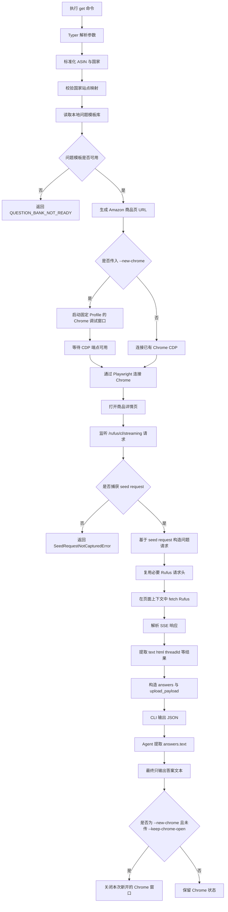
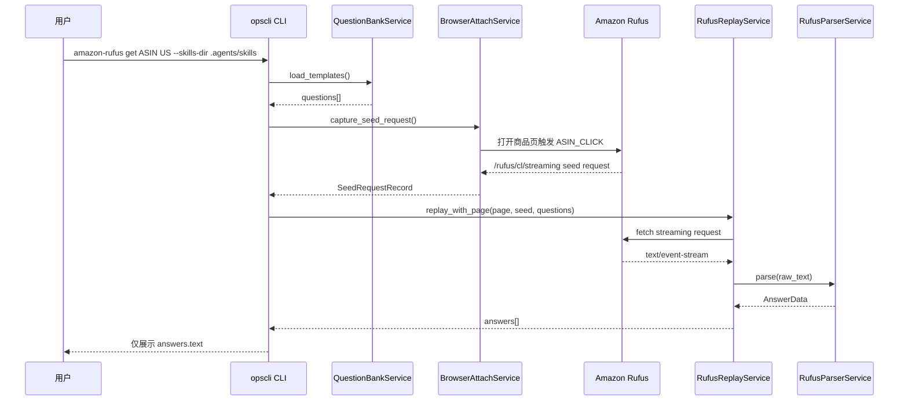

# ops-amazon-rufus 使用说明

`ops-amazon-rufus` 提供 `opscli amazon-rufus get <asin> <country>` 所需的默认问题模板库。

## 常用命令

### 启动 Chrome 调试窗口

```powershell
Start-Process chrome.exe -ArgumentList '--remote-debugging-port=9222 --user-data-dir="E:\chrome-profiles\opscli-rufus" --auto-open-devtools-for-tabs --no-first-run --no-default-browser-check'
```

### 升级问题模板库

```powershell
$env:PYTHONUTF8 = "1"; $env:PYTHONIOENCODING = "utf-8"; uv run --extra amazon opscli skills upgrade ops-amazon-rufus --skills-dir ".agents/skills" --pretty
```

升级成功后，问题模板库会保存到：

```text
.agents/skills/ops-amazon-rufus/data/question_templates.json
```

### 执行 Rufus 获取

```powershell
$env:PYTHONUTF8 = "1"; $env:PYTHONIOENCODING = "utf-8"; uv run --extra amazon opscli amazon-rufus get B0B1MLVMY5 US --skills-dir ".agents/skills" --new-chrome
```

`--new-chrome` 默认会在命令输出结果后通过 CDP `Browser.close` 关闭本次新开的 Chrome 调试窗口。若需要保留窗口用于继续调试或复用登录态，追加：

```powershell
$env:PYTHONUTF8 = "1"; $env:PYTHONIOENCODING = "utf-8"; uv run --extra amazon opscli amazon-rufus get B0B1MLVMY5 US --skills-dir ".agents/skills" --new-chrome --keep-chrome-open
```

## 输出要求

命令执行完成后只输出：

```text
data.answers[].text
```

多条回答按题库顺序输出，并用空行分隔。不得输出 `seed_request`、`upload_payload`、headers 或完整原始 JSON。


## `amazon-rufus get` 执行流程



## 关键数据流



## 关键文件

- `opscli/amazon_rufus/commands/cli.py`：CLI 参数解析与 JSON 输出。
- `opscli/amazon_rufus/services/manager.py`：编排题库、浏览器捕获、Rufus 重放与输出结构。
- `opscli/amazon_rufus/services/question_bank.py`：读取 `.agents/skills/ops-amazon-rufus/data/question_templates.json`。
- `opscli/amazon_rufus/services/browser.py`：启动或连接 Chrome，并捕获 Rufus seed request。
- `opscli/amazon_rufus/services/replay.py`：基于 seed request 重放问题请求。
- `opscli/amazon_rufus/services/parser.py`：解析 Rufus SSE 响应。

## 注意事项

- `amazon-rufus get` 只读取本地题库，不会自动升级题库。
- PowerShell 下运行命令必须设置 `$env:PYTHONUTF8 = "1"` 与 `$env:PYTHONIOENCODING = "utf-8"`，避免中文答案乱码。
- Agent 执行完成后只向用户输出 `answers.text`，不输出完整 JSON。
- 题库升级需要单独执行 `opscli skills upgrade ops-amazon-rufus --skills-dir ".agents/skills"`。
- `--new-chrome` 会启动固定用户目录的 Chrome 调试窗口，命令完成后默认关闭该窗口。
- `--keep-chrome-open` 仅配合 `--new-chrome` 使用，表示命令完成后保留本次新开的 Chrome 窗口。
- Node 的 `[DEP0169] url.parse()` 是 Playwright 依赖链警告，通常不影响命令执行。
