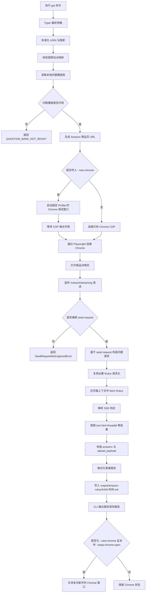
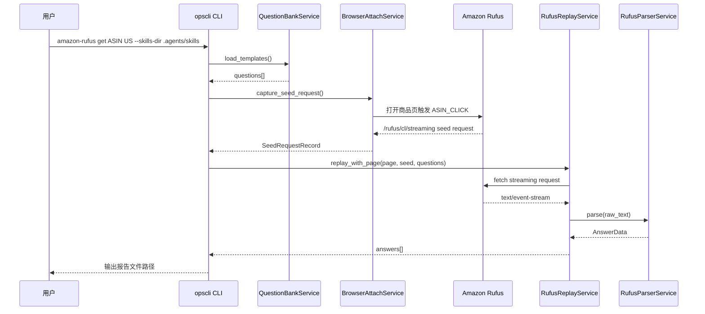

# ops-amazon-rufus 使用说明

`ops-amazon-rufus` 提供 `opscli amazon-rufus get <asin> <country>` 所需的默认问题模板库。

## 常用命令

### PowerShell UTF-8 前缀

PowerShell 下执行任何 `opscli amazon-rufus` 或 `opscli skills upgrade ops-amazon-rufus` 命令前，只需在同一命令行设置 UTF-8 环境，避免状态提示或错误信息乱码。完整 Rufus 答案报告不依赖终端历史，命令成功后会写入运行目录下的 `output/amazon-rufus`：

```powershell
$env:PYTHONUTF8 = "1"; $env:PYTHONIOENCODING = "utf-8";
```

### 前置条件：登录对应国家站点

使用 Rufus 获取前，必须先在对应国家站点登录 Amazon 账户。不同国家站点的登录态相互独立，例如 `US` 对应 `amazon.com`，`DE` 对应 `amazon.de`。

推荐先执行初始化命令，让 opscli 使用与 Rufus 获取相同的固定 Chrome profile 打开对应站点：

```powershell
$env:PYTHONUTF8 = "1"; $env:PYTHONIOENCODING = "utf-8"; uv run --extra amazon opscli amazon-rufus init US
```

请在新窗口中完成登录，再执行 `amazon-rufus get`。切换国家时，应先执行对应国家的初始化命令并确认该站点已登录。

### 启动 Chrome 调试窗口

```powershell
Start-Process chrome.exe -ArgumentList '--remote-debugging-port=9222 --user-data-dir="E:\chrome-profiles\opscli-rufus" --auto-open-devtools-for-tabs --no-first-run --no-default-browser-check'
```

### 升级问题模板库

```powershell
$env:PYTHONUTF8 = "1"; $env:PYTHONIOENCODING = "utf-8"; uv run --extra amazon opscli skills upgrade ops-amazon-rufus --skills-dir ".agents/skills" --pretty
```

升级成功后，问题模板库会保存到：

```text
.agents/skills/ops-amazon-rufus/data/question_templates.json
```

### 执行 Rufus 获取
确认新窗口已登录 Amazon 后，再执行获取命令：

```powershell
$env:PYTHONUTF8 = "1"; $env:PYTHONIOENCODING = "utf-8"; uv run --extra amazon opscli amazon-rufus get B0B1MLVMY5 US --skills-dir ".agents/skills" --new-chrome
```

`--new-chrome` 默认会在命令输出结果后通过 CDP `Browser.close` 关闭本次新开的 Chrome 调试窗口。若需要保留窗口用于继续调试或复用登录态，追加：

## 输出要求

命令执行成功后，stdout 只输出报告保存路径：

```text
Rufus 答案报告已保存：output/amazon-rufus/B0B1MLVMY5-20260430-101530.md
```

完整答案报告写入运行目录下的 `output/amazon-rufus/<ASIN>-YYYYMMDD-HHMMSS.md`。文件名中的时间精确到秒，文件内容按题库顺序输出格式化答案报告。不得输出 `seed_request`、`upload_payload`、headers 或完整原始 JSON。


## `amazon-rufus get` 执行流程



## 关键数据流



## 关键文件

- `opscli/amazon_rufus/commands/cli.py`：CLI 参数解析、报告文件写入与错误 JSON 输出。
- `opscli/amazon_rufus/services/manager.py`：编排题库、浏览器捕获、Rufus 重放与输出结构。
- `opscli/amazon_rufus/services/question_bank.py`：读取 `.agents/skills/ops-amazon-rufus/data/question_templates.json`。
- `opscli/amazon_rufus/services/browser.py`：启动或连接 Chrome，并捕获 Rufus seed request。
- `opscli/amazon_rufus/services/replay.py`：基于 seed request 重放问题请求。
- `opscli/amazon_rufus/services/parser.py`：解析 Rufus SSE 响应。

## 注意事项

- `amazon-rufus get` 只读取本地题库，不会自动升级题库。
- 使用本 Skill 前必须先登录对应国家站点的 Amazon 账户。
- `amazon-rufus init <country>` 会打开对应国家站点，并提示 `请在新窗口中登录亚马逊`。
- 不同国家站点登录态可能独立，切换国家时需要确认目标站点已登录。
- PowerShell 下运行命令建议先设置 `$env:PYTHONUTF8 = "1"` 与 `$env:PYTHONIOENCODING = "utf-8"`，避免状态提示和错误信息乱码。
- Agent 执行完成后只向用户输出报告文件路径，完整报告读取 `output/amazon-rufus/<ASIN>-YYYYMMDD-HHMMSS.md`，不输出完整 JSON。
- 题库升级需要单独执行 `opscli skills upgrade ops-amazon-rufus --skills-dir ".agents/skills"`。
- `--new-chrome` 会启动固定用户目录的 Chrome 调试窗口，命令完成后默认关闭该窗口。
- `--keep-chrome-open` 仅配合 `--new-chrome` 使用，表示命令完成后保留本次新开的 Chrome 窗口。
- Node 的 `[DEP0169] url.parse()` 是 Playwright 依赖链警告，通常不影响命令执行。
