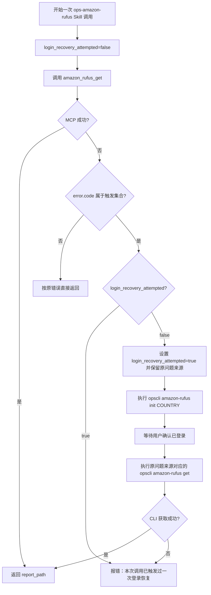
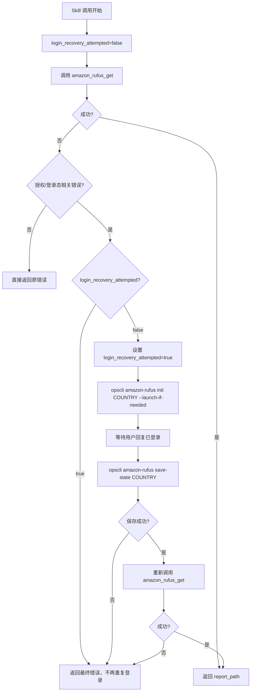

# ops-amazon-rufus Architecture

## 2026-06-04 架构增量：MCP 默认获取切换为 headless 后端链路

### 结论

`amazon_rufus_get` 的默认实现应从“本机 CDP 浏览器路径”切换为“后端 Rufus secret + headless context capture + HTTP streaming 请求”。CDP 能力继续保留，但不再作为默认 MCP 获取入口。

目标边界：

```text
opscli/mcp/tools/amazon_rufus.py
  -> amazon_rufus_get
  -> RufusManager.get_backend 或 get_headless_from_secret
  -> RufusSecretStore / RufusSecretProvider
  -> HeadlessRufusCaptureService
  -> HeadlessRufusClient
  -> AnswerReportWriter
```

旧默认边界改为兼容路径：

```text
RufusManager.get
  -> BrowserAttachService
  -> Chrome CDP
```

### 新增推荐边界

#### RufusSecret

新增内部模型，表达参考实现的 `ParsedCurlRufusRequest`：

```python
@dataclass(frozen=True)
class RufusSecret:
    """Rufus 后端请求凭证。"""

    url: str
    headers: dict[str, str]
    cookies: str
    payload_template: dict[str, Any]
```

该模型只在服务层内部流转，不进入 MCP 成功返回和报告。

#### RufusSecretProvider

推荐新增最小 provider：

```python
class RufusSecretProvider:
    """读取 Rufus 后端请求凭证。"""

    def load(self, *, country: str) -> RufusSecret:
        """读取指定国家站点可用的 Rufus secret。"""
```

首版可从本地加密状态或已有 `RufusBrowserStateStore` 派生；后续再接 ops 后端账号池。不要把 cookie/header 作为 MCP 普通入参。

#### RufusManager.get_backend

推荐新增入口：

```python
def get_backend(
    *,
    asin: str,
    country: str,
    question: str | None = None,
    questions: list[str] | None = None,
    skills_dir: str | None = None,
    timeout_seconds: int = 180,
    include_upload_payload: bool = True,
) -> dict:
    """使用后端 Rufus secret、headless 捕获和 HTTP streaming 获取答案。"""
```

职责：

1. 校验 ASIN / country。
2. 解析问题来源，复用 `_resolve_questions()`。
3. 读取 `RufusSecret`。
4. 调用 headless 捕获服务补齐上下文。
5. 基于 `payload_template` 构造每题 payload。
6. 调用 HTTP streaming client 获取 SSE。
7. 组装现有报告数据结构。

超时策略：`timeout_seconds` 是单题 Rufus 获取预算，默认 180 秒。headless 捕获和每个 Rufus streaming 请求都会使用该值；多题模式逐题请求，内部总等待上限随问题数累加。同步 MCP Router 或调用宿主可能有约 60 秒外层请求上限，该外层限制不能由内部默认值覆盖，长任务需要后续异步 job/polling 架构。

### headless 捕获调整

当前 `HeadlessRufusCaptureService.capture_seed_request()` 已能使用 cookie 或 storage_state 打开商品页并捕获 seed request。为贴近参考实现，后续实现应补齐：

1. 从捕获到的请求 body 提取 `impressionsContext`。
2. 从 response SSE 提取 `requestContext`。
3. 将捕获上下文作为 payload override 输入，而不是仅复用完整 seed request body。
4. 捕获失败时允许固定上下文兜底，但必须保证错误摘要脱敏。

可选新增模型：

```python
@dataclass(frozen=True)
class RufusPayloadContext:
    """headless 捕获到的 Rufus payload 上下文。"""

    impressions_context: dict[str, Any] | None
    request_context: dict[str, Any] | None
    final_page_url: str | None
```

### payload 构造调整

当前 `RufusReplayService.build_payload()` 基于 seed body 做有限覆盖。参考实现的 `build_rufus_payload_from_template()` 更适合后端 secret 模式，应补齐：

1. `payload_template` 深拷贝。
2. 强制覆盖 `queryContext.query/actionType/qis`。
3. 强制设置 `pageContext.pageType/targetPageType/originPageType`。
4. 确保 `targetPageMetadata/pageMetadata/originPageMetadata` 包含目标 ASIN。
5. 写入 `targetUrl/originUrl`。
6. 使用 headless 捕获的 `impressionsContext` 覆盖模板值。
7. 使用 `requestContext` 构造 `requestCancellationTokens`。
8. 设置 `historyThreadContext.threadState=THREAD_STATE_UNKNOWN`。

实现可在 `RufusReplayService` 中新增 `build_payload_from_template()`，避免直接复制参考项目模块。

### MCP 工具调整

`amazon_rufus_get`：

```text
默认调用 RufusManager.get_backend(...)
不再把 new_chrome/launch_if_needed 作为推荐路径参数
```

`amazon_rufus_init`：

```text
保留，用于人工授权、状态初始化或兼容排障
```

`amazon_rufus_get_remote`：

```text
若保留，应重命名语义为 capture/refresh authorization 更清晰；
不应继续作为“真正默认获取”的替代入口。
```

### 错误模型

新增或复用稳定错误：

| 场景 | 错误码 |
|------|--------|
| 未找到后端 Rufus secret | `RUFUS_SECRET_NOT_READY` |
| headless 捕获上下文失败 | `RUFUS_HEADLESS_CAPTURE_ERROR` |
| Rufus HTTP/SSE 请求失败 | `RUFUS_HEADLESS_REQUEST_ERROR` |
| cookie 失效或权限异常 | `RUFUS_LOGIN_REQUIRED` 或按 HTTP status 映射 |

错误响应不得包含 cookie、headers、payload_template、storage_state、seed request 原文。

### 测试策略

1. MCP 测试：`amazon_rufus_get` 默认调用 `get_backend`，不调用 `get`。
2. Manager 测试：`get_backend` 使用 secret provider、headless capture、headless client。
3. Payload 测试：从 template 覆盖问题、ASIN、impressions/request context。
4. 安全测试：MCP 返回、报告和错误中不包含 cookie/header/payload_template。
5. 回归测试：多题输入、默认题库、报告写入、headless Chromium 自动安装仍通过。
6. 兼容测试：显式 CDP 路径仍可在 CLI 或兼容工具中使用，但不影响默认 MCP 获取。

### 架构取舍

该方案只新增 secret provider 与后端编排入口，不删除旧 CDP 实现，满足 KISS/YAGNI：

1. 默认路径修正用户指出的问题。
2. 旧路径保留，降低迁移风险。
3. headless/browser/httpx 能力复用现有代码。
4. 后续接账号池或 ops 后端时，只替换 `RufusSecretProvider`。

## 2026-06-04 架构增量：Skill 文档瘦身与 references 分层

### 结论

`ops-amazon-rufus` 的文档架构应从“主文档承载所有规范”调整为“主文档负责入口，references 负责专题规则”。该调整只改变 Skill 文档信息架构，不改变 MCP 工具实现、题库数据结构或 Rufus 获取服务层。

目标结构：

```text
ops-amazon-rufus/
├── README.md
├── SKILL.md
├── data/
│   ├── VERSION.json
│   └── question_templates.json
└── references/
    ├── question-templates.md
    ├── remote-authorization.md
    ├── rufus-mcp-workflow.md
    └── rufus-report-formatting.md
```

模板目录与已安装目录都应保持相同结构：

```text
opscli/skills/templates/ops-amazon-rufus/
.agents/skills/ops-amazon-rufus/
```

### 主文档边界

`SKILL.md` 只承担 Agent 入口职责：

1. 说明 Skill 是 Rufus 默认题库数据包与 Agent 编排入口。
2. 说明何时触发本 Skill。
3. 列出前置条件。
4. 给出 5 步以内的精简主流程。
5. 列出本地文件和 references 索引。
6. 明确文件边界：Skill 不承载获取 Rufus 的 Python 脚本。

`SKILL.md` 不直接承载：

1. MCP 工具完整参数表。
2. Chrome CDP 排障细节。
3. 远程授权状态机。
4. 问题模式细则。
5. 拒答改写和报告格式化细节。

### reference 职责边界

| 文件 | 职责 |
|------|------|
| `references/rufus-mcp-workflow.md` | Rufus 获取、MCP 工具调用、本机 CDP、问题来源选择、report_path 输出 |
| `references/remote-authorization.md` | 远程授权偏好、Amazon 登录确认门、`amazon_rufus_get_remote` 安全调用、敏感信息保护 |
| `references/question-templates.md` | 题库文件结构、问题模板维护、题库数据来源 |
| `references/rufus-report-formatting.md` | 报告格式化、拒答改写、输出隐藏规则 |

### 读取顺序

Agent 使用 Skill 时的推荐读取顺序：

```text
SKILL.md
  -> 默认/本机/MCP 获取：references/rufus-mcp-workflow.md
  -> 远程授权：references/remote-authorization.md
  -> 题库维护：references/question-templates.md
  -> 报告格式：references/rufus-report-formatting.md
```

### README 边界

`README.md` 面向人类维护者和安装后快速浏览，应保留：

1. Skill 功能一句话说明。
2. 文件结构。
3. references 索引。
4. 简短使用路径。

不应复制 reference 的长流程，避免 README、SKILL、reference 三处内容漂移。

### 实现影响

后续实现只需要文档文件重排：

1. 新增 `remote-authorization.md`。
2. 新增 `rufus-mcp-workflow.md`。
3. 精简模板与已安装目录的 `SKILL.md`。
4. 精简模板与已安装目录的 `README.md`。
5. 同步更新相关测试中对文档内容的断言。

不需要：

1. 修改 `opscli/mcp/tools/amazon_rufus.py`。
2. 修改 `opscli/amazon_rufus/services/*`。
3. 新增 Skill `scripts/`。

### 测试策略

1. 验证模板目录存在 4 个 reference 文件。
2. 验证 `.agents` 已安装目录存在相同 reference 文件。
3. 验证 `SKILL.md` 包含 references 索引。
4. 验证 `SKILL.md` 不包含完整 MCP 参数长表。
5. 验证 `remote-authorization.md` 包含“已登录后再调用 remote MCP”的规则。
6. 验证 `rufus-mcp-workflow.md` 包含单题、多题、默认题库和 `report_path` 规则。

## 2026-06-04 架构增量：远程授权偏好存储与获取前分流

### 结论

本轮不应把“远程授权偏好”硬编码进 Skill 文案的临时记忆，也不应复用 `storage_state` 文件承载普通布尔选择。推荐新增一个极小的偏好边界，用于保存用户是否优先使用远程授权；MCP 工具继续保留 `allow_capture_browser_state=True` 安全门。

推荐边界：

```text
opscli/amazon_rufus/services/remote_consent_preference.py  # 远程授权偏好读写
opscli/mcp/tools/amazon_rufus.py                           # 根据偏好或显式参数执行 remote/local 工具
opscli/skills/templates/ops-amazon-rufus/SKILL.md          # Agent 编排规则
.agents/skills/ops-amazon-rufus/SKILL.md                   # 已安装 Skill 同步规则
```

如果为了最小 diff，也可以先只在 Skill 文档中定义偏好文件协议；但最终实现应有服务层封装，避免 Agent 或 MCP 工具散落读写 JSON。

### 偏好数据模型

推荐模型：

```python
@dataclass(frozen=True)
class RemoteConsentPreference:
    """记录用户是否优先使用 Rufus 远程授权。"""

    use_remote_authorization: bool
    country: str | None
    updated_at: str
    source: str = "ops-amazon-rufus"
```

文件内容只保存：

```json
{
  "use_remote_authorization": true,
  "country": "US",
  "updated_at": "2026-06-04T10:00:00+08:00",
  "source": "ops-amazon-rufus"
}
```

禁止保存：

- cookie
- localStorage
- `storage_state`
- headers
- seed request
- upload payload

### 存储位置

保存路径：

```text
CONFIG_DIR/amazon-rufus/remote-consent.json
```

原因：

1. 复用 `opscli.config.CONFIG_DIR`，符合项目配置目录规范。
2. 不污染仓库、Skill 模板目录或 `output/`。
3. 与现有 `RufusBrowserStateStore` 同属 Rufus 本地状态，但职责独立。

该文件不是敏感登录态，但仍属于用户选择，不应随报告或 feedback 上传。

### 服务接口

推荐服务：

```python
class RemoteConsentPreferenceStore:
    """读写 Rufus 远程授权偏好。"""

    def load(self) -> RemoteConsentPreference | None:
        """读取已保存偏好；不存在或格式非法时返回 None。"""

    def save(self, *, use_remote_authorization: bool, country: str | None = None) -> RemoteConsentPreference:
        """保存用户选择，后续 Rufus 获取直接复用。"""

    def clear(self) -> None:
        """清除偏好，供用户显式重置授权选择。"""
```

首版可以不暴露 CLI reset 命令；如果用户要求修改偏好，Agent 可重新询问并覆盖保存。

### 获取前分流

Skill / Agent 的统一流程：

```text
需要获取 Rufus
  -> 读取 RemoteConsentPreference
    -> 无偏好：询问用户是否使用远程授权，并保存选择
    -> use_remote_authorization=true：
       amazon_rufus_init(country=...) 或等价登录检测
       等待用户明确回复已登录
       amazon_rufus_get_remote(..., allow_capture_browser_state=True)
    -> use_remote_authorization=false：
       opscli amazon-rufus get ... --launch-if-needed
```

远程授权偏好只决定“使用哪条获取路径”，不代表 Amazon 已登录，也不代表可以立即捕获浏览器状态。远程授权路径必须经过登录确认门后才能调用 MCP remote 工具。

### MCP 工具边界

有两种实现选择：

1. **最小实现**：保持现有 `amazon_rufus_get` / `amazon_rufus_get_remote` 不变，由 Skill 指导 Agent 读取/保存偏好并选择工具。
2. **更稳实现**：新增 MCP helper 或工具参数，让 `amazon_rufus_get` 可在内部读取偏好并自动分流。

推荐首版采用方案 1，原因：

- 不改变现有 MCP 工具 schema。
- 不影响已有测试和调用方。
- 更符合当前需求“流程中添加询问并保存值”，实现范围小。

如果后续发现 Agent 无法稳定读取偏好，再进入方案 2：新增 `amazon_rufus_get_with_preference` 或在 `amazon_rufus_get` 中增加 `use_saved_remote_consent: bool = True`。

### 安全门

即使偏好为 `true`，调用远程工具时仍必须传：

```text
allow_capture_browser_state=True
```

原因：

1. 偏好表达“用户选择远程授权路径”。
2. MCP 参数表达“本次工具调用允许捕获浏览器状态”。
3. 二者分离可以防止工具绕过已有安全门。

### 登录确认门

远程授权路径新增一个 Agent 层状态门：

```text
remote_consent=true
  -> call amazon_rufus_init(country)
  -> ask user: 请在打开的目标国家站点 Amazon 窗口完成登录，完成后回复“已登录”
  -> user confirms logged in
  -> call amazon_rufus_get_remote(..., allow_capture_browser_state=True)
```

实现约束：

1. 未收到用户“已登录”确认前，不调用 `amazon_rufus_get_remote`。
2. `amazon_rufus_init` 只负责打开登录窗口，不捕获 storage state。
3. `amazon_rufus_get_remote` 仍是唯一捕获并加密保存浏览器状态的工具入口。
4. 如果用户回复未登录或登录失败，停留在登录确认门，不保存浏览器状态。
5. 如果用户改口不使用远程授权，覆盖偏好为 `false` 并改走 `opscli amazon-rufus get ... --launch-if-needed`。

### 测试策略

新增测试项：

1. 偏好文件不存在时 `load()` 返回 `None`。
2. 保存 `true` 后再次读取仍为 `true`。
3. 保存 `false` 后再次读取仍为 `false`。
4. 偏好文件不包含 cookie、localStorage、`storage_state`。
5. Skill 文档包含“获取 Rufus 前先检查偏好”规则。
6. 偏好为 `true` 时先调用 `amazon_rufus_init` 或等价登录检测，不立即调用 `amazon_rufus_get_remote`。
7. 用户确认已登录后才调用 `amazon_rufus_get_remote`。
8. 偏好为 `false` 的 Agent 流程调用 `amazon_rufus_get`。

## 2026-06-04 架构增量：Chrome CDP 自动发现与按需启动

### 结论

本轮应把 CDP 自启动能力落在 `opscli.amazon_rufus` 正式 Python 运行层，而不是落在 `ops-amazon-rufus` Skill 目录。Skill 只负责 Agent 编排：遇到 CDP 未启动时启用自动启动参数，必要时向用户索取 Chrome 路径。

推荐新增或内聚以下边界：

```text
opscli/amazon_rufus/services/chrome_cdp.py      # 可选新增：CDP 探测、Chrome 路径发现、启动参数构造
opscli/amazon_rufus/services/browser.py         # 接入 launch_if_needed/chrome_path
opscli/amazon_rufus/services/manager.py         # 透传参数
opscli/amazon_rufus/commands/cli.py             # CLI 参数语义落地
opscli/mcp/tools/amazon_rufus.py                # MCP 参数同步
opscli/skills/templates/ops-amazon-rufus/SKILL.md # Agent 编排规则
```

若为最小 diff，也可以先把私有 helper 放在 `browser.py` 中；当浏览器发现逻辑超过简单函数再拆出 `chrome_cdp.py`。不建议新增通用浏览器管理抽象，因为当前只有 Rufus 需要 CDP profile。

### 运行时流程

```text
amazon-rufus get / amazon_rufus_get
  -> RufusManager.get(..., chrome_path, launch_if_needed)
  -> BrowserAttachService.capture_seed_request(...)
    -> ensure_cdp_available(cdp_url, launch_if_needed, chrome_path)
      -> check_cdp(cdp_url)
      -> 可用：直接返回
      -> 不可用且 launch_if_needed/new_chrome：resolve_chrome_path()
      -> start_chrome_for_cdp()
      -> wait_for_cdp(cdp_url)
    -> playwright.chromium.connect_over_cdp(cdp_url)
    -> 捕获 Rufus seed request
```

### CDP 探测接口

建议保留当前 `_wait_for_cdp()` 的轮询逻辑，并新增单次探测：

```python
def is_cdp_available(cdp_url: str) -> bool:
    """检查 Chrome DevTools HTTP endpoint 是否可用。"""
```

实现要求：

1. 使用 `httpx.get(f"{cdp_url.rstrip('/')}/json/version", timeout=1)`。
2. 只判断 CDP HTTP endpoint，不读取任何页面、cookie 或 storage state。
3. 错误吞掉后返回 `False`，由上层决定是否启动。

### Chrome 路径发现

推荐函数：

```python
def resolve_chrome_executable(explicit_path: str | None = None) -> Path:
    """按平台查找 Chrome 可执行文件。"""
```

Windows 搜索顺序：

1. `explicit_path`
2. 注册表 `HKCU/HKLM\Software\Microsoft\Windows\CurrentVersion\App Paths\chrome.exe`
3. `%ProgramFiles%\Google\Chrome\Application\chrome.exe`
4. `%ProgramFiles(x86)%\Google\Chrome\Application\chrome.exe`
5. `%LocalAppData%\Google\Chrome\Application\chrome.exe`
6. `shutil.which("chrome")`、`shutil.which("chrome.exe")`

macOS/Linux 搜索作为兜底，不扩大本轮测试范围到真实系统依赖。

### 启动参数

推荐函数：

```python
def start_chrome_for_cdp(
    *,
    chrome_path: Path,
    cdp_url: str,
    user_data_dir: Path,
) -> subprocess.Popen:
    """启动带 CDP 的 Chrome。"""
```

参数从 `cdp_url` 解析 host/port。默认只允许本地地址：

```text
--remote-debugging-address=127.0.0.1
--remote-debugging-port=9222
--user-data-dir=<CONFIG_DIR 或固定 opscli Rufus profile>
--no-first-run
--no-default-browser-check
```

`--user-data-dir` 必须使用非默认目录。优先建议放到 `opscli.config.CONFIG_DIR / "amazon-rufus" / "chrome-profile"`，比当前硬编码 `E:\chrome-profiles\opscli-rufus` 更跨平台，也更符合项目配置目录规则。若考虑兼容已有登录态，可保留旧目录作为 Windows 默认，但需要在 PRD/Spec 中明确迁移策略。

### 参数传递

`BrowserAttachService.capture_seed_request()` 增加：

```python
chrome_path: str | None = None
launch_if_needed: bool = False
```

`RufusManager.get()` 已有这两个参数，应传入 browser service。

CLI：

```python
chrome_path: str | None = typer.Option(None, "--chrome-path", help="Chrome 可执行文件路径")
launch_if_needed: bool = typer.Option(False, "--launch-if-needed", help="CDP 不可用时自动搜索并启动 Chrome")
```

MCP：

```python
async def amazon_rufus_get(..., chrome_path: str | None = None, launch_if_needed: bool = False, ...)
```

### 错误模型

继续使用 `ChromeCdpUnavailableError`，message 区分三类：

| 场景 | message 要点 |
|------|--------------|
| CDP 不可用且未允许启动 | 提示使用 `launch_if_needed=True` 或 `--launch-if-needed` |
| 已允许启动但找不到 Chrome | 提示传入 `chrome_path` / `--chrome-path` |
| 已启动但 CDP 仍不可用 | 提示检查 `cdp_url`、端口占用和 profile 目录 |

错误码不新增，避免 Agent 多分支适配；通过 message 和 `next_action` 给出下一步。

### 测试策略

新增测试应全部 mock，不访问真实 Chrome：

1. `is_cdp_available()` 在 `/json/version` 返回 200 时为 True。
2. CDP 已可用时不调用 `start_chrome_for_cdp()`。
3. CDP 不可用且 `launch_if_needed=False` 时抛出 `ChromeCdpUnavailableError`。
4. CDP 不可用且 `launch_if_needed=True` 时按顺序调用路径发现、启动、等待。
5. `chrome_path` 显式传入时优先使用。
6. 启动参数包含非默认 `--user-data-dir` 与 `--remote-debugging-address=127.0.0.1`。
7. CLI 参数透传到 `RufusManager.get()`。
8. MCP 参数透传到 `RufusManager.get()`。
9. Skill 文档包含 `CHROME_CDP_UNAVAILABLE` 处理规则。

## 2026-06-04 架构增量：临时多问题参数链路

### 结论

当前底层 replay 和报告链路已经以 `questions: list[str]` 为核心工作，缺口集中在参数入口和问题来源解析。推荐把多问题能力收敛到 `RufusManager` 的问题解析边界，CLI 和 MCP 只负责把输入透传为临时问题列表。

新增边界不应绕过现有题库服务，也不应复制 replay 逻辑。

### 参数模型

推荐将 `RufusManager` 的问题入口调整为兼容结构：

```python
def get(
    ...,
    question: str | None = None,
    questions: list[str] | None = None,
    ...
) -> dict:
    ...
```

同样适用于：

```python
get_headless(...)
get_remote_from_storage_state(...)
get_remote_from_browser(...)
```

兼容规则：

1. `question` 保留给旧调用方和单题 MCP 入参。
2. `questions` 承载新多题能力。
3. 两者不能同时传入；同时传入时抛出稳定业务异常。
4. 两者都为空时走默认题库。

### 问题解析函数

当前 `_resolve_questions(question, skills_dir)` 建议改为：

```python
def _resolve_questions(
    *,
    question: str | None,
    questions: list[str] | None,
    skills_dir: str | None,
) -> list[str]:
    ...
```

处理顺序：

1. 若 `question is not None` 且 `questions` 非空，返回参数冲突错误。
2. 若 `questions` 非空，逐项 `strip()`，任一为空则返回 `INVALID_RUFUS_QUESTION`。
3. 若 `question is not None`，沿用现有单题校验。
4. 否则读取默认题库。

该函数是唯一的问题来源选择点，避免 CLI、MCP、headless 分支各自实现一套校验。

### CLI 参数设计

`commands/cli.py` 中 `question` 选项改为可重复选项：

```python
question: list[str] | None = typer.Option(
    None,
    "--question",
    "-q",
    help="指定 Rufus 问题，可多次传入；传入后跳过默认题库",
)
```

CLI 调用 `RufusManager.get(..., questions=question, ...)`。变量名可以保持 `question` 以降低 Typer 参数变更，但传入 Manager 时应明确为 `questions`。

### MCP 参数设计

MCP Tool 推荐保留现有单题参数，并新增多题参数：

```python
async def amazon_rufus_get(
    asin: str,
    country: str,
    question: str | None = None,
    questions: list[str] | None = None,
    ...
) -> dict:
    ...
```

原因：

1. 保持现有 Agent 调用兼容。
2. 新 Agent 可以一次传入多个问题。
3. 错误语义由 Manager 统一处理。

### 数据流

```text
CLI: -q 问题一 -q 问题二
  -> Typer 解析为 list[str]
  -> RufusManager.get(questions=[...])
  -> _resolve_questions(...)
  -> BrowserAttachService 捕获一次 seed request
  -> RufusReplayService 按 questions 顺序逐题 replay
  -> AnswerReportWriter 写一份多题报告
```

MCP：

```text
amazon_rufus_get(questions=["问题一", "问题二"])
  -> RufusManager.get(questions=[...], include_upload_payload=False)
  -> AnswerReportWriter
  -> allowlist summary(question_count=2, answer_count=2)
```

### 错误模型

建议沿用或扩展 `InvalidQuestionError`：

| 场景 | 错误码 | 说明 |
|------|--------|------|
| 单题空白 | `INVALID_RUFUS_QUESTION` | 现有语义 |
| 多题中任一空白 | `INVALID_RUFUS_QUESTION` | 不静默过滤 |
| 同时传 `question` 和 `questions` | `INVALID_RUFUS_QUESTION` | 参数来源冲突 |

### 测试策略

新增测试项：

1. Manager 多题模式不读取题库，并返回 `question_count=2`。
2. CLI 多次 `-q` 透传为 `questions` 列表。
3. CLI 多次 `--question` 与混用 `-q/--question` 都保序。
4. 多题中空白问题失败。
5. MCP `questions` 参数写出多题报告且不返回敏感字段。
6. 现有 `--question` 单题测试更新为兼容新列表参数。

## 2026-06-03 架构增量：Rufus 获取能力 MCP 化，Skill 保留授权编排边界

### 结论

本节为最新约束，后续 Spec 和实现以本节为准；旧章节中出现的 CLI 获取路径只保留历史背景，不再作为 Skill 交互入口。

本轮架构边界调整为：

```text
opscli/mcp/tools/amazon_rufus.py   -> MCP 工具入口
opscli/amazon_rufus/               -> Python Rufus 业务实现
ops-amazon-rufus Skill             -> 默认题库数据包 + Agent 授权编排规则
```

Rufus Python/CLI 获取实现不再写在 Skill 使用流程中。MCP Tool 直接复用现有 Python 服务层，Skill 负责题库数据、版本文件，以及“用户同意保存 cookie / browser state 后调用 MCP”的 Agent 编排规则。
获取 Rufus 的 `.py` 工具文件归属 MCP 层，目标文件为 `opscli/mcp/tools/amazon_rufus.py`；Skill 目录不得包含获取 Rufus 的 Python 脚本。

### 新增 MCP 模块

新增文件：

```text
opscli/mcp/tools/amazon_rufus.py
```

该文件是 Rufus 获取 MCP Tool 的 Python 文件，负责暴露 `amazon_rufus_*` 工具函数。它可以调用 `opscli/amazon_rufus/services/*`，但不能复制到 Skill 目录。

模块职责：

1. 定义可测试的模块级 async tool 函数。
2. 调用 `RufusManager` 的 Python 方法。
3. 生成报告文件并返回报告路径。
4. 过滤敏感字段。
5. 对登录中断禁用自动 feedback。
6. 通过 `register(mcp)` 批量注册工具。

不承担：

- 题库解析细节。
- Rufus replay 细节。
- Playwright storage_state 加密实现。
- Skill 文档中的授权决策规则。

### 工具定义

#### `amazon_rufus_init`

```python
async def amazon_rufus_init(
    country: str,
    cdp_url: str = "http://127.0.0.1:9222",
    timeout_seconds: int = 30,
) -> dict:
    ...
```

调用：

```python
RufusManager().init(country=country, cdp_url=cdp_url, timeout_seconds=timeout_seconds)
```

返回：

```json
{
  "success": true,
  "data": {
    "country": "US",
    "url": "https://www.amazon.com",
    "next_action": "请在新窗口中登录亚马逊，完成后重新调用 amazon_rufus_get。"
  },
  "error": null
}
```

#### `amazon_rufus_get`

```python
async def amazon_rufus_get(
    asin: str,
    country: str,
    question: str | None = None,
    skills_dir: str | None = None,
    cdp_url: str = "http://127.0.0.1:9222",
    new_chrome: bool = False,
    keep_chrome_open: bool = False,
    timeout_seconds: int = 180,
) -> dict:
    ...
```

调用：

```python
data = RufusManager().get(
    asin=asin,
    country=country,
    question=question,
    skills_dir=skills_dir,
    cdp_url=cdp_url,
    new_chrome=new_chrome,
    keep_chrome_open=keep_chrome_open,
    timeout_seconds=timeout_seconds,
    include_upload_payload=False,
)
```

注意：MCP 默认 `include_upload_payload=False`，避免返回内部上传 payload。

#### `amazon_rufus_get_remote`

```python
async def amazon_rufus_get_remote(
    asin: str,
    country: str,
    question: str | None = None,
    skills_dir: str | None = None,
    cdp_url: str = "http://127.0.0.1:9222",
    timeout_seconds: int = 180,
    allow_capture_browser_state: bool = False,
) -> dict:
    ...
```

安全门：

- `allow_capture_browser_state` 必须为 `True` 才执行。
- 否则返回 `RUFUS_REMOTE_CONSENT_REQUIRED`。
- 工具描述中必须说明会捕获并加密保存当前 Amazon 站点 cookie/localStorage。

调用：

```python
data = RufusManager().get_remote_from_browser(
    asin=asin,
    country=country,
    question=question,
    skills_dir=skills_dir,
    cdp_url=cdp_url,
    timeout_seconds=timeout_seconds,
    include_upload_payload=False,
    wait_for_login=None,
)
```

MCP 场景不使用 `typer.prompt`。是否已登录由用户和 Agent 在调用前确认，工具只执行显式授权动作。

### 报告生成边界

CLI 当前报告写入逻辑在 `opscli/amazon_rufus/commands/cli.py` 的私有函数中。为避免 MCP 复制 CLI 私有实现，建议新增服务模块：

```text
opscli/amazon_rufus/services/report_writer.py
```

推荐接口：

```python
class RufusReportWriter:
    """写入 Rufus 答案报告。"""

    def write(self, data: dict, output_dir: Path | None = None) -> Path:
        ...
```

CLI 与 MCP 共同使用该服务。若为了最小改动，也可以首版在 MCP 模块中保留小型 `_write_report()`，但长期应抽到 service。

### 敏感字段过滤

MCP 工具返回前必须构造 allowlist 响应，不直接返回 `RufusManager` 原始 data。

允许字段：

- `asin`
- `country`
- `page_url`
- `question_count`
- `questions`
- `answer_count`
- `report_path`

默认禁止字段：

- `seed_request`
- `upload_payload`
- `request_headers`
- `cookie`
- `localStorage`
- `storage_state`
- `payload_template`

### 错误处理

新增本地辅助函数：

```python
def _rufus_err(exc: Exception, *, tool: str, call_params: dict) -> dict:
    ...
```

规则：

1. `RufusLoginRequiredError` 和 `SeedRequestNotCapturedError`：
   - 使用 `_err(..., auto_feedback=False)`。
   - 在 `data` 或 `error` 中补 `next_action`。
   - 不调用 feedback。
2. 其他异常：
   - 使用 `_err(..., tool=..., call_params=safe_params)`。
   - `safe_params` 只包含 ASIN、国家、是否单题、timeout，不包含敏感状态。

### MCP 注册

`opscli/mcp/server.py` 增加：

```python
try:
    from opscli.mcp.tools import amazon_rufus as _amazon_rufus_tools
    _amazon_rufus_tools.register(_telemetry_mcp)
except (ImportError, ModuleNotFoundError):
    _logger.info("amazon_rufus 工具未加载：缺少 playwright 依赖")
```

由于 `opscli.amazon_rufus` 模块只有运行时才 import Playwright，理论上可以无条件注册；但 Rufus 实际功能依赖 `opscli[amazon]`，沿用 Amazon 工具的条件注册心智更清晰。

### Skill 边界调整

`opscli/skills/templates/ops-amazon-rufus/SKILL.md` 和 `.agents/skills/ops-amazon-rufus/SKILL.md` 应改为：

```text
ops-amazon-rufus 是 Rufus 默认题库数据包与 MCP 编排规则。
它提供 data/question_templates.json，供 amazon_rufus_get MCP Tool 在未指定 question 时读取。
执行 Rufus 获取必须使用 MCP Tool：amazon_rufus_init / amazon_rufus_get / amazon_rufus_get_remote。
当用户同意保存 cookie / browser state 时，调用 amazon_rufus_get_remote(..., allow_capture_browser_state=True)。
当用户不同意保存 cookie / browser state 时，不调用远程捕获工具。
```

Skill 不再描述：

- PowerShell 环境前缀。
- `uv run --extra amazon opscli amazon-rufus get ...`。
- `--remote-rufus`。
- Python headless 调用方式。
- 手动 Chrome 命令。
- 获取 Rufus 的 `.py` 脚本文件。

Skill 仍应描述：

- 题库数据文件和升级方式。
- 用户授权前不得保存 cookie / browser state。
- 用户同意保存 cookie / browser state 后，Agent 走 MCP Tool 获取 Rufus。
- 登录中断错误属于可恢复流程，不提交 feedback。

### Skill 目录文件约束

允许保留：

```text
opscli/skills/templates/ops-amazon-rufus/
├── SKILL.md
├── README.md
├── data/
│   ├── VERSION.json
│   └── question_templates.json
└── references/
    └── *.md
```

禁止新增：

```text
opscli/skills/templates/ops-amazon-rufus/scripts/get_rufus.py
opscli/skills/templates/ops-amazon-rufus/scripts/rufus.py
opscli/skills/templates/ops-amazon-rufus/scripts/headless_rufus.py
.agents/skills/ops-amazon-rufus/scripts/*.py
```

所有获取 Rufus、捕获 cookie/browser state、请求 Amazon Rufus 的 Python 代码都必须位于 `opscli/amazon_rufus/` 或 `opscli/mcp/tools/amazon_rufus.py`，不能作为 Skill 文件分发。

### 数据流

```text
MCP client
  -> amazon_rufus_get(...)
    -> RufusManager.get(...)
      -> QuestionBankService(skills_dir)
      -> BrowserAttachService / RufusReplayService
      -> AnswerReportFormatter / RufusReportWriter
    -> allowlist summary
    -> _ok(summary)
```

远程授权：

```text
MCP client
  -> 读取 ops-amazon-rufus Skill 的授权编排规则
  -> 向用户确认是否同意保存 cookie / browser state
  -> amazon_rufus_get_remote(..., allow_capture_browser_state=True)
    -> RufusManager.get_remote_from_browser(...)
      -> RufusBrowserStateStore.capture_from_browser(...)
      -> 加密保存 storage_state
      -> get_headless(...)
    -> allowlist summary
```

### 测试策略

新增测试文件：

```text
tests/mcp/test_amazon_rufus_tools.py
```

测试项：

1. `test_mcp_exposes_amazon_rufus_tools`：工具列表包含 `amazon_rufus_init`、`amazon_rufus_get`。
2. `test_amazon_rufus_get_calls_manager_and_writes_report`：fake manager 返回答案，工具写报告并返回 allowlist。
3. `test_amazon_rufus_get_does_not_return_sensitive_fields`：返回 JSON 不包含 cookie、localStorage、storage_state、seed_request。
4. `test_amazon_rufus_login_required_has_no_feedback`：登录中断不生成 feedback 草案。
5. `test_amazon_rufus_remote_requires_consent`：未传授权参数不调用 manager。
6. `test_amazon_rufus_remote_calls_manager_when_consented`：授权后调用 `get_remote_from_browser()`。

回归测试：

```powershell
pytest tests/mcp/test_tools.py -v
pytest tests/mcp/test_amazon_rufus_tools.py -v
pytest tests/amazon_rufus/test_core.py -v
```

## 2026-06-03 架构增量：远程获取授权、storage_state 持久化与 Rufus MCP 调用

### 结论

本轮不替换现有本机 Chrome/CDP 获取链路，而是在“Amazon 未登录或登录态不可用”场景增加一个可选远程获取分支。用户拒绝远程获取时，现有 `RufusManager.get()` 流程保持不变；用户同意后，系统捕获当前 Amazon 站点的 cookie/localStorage，保存为本地加密状态，再调用 Rufus MCP 工具获取答案数据。

### 新增架构边界

建议在现有 `amazon_rufus` 模块内新增三个小边界，避免把 consent、状态存储和 MCP 调用塞进 CLI 函数：

```text
opscli/amazon_rufus/services/login_state.py
opscli/amazon_rufus/services/browser_state_store.py
opscli/amazon_rufus/services/remote_mcp.py
```

职责划分：

1. `login_state.py`
   - 检测当前 Amazon 页面是否已登录。
   - 给出登录态不可用原因，例如未登录、站点不匹配、状态过期。
   - 不保存 cookie/localStorage。
2. `browser_state_store.py`
   - 从 Playwright `BrowserContext.storage_state()` 获取标准状态。
   - 将状态保存到 `opscli.config.CONFIG_DIR / "amazon-rufus"` 下。
   - 使用加密文件或复用现有 `CredentialStore` 的加密策略，避免明文落盘。
   - 按 `country` 覆盖保存，避免同一用户多站点状态混用。
3. `remote_mcp.py`
   - 封装 Rufus MCP 工具调用。
   - 只接收 `storage_state` 等价结构，不从仓库目录读取敏感状态。
   - 将 MCP 返回数据转换为当前 `RufusManager.get()` 兼容结构。

### CLI 与 Manager 接入点

`commands/cli.py` 仍只负责参数解析、交互确认、错误 JSON 和报告文件写入。推荐由 CLI 层做 consent 交互，因为是否继续远程获取是用户交互，不应隐藏在 service 内部。

推荐新增参数或内部模式：

```text
--remote-rufus/--local-rufus
```

但本轮最小落地可以先不新增公开参数，只在未登录时交互询问。后续若需要非交互脚本，可在 Spec 阶段再明确默认值与 CI 行为。

`RufusManager.get()` 推荐增加可选编排入口：

```python
def get(
    ...,
    remote_rufus: bool | None = None,
) -> dict:
    ...
```

取值语义：

| 值 | 行为 |
|---|---|
| `None` | 自动：未登录时询问用户；非交互环境下保持现有本机流程 |
| `False` | 强制本机流程，不保存状态，不调用 MCP |
| `True` | 强制远程流程；未捕获有效状态时提示登录并捕获 storage_state |

### storage_state 数据契约

Playwright 标准结构可直接表达用户要求的 cookie 和 localStorage：

```json
{
  "cookies": [
    {
      "name": "session-id",
      "value": "...",
      "domain": ".amazon.com",
      "path": "/"
    }
  ],
  "origins": [
    {
      "origin": "https://www.amazon.com",
      "localStorage": [
        {
          "name": "key",
          "value": "value"
        }
      ]
    }
  ]
}
```

本地保存结构建议包一层 metadata：

```json
{
  "country": "US",
  "marketplace_origin": "https://www.amazon.com",
  "captured_at": 1780000000000,
  "storage_state": {
    "cookies": [],
    "origins": []
  }
}
```

安全约束：

1. 不把该结构写入 `output/amazon-rufus` 报告目录。
2. 不写入 `.agents/skills/ops-amazon-rufus/data`。
3. 不在异常 message、ops-feedback payload 或 telemetry raw payload 中包含明文状态。
4. 保存前校验 `origins[].origin` 与当前 `country` 的 marketplace 一致。

### Rufus MCP 工具契约

建议新增或对接一个 Rufus MCP tool，命名在 Spec 阶段最终确定。推荐临时契约：

```python
amazon_rufus_remote_get(
    asin: str,
    country: str,
    questions: list[str],
    storage_state: dict,
    timeout_seconds: int = 180,
) -> dict
```

输入约束：

1. `asin` 在调用前统一大写。
2. `country` 使用现有 `resolve_marketplace()` 支持的国家码。
3. `questions` 复用 `_resolve_questions()` 结果。
4. `storage_state` 必须包含 `cookies` 和 `origins`；缺任一字段应返回稳定错误。
5. MCP 工具不得持久化该状态；如远端工具必须缓存，应由工具自身显式声明生命周期并另行确认。

输出结构：

```json
{
  "asin": "B0TEST1234",
  "country": "US",
  "page_url": "https://www.amazon.com/dp/B0TEST1234",
  "question_count": 1,
  "questions": ["这个商品适合送礼吗？"],
  "answers": [
    {
      "text": "Rufus 回答文本",
      "isSuccess": true
    }
  ],
  "source": "rufus_mcp"
}
```

Manager 收到 MCP 输出后继续补齐或复用报告层所需字段，不要求 MCP 返回 `seed_request` 或 `upload_payload`。

### 运行时数据流

```text
opscli amazon-rufus get ASIN COUNTRY
    -> 解析 question / 题库得到 questions[]
    -> 打开 Amazon 当前国家站点
    -> LoginStateService 检查登录态
        -> 已登录：继续现有本机流程
        -> 未登录：CLI 询问是否同意远程获取
            -> 不同意：继续现有本机流程，提示可能卡顿
            -> 同意：
                -> 用户在新窗口登录 Amazon
                -> BrowserStateStore.capture(storage_state)
                -> BrowserStateStore.save_encrypted(country, storage_state)
                -> RufusRemoteMcpClient.remote_get(...)
                -> 返回兼容 data
    -> AnswerReportFormatter 写报告
    -> CLI 输出报告路径
```

### 错误处理

新增错误建议：

| 错误码 | 场景 | 用户提示 |
|---|---|---|
| `RUFUS_REMOTE_CONSENT_REQUIRED` | 非交互环境无法确认远程获取 | 请加参数明确选择本机或远程模式 |
| `RUFUS_REMOTE_STATE_EMPTY` | 同意远程但未捕获 cookie/localStorage | 请在新窗口完成 Amazon 登录后重试 |
| `RUFUS_REMOTE_MCP_FAILED` | MCP 工具调用失败 | 可退回本机流程，远程错误已隐藏敏感状态 |

这些错误不得包含 storage_state 明文。若 MCP 工具调用失败，按 ops-feedback 铁律提交结构化反馈；用户拒绝远程获取、等待登录、人工取消不提交反馈。

### 测试策略

新增测试：

1. CLI 未登录时展示 consent 文案，文案包含干净账号、未绑定信用卡、仅本人使用、不共享、本机卡顿提示。
2. 用户拒绝远程获取时，不调用 `BrowserStateStore` 和 `RufusRemoteMcpClient`。
3. 用户同意后，`BrowserStateStore` 保存的数据包含 cookies 与 localStorage。
4. 状态保存路径位于 `CONFIG_DIR / "amazon-rufus"`，不在仓库和 `output/` 下。
5. MCP 成功返回后，CLI 写入报告文件且 stdout 只输出报告路径。
6. MCP 失败时错误结构不包含 cookie/localStorage，并允许退回本机流程。
7. 现有本机 `amazon-rufus get`、`--question`、拒答改写、报告 formatter 测试继续通过。

## 2026-06-03 架构增量：Python 端 headless 获取调用方法

### 结论

本轮不改现有 CDP attach 链路，而是在 Python 层新增 headless 获取入口。现有 `RufusManager.get()` 继续服务 `opscli amazon-rufus get`；新增 `RufusManager.get_headless()` 负责纯 Python/headless 场景。

### 推荐对外调用

```python
from opscli.amazon_rufus.services.manager import RufusManager

data = RufusManager().get_headless(
    asin="B0TEST1234",
    country="US",
    question="这个商品适合送礼吗？",
    streaming_url="https://www.amazon.com/rufus/cl/streaming?tabId=...",
    headers=headers,
    cookie=amazon_cookie,
    payload_template=payload_template,
    timeout_seconds=180,
)
```

参数说明：

| 参数 | 说明 |
|------|------|
| `asin` | 目标 ASIN，内部统一转大写 |
| `country` | Amazon 国家站点，如 `US`、`DE` |
| `question` | 单题问题；为空时可复用现有题库解析 |
| `streaming_url` | Rufus `/rufus/cl/streaming` URL，来自 Copy as cURL 或账号配置 |
| `headers` | Rufus 请求 header，不包含 Cookie |
| `cookie` | 必传的 Amazon Cookie header 字符串，仅在内存中使用 |
| `payload_template` | Copy as cURL 中保存的原始 payload 模板 |
| `timeout_seconds` | 捕获和请求超时 |

`cookie` 的用途必须对齐外部 Python 实现：

1. 在 headless 捕获阶段解析为 Playwright cookie，并通过 `context.add_cookies()` 注入 Amazon 商品页 context。
2. 在 Rufus 请求阶段写入 HTTP `Cookie` header，用于请求 `/rufus/cl/streaming`。
3. 捕获和请求必须使用同一份 `cookie`，避免上下文来自一个登录态、问答请求来自另一个登录态。

### 新增模块边界

建议新增最小模块：

```text
opscli/amazon_rufus/services/headless_capture.py
opscli/amazon_rufus/services/headless_client.py
```

职责划分：

1. `headless_capture.py`
   - 复刻外部 `PlaywrightTargetRequestCaptor` 的必要能力。
   - 用 `async_playwright().start()` 和 `chromium.launch(headless=True)` 启动浏览器。
   - 新建 context 后注入调用方传入的 `cookie`。
   - 访问 ASIN 商品页，捕获 `rufus/cl/streaming` request 与 response body。
   - 提取 `impressionsContext` 和 `requestContext`。
2. `headless_client.py`
   - 复刻外部 `query_rufus` 的必要能力。
   - 用 `httpx` streaming POST Rufus URL。
   - 收集 SSE raw text，并复用现有 `RufusParserService.parse(raw_text)` 转为 `AnswerData`。
3. `manager.py`
   - 新增 `get_headless()` 编排入口。
   - 复用 `_resolve_questions()`、`build_upload_payload()` 和空答案登录态判定。

### 运行时数据流

```text
Python caller
    -> RufusManager.get_headless(...)
        -> _resolve_questions(question, skills_dir)
        -> HeadlessRufusCaptureService.capture_context_for_asin(...)
            -> Playwright chromium.launch(headless=True)
            -> context.add_cookies(parse_cookie_header(cookie))
            -> page.route/page.on 捕获 rufus/cl/streaming
            -> 提取 request body + response context
        -> HeadlessRufusClient.query(...)
            -> build payload from payload_template + captured context
            -> 带同一份 cookie 请求 Rufus
            -> httpx stream POST /rufus/cl/streaming
            -> RufusParserService.parse(raw_sse)
        -> 组装现有 data 结构
        -> 返回给调用者或报告 formatter
```

### 与现有 CDP 模式关系

| 能力 | 当前 CDP 模式 | 新 headless 模式 |
|------|---------------|------------------|
| 登录态来源 | 用户可见 Chrome profile | 调用者传入 `cookie` |
| 浏览器 | `connect_over_cdp` 连接 Chrome | Playwright 启动 headless Chromium |
| replay 位置 | 页面上下文 `fetch()` | `httpx` streaming POST |
| CLI 输出 | 报告路径 | 先作为 Python 方法，不直接输出 |
| 风险 | 依赖用户窗口和 CDP 端口 | 依赖 cookie/header 有效性 |

两种模式共用 `QuestionBankService`、`RufusParserService`、`AnswerReportFormatter` 的数据结构，避免重复实现报告和题库逻辑。

### 安全约束

1. 不允许在异常、日志、报告中输出 `cookie`、`headers`、完整 `payload_template`。
2. Python 示例只使用变量名，不展示真实 cookie。
3. 若后续扩展 CLI，优先使用 `--curl-file` 或 `--secrets-file`，不设计 `--cookie` 明文参数。
4. 测试必须 mock 网络和 Playwright，不请求真实 Amazon。

## 2026-05-14 架构增量：拒答检测与问题改写

### 设计原则

拒答检测属于“单题执行结果处理”，不属于 CLI 参数校验。实现应放在 replay 服务附近，确保 `--question` 单题模式和题库模式走同一套逻辑。

设计取舍：

1. 每题最多 3 次改写重试；加上原问题首次执行，单题最多 4 次尝试，防止不可控循环。
2. 改写只影响本次运行，不写回题库文件。
3. 拒答检测和问题改写拆成独立服务，避免污染 parser 与 formatter。
4. 改写后的重试问题必须是中文，避免 Agent 在英文站点或英文原问题场景下生成英文重试问题。
5. 不引入外部模型依赖，首版使用保守规则识别拒答，并用规则化模板做中性改写。

### 新增服务边界

推荐新增文件：

```text
opscli/amazon_rufus/services/question_refusal.py
```

推荐类：

```python
class QuestionRefusalService:
    """识别 Rufus 拒答并生成受限改写问题。"""

    MAX_REWRITTEN_QUESTION_LENGTH = 180
    MAX_REFUSAL_RETRIES = 3

    def is_refusal(self, answer: AnswerData) -> bool:
        ...

    def rewrite_question(self, question: str) -> str:
        ...
```

职责：

1. `is_refusal()` 只判断答案内容，不访问浏览器或题库。
2. `rewrite_question()` 保持原问题核心语义，输出不超过 180 字。
3. `rewrite_question()` 输出必须为中文；原问题为英文或中英混合时，应先保留核心业务词，再转写为自然中文。
4. 改写时压缩空白、去掉重复礼貌词和绝对化措辞，转换为面向公开商品信息的中性问法。
5. 若改写后仍超过 180 字，继续按句子边界和修饰语压缩，最终保证不超过 180 字。

### Replay 接入点

`RufusReplayService.replay_with_page()` 当前逐题执行：

```text
build_payload -> fetch -> parse -> append answer
```

推荐改为：

```text
build_payload(current_question)
  -> fetch
  -> parse
  -> is_refusal(answer)
    -> 否：返回 answer
    -> 是且 retry_count < 3：rewrite_question(original_question, last_question)
       -> 使用改写问题继续重试
    -> 是且 retry_count == 3：返回带拒答改写元信息的最终 answer
```

线程上下文策略：

1. 首次问题返回拒答时，不应把拒答产生的 `threadId` 注入改写问题，避免后续回答继续受拒答上下文影响。
2. 改写重试成功后，才把最终成功结果的 `threadId` 作为后续题目的上下文。
3. 若 3 次改写重试后仍拒答，则按现有失败/答案保留逻辑处理，并记录 `attemptCount = 4`。

### AnswerData 扩展

推荐在 `AnswerData` 上增加可选字段，并在 `to_dict()` 中输出前端兼容 camelCase：

```python
refusal_detected: bool = False
refusal_retry_applied: bool = False
original_question: str | None = None
rewritten_question: str | None = None
attempt_count: int = 1
```

输出示例：

```json
{
  "text": "最终答案",
  "isSuccess": true,
  "refusalDetected": true,
  "refusalRetryApplied": true,
  "originalQuestion": "这个商品适合送礼吗？",
  "rewrittenQuestion": "基于商品页面和公开评价，分析该商品是否适合送礼，并说明理由",
  "attemptCount": 4
}
```

### 报告格式化接入

`AnswerReportFormatter` 读取 `refusalRetryApplied` 和 `rewrittenQuestion`：

1. section 标题仍优先展示原题，避免用户丢失原始意图。
2. 标题下方增加短说明和改写后问题。
3. 正文展示最终答案，不默认输出首次拒答原文。

推荐格式：

```text
## 第 1 题：这个商品适合送礼吗？

已检测到首次回答拒答，已在保持原语义的前提下改写问题并重试。
改写后问题：基于商品页面和公开评价，分析该商品是否适合送礼，并说明理由

### 答案
...
```

### 与 `--question` 的关系

空白 `--question` 仍在 manager 的问题来源解析阶段提前失败，错误码为 `INVALID_RUFUS_QUESTION`。拒答检测发生在问题已成功发送并解析出 Rufus 答案之后，两者不要混在同一个分支里。

### 测试策略

新增测试：

1. `QuestionRefusalService.is_refusal()` 覆盖中文、英文拒答短语和非拒答正常答案。
2. `rewrite_question()` 输出不超过 180 字，并保留核心业务词。
3. `rewrite_question()` 在英文或中英混合原问题场景下仍输出中文问题。
4. `replay_with_page()` 首次拒答时继续改写重试，最多额外执行 3 次 fetch。
5. 首次拒答、任一改写重试成功时，最终 `AnswerData` 包含改写元信息。
6. 原问题加 3 次改写都拒答时，不继续第 5 次请求。
7. formatter 在发生改写时展示改写说明，但不输出首次拒答全文。

## 2026-05-14 架构增量：CLI 问题参数与题库双模式

### 设计原则

本轮只在问题来源选择层增加一个分支。Rufus replay、浏览器捕获、SSE 解析、报告格式化和上传 payload 继续复用现有链路。

设计取舍：

1. 使用 `--question` 选项，不新增第三个位置参数，避免破坏 `get <asin> <country>` 的既有命令心智。
2. 单题模式跳过题库读取，降低“临时问一句”对 Skill 题库同步的依赖。
3. 题库模式保持默认行为，兼容已有 Agent 工作流和测试。
4. 不提前支持多个 `--question`，避免引入排序、报告命名和重复问题处理的新规则。

### CLI 层变更

`opscli/amazon_rufus/commands/cli.py` 的 `get()` 增加选项：

```python
question: str | None = typer.Option(None, "--question", help="直接传入单个 Rufus 问题，传入后跳过默认题库")
```

调用 manager 时透传：

```python
data = manager.get(
    asin=asin,
    country=country,
    question=question,
    ...
)
```

CLI 层仍只负责参数解析、错误 JSON 输出和报告文件写入，不直接选择题库或单题逻辑。

### Manager 层变更

`RufusManager.get()` 增加参数：

```python
question: str | None = None
```

推荐新增私有方法集中处理问题来源：

```python
def _resolve_questions(self, *, question: str | None, skills_dir: str | None) -> tuple[list[str], str]:
    ...
```

职责：

1. `question is not None` 时进入单题模式。
2. 单题模式去除首尾空白；为空则抛出 `InvalidRufusQuestionError`。
3. 单题模式返回 `([normalized_question], "cli")`，不实例化或调用 `QuestionBankService`。
4. 未传 `question` 时进入题库模式，复用当前 `QuestionBankService.load_templates()` 逻辑，返回 `(questions, "template")`。

Manager 返回结构增加：

```json
{
  "question_source": "cli"
}
```

其余字段保持不变：

- `asin`
- `country`
- `page_url`
- `question_count`
- `questions`
- `answers`
- `seed_request`
- `upload_payload`

### 错误模型

新增异常类：

```python
class InvalidRufusQuestionError(RufusError):
    """Rufus 问题参数无效。"""

    code = "INVALID_RUFUS_QUESTION"
```

错误触发条件：

1. 用户显式传入 `--question ""`。
2. 用户显式传入全空白字符串。

该错误由现有 `_error_payload()` 自动转为稳定 JSON，不需要新增 CLI 特殊分支。

### 数据流

题库模式：

```text
get asin country
  -> _resolve_questions(question=None)
  -> QuestionBankService.load_templates()
  -> questions[]
  -> capture_seed_request()
  -> replay_with_page(page, seed, questions)
  -> report
```

单题模式：

```text
get asin country --question "问题"
  -> _resolve_questions(question="问题")
  -> questions=["问题"]
  -> capture_seed_request()
  -> replay_with_page(page, seed, questions)
  -> report
```

### Skill 文档边界

`SKILL.md` 应增加“问题来源选择”规则：

1. 用户给出明确 Rufus 问题时，使用单题模式：

```powershell
uv run --extra amazon opscli amazon-rufus get B0TEST1234 US --skills-dir ".agents/skills" --new-chrome --question "这个商品适合送礼吗？"
```

2. 用户只给 ASIN、要求默认 Rufus 分析、或要求完整题库报告时，使用题库模式：

```powershell
uv run --extra amazon opscli amazon-rufus get B0TEST1234 US --skills-dir ".agents/skills" --new-chrome
```

3. 单题模式仍需先执行 `amazon-rufus init <country>` 完成对应国家站点登录。
4. 单题模式不要求先执行 `opscli skills upgrade ops-amazon-rufus`，但安装 Skill 仍用于让 Agent 获得使用规范和参考文档。

### 测试策略

新增或调整测试：

1. `tests/amazon_rufus/test_core.py`
   - CLI `get --question "问题"` 透传 `question` 到 manager。
   - 单题模式 manager 不调用 `QuestionBankService.load_templates()`。
   - 单题模式结果 `questions == ["问题"]`，`question_source == "cli"`。
   - 单题模式报告标题包含传入问题。
   - 空白 `--question` 返回 `INVALID_RUFUS_QUESTION`。
2. 回归测试
   - 现有题库模式测试继续通过。
   - 现有 formatter、replay、browser 测试不需要因本轮变更调整底层预期。

## 2026-05-14 架构增量：问题模板 reference 与保存接口文档

### 设计原则

本轮只调整 Skill 文档结构，不改运行链路。问题模板管理是独立资源域，应从 `amazon-rufus get` 的回答获取流程中拆出，避免文档读者误以为模板保存会在回答获取时自动发生。

设计取舍：

1. 新增 reference 文件，而不是继续扩写 `README.md` 或 `SKILL.md`。
2. reference 只写问题模板；报告格式化继续留在 `references/rufus-report-formatting.md`。
3. 管理端保存接口先文档化，不新增 CLI 子命令。
4. 若后续需要让 CLI 保存模板，应新增正式 opscli 命令入口，不能让 Skill 脚本直接调用后端接口。

### 文档文件边界

推荐落点：

```text
opscli/skills/templates/ops-amazon-rufus/
├── README.md
├── SKILL.md
├── data/
│   ├── VERSION.json
│   └── question_templates.json
└── references/
    ├── question-templates.md
    └── rufus-report-formatting.md
```

职责：

| 文件 | 职责 |
|---|---|
| `README.md` | Skill 使用总览、登录、升级、执行 `amazon-rufus get` |
| `SKILL.md` | Agent 执行规范、最新数据优先、最终报告输出边界 |
| `references/question-templates.md` | 问题模板获取与保存接口调用说明 |
| `references/rufus-report-formatting.md` | Rufus 答案报告格式化规范 |
| `data/question_templates.json` | `skills upgrade` 后的本地默认题库数据 |

### 新 reference 推荐结构

`references/question-templates.md` 建议结构：

```markdown
# Rufus 问题模板接口调用说明

## 适用范围
## 认证与基础路径
## 数据模型
## 获取默认题库
## 管理端模板接口
## 保存模板工作流
## 本地题库文件
## 注意事项
```

约束：

1. 不写 `amazon-rufus init/get` 的完整命令流程。
2. 不写报告格式化规则。
3. 不写 seed request、Chrome CDP、Rufus replay 细节。
4. 不输出真实 token、cookie 或生产环境敏感数据。

### 接口契约

#### 默认题库读取

用于 `opscli skills upgrade ops-amazon-rufus` 同步默认题库：

```http
GET /opencalw/default-question-templates
```

响应数据：

```json
{
  "items": [
    {
      "id": 56,
      "description": "默认模板",
      "preferred_version_index": 0,
      "questions": [
        {
          "id": 3172,
          "text": "问题文本",
          "position": 1
        }
      ],
      "created_at": "2026-04-28T09:25:05",
      "updated_at": "2026-04-28T09:25:12"
    }
  ]
}
```

#### 模板管理

| 能力 | 方法 | 路径 | 请求体 | 响应 |
|---|---|---|---|---|
| 列出模板 | `GET` | `/admin/opencalw/question-templates` | 无 | `{ "items": [...] }` |
| 获取详情 | `GET` | `/admin/opencalw/question-templates/{templateId}` | 无 | 模板详情 |
| 新增模板 | `POST` | `/admin/opencalw/question-templates` | `{ "description": "..." }` | 模板详情 |
| 修改描述 | `PATCH` | `/admin/opencalw/question-templates/{templateId}` | `{ "description": "..." }` | 模板详情 |
| 删除模板 | `DELETE` | `/admin/opencalw/question-templates/{templateId}` | 无 | `{ "deleted": true }` |

#### 问题列表管理

| 能力 | 方法 | 路径 | 请求体 | 响应 |
|---|---|---|---|---|
| 整体保存问题列表 | `PUT` | `/admin/opencalw/question-templates/{templateId}/questions` | `{ "questions": ["Q1", "Q2"] }` | `{ "template_id": 12, "questions_count": 2, "updated_at": "..." }` |
| 追加问题 | `PUT` | `/admin/opencalw/question-templates/{templateId}/questions/append` | `{ "questions": ["Q3"] }` | `{ "template_id": 12, "inserted": 1, "skipped": 0, "total": 3, "updated_at": "..." }` |
| 修改单题 | `PUT` | `/admin/opencalw/question-templates/{templateId}/questions/{questionId}` | `{ "text": "..." }` | 问题详情 |
| 删除单题 | `DELETE` | `/admin/opencalw/question-templates/{templateId}/questions/{questionId}` | 无 | `{ "deleted": true }` |

### 数据命名约束

前端源码中类型采用 camelCase：

- `preferredVersionIndex`
- `questionsCount`
- `createdAt`
- `updatedAt`

但 `extensionInterceptors.ts` 会自动转换请求与响应数据。因此 reference 应以 wire JSON / 本地文件为准使用 snake_case：

- `preferred_version_index`
- `questions_count`
- `created_at`
- `updated_at`
- `template_id`

`QuestionBankService` 当前也按 `preferred_version_index`、`created_at`、`updated_at` 读取本地 `question_templates.json`，因此文档不应改成纯前端 camelCase。

### 保存工作流

新增模板并配置问题的最小调用顺序：

1. `POST /admin/opencalw/question-templates` 创建模板，拿到 `id`。
2. `PUT /admin/opencalw/question-templates/{id}/questions/append` 追加一个或多个问题。
3. 如需覆盖整个问题列表，使用 `PUT /admin/opencalw/question-templates/{id}/questions`。
4. 如需改描述，使用 `PATCH /admin/opencalw/question-templates/{id}`。
5. 如需改单个问题，使用 `PUT /admin/opencalw/question-templates/{id}/questions/{questionId}`。

### 主文档更新边界

`README.md` 和 `SKILL.md` 只做链接化收敛：

```markdown
问题模板接口和本地题库文件说明见 references/question-templates.md。
```

保留 `opscli skills upgrade ops-amazon-rufus` 命令示例，因为这是普通用户同步默认题库的入口；但不在主文档展开保存接口详情。

### 测试与验证策略

文档阶段验证：

1. 回读 `references/question-templates.md`，确认不包含 `amazon-rufus get` 回答流程。
2. 回读 `README.md` 和 `SKILL.md`，确认只保留 reference 跳转与必要升级命令。
3. 用 `rg -n "question-templates|default-question-templates|questions/append"` 检查接口路径均被文档覆盖。
4. 不运行 `opscli skills upgrade`，避免本轮文档拆分触发远端请求。

## 2026-05-07 架构增量：登录前置提示与 streaming 捕获失败指引

### 设计原则

本轮只调整用户提示与错误映射，不改变 Amazon 登录态的来源。Amazon 登录仍发生在固定 Chrome profile 中，`opscli` 只负责打开登录窗口和给出下一步指引。

设计取舍：

1. 安装提示放在 `skills install` 的成功 payload 内，而不是额外打印 JSON 外文本。
2. 未捕获 streaming 继续使用 `SeedRequestNotCapturedError`，只增强 message。
3. 不新增新的认证模块，不保存 Amazon 账号，不读取 cookie。
4. 不改变 `RufusManager.get()` 的返回结构和报告生成链路。

### Skills 安装输出边界

推荐在 `opscli/skills/commands/cli.py` 中增加一个私有 helper，专门给安装结果追加 Skill 专属提示：

```python
def _with_post_install_guidance(data: dict, skill_name: str) -> dict:
    ...
```

职责：

1. 接收 `result.to_dict()` 之后的普通 dict。
2. 当 `skill_name == "ops-amazon-rufus"` 时，返回包含 `requires_amazon_login` 与 `next_steps` 的新 dict。
3. 其他 Skill 原样返回，避免影响通用安装模型。
4. helper 只处理展示数据，不参与复制模板、版本读取或安装目标检测。

推荐输出结构：

```json
{
  "name": "ops-amazon-rufus",
  "version": "v0.0.0",
  "installed_paths": [
    {
      "tool": "codex",
      "path": ".agents/skills/ops-amazon-rufus",
      "replaced": false
    }
  ],
  "requires_amazon_login": true,
  "next_steps": [
    "使用前必须先登录对应国家站点的 Amazon 账户。",
    "请先执行 opscli amazon-rufus init <country>，在新窗口完成登录。",
    "登录后再执行 opscli amazon-rufus get <asin> <country> --new-chrome。"
  ]
}
```

### 非交互安装接入点

`install_skill()` 当前成功路径：

```python
result = manager.install(...)
payload = {
    "success": True,
    "command": "skills install",
    "data": result.to_dict(),
    "error": None,
}
```

推荐改为：

```python
data = _with_post_install_guidance(result.to_dict(), name)
payload = {
    "success": True,
    "command": "skills install",
    "data": data,
    "error": None,
}
```

这样保持顶层 payload 不变，也不污染 `SkillBatchInstallResult` 领域模型。该设计符合单一职责：Manager 负责安装，CLI 展示层负责安装后的用户指引。

### 交互安装接入点

`_install_interactive()` 中所有 `all_results.append(result.to_dict())` 应改为同一 helper：

```python
all_results.append(_with_post_install_guidance(result.to_dict(), skill_name))
```

这样交互安装与单 Skill 安装的最终 JSON 一致。Rich 进度输出是否增加人类可读提示不是本轮必要项；若实现阶段增加，也必须保持最终 JSON 可解析。

### streaming 捕获失败接入点

当前 `BrowserAttachService.capture_seed_request()` 已接收 `country` 参数，并在未捕获请求时抛出：

```python
SeedRequestNotCapturedError(...)
```

推荐只替换错误 message：

```python
raise SeedRequestNotCapturedError(
    "未捕获 /rufus/cl/streaming。"
    f"请先执行 opscli amazon-rufus init {country.strip().upper()}，"
    "并在新窗口登录 Amazon 后重试；"
    f"同时确认目标站点支持 Rufus: {page_url}"
)
```

保留点：

1. 错误类型仍是 `SeedRequestNotCapturedError`。
2. 错误码仍是 `SEED_REQUEST_NOT_CAPTURED`。
3. CLI `_error_payload()` 不需要新增分支。
4. `--pretty` 仍只影响 JSON 缩进。

### 测试策略

新增或调整测试：

1. `tests/skills/test_cli.py`
   - 安装 `ops-amazon-rufus` 时，断言 `payload["data"]["requires_amazon_login"] is True`。
   - 断言 `payload["data"]["next_steps"]` 中包含 `opscli amazon-rufus init <country>`。
   - 安装其他 Skill 时，断言不包含 `requires_amazon_login`。
2. `tests/amazon_rufus/test_core.py`
   - 构造未捕获 streaming 的路径，断言错误码为 `SEED_REQUEST_NOT_CAPTURED`。
   - 断言错误信息包含 `opscli amazon-rufus init US`。
   - 断言错误路径不生成报告文件。
3. 回归测试
   - 现有 `skills`、`amazon_rufus` 测试继续通过。

### 风险控制

1. 不修改 `SkillBatchInstallResult.to_dict()`，降低对所有 Skill 的影响面。
2. 不在非交互安装输出 JSON 外增加散文本，避免破坏自动化脚本。
3. 不改变异常 code，避免破坏现有错误解析方。
4. 不新增自动登录行为，避免触碰 Amazon 账号安全和浏览器凭证边界。

## 2026-04-30 架构增量：前端渲染对齐答案输出

### 设计原则

本轮变更只处理 CLI 成功输出展示，不改变 Rufus 原始解析结构。formatter 必须参考前端 `asinRufusView` 的渲染规则，使用完整 `data` 生成确定性文本报告，不能总结、删减或改写业务内容。

### 模块边界

新增文件：

```text
opscli/amazon_rufus/services/answer_report_formatter.py
```

职责：

1. 接收 `RufusManager.get()` 返回的完整 `data`。
2. 读取 `answers[]`、`upload_payload.records[0].questions[]`、`asin`、`country`、`page_url`。
3. 按前端 section/card 结构输出问题、相关产品、正文、推荐 ASIN、总结。
4. 优先消费 `answer.blocks`，缺失时回退解析 `answer.text`。
5. 返回完整格式化字符串。

推荐类：

```python
class AnswerReportFormatter:
    def format_data(self, data: dict) -> str:
        ...
```

CLI 层改造：

1. `commands/cli.py` 的 `_emit_answers_text()` 改为 `_emit_answer_report()`，并调用 `AnswerReportFormatter.format_data(data)`。
2. `_emit_answer_report()` 不再直接输出完整报告，而是写入运行目录下的 `output/amazon-rufus`。
3. 文件名使用 `<ASIN>-YYYYMMDD-HHMMSS.md`，时间精确到秒。
4. 成功时 stdout 只输出报告保存路径。
5. `get` 命令不新增可配置文件输出参数。

不改动：

1. `RufusParserService` 不做展示格式化。
2. `RufusManager.get()` 返回结构不变。
3. `AnswerData.to_dict()` 不变。
4. `upload_payload` 构造不变。

### 前端对齐数据模型

参考前端：

- `AsinRufusSectionCard.vue`
- `AsinRufusAnswerBlocks.vue`
- `utils/asinRufus/answerBlocks.ts`
- `utils/asinRufus/toSections.ts`
- `api/types/intercept.ts`

CLI formatter 的 section 组装规则：

1. `answers = data.get("answers", [])`。
2. `questions` 优先从 `data["questions"]` 读取；若不存在，从 `data["upload_payload"]["records"][0]["questions"]` 读取；仍不存在时使用 `第 N 题`。
3. `answer.isSuccess is False` 或 `answer.text` 以 `【失败】` 开头时标记为失败。
4. 输出顺序沿用答案数组顺序，不在 CLI 展示层重新排序；题库顺序由 `QuestionBankService` 和 `RufusManager` 保证。

### 正文 block 渲染算法

推荐实现步骤：

1. `_build_answer_blocks(text, structured_blocks)` 对齐前端 `buildAsinRufusAnswerBlocks()`。
2. 若 `structured_blocks` 非空：
   - `heading` 输出 Markdown 标题，level 限制在 1-6。
   - `paragraph` 输出普通段落。
   - 连续 `list_item` 合并为 `- item` 列表。
   - 连续 `table_row` 合并为 Markdown 表格，优先使用 `cells`，缺失时解析 `text` 中的 `|`。
3. 若 `structured_blocks` 为空：
   - 标准化换行。
   - 支持 Markdown heading。
   - 支持 `-/*/•` 与 `1.` / `1)` 列表。
   - 缩进行并入上一条列表项。
   - 只有存在 delimiter 行时才识别 Markdown 表格。
4. 输出前压缩多余空行，但不主动删减正文。

该算法不尝试把退化表格自动重建为 Markdown 表格。原因是 Rufus 文本来源复杂，自动推断列数容易误伤正文。若后续需要表格重建，应基于 parser 的结构化 blocks 做增量设计，而不是在纯文本层猜测。

### 文件输出边界

终端截断不是 CLI 进程完全可控的问题。本轮通过默认文件落地规避 stdout 长文本承载风险，但不新增分页器、剪贴板中转或交互式分段输出。

实现约束：

1. 输出目录固定为 `Path.cwd() / "output" / "amazon-rufus"`。
2. 文件写入使用 UTF-8。
3. stdout 不输出完整答案报告，只输出保存路径提示。
4. 错误路径继续使用稳定 JSON 结构，不写报告文件。
5. formatter 仍负责报告文本生成，CLI 层只负责文件命名、目录创建、写入和提示。

### 测试策略

1. formatter 单元测试：
   - 对齐前端 `answerBlocks.test.ts`：结构化 blocks 优先、text fallback、无 delimiter 不识别表格、空文本无 blocks。
   - 渲染 `productLinks`、`recommendedAsins`、`summaryText`。
   - 保留原文内容不主动删减。
   - 失败空答案输出稳定提示。
2. CLI 测试：
   - 默认生成 `output/amazon-rufus/<ASIN>-YYYYMMDD-HHMMSS.md`。
   - stdout 只输出保存路径提示。
   - 不存在可配置文件输出参数。
   - 不泄露 `seed_request` 与 `upload_payload`。
3. 回归测试：
   - 现有 `amazon_rufus` 测试继续通过。

## 2026-04-29 架构增量：init 登录初始化命令

### 设计原则

本轮新增 `amazon-rufus init <country>`，目标是为后续 `get` 准备同一个独立 Chrome profile 的 Amazon 登录态。实现必须复用现有浏览器打开机制，避免复制启动参数或新增独立 profile。

### 模块边界

1. `commands/cli.py` 增加 `init` Typer 子命令，只负责参数解析、调用 Manager、输出提示与错误结构。
2. `RufusManager` 增加 `init(country, cdp_url=...)` 方法，只编排国家解析与浏览器初始化。
3. `BrowserAttachService` 增加登录初始化专用方法，例如 `open_marketplace_for_login()`。
4. `country_map.py` 继续作为国家到 Amazon 站点的唯一映射来源。

### 浏览器复用契约

`init` 必须复用 `BrowserAttachService.DEFAULT_NEW_CHROME_ARGUMENTS`：

```text
--remote-debugging-port=9222 --user-data-dir="E:\chrome-profiles\opscli-rufus" --auto-open-devtools-for-tabs --no-first-run --no-default-browser-check
```

实现要求：

1. 启动 Chrome 的底层方法与 `get --new-chrome` 保持一致。
2. 等待 CDP 可用后连接浏览器。
3. 创建或复用 context，打开对应国家 Amazon 首页。
4. 调用 `page.bring_to_front()` 让登录窗口可见。
5. 方法返回后不关闭浏览器。

### CLI 输出契约

成功输出固定文案：

```text
请在新窗口中登录亚马逊
```

错误输出继续使用现有 `_error_payload("amazon-rufus init", exc)` 稳定结构。

### 职责隔离

`init` 不依赖题库服务和 replay 服务，避免初始化命令引入采集副作用。该设计符合 KISS/YAGNI：只打开登录窗口，不做任何 Rufus 私有接口操作。

### 测试策略

1. CLI help 测试：`amazon-rufus init --help` 可见国家参数。
2. Manager 测试：`init("US")` 解析到 `https://www.amazon.com` 并调用浏览器服务。
3. Browser 测试：模拟 Playwright/CDP，验证打开 URL、前置窗口、且不调用关闭逻辑。
4. 错误测试：不支持国家时返回稳定错误结构。

## 2026-04-29 架构增量：UTF-8 运行环境与答案报告投影

### 设计原则

本轮变更调整 CLI 成功输出契约：`amazon-rufus get` 执行完成后不输出完整 JSON，只输出格式化答案报告的保存路径。

### UTF-8 运行契约

Windows PowerShell 运行示例必须在同一进程环境中设置：

```powershell
$env:PYTHONUTF8 = "1"; $env:PYTHONIOENCODING = "utf-8"; uv run --extra amazon opscli amazon-rufus get B0B1MLVMY5 US --skills-dir ".agents/skills" --new-chrome
```

说明：

1. `PYTHONUTF8=1` 强制 Python 使用 UTF-8 模式，降低 Windows 默认代码页导致的乱码风险。
2. `PYTHONIOENCODING=utf-8` 约束标准输入输出编码，保证中文保存路径和错误信息可被 Agent 正确读取。
3. 该环境变量只作用于当前命令会话，不修改系统级环境变量。

### 输出分层契约

1. CLI 层：成功时只输出格式化答案报告保存路径。
2. Service 层：仍可保留完整数据结构用于内部编排。
3. 用户展示层：只展示报告保存路径，不展示完整 JSON、`seed_request`、`upload_payload` 或 headers。

### 报告投影规则

伪代码：

```python
report = AnswerReportFormatter().format_data(data)
print(report)
```

失败处理：

1. 出现异常时输出稳定 JSON 错误结构。
2. 单题无 `text` 且 `isSuccess=false` 时，展示该题失败摘要。
3. 不把解析失败时的原始 JSON 直接贴给最终用户，除非用户明确要求排障。

### 代码实现边界

本变更移除 `--answers-text` 参数需求，成功路径默认执行报告投影、文件写入并输出保存路径。错误路径保留稳定 JSON 错误结构，便于排障。

## 2026-04-29 架构增量：Rufus 请求参数对齐

### 设计原则

本轮变更只触及 Rufus replay 请求构造，不改变 CLI 命令树、题库加载、浏览器 attach、SSE 解析与输出协议。实现应遵循 KISS/YAGNI：复刻扩展端已验证字段，不新增未观察到的私有参数。

### 推荐模块边界

1. `RufusReplayService.build_payload()` 负责 body 对齐：
   - 解析 seed body。
   - 替换问题。
   - 补齐 query/page/bottomSheet/impressions/history 字段。
   - 接收 `asin` 参数以修正 metadata。
2. 新增或内聚一个 URL 构造方法，例如 `RufusReplayService.build_replay_url()`：
   - 基于 `seed.request_url`。
   - 保留原始 origin/path 与已有 query。
   - 补齐 `tabId`、`programId`、`ref`。
3. `replay_with_page()` 只负责组装 payload、URL、headers 并执行页面上下文 fetch。
4. `BrowserAttachService` 继续只负责捕获 seed request，不承担 payload 复刻逻辑。
5. `RufusManager` 继续负责业务编排，不下沉具体 Rufus 参数。

### 请求 body 契约

目标 payload 以 seed body 为基础，确保以下字段：

```json
{
  "queryContext": {
    "query": "当前题目",
    "actionType": "SEARCH",
    "qis": "NileCLTextInput"
  },
  "pageContext": {
    "originPageType": "DETAIL_PAGE",
    "targetPageMetadata": [{ "type": "ASIN", "value": "B0TEST1234" }],
    "originPageMetadata": [{ "type": "ASIN", "value": "B0TEST1234" }]
  },
  "bottomSheetContext": {
    "previousTurnsBottomSheetSize": "expanded"
  },
  "impressionsContext": {
    "FIRST_TIME_USER_MESSAGE_SEEN_STATUS": "SEEN"
  }
}
```

当存在上一题 `threadId` 时追加：

```json
{
  "historyThreadContext": {
    "threadId": "上一题返回的 threadId",
    "threadState": "THREAD_STATE_UNKNOWN"
  }
}
```

### 请求 URL 契约

URL 构造规则：

1. 优先解析 `seed.request_url`。
2. 保留 `https://<amazon-marketplace>/rufus/cl/streaming`。
3. `tabId` 优先使用 `seed.tab_id`，缺失时保留 URL 既有值。
4. `programId` 缺失时设置为 `NILE_CLASSIC:desktop-cl`。
5. `ref` 缺失时设置为 `nl_cl_dsk_csq`。

### Headers 策略

当前 CLI 在页面上下文内执行 fetch，仍应使用 allowlist：

- `anti-csrftoken-a2z`
- `content-type`
- `x-amz-is-papyrus`

不建议本轮直接复用扩展端完整 headers，因为浏览器脚本环境禁止设置部分安全 header，且 cookie/凭证由页面上下文自然携带。若后续实测 Amazon 站点需要更多 header，再通过最小 allowlist 扩展。

### 测试策略

1. `build_payload` 测试：seed body 为空、字段类型异常、已有 metadata、缺失 metadata、带 threadId。
2. `build_replay_url` 测试：URL 已有参数、URL 缺 `programId/ref`、`seed.tab_id` 覆盖 URL tabId。
3. `replay_with_page` 测试：传入页面 evaluate 的 `url/body/headers` 符合契约。

## 架构目标

以最小侵入方式为 `opscli` 增加一条新的 Rufus 运行链路，同时遵守现有项目分层：

- CLI 层只做参数解析、成功报告文件写入与错误 JSON 输出
- Service 层负责业务编排
- Transport 层负责远端接口
- Skill 远端升级数据与运行时解耦

---

## 总体设计

### 新增模块

```text
opscli/
└── amazon_rufus/
    ├── __init__.py
    ├── cli.py
    ├── commands/
    │   └── cli.py
    ├── services/
    │   ├── manager.py
    │   ├── browser.py
    │   ├── replay.py
    │   ├── parser.py
    │   └── question_bank.py
    ├── transport/
    │   └── client.py
    ├── domain/
    │   ├── models.py
    │   └── exceptions.py
    └── runtime/
        └── country_map.py
```

说明：

- `browser.py`
  - 负责 attach Chrome、打开商品页、监听 seed request
- `replay.py`
  - 负责基于 seed request 逐题重放 Rufus
- `parser.py`
  - 负责 SSE 解析与 answer 结构化
- `question_bank.py`
  - 负责从已安装 Skill 目录读取合并后的默认题目模板数据
- `transport/client.py`
  - 负责 `ops-amazon-rufus` Skill 升级所需的远端拉取接口
  - 同时预留上传接口代码，但一期默认不执行

---

## 命令层设计

### CLI 路由

顶级注册：

```python
from opscli.amazon_rufus.cli import app as amazon_rufus_app
app.add_typer(amazon_rufus_app, name="amazon-rufus")
```

命令树：

```text
opscli amazon-rufus
    get <asin> <country>
```

### CLI 职责

- 参数解析
- 调用 `RufusManager.get()`
- 成功时输出格式化答案报告保存路径，错误时返回稳定 JSON 结构
- 错误映射为稳定结构

CLI 不直接：

- 打开浏览器
- 处理 Playwright 细节
- 读取 Skill 数据文件

---

## Service 层设计

### `RufusManager`

职责：

1. 校验入参
2. 解析国家站点
3. 读取本地默认题目模板
4. attach Chrome
5. 打开商品页并捕获 seed request
6. 调用 replay 逐题执行
7. 聚合结果
8. 构造 upload payload，并预留注释态上传调用代码

建议主入口：

```python
class RufusManager:
    def get(
        self,
        *,
        asin: str,
        country: str,
        skills_dir: str | None = None,
        cdp_url: str = "http://127.0.0.1:9222",
        new_chrome: bool = False,
        chrome_path: str | None = None,
        launch_if_needed: bool = False,
        timeout_seconds: int = 180,
        include_upload_payload: bool = True,
    ) -> dict:
        ...
```

### `QuestionBankService`

职责：

- 从 `ops-amazon-rufus` 安装目录读取：
  - `question_templates.json`
- `question_templates.json` 同时承载模板列表与模板下题目列表，不再拆分 `questions/<template_id>.json`
- 国家站点映射不再通过 `marketplaces.json` 下发，直接固定在 `runtime/country_map.py` 代码中，并使用 `US` 等国家名作为输入枚举
- 负责本地数据校验
- 若文件缺失，抛出“请安装/升级 ops-amazon-rufus”的错误

本地 `question_templates.json` 应参考固定默认题库接口 `/opencalw/default-question-templates` 的数据结构；本地联调只覆盖 `ops_url` / `OPSCLI_OPS_URL` 这一段 base URL。

```json
{
  "items": [
    {
      "id": 56,
      "description": "测试",
      "preferred_version_index": 0,
      "questions": [
        {
          "id": 3172,
          "text": "问题1",
          "position": 1
        }
      ],
      "created_at": "2026-04-28T09:25:05",
      "updated_at": "2026-04-28T09:25:12"
    }
  ]
}
```

### `BrowserAttachService`

职责：

- 探测 CDP endpoint 是否可用
- 当 `new_chrome=True` 时，先新开独立 Chrome 调试窗口
- 必要时启动 Chrome
- `connect_over_cdp()` attach 到已有 Chrome
- 选择默认 context/page
- 在商品页跳转前注册 seed request 监听器

Windows 默认新开 Chrome 命令：

```powershell
Start-Process chrome.exe -ArgumentList '--remote-debugging-port=9222 --user-data-dir="E:\chrome-profiles\opscli-rufus" --no-first-run --no-default-browser-check'
```

实现约束：

- `new_chrome=True` 时优先执行固定启动命令，再轮询 `cdp_url` 可用性
- `new_chrome=False` 时保持原有行为，仅连接外部已启动 Chrome
- `chrome_path` 与 `launch_if_needed` 保持兼容，但不覆盖 `--new-chrome` 的固定默认启动命令
- 启动后必须继续使用 `connect_over_cdp()`，不切换为 Playwright 托管 `launch()`，以保持命令语义一致

关键输出模型：

```python
SeedRequestRecord(
    request_url: str,
    request_headers: dict[str, str],
    request_body: str,
    page_url: str,
    tab_id: str,
    asin: str,
    country: str,
    captured_at: int,
)
```

### `RufusReplayService`

职责：

- 按模板逐题执行 Rufus
- 基于 seed request 构造新的 payload
- 维护 `historyThreadContext`
- 调用页面上下文里的 fetch/replay 逻辑
- 将原始 SSE 交给 parser 处理

### `RufusParserService`

职责：

- 解析 SSE 事件
- 提取：
  - 主回答
  - summary
  - 推荐商品链接
  - 推荐 ASIN
  - blocks
- 产出与现有前端兼容的 `AnswerData`

实现策略：

- 优先复刻外部前端 `rufus.ts + rufusTextExtractor.ts` 的逻辑
- 先支持一期所需字段，不做额外抽象

---

## 运行时数据流

```text
opscli amazon-rufus get <asin> <country>
    -> RufusManager
        -> QuestionBankService 读取本地默认题目模板
        -> BrowserAttachService attach Chrome
        -> 打开商品页
        -> 捕获 seed request
        -> RufusReplayService 逐题重放
            -> build payload from seed request
            -> page context fetch /rufus/cl/streaming
            -> SSE raw text
            -> RufusParserService 解析 answer
        -> UploadPayloadBuilder 构造上传结构
        -> 生成注释态上传调用代码对应的数据入参
        -> 返回统一 JSON
```

---

## seed request 设计

### 为什么必须有 seed request

Rufus replay 依赖真实上下文，至少包括：

- 原始请求 URL
- `tabId`
- 原始 requestBody
- 会话线程上下文
- 当前 ASIN / page metadata

没有 seed request，就无法可靠重放。

### 捕获策略

在打开商品页前完成监听：

1. attach Chrome
2. 注册 request listener
3. 导航到商品页
4. 等待首个 `/rufus/cl/streaming`

### 失败策略

超时未捕获时返回：

- 当前页面 URL
- 站点国家
- 等待时长
- 建议操作：
  - 登录 Amazon
  - 刷新页面
  - 检查目标站点是否支持 Rufus

---

## Rufus replay 设计

### 重放策略

推荐在页面上下文中发请求，而不是额外新建独立 httpx 客户端。

原因：

1. Amazon Rufus 更依赖真实浏览器会话上下文。
2. 页面上下文天然复用当前登录态。
3. 更接近外部前端现有实现，迁移风险更低。

### payload 构造

基于 seed request 的 `requestBody`：

1. 反序列化原始 JSON
2. 替换 `queryContext.query`
3. 保留或补齐：
   - `queryContext.actionType`
   - `pageContext.originPageType`
   - `pageContext.originUrl`
   - `pageContext.originPageMetadata`
   - `pageContext.targetPageMetadata`
   - `requestCancellationTokens`
4. 若拿到 threadId，则补 `historyThreadContext`

### 线程上下文

复用外部前端批量模式策略：

- 初始 threadId 优先从 seed payload 中取
- 若不存在，则在首题 SSE 的 `conversation_metadata` 中回填
- 一旦锁定 threadId，后续请求全部显式带回去

---

## 上传 payload 设计

### 设计原则

- 一期只构造，不发送
- 结构与现有前端兼容
- 业务类型与现有前端区分
- 上传 HTTP 实现代码需要存在于 `transport/client.py`
- 调用代码保留在 `manager.py`，但默认注释掉

### record collect payload

建议形状：

```json
{
  "records": [
    {
      "configId": "...",
      "requestUrl": ".../rufus/cl/streaming?...",
      "requestMethod": "POST",
      "requestBody": "{\"asin\":\"B0...\",\"country\":\"US\",\"template_ids\":[1,2,3],\"source\":\"opscli_rufus_cli\"}",
      "pageUrl": "https://www.amazon.com/dp/B0...",
      "country": "US",
      "tabId": 123,
      "capturedAt": 1710000000000,
      "asin": "B0...",
      "businessType": "asin_rufus_cli",
      "questions": [
        { "question": "[T1] ...", "capturedAt": 1710000000000 }
      ]
    }
  ]
}
```

### answer update payload

建议形状：

```json
[
  {
    "question": "[T1] ...",
    "answer": {
      "text": "...",
      "html": "...",
      "summaryText": "...",
      "productLinks": [],
      "recommendedAsins": [],
      "blocks": [],
      "isSuccess": true
    }
  }
]
```

---

## Skill 远端升级设计

### 新 Skill

```text
opscli/skills/templates/ops-amazon-rufus/
```

### 远端同步文件

建议同步以下数据：

- `question_templates.json`

不再同步以下数据：

- `runner_config.json`：一期不需要该文件接口
- `questions/<template_id>.json`：已合并进 `question_templates.json` 的 `questions` 字段
- `marketplaces.json`：国家站点映射固定在代码中

### SkillsUpdater 改造点

在 `opscli/skills/sync/updater.py` 中新增：

- `RUFUS_DEFAULT_QUESTION_TEMPLATES_ENDPOINT`
- `upgrade_ops_amazon_rufus()`

`RUFUS_DEFAULT_QUESTION_TEMPLATES_ENDPOINT` 作为固定相对路径，实际请求地址由 `OPS_URL + 固定 path` 决定：

```text
/opencalw/default-question-templates
```

### SkillsManager 改造点

在 `opscli/skills/services/manager.py` 中新增：

- `upgrade()` 对 `ops-amazon-rufus` 的分发

一期不新增 `ops-amazon-rufus` 远端版本判断，`status()` 不请求独立版本接口。

---

## 错误模型

建议新增 `opscli/amazon_rufus/domain/exceptions.py`：

- `RufusError`
- `ChromeCdpUnavailableError`
- `SeedRequestNotCapturedError`
- `QuestionBankNotReadyError`
- `RufusReplayError`
- `UnsupportedMarketplaceError`

错误都需要转换成稳定 JSON 输出。

---

## 测试策略

### 单元测试

- 国家码到 marketplace 的映射
- question bank 文件读取
- seed request 选择逻辑
- payload 构造逻辑
- SSE parser 逻辑
- upload payload 构造逻辑

### 集成测试

- mock Playwright browser / page / request
- mock `skills upgrade` 后的数据目录
- 验证 `opscli amazon-rufus get` 的内部数据结构与格式化报告文件输出

### 不做真实依赖

- 不连真实 Amazon
- 不依赖真实 Chrome
- 不调用真实上传接口

---

## 架构结论

推荐采用以下边界：

- `opscli amazon-rufus` 负责正式运行链路
- `ops-amazon-rufus` Skill 负责远端升级数据与使用指南
- Chrome MCP 不进入正式运行时依赖
- 上传接口代码一期写入，但调用位置默认注释掉

这个拆分与当前仓库的 `query + ops-dataset-query` 关系最接近，可维护性最好。

## 2026-06-04 架构增量：headless Chromium 启动失败诊断边界

### 当前远程获取架构

`amazon_rufus_get_remote` 的执行路径分成两段：

1. 可见 Chrome/CDP 段：打开 Amazon 页面并捕获 `storage_state`。
2. headless 段：使用 `storage_state` 启动 Playwright headless Chromium 打开商品页，捕获 Rufus seed request，再用 HTTP 客户端请求 Rufus SSE。

实际代码边界：

```text
opscli/mcp/tools/amazon_rufus.py
  -> RufusManager.get_remote_from_browser
  -> RufusBrowserStateStore.capture_from_browser
  -> RufusManager.get_headless
  -> HeadlessRufusCaptureService.capture_seed_request
  -> HeadlessRufusClient.query
```

### 失败点

当前错误发生在：

```python
browser = playwright.chromium.launch(
    headless=True,
    args=["--disable-dev-shm-usage", "--disable-gpu"],
)
```

这一步依赖 Playwright 自带的 Chromium headless shell，不依赖用户机器上的 Google Chrome，也不依赖 `amazon_rufus_init` 打开的 CDP Chrome。

### 依赖关系

`pyproject.toml` 只声明：

```toml
amazon = [
    "playwright>=1.44",
]
```

该声明安装 Python 包，但不会保证对应浏览器二进制已经存在。Playwright 浏览器二进制安装属于运行环境准备步骤。

### 自动修复边界

现有代码把所有 launch 异常包装为同一个业务异常：

```python
raise HeadlessRufusCaptureError("无法启动 headless Chromium") from exc
```

用户已确认不新增参数，默认自动修复一次。推荐在 `HeadlessRufusCaptureService` 内部收敛该逻辑：

```python
try:
    browser = launch_headless()
except Exception as exc:
    if is_missing_playwright_browser(exc):
        install_playwright_chromium_once()
        browser = launch_headless()
    else:
        raise
```

实现约束：

1. 使用 `sys.executable -m playwright install chromium`，确保安装到当前 MCP/opscli 运行环境。
2. 只在底层异常明确表示 Playwright 浏览器缺失时触发，例如包含 `Executable doesn't exist` 或 `playwright install`。
3. 自动安装后只重试一次 `launch_headless()`。
4. 安装失败或重试仍失败时，抛出 `HeadlessRufusCaptureError`，message 附带安全截断后的底层原因和手动安装命令。
5. 不新增 `auto_install_browser` 等公开参数，避免 Agent 和用户多一层选择。

### 不建议的方案

1. 不把 headless 分支改成系统 Chrome `channel="chrome"`，这会引入更多平台差异和登录态隔离问题。
2. 不把 browser cache 路径写死到代码中。
3. 不把安装命令写到 Skill 脚本目录中执行。
4. 不对任意 launch 失败都自动安装，避免掩盖权限、杀软拦截、系统依赖缺失等真实问题。
5. 不无限重试，避免 MCP 调用长时间卡住。

### 测试策略

新增或调整测试：

1. mock `playwright.chromium.launch()` 抛出包含 `Executable doesn't exist` 的异常。
2. 断言服务调用 `sys.executable -m playwright install chromium`。
3. 断言安装后会第二次调用 `launch()`，且只调用一次安装。
4. 安装失败时，断言抛出的 `HeadlessRufusCaptureError` 仍为 `RUFUS_HEADLESS_CAPTURE_ERROR`，message 包含 `install chromium`。
5. 重试失败时，断言不会第三次 launch。
6. 保持现有 `tests/mcp/test_amazon_rufus_tools.py` 与 `tests/amazon_rufus/test_core.py` 通过。

## 2026-06-05 架构增量：headless 页面重开捕获重试

### 结论

本轮重试应落在 `opscli/amazon_rufus/services/headless_capture.py`，不应落在 MCP 工具层。MCP 工具只看到一次 `RufusManager.get_backend()` 或 remote 调用；页面抖动由 headless capture 服务内部消化。

推荐边界：

```text
opscli/mcp/tools/amazon_rufus.py
  -> RufusManager.get_backend / get_remote_from_browser
  -> HeadlessRufusCaptureService.capture_seed_request
     -> _launch_headless_browser_with_repair
     -> browser.new_context
     -> _capture_seed_request_with_page_retry
        -> _capture_seed_request_once
```

### 常量

新增模块级常量：

```python
MAX_HEADLESS_PAGE_REOPEN_RETRIES = 3
```

语义：首次页面打开失败后最多重试 3 次；总尝试次数最多 4 次。

### 捕获流程

建议将现有内联捕获逻辑拆成两个私有方法：

```python
def _capture_seed_request_with_page_retry(...) -> SeedRequestRecord:
    """在同一 context 内重开 Amazon 商品页，最多重试 3 次。"""

def _capture_seed_request_once(...) -> SeedRequestRecord:
    """打开一次商品页并捕获首个 Rufus streaming 请求。"""
```

新流程：

```text
capture_seed_request
  -> 校验 cookie/storage_state
  -> resolve marketplace/page_url
  -> sync_playwright
  -> launch browser with repair
  -> new_context(storage_state)
  -> 注入 cookie
  -> _capture_seed_request_with_page_retry
     -> attempt 1: new_page + on_request + goto
     -> failed: close page, record last error
     -> retry 1: new_page + on_request + goto
     -> retry 2: new_page + on_request + goto
     -> retry 3: new_page + on_request + goto
  -> close context/browser
```

### 可重试与不可重试边界

可重试：

1. 页面未捕获 `/rufus/cl/streaming`。
2. `page.goto()` 或 `wait_for_timeout()` 抛出的临时异常。
3. 页面对象异常导致单次捕获失败。

不可重试：

1. cookie 为空或 storage_state 缺失导致的输入校验错误。
2. Playwright 未安装。
3. Chromium 启动失败；该类错误继续由 `_launch_headless_browser_with_repair()` 处理。
4. 国家站点不支持或 page URL 无效。

### 超时预算

`timeout_seconds` 仍是 headless 捕获总预算。实现可在进入页面重试前记录单调时钟 deadline，每次尝试使用剩余毫秒数：

```text
remaining_ms = deadline - now
```

当剩余预算不足时停止重试，避免默认 180 秒在 4 次页面打开中被线性放大。

### 资源清理

每次页面尝试结束后必须 best-effort 关闭 page，最终仍由现有 `finally` 关闭 context 和 browser。测试 fake page 不一定实现 `close()`，实现应通过 `getattr(page, "close", None)` 兼容。

### 错误文案

最终失败建议：

```text
未捕获 /rufus/cl/streaming；已重新打开 Amazon 商品页并重试 3 次。请确认 cookie 或浏览器状态有效，或目标商品页支持 Rufus。
```

若底层是页面异常，保留短摘要：

```text
headless 捕获失败: TimeoutError；已重新打开 Amazon 商品页并重试 3 次
```

摘要继续使用现有 `_summarize_exception()` 风格，避免长堆栈和敏感字段进入 MCP 响应。

### 测试策略

1. `test_headless_capture_reopens_page_and_succeeds_after_transient_miss`：前三个 fake page 不触发 request，第四个触发 request，断言成功并创建 4 个 page。
2. `test_headless_capture_stops_after_three_page_retries`：四次均不触发 request，断言抛 `HeadlessRufusCaptureError` 且没有第五次 page。
3. `test_headless_capture_page_retry_reuses_context`：断言 `new_context` 只调用一次，cookie 注入只调用一次。
4. `test_headless_capture_page_retry_does_not_relaunch_browser`：断言 Chromium launch 只调用一次。
5. 保持现有自动安装 Chromium 的三类测试通过，证明 browser 启动修复与页面重试互不干扰。

## 2026-06-05 架构增量：MCP 去 CDP 与去 remote 工具

### 结论

本轮架构应把 MCP Rufus 收敛为单工具：

```text
amazon_rufus_get
```

该工具只走：

```text
RufusManager.get_backend
  -> RufusBackendSecretProvider
  -> HeadlessRufusCaptureService
  -> HeadlessRufusClient
  -> AnswerReportWriter
```

MCP 层不再暴露任何会打开 Chrome CDP、捕获浏览器状态或要求用户确认登录的工具。

### MCP 工具边界

目标文件：

```text
opscli/mcp/tools/amazon_rufus.py
```

目标结构：

```python
async def amazon_rufus_get(...):
    ...

_ALL_TOOLS = [
    amazon_rufus_get,
]
```

删除或内部废弃：

```text
amazon_rufus_init
amazon_rufus_get_remote
RufusRemoteConsentRequiredError import
SeedRequestNotCapturedError 的 init next_action 文案
CDP 兼容参数
```

### 服务层保留边界

首版不删除下列服务层能力：

```text
RufusManager.init
RufusManager.get
RufusManager.get_remote_from_browser
RufusBrowserStateStore.capture_from_browser
BrowserAttachService
```

原因：

1. CLI 旧入口仍可能依赖这些方法。
2. 一次性删除会牵动大量 CLI、Skill 历史测试和用户迁移。
3. 用户本轮明确说的是 MCP 工具链路，先切断 MCP 暴露面即可。

后续如果要彻底删除 CDP 运行时代码，应单独开变更，清理 CLI 命令、BrowserAttachService、browser state 捕获、相关测试和文档。

### 错误语义调整

现有：

```text
RUFUS_LOGIN_REQUIRED -> next_action: 调用 amazon_rufus_init
```

目标：

```text
RUFUS_LOGIN_REQUIRED -> next_action: 刷新 Rufus 后端授权状态后重试 amazon_rufus_get
```

`_answers_require_login_resume()` 当前判断保留，但架构上应视为“无可展示答案”检测，而不是精确登录态检测。

判断逻辑：

```text
answers 为空 -> True
所有 answer 都没有 text/html/summary_text/blocks -> True
任意 answer 有可展示内容 -> False
```

### 测试调整

需要更新：

1. `tests/mcp/test_amazon_rufus_tools.py::test_mcp_exposes_amazon_rufus_tools`
   - 只断言 `amazon_rufus_get` 存在。
   - 断言 `amazon_rufus_init` 和 `amazon_rufus_get_remote` 不存在。
2. 删除或改写 remote/init MCP 测试。
3. 新增 schema 或参数透传测试，确认 CDP 兼容参数不再进入 `amazon_rufus_get`。
4. 新增登录恢复错误文案测试。

不需要更新：

1. `HeadlessRufusCaptureService` 页面重试测试。
2. `RufusManager.get_backend` 业务测试。
3. 报告 writer 和敏感字段过滤测试。

## 2026-06-05 架构增量：Rufus MCP 工具不可见时的宿主分流

### 结论

本轮不改变 Rufus 获取实现层，只在 Skill 文档中补充宿主能力分流。默认架构仍是：

```text
Agent
  -> amazon_rufus_get MCP Tool
  -> RufusManager.get_backend
  -> headless capture + HTTP streaming
  -> report_path
```

当当前宿主未暴露 `amazon_rufus_*` MCP 工具时，兼容架构切换为：

```text
Agent
  -> opscli amazon-rufus get
  -> RufusManager.get
  -> BrowserAttachService
  -> Chrome CDP
  -> report_path
```

该分流只发生在“工具不可见”这一宿主能力边界，不应发生在 `amazon_rufus_get` 已经返回 `RUFUS_SECRET_NOT_READY` 的业务错误场景。

### 分流边界

| 场景 | 入口 | 原因 |
|------|------|------|
| 当前宿主可见 `amazon_rufus_get` | MCP `amazon_rufus_get` | 默认后端/headless 获取路径 |
| 当前宿主不可见 `amazon_rufus_*` | `opscli amazon-rufus get` | 宿主未接入 Rufus MCP 工具，使用正式 CLI 兼容链路 |
| MCP 返回 `RUFUS_SECRET_NOT_READY` | `remote-authorization.md` | 授权状态缺失，不是工具不可见 |
| MCP/CLI 返回登录中断 | `amazon_rufus_init` 或 `opscli amazon-rufus init` | 目标国家站点需要用户登录 |
| CDP 不可用 | `--launch-if-needed` / `--chrome-path` | 本机兼容链路浏览器前置条件缺失 |

### 文档边界

Skill 文档只描述分流决策和正式入口，不承载实现脚本。允许出现：

```text
opscli amazon-rufus init
opscli amazon-rufus get
```

不允许新增或建议执行：

```text
ops-amazon-rufus/scripts/get_rufus.py
ops-amazon-rufus/scripts/rufus.py
ops-amazon-rufus/scripts/headless_rufus.py
```

### 问题来源保持一致

MCP 和 CLI 两条入口必须保持同一问题来源语义：

1. 单题：`question` 或 `-q`。
2. 多题：`questions` 或多次 `-q`。
3. 未传问题：读取默认题库。

因此 Skill 的兜底文案应围绕“入口替换”，而不是另起一套问题解析规则。

### 风险控制

1. 不把 CDP 兼容路径写回 MCP 默认路径。
2. 不把宿主工具不可见解释为后端 secret 失效。
3. 不输出 cookie、storage_state、headers、seed request 或 upload payload。
4. opscli 命令失败时仍遵守项目反馈铁律；登录中断和用户取消仍按既有例外处理。

## 2026-06-05 架构增量：headless 捕获失败后的登录态刷新分流

### 结论

`RUFUS_HEADLESS_CAPTURE_ERROR` 的恢复不应落在 MCP 工具层新增参数，也不应把 headless 默认路径改回 CDP。推荐只在 Skill/reference 中定义 Agent 编排分流：

```text
MCP amazon_rufus_get
  -> RUFUS_HEADLESS_CAPTURE_ERROR
  -> amazon_rufus_init(country)
  -> 用户确认已登录
  -> amazon_rufus_get_remote(..., allow_capture_browser_state=True)
  -> report_path
```

CLI 兼容路径保持：

```text
opscli amazon-rufus get
  -> headless 或登录态相关失败需要人工登录
  -> opscli amazon-rufus init <COUNTRY>
  -> 用户确认已登录
  -> 原 opscli amazon-rufus get 命令重试
```

### 错误码分流表

| 错误码 | 推荐恢复 |
|------|------|
| `RUFUS_SECRET_NOT_READY` | 进入远程授权初始化或刷新 |
| `RUFUS_HEADLESS_CAPTURE_ERROR` | 先 CDP 登录刷新浏览器状态，再按原入口重试 |
| `RUFUS_LOGIN_REQUIRED` | 进入登录确认门 |
| `CHROME_CDP_UNAVAILABLE` | 处理 `launch_if_needed`、`chrome_path` 或本机 CDP 排障 |

### MCP 可见路径

1. 不直接重试 `amazon_rufus_get`，避免复用失效的 headless 状态。
2. 先通过 `amazon_rufus_init(country=...)` 打开可见登录窗口。
3. 用户确认登录后，调用 `amazon_rufus_get_remote(..., allow_capture_browser_state=True)`。
4. `amazon_rufus_get_remote` 既负责捕获或刷新浏览器状态，也负责继续获取 Rufus 答案。
5. 后续同一国家站点再次获取时，可回到默认 `amazon_rufus_get`。

### MCP 不可见或 CLI 原入口

当当前宿主未暴露 MCP 工具，或用户原本就是在 CLI 兼容链路中：

1. 使用 `opscli amazon-rufus init <COUNTRY>` 打开登录窗口。
2. 用户完成登录后，重新执行原 `opscli amazon-rufus get`，保留 `--skills-dir`、`-q/--question`、`--launch-if-needed` 与 `--chrome-path`。
3. 不在 Skill 目录新增脚本，不绕过 opscli 正式入口。

### 安全边界

1. 未收到用户“已登录”确认前，不调用 `amazon_rufus_get_remote`。
2. 远程捕获仍必须显式传 `allow_capture_browser_state=True`。
3. 不输出 cookie、localStorage、`storage_state`、headers、seed request 或 upload payload。
4. 若刷新后仍失败，不自动无限重试；提示用户确认目标站点是否支持 Rufus或切换本机兼容流程。

## 2026-06-05 架构修正：Rufus CDP 彻底移除

### 覆盖声明

本节覆盖前文所有保留 CLI CDP 兼容路径、CDP 登录恢复、remote browser state 捕获的架构结论。后续实现以“Rufus 无 CDP 单链路”为准。

### 目标架构

```text
Agent / CLI
  -> amazon_rufus_get / opscli amazon-rufus get
  -> RufusManager.get_backend
  -> RufusBackendSecretProvider
  -> HeadlessRufusCaptureService
  -> HeadlessRufusClient
  -> AnswerReportWriter
  -> report_path
```

### 删除矩阵

| 层级 | 删除项 | 说明 |
|------|------|------|
| MCP | `amazon_rufus_init` | 不再打开 CDP 登录窗口 |
| MCP | `amazon_rufus_get_remote` | 不再捕获浏览器状态 |
| MCP | `cdp_url`、`new_chrome`、`keep_chrome_open`、`chrome_path`、`launch_if_needed` | `amazon_rufus_get` 不再接受运行时 CDP 参数 |
| CLI | `opscli amazon-rufus init` | 删除登录初始化命令 |
| CLI | `--cdp-url`、`--new-chrome`、`--keep-chrome-open`、`--chrome-path`、`--launch-if-needed`、`--remote-rufus` | `get` 只保留业务参数 |
| Service | `BrowserAttachService` | 删除 Playwright CDP attach 与 seed request 捕获实现 |
| Service | `RufusManager.get()` CDP 主链路 | CLI 与 MCP 都走 `get_backend()` |
| Service | `get_remote_from_browser()`、`get_remote_from_storage_state()` | 删除 remote browser state 获取链路 |
| Service | `RufusBrowserStateStore.capture_from_browser()` | 删除依赖 CDP 的状态捕获方法 |
| Domain | `ChromeCdpUnavailableError`、`SeedRequestNotCapturedError` 的 Rufus CDP 用途 | 无引用后删除或从 Rufus 流程移除 |

### 空答案处理

旧逻辑：

```text
answers 为空
  -> _answers_require_login_resume()
  -> RufusLoginRequiredError
  -> MCP next_action 引导登录恢复
```

新逻辑：

```text
answers 为空
  -> AnswerReportWriter 写入 0 答案报告
  -> 返回 answer_count=0 和 report_path
```

实现要求：

1. 删除 `_answers_require_login_resume()` 对空列表和空内容的业务分流。
2. 删除 `RufusLoginRequiredError` 在 Rufus 获取链路中的空答案推断用途。
3. `_rufus_error()` 不再为 `RufusLoginRequiredError` 返回 `amazon_rufus_init` 或 remote 引导。
4. 报告 formatter 已支持空答案时，不增加额外分支。

### 新错误边界

保留失败只来自明确异常：

| 错误 | 处理 |
|------|------|
| `RUFUS_SECRET_NOT_READY` | 后端授权材料缺失或不可用 |
| `RUFUS_HEADLESS_CAPTURE_ERROR` | headless 页面上下文捕获失败，可由内部页面重试机制处理，超过上限后失败 |
| Rufus HTTP/SSE 异常 | 作为真实请求失败返回 |

不再使用以下错误恢复语义：

```text
RUFUS_LOGIN_REQUIRED -> 打开 CDP 登录窗口
CHROME_CDP_UNAVAILABLE -> 启动或连接 Chrome 调试端口
SEED_REQUEST_NOT_CAPTURED -> 走 CDP 登录恢复
```

### 实现顺序建议

1. 先改测试，锁定 MCP 工具列表、CLI help、空答案成功返回。
2. 删除 MCP remote/init 工具和 CDP 参数。
3. 收敛 CLI 命令到 `get_backend()`。
4. 删除 service 层 CDP/remote 引用，再删除无引用文件。
5. 更新 Skill 模板和 `.agents` 副本。
6. 更新 `docs/change-log-pending.md` 并运行定向测试。

## 2026-06-05 架构修正：指定 MCP 错误后的 Skill 级 CDP 登录恢复

### 覆盖声明

本节覆盖前文“Rufus CDP 彻底移除”中关于 Skill 当前流程不得出现 CDP 的结论。新的架构边界是：MCP 默认获取仍无 CDP；CDP 仅作为 Skill 编排层在指定错误后的单次恢复路径。

### 目标边界

默认路径：

```text
Agent
  -> amazon_rufus_get
  -> RufusManager.get_backend
  -> headless capture + HTTP streaming
  -> report_path
```

恢复路径：

```text
amazon_rufus_get 失败且 error.code 属于触发集合
  -> Skill 运行态 login_recovery_attempted=false
  -> opscli amazon-rufus init <COUNTRY>
  -> 等待用户确认已登录
  -> opscli amazon-rufus get <ASIN> <COUNTRY> --launch-if-needed ...
  -> report_path 或最终错误
```

### 当前实现约束

当前 `opscli/mcp/tools/amazon_rufus.py` 只注册 `amazon_rufus_get`。因此本轮不设计“调用 MCP 的 `amazon_rufus_init`”作为首选恢复动作。恢复动作应通过 opscli 正式 CLI 进入 CDP 链路。

如果后续重新暴露 MCP 登录工具，Skill reference 可以把恢复入口从 CLI 替换为 MCP 工具；但本轮不要求变更 MCP schema。

### 状态机



### 触发集合

```text
RUFUS_HEADLESS_REQUEST_ERROR
RUFUS_HEADLESS_CAPTURE_ERROR
RUFUS_SECRET_NOT_READY
```

`RUFUS_HEADLESS_REQUEST_ERROR` 包含 Amazon 返回 403、401、429 或 HTTP/SSE 请求失败等场景；Skill 不应把 403 当作 MCP 传输层失败，而应读取工具结果里的 `error.code` 与 `error.message`。

### 运行态记录

Skill 运行态只保存在当前 Agent 执行上下文中：

```text
login_recovery_attempted: bool
login_recovery_trigger_code: str
login_recovery_country: str
```

它不是持久化配置，不写入仓库、不写入 Skill 目录、不写入报告。这样可以满足“每次调用 Skill 最多触发一次登录”，同时避免引入新的状态文件。

### 问题来源复用

恢复路径必须保持和初始 MCP 调用一致的问题来源：

| 初始来源 | CLI 恢复命令 |
|------|------|
| `question` | 单次 `-q "<question>"` |
| `questions` | 多次 `-q "<question>"`，顺序不变 |
| 未传问题 | `--skills-dir ".agents/skills"` 读取默认题库 |

不得把多个问题拼成一个长字符串，也不得在恢复路径改跑默认题库。

### 错误边界

登录恢复后的失败不再触发第二次登录。最终错误应包含：

1. 原 MCP 错误码。
2. 登录恢复后的 CLI 错误码或简短 message。
3. 本次 Skill 已经触发过一次登录恢复。

不得包含：

- cookie
- localStorage
- `storage_state`
- headers
- seed request
- upload payload

### 文档落点

`SKILL.md` 保留三条精简规则：

1. 默认先调用 `amazon_rufus_get`。
2. 三类错误统一进入一次 CDP 登录恢复。
3. 每次 Skill 调用最多登录一次，超过直接报错。

详细状态机、命令模板、敏感信息边界写入 `references/rufus-mcp-workflow.md`。

## 2026-06-05 架构修正：登录态保存闭环并重试 MCP

### 覆盖声明

本节覆盖前文“登录后执行 `opscli amazon-rufus get`”的恢复路径。新的架构要求是：CDP 只用于可见登录和捕获浏览器状态；真正 Rufus 获取仍回到 MCP `amazon_rufus_get`，由服务层读取本地加密状态并带上 cookie。

### 目标链路

```text
Agent
  -> amazon_rufus_get(asin, country, question/questions/skills_dir)
  -> RufusManager.get_backend()
  -> RufusBackendSecretProvider.load(country)
  -> 本地状态缺失或失效
  -> opscli amazon-rufus init <COUNTRY> --launch-if-needed [--chrome-path <PATH>]
  -> 用户完成目标国家站点 Amazon 登录
  -> opscli amazon-rufus save-state <COUNTRY>
  -> BrowserAttachService.capture_storage_state(...)
  -> RufusBrowserStateStore.save(country, marketplace_origin, storage_state)
  -> Agent 重新调用 amazon_rufus_get(...)
  -> RufusBackendSecretProvider 从 storage_state 派生 Cookie header
  -> HeadlessRufusCaptureService.capture_seed_request(cookie, storage_state)
  -> HeadlessRufusClient.query(cookie)
  -> AnswerReportWriter.write()
  -> report_path
```

### 组件边界

| 组件 | 本轮职责 |
|---|---|
| `BrowserAttachService` | 连接 CDP Chrome，打开登录页；新增捕获当前 context `storage_state()` 的方法 |
| `RufusBrowserStateStore` | 继续负责校验、加密保存、读取 storage_state，并从 storage_state 派生 Cookie header |
| `RufusBackendSecretProvider` | 读取本地加密状态，生成 `RufusSecret.cookies/storage_state`，供 MCP 默认链路使用 |
| `RufusManager` | 新增 `save_state()` 或等价服务方法，协调 CDP 捕获和 store 保存 |
| CLI `init` | 打开目标国家站点登录窗口，暴露 `--launch-if-needed` 与 `--chrome-path` |
| CLI `save-state` | 用户确认登录后捕获并保存当前国家站点浏览器状态 |
| MCP `amazon_rufus_get` | 不新增 cookie 参数；重试时自动读取本地状态 |

### 推荐 API 形态

#### Service

```python
RufusManager.save_state(
    country: str,
    cdp_url: str = "http://127.0.0.1:9222",
    timeout_seconds: int = 30,
    chrome_path: str | None = None,
    launch_if_needed: bool = False,
) -> dict
```

返回结构只包含非敏感摘要：

```json
{
  "country": "US",
  "saved": true,
  "cookie_count": 2,
  "origin_count": 1
}
```

不返回保存路径、cookie、localStorage 或完整 `storage_state`。

#### Browser

```python
BrowserAttachService.capture_storage_state(
    marketplace_url: str,
    cdp_url: str,
    timeout_seconds: int,
    chrome_path: str | None,
    launch_if_needed: bool,
) -> dict
```

该方法复用 `_ensure_cdp_ready()`，连接现有 CDP context，必要时打开目标国家站点页面，然后调用 Playwright `context.storage_state()`。

#### CLI

```powershell
opscli amazon-rufus init US --launch-if-needed
opscli amazon-rufus init US --launch-if-needed --chrome-path "C:/Program Files/Google/Chrome/Application/chrome.exe"
opscli amazon-rufus save-state US
```

`save-state` 只保存当前 CDP profile 的登录态，不执行 Rufus 问答，不读取题库。

### 状态机



### 错误触发集合

本轮只把以下 MCP 错误视为登录态刷新触发条件：

```text
RUFUS_SECRET_NOT_READY
RUFUS_HEADLESS_CAPTURE_ERROR
RUFUS_HEADLESS_REQUEST_ERROR
```

以下错误不进入本轮修复：

```text
QUESTION_BANK_NOT_READY
answer_count=0
空报告
题库升级接口环境切换
发布产物未包含 ops-amazon-rufus
```

### #5 指引统一方案

`--new-chrome` 与 `--launch-if-needed` 的处理原则：

1. 对 Agent 和普通用户，只推荐 `--launch-if-needed`。
2. `--new-chrome` 保留给开发者强制新开调试 Chrome 的排障场景。
3. 安装后 next_steps、README、Skill reference 都改成 `init --launch-if-needed -> save-state -> amazon_rufus_get`。
4. `init` 命令补齐 `--chrome-path`，因为底层服务已经有 `chrome_path` 参数，CLI 不暴露会破坏 Chrome 发现失败后的恢复路径。

### 测试建议

1. `test_manager_save_state_persists_browser_state`：fake browser 返回 storage_state，断言 store.save 被调用。
2. `test_cli_save_state_outputs_no_sensitive_fields`：CLI 输出不包含 cookie、localStorage、storage_state。
3. `test_mcp_get_uses_saved_state`：已有本地状态时，`RufusBackendSecretProvider` 能派生 Cookie header 并传入 headless capture/client。
4. `test_install_guidance_uses_save_state_flow`：安装后提示不再推荐 `--new-chrome`。
5. `test_init_exposes_chrome_path`：CLI help 包含 `--chrome-path`。

## 2026-06-06 架构增量：Skill 与 CLI 重构后的目标边界

### 覆盖说明

本节不是删除 CDP 的新方案，而是对当前实现进行职责收敛。此前“彻底删除 CDP”和“CDP 恢复”之间的冲突，统一解释为：

1. MCP 默认获取不暴露 CDP。
2. CLI CDP 能力保留，但只承担登录态初始化、状态保存和宿主无 MCP 时的兼容获取。
3. Skill 负责分流和护栏，不承载 Python 获取实现。

### 目标调用链

默认获取链：

```text
Agent
  -> ops-amazon-rufus Skill
  -> amazon_rufus_get
  -> RufusManager.get_backend
  -> RufusBackendSecretProvider.load
  -> RufusBrowserStateStore.build_cookie_header
  -> HeadlessRufusCaptureService
  -> HeadlessRufusClient
  -> AnswerReportWriter
  -> report_path
```

登录态刷新链：

```text
amazon_rufus_get 返回登录态触发错误
  -> Skill 记录 login_recovery_attempted=true
  -> opscli amazon-rufus init <COUNTRY> --launch-if-needed
  -> 用户确认已登录
  -> opscli amazon-rufus save-state <COUNTRY>
  -> RufusManager.save_state
  -> BrowserAttachService.capture_storage_state
  -> RufusBrowserStateStore.save
  -> amazon_rufus_get 原参数重试
```

宿主兜底链：

```text
当前宿主未暴露 amazon_rufus_get
  -> opscli amazon-rufus get <ASIN> <COUNTRY> --skills-dir ".agents/skills" --launch-if-needed
  -> RufusManager.get
  -> BrowserAttachService.capture_seed_request
  -> RufusReplayService
  -> AnswerReportWriter
  -> report_path
```

### 组件职责

| 组件 | 保留职责 | 不承担职责 |
|---|---|---|
| `opscli/mcp/tools/amazon_rufus.py` | 注册 `amazon_rufus_get`，调用 `get_backend`，输出 allowlist 响应 | 不暴露 CDP 参数，不返回敏感字段 |
| `RufusManager.get_backend` | 默认后端/headless Rufus 获取 | 不打开可见浏览器，不要求用户登录确认 |
| `RufusManager.init` | 打开目标国家站点登录窗口 | 不保存状态，不请求 Rufus |
| `RufusManager.save_state` | 捕获并加密保存 Playwright `storage_state` | 不生成 Rufus 报告，不输出状态原文 |
| `RufusManager.get` | CLI 本机兼容获取 | 不作为 Skill 默认主路径 |
| `BrowserAttachService` | CDP 登录窗口、storage_state 捕获、本机兼容 seed 捕获 | 不进入 MCP 默认参数面 |
| `ops-amazon-rufus/SKILL.md` | 触发、主流程、reference 索引、单次恢复护栏 | 不承载采集脚本、不展开完整参数表 |

### 数据与敏感信息边界

本地登录态保存位置继续由服务层控制。目标结构为：

```text
CONFIG_DIR/amazon-rufus/browser-state-<COUNTRY>.bin
CONFIG_DIR/amazon-rufus/.browser-state-key
```

如果后续调整 CDP profile，也应收敛到：

```text
CONFIG_DIR/amazon-rufus/chrome-profile-<PORT>/
```

禁止输出或写入报告：

1. cookie
2. localStorage
3. `storage_state`
4. headers
5. seed request 原文
6. upload payload 原文

### CLI 参数策略

`get` 保留现有 `-q/--question` 多问题能力。多题参数在 CLI 层拆分为：

```text
单个问题 -> question
多个问题 -> questions
无问题 -> skills_dir/default bank
```

`init` 和 `save-state` 可保留 `--chrome-path`。`--new-chrome` 只允许作为开发排障参数，不进入普通用户默认路径。

### 实现优先级建议

Spec 阶段按以下顺序拆任务：

1. 文档和 Skill 同步：模板目录、`.agents` 目录、README、reference。
2. CLI help 与安装后 next_steps 文案统一。
3. 测试补齐：文档同步、MCP schema、CLI help、next_steps、敏感字段过滤。
4. 低风险代码整理：CDP profile 目录、`--remote-debugging-address=127.0.0.1`、`--auto-open-devtools-for-tabs` 是否降级为调试参数。

不建议首个任务删除 `RufusManager.get()` 或 `BrowserAttachService`，因为它们仍是宿主无 MCP 时的兼容路径。

## 2026-06-06 架构增量：手动登录态导入能力撤出 Skill/MCP

### 结论

手动登录态导入能力只能保留在 CLI 与 `opscli.amazon_rufus` 服务层的底层调试面，不能出现在 MCP schema、Skill 模板、已安装 Skill、README、workflow reference 或安装后 next_steps 中。

目标边界：

```text
Skill
  -> 默认调用 amazon_rufus_get
  -> 登录态缺失时提示用户运行 watch-login
  -> watch-login 成功后重试 amazon_rufus_get

amazon_rufus_get
  -> RufusManager.get_backend
  -> RufusBackendSecretProvider.load
  -> 读取本地加密状态
```

### 保留与移除

1. `RufusCookieParser`、`RufusBrowserStateStore` 和 `RufusBackendSecretProvider` 可以继续作为服务层实现细节存在。
2. MCP 工具不新增 cookie、headers、payload、curl、`storage_state` 或 CDP 参数。
3. Skill 不编排手动导入登录态，不让用户复制请求材料，不展示相关 CLI 子命令。
4. 安装后 next_steps 只保留 `init/watch-login` 与 `amazon_rufus_get`。
5. 文档和测试只允许在“禁止项/内部实现/测试隔离”语境下提到敏感字段，不提供可执行手动导入流程。

### 服务层约束

服务层若继续读取本地状态，必须满足：

1. 成功输出不包含 cookie 名值、headers、payload template、request body、完整请求或本地状态文件绝对路径。
2. 本地状态继续加密保存。
3. `amazon_rufus_get` 只通过 `RufusBackendSecretProvider.load(country)` 获取后端请求材料。
4. 同 ASIN seed 可以由 `watch-login` 捕获并复用；不依赖 Skill 传入敏感材料。

### MCP 不变约束

`opscli/mcp/tools/amazon_rufus.py` 不新增任何工具，也不新增参数：

```text
asin
country
question
questions
skills_dir
timeout_seconds
```

原因：

1. MCP 参数会被 Agent、宿主、日志或调试界面更容易观察到。
2. 当前 `RufusBackendSecretProvider` 已能从本地加密状态派生 Cookie header。
3. 让状态管理留在 CLI/服务层内部可以减少 Skill 与 MCP 的敏感数据面。

### Skill 边界

Skill 只写流程规则：

1. 默认直接调用 `amazon_rufus_get`。
2. 如果 MCP 返回登录态缺失或捕获失败，提示并运行 `watch-login`。
3. `watch-login` 成功后重试 `amazon_rufus_get`。
4. Skill 不读取 cookie 原文，不解析 cookie，不把 cookie 写入报告，不提供手动状态导入命令样例。

### 测试策略

1. MCP schema 测试禁止敏感请求材料参数回扩。
2. Skill 文档测试禁止手动状态导入、浏览器复制请求和敏感字段样例。
3. 安装后 next_steps 测试禁止出现手动状态导入命令。
4. 服务层状态读取测试继续使用假数据，避免访问真实 Amazon 或真实浏览器 profile。
## 2026-06-06 变更需求：监听登录页并保存 Rufus streaming 请求种子

### 目标

本轮新增 CLI 侧登录恢复自动化能力：连接 `opscli amazon-rufus init` 打开的 CDP Chrome，实时监听用户正在操作的 Amazon 页面。当用户完成目标国家站点登录后，CLI 自动打开目标 ASIN 商品页，持续监听 `/rufus/cl/streaming` 请求，并把该请求的 curl 等价材料保存到本地加密 Rufus 状态。

### 职责边界

1. CLI 新增阻塞式监听入口，负责打开或连接本机调试 Chrome、检测登录完成、捕获 streaming 请求、保存本地加密状态。
2. Skill 只编排流程：当 `amazon_rufus_get` 失败且本轮未恢复过登录态时，调用 CLI 监听入口；CLI 成功后重试 `amazon_rufus_get`。
3. MCP 仍只暴露 `amazon_rufus_get`，不新增 `init`、`save_cookie`、`watch_login` 或 CDP 参数。
4. curl 等价材料只在服务层内部加密保存，不进入 MCP 参数、报告、feedback、Skill 文档示例或终端明文输出。

### CLI 入口

推荐新增命令：

```powershell
opscli amazon-rufus watch-login <ASIN> <COUNTRY> --launch-if-needed
```

该命令阻塞执行，直到满足以下任一条件：

1. 捕获到 `/rufus/cl/streaming` 请求并保存本地状态，返回脱敏 JSON 摘要。
2. 超时未捕获请求，返回 `SEED_REQUEST_NOT_CAPTURED` 或等价 Rufus 错误。
3. Chrome CDP 不可用，返回 `CHROME_CDP_UNAVAILABLE`。

### 运行流程

```text
watch-login
  -> 确保 Chrome CDP 可用，必要时启动调试 Chrome
  -> 打开目标国家站点 Amazon 页面供用户登录
  -> 注册 context/page request 监听器
  -> 周期性检测目标国家站点登录完成
  -> 登录完成后打开目标 ASIN 商品页
  -> 捕获 /rufus/cl/streaming request
  -> 捕获当前 context.storage_state()
  -> RufusBrowserStateStore.save(..., seed_request=...)
  -> 返回脱敏摘要
```

### 登录完成检测

检测策略保持保守：

1. 优先读取 Amazon 顶部账号区域文本；如果仍包含 `sign in`，视为未登录。
2. 账号区域不再显示 sign-in 语义且当前 context 能导出目标站点 Cookie 时，视为登录完成。
3. 即便登录检测尚未明确完成，只要监听器捕获到 `/rufus/cl/streaming`，即可直接进入保存流程；捕获请求是更强的成功信号。

### 加密保存字段

`RufusBrowserStateStore.save()` 保持向后兼容，新增可选 `seed_request` 参数。保存记录的规范结构对齐参考实现 `ParsedCurlRufusRequest.to_dict()`，优先保存 `curl_data`：

```json
{
  "curl_data": {
    "url": "<rufus streaming url>",
    "headers": "<不含 Cookie/content-length 的请求头>",
    "cookies": "<Cookie header，内部加密保存，不输出>",
    "payload_template": "<request body JSON>"
  }
}
```

`curl_data` 是 MCP 后端获取 Rufus 的优先输入。它只存在于本地加密状态内，不进入 MCP 参数、CLI 成功输出、报告或 feedback。

为兼容旧状态与现有 provider，保存记录也可以继续包含冗余派生字段：

```json
{
  "storage_state": "<Playwright storage_state>",
  "streaming_url": "<内部保存，不输出>",
  "headers": "<删除 cookie/content-length 后的请求头>",
  "payload_template": "<request body JSON>",
  "seed_request": {
    "request_url": "<内部保存，不输出>",
    "page_url": "<商品页 URL>",
    "tab_id": "<tabId>",
    "asin": "<ASIN>",
    "country": "<COUNTRY>",
    "captured_at": 1710000000000
  }
}
```

请求头保存前必须移除 `cookie`、`authorization`、`proxy-authorization`、`content-length`。Cookie 统一保存到 `curl_data.cookies`，优先来自捕获到的 request Cookie header；如果 request headers 中没有 Cookie，再从加密 `storage_state` 派生。

### 后端获取复用策略

`RufusBackendSecretProvider.load(country)` 读取本地记录时，优先解析 `curl_data.url`、`curl_data.headers`、`curl_data.cookies` 和 `curl_data.payload_template`；旧字段只作为兼容 fallback。如果存在同 ASIN 的 `seed_request`，`RufusManager.get_backend()` 可以跳过 headless 页面捕获，直接用加密保存的 curl_data 请求 Rufus。若保存的 seed ASIN 与本次 ASIN 不一致，则继续走现有 headless 商品页捕获，避免用错误商品上下文。

### 输出约束

CLI 成功输出只允许包含：

```json
{
  "country": "US",
  "asin": "B0TEST1234",
  "saved": true,
  "login_detected": true,
  "cookie_count": 10,
  "origin_count": 1,
  "streaming_request_saved": true,
  "has_payload_template": true
}
```

禁止输出 cookie、headers、payload_template、request body、完整 curl、storage_state、本地状态文件绝对路径。

## 2026-06-06 架构增量：浏览器复制请求导入路径撤出 Skill/MCP

### 目标

浏览器 Network 面板复制请求只能作为服务层调试材料，不再作为 Skill、安装提示或 MCP 参数面的一部分。默认恢复路径统一为 `watch-login -> amazon_rufus_get`，由 CLI 监听真实登录页并捕获 Rufus streaming seed。

### 当前边界

1. `amazon_rufus_get` MCP schema 不新增 cookie、headers、curl、payload 或 `storage_state` 参数。
2. `ops-amazon-rufus` Skill 不提示用户复制浏览器请求，不编排手动导入命令。
3. 安装后 next_steps 不出现手动导入命令，只保留登录监听与 Rufus 获取。
4. 服务层可以继续读取本地加密 `curl_data`，但该字段只来自内部捕获或底层调试入口。

### 测试要求

1. MCP schema 测试禁止敏感请求材料参数。
2. Skill 模板和 `.agents` 已安装 Skill 测试禁止手动导入与浏览器复制请求文案。
3. 安装后 next_steps 测试禁止手动导入命令。
4. 服务层回归测试继续覆盖 `curl_data` 读取与脱敏输出，不把该能力升级为 Skill/MCP 暴露面。

### MCP 运行时诊断结论

本轮验证区分三层：

1. 直接调用 `RufusManager.get_backend()`：成功返回 2 个 Rufus 答案。
2. 直接调用当前工作区 `opscli.mcp.tools.amazon_rufus.amazon_rufus_get()`：成功返回 MCP allowlist 结构。
3. 新建 MCP 服务验证：
   - 进程内 `FastMCP` server + `fastmcp.Client`：`amazon_rufus_get` 可见，调用成功。
   - 全新 `opscli-mcp --transport stdio` 子进程 + `fastmcp.Client`：`amazon_rufus_get` 可见，调用成功。
   - 子代理独立执行同类 stdio MCP 验证：调用成功。

因此当前会话已绑定的 `mcp__mcp_router.amazon_rufus_get` 返回旧的 headless 捕获错误，不代表 Rufus MCP 代码路径失败；更符合“宿主已挂载的 MCP Router 进程未加载本轮工作区代码或需要重启/刷新”的运行时问题。交付验证应以新建当前工作区 MCP 服务为准；继续使用宿主内置 MCP Router 前需要重启该 MCP 连接。

## 2026-06-06 架构增量：Rufus 接口配置化

### 配置项

Rufus 默认题库接口和上传接口统一进入 `opscli.auth.config` 的三层配置模型：

```text
.env > ~/.config/opscli/config.ini [systems] > DEFAULTS
```

Rufus 不新增独立 endpoint 配置键，复用 opscli 既有 ops 系统地址配置：

```ini
[systems]
ops_url = https://ops.api.xenkee.com/api
```

对应环境变量：

```text
OPSCLI_OPS_URL=http://127.0.0.1:8000/api
```

### 默认题库接口

`SkillsUpdater.upgrade_ops_amazon_rufus()` 固定请求 `/opencalw/default-question-templates`，不再硬编码 `127.0.0.1`，也不暴露题库 path 配置；本地开发通过覆盖 `OPS_URL` 的 base URL 切换环境，并复用 ops 登录态。

### 上传接口

`RufusTransportClient.submit_upload_payload()` 按 `OPS_URL + /v1/rufus/upload` 提交 `upload_payload`，复用 `AuthClient.build_request_auth("ops")`、MCP API Key 透传和统一远端错误解析。`RufusManager` 只在显式 `submit_upload=True` 时提交；CLI 对应 `--submit-upload`，MCP 仍默认 `include_upload_payload=False` 且不上传。

## 2026-06-08 架构增量：报告路径新鲜度绑定

### 结论

“不允许返回历史 ASIN Markdown 报告”应作为 Skill/Agent 流程层的硬约束，并在实现阶段用测试兜住。当前 MCP 运行层已经在成功路径中调用 `AnswerReportWriter.write(data)` 并返回本次生成的 `report_path`，因此首选修正不是改写报告 writer，而是禁止 Agent 脱离本次 `report_path` 去扫历史目录。

### 当前正确链路

```text
amazon_rufus_get
  -> RufusManager.get_backend(...)
  -> AnswerReportWriter.write(data)
  -> output/amazon-rufus/<ASIN>-YYYYMMDD-HHMMSS.md
  -> _build_success_payload(data)
  -> data.report_path
  -> Agent 只展示或读取该 report_path
```

### 新增流程不变量

每次 Skill 调用维护一个非持久运行态：

```text
current_report_path = None
```

状态规则：

1. `amazon_rufus_get` 成功时，设置 `current_report_path = response.data.report_path`。
2. 登录恢复后重试成功时，用重试响应覆盖 `current_report_path`。
3. 最终回复只允许输出 `current_report_path`。
4. 如果用户要求读取正文，只允许读取 `current_report_path`。
5. 如果 `current_report_path` 为空，不得按 ASIN 历史文件兜底。

该状态不写入 Skill 目录、报告或 `output/` 元数据，只存在于本次 Agent 编排中。

### CLI 兼容路径

宿主没有 MCP 工具时才走 CLI 兼容入口。该路径必须优先解析本次命令 stdout 中的报告路径：

```text
Rufus 答案报告已保存：output/amazon-rufus/<ASIN>-YYYYMMDD-HHMMSS.md
```

只有 stdout 未提供路径时，才允许引入一个明确的最新报告解析 helper：

```python
class RufusReportResolver:
    """解析 Rufus 报告路径。"""

    def latest_for_asin(self, *, asin: str, output_dir: Path) -> Path:
        """按文件名时间戳和 mtime 返回最新 ASIN 报告。"""
```

解析顺序：

1. 只匹配规范文件名：`<ASIN>-YYYYMMDD-HHMMSS.md`。
2. 文件名时间戳降序。
3. 时间戳相同则 mtime 降序。
4. 无法唯一确定时抛出稳定错误，不返回旧文件。

### 文档落点

| 文件 | 需要新增的约束 |
|---|---|
| `SKILL.md` | 最终回复只展示本次工具返回的 `report_path`；正文也只读该路径 |
| `references/rufus-mcp-workflow.md` | 新增“报告新鲜度约束”小节 |
| `README.md` | 常用路径补充禁止返回历史 ASIN 报告 |
| `tests/skills/test_ops_amazon_rufus_updater.py` | 断言模板与已安装 Skill 都包含该约束 |
| `tests/mcp/test_amazon_rufus_tools.py` | 继续断言 MCP 成功返回 `report_path` 并写入报告 |

### 非推荐方案

不建议在本轮：

1. 删除历史报告。
2. 让 `AnswerReportWriter` 覆盖同 ASIN 旧报告。
3. 在最终回复中按 ASIN 自动拼接历史报告正文。
4. 将“最新”理解为用户当前 IDE 打开的 Markdown 文件。

这些方案要么破坏历史追溯，要么仍然无法保证本次调用绑定。

### 测试策略

1. 文档测试：`SKILL.md`、README、workflow reference 均包含“本次 report_path”和“禁止历史报告”。
2. 流程测试：模拟 MCP 两次返回同 ASIN 不同 `report_path`，最终只使用第二次成功路径。
3. helper 测试：若实现 `RufusReportResolver`，创建同 ASIN 多个报告，断言返回最新时间戳/mtime 文件。
4. 负例测试：没有本次 `report_path` 且目录中只有历史报告时，Agent/CLI helper 返回错误而不是读取旧报告。
