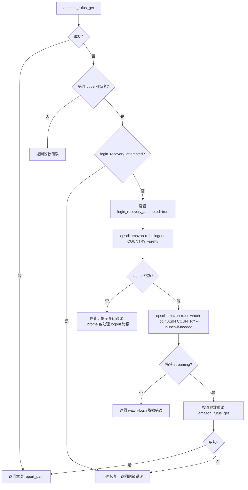
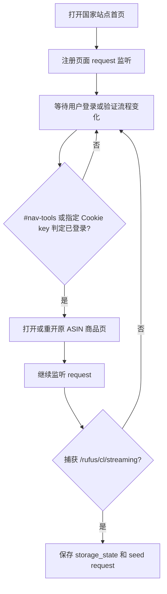

# ops-amazon-rufus 登录恢复增强 Architecture

## 架构结论

本轮不新增 MCP 工具，不把清理登录态能力暴露到 MCP 默认工具面。登录恢复仍由 Skill 编排 CLI 完成：

```text
amazon_rufus_get MCP 失败
  -> Skill 判断错误 code
  -> opscli amazon-rufus logout <COUNTRY> --pretty
  -> opscli amazon-rufus watch-login <ASIN> <COUNTRY> --launch-if-needed
  -> amazon_rufus_get MCP 按原参数重试
```

现有 `watch-login` 的 service 边界继续保留：

```text
CLI command
  -> RufusManager.watch_login(...)
  -> BrowserAttachService.watch_login_and_capture_seed_request(...)
  -> RufusBrowserStateStore.save(...)
```

## 现有组件职责

### MCP 层

文件：

```text
opscli/mcp/tools/amazon_rufus.py
```

职责：

1. 暴露 `amazon_rufus_get`。
2. 调用 `RufusManager.get_backend()`。
3. 写入报告并返回 allowlist 响应。
4. 不接收 CDP、cookie、headers、payload、storage_state、seed request 等敏感入参。

本轮不修改 MCP 工具签名。

### Skill 编排层

文件：

```text
opscli/skills/templates/ops-amazon-rufus/SKILL.md
opscli/skills/templates/ops-amazon-rufus/references/rufus-mcp-workflow.md
.agents/skills/ops-amazon-rufus/SKILL.md
.agents/skills/ops-amazon-rufus/references/rufus-mcp-workflow.md
```

职责：

1. 识别 `amazon_rufus_get` 失败 code。
2. 控制 `login_recovery_attempted` 单次状态。
3. 在恢复前执行 `logout`。
4. 执行 `watch-login`。
5. 保持原问题来源并重试 MCP。
6. 控制最终回复只展示本次 `report_path` 或脱敏错误。

### CLI 清理层

文件：

```text
opscli/amazon_rufus/commands/cli.py
opscli/amazon_rufus/services/manager.py
opscli/amazon_rufus/services/browser_state_store.py
opscli/amazon_rufus/services/browser.py
```

已有命令：

```powershell
opscli amazon-rufus logout <COUNTRY> --pretty
```

清理路径：

```text
RufusManager.logout(...)
  -> RufusBrowserStateStore.delete(country)
  -> BrowserAttachService.clear_owned_profile(cdp_url)
```

默认清理：

1. `~/.config/opscli/amazon-rufus/browser-state-<COUNTRY>.bin`
2. `~/.opscli/chrome-profiles/amazon-rufus-<PORT>`

不清理：

1. `.browser-state-key`
2. 用户默认 Chrome profile
3. opscli auth 凭证
4. MCP API key

### CLI 登录捕获层

文件：

```text
opscli/amazon_rufus/services/browser.py
```

核心方法：

```python
def watch_login_and_capture_seed_request(...):
    """监听登录页，登录后捕获首个 Rufus streaming 请求。"""
```

目标行为：

1. 打开 `marketplace_url`。
2. 注册当前 context 中已有页面的 request 监听。
3. 通过 context 的 `page` 事件注册后续新页面。
4. 循环检测登录态；`#nav-tools` 内容判定或 `sso-state-main` / `at-main` Cookie key 判定满足任一条件时，打开 `page_url`。
5. 捕获商品页上的 `/rufus/cl/streaming`。
6. 捕获成功后返回 `storage_state`、`seed_request` 和 `login_detected` 摘要。

## 新恢复流程

### 主流程



### `watch-login` 内部流程



## 关键设计点

### 1. 为什么清理放在 Skill 编排层

`logout` 是本地破坏性清理动作。放在 Skill 编排层可以让 MCP 工具保持单一职责：只获取 Rufus 回答并写报告。这样也避免新增 destructive MCP 工具，降低 Agent 误调用风险。

### 2. 为什么不只清理 MCP 状态

如果只删除 `browser-state-<COUNTRY>.bin`，opscli-owned Chrome profile 仍可能保持 Amazon 登录态。下一次 `watch-login` 可能直接复用旧身份并重新保存 seed，不符合“失败后重新登录恢复”的意图。因此默认使用 `logout` 完整清理。

### 3. 登录成功如何判断

不再使用 `#nav-link-accountList-nav-line-1` 或 `#nav-link-accountList .nav-line-1`。当前判断应围绕 `#nav-tools` 容器和指定 Cookie key：

1. `#nav-tools` 内容判定：读取 `#nav-tools` 的可见文本，若未出现 i18n 未登录提示，判定登录成功。
2. Cookie key 判定：从 `context.storage_state()["cookies"]` 中检查 Cookie 名称，若存在 `sso-state-main` 或 `at-main` 任一 key，判定登录成功。

两类条件满足任一即可打开商品页。Cookie 判定只使用 Cookie name，不读取、不输出 Cookie value。

`#nav-tools` 的未登录提示必须做 i18n，至少覆盖当前支持站点：

| 站点 | 未登录提示方向 |
| --- | --- |
| US/UK | `sign in`、`signin`、`log in`、`login` |
| 西语页面 | `identifícate`、`identificate`、`identificarse`、`iniciar sesión` |
| DE | `anmelden`、`einloggen` |
| JP | `サインイン`、`ログイン` |
| 中文页面 | `登录`、`登入` |
| 法语页面兜底 | `connexion`、`se connecter` |

因此后续实现应让 `watch-login` 在固定账号子节点缺失时仍能推进：优先读取 `#nav-tools` 全量文本，同时检查 `sso-state-main` / `at-main` Cookie key。任一条件命中后打开或重开商品页，继续捕获 `/rufus/cl/streaming`。

### 4. `logout` 失败的处理

如果 profile 被占用导致 `logout` 失败，Skill 不应自动降级到 `--no-browser-profile`。这是因为降级会保留旧 profile，无法保证恢复是干净登录。默认处理是停止并提示用户关闭对应调试 Chrome 后重试。

## 待修改文件

确认后优先修改文档和测试：

```text
opscli/skills/templates/ops-amazon-rufus/SKILL.md
opscli/skills/templates/ops-amazon-rufus/references/rufus-mcp-workflow.md
.agents/skills/ops-amazon-rufus/SKILL.md
.agents/skills/ops-amazon-rufus/references/rufus-mcp-workflow.md
tests/amazon_rufus/test_core.py
```

代码层如果测试证明现有 `BrowserAttachService.watch_login_and_capture_seed_request()` 已满足首页跳转捕获，只补回归测试和 Skill 文档；不做无意义重构。

## 测试计划

1. Skill 文档测试或快照检查：确认恢复步骤包含 `logout` 且顺序在 `watch-login` 前。
2. Manager 测试：确认 `watch_login()` 仍使用原 ASIN、国家和 `build_product_url()` 生成商品页。
3. Browser service 单元测试：模拟固定账号导航 selector 缺失，但 `#nav-tools` 未出现未登录提示，断言服务会打开商品页。
4. Browser service 单元测试：模拟 Cookie 名称包含 `sso-state-main` 或 `at-main`，断言服务会打开商品页。
5. Browser service 单元测试：模拟 `#nav-tools` 出现 US/UK/DE/JP 未登录提示，断言服务不会误判登录成功。
6. MCP 工具 schema 回归：确认没有新增 `logout`、CDP、cookie、headers、storage_state 等 MCP 参数。
7. 敏感字段检查：CLI 与 MCP 输出仍不包含 cookie、headers、payload_template、storage_state、seed_request。

## 回滚方式

1. 回滚 Skill 文档中 `logout -> watch-login` 的编排规则。
2. 回滚新增回归测试。
3. 如果后续实现阶段触及代码，按最小 diff 回滚对应 service 或 CLI 改动。
