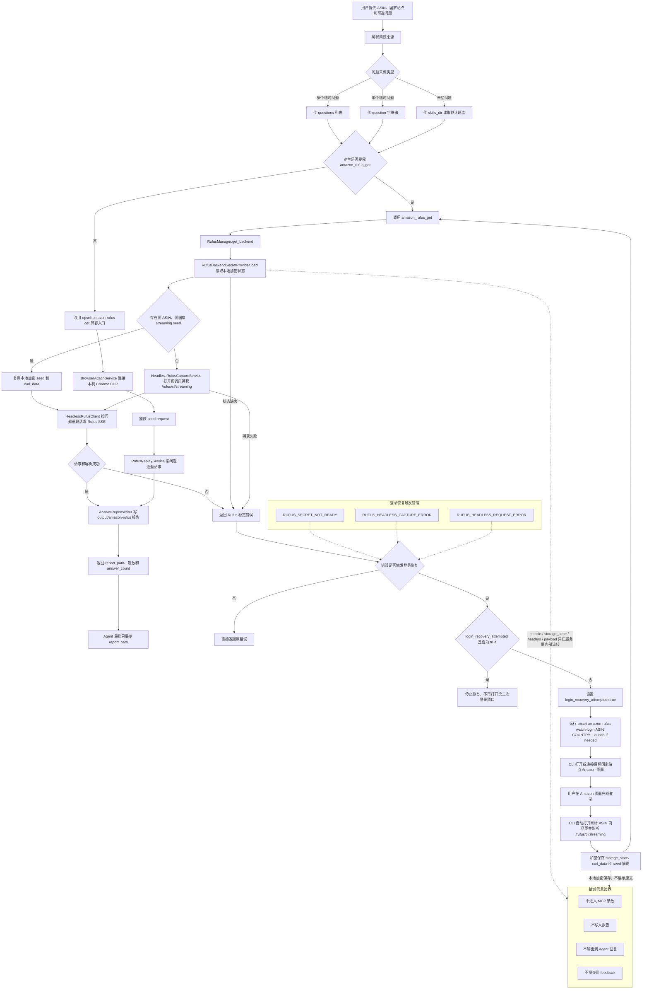

# ops-amazon-rufus MCP 流程图

## 流程图

## 关键边界

1. 默认入口是 `amazon_rufus_get`，MCP 参数只包含 ASIN、国家、问题来源、`skills_dir` 和超时。
2. `RufusManager.get_backend` 负责读取本地加密状态、复用同 ASIN seed 或走 headless 捕获，再逐题请求 Rufus SSE。
3. 只有 `RUFUS_SECRET_NOT_READY`、`RUFUS_HEADLESS_CAPTURE_ERROR`、`RUFUS_HEADLESS_REQUEST_ERROR` 进入登录恢复。
4. 每次 Skill 调用只允许一次登录恢复；恢复后仍失败时直接返回错误，不重复打开登录窗口。
5. 登录恢复使用 `opscli amazon-rufus watch-login <ASIN> <COUNTRY> --launch-if-needed`，由 CLI 自动监听登录并捕获 streaming seed。
6. cookie、localStorage、`storage_state`、headers、payload、完整请求和 upload payload 都不得进入 MCP 参数、报告、Agent 回复或 feedback。
