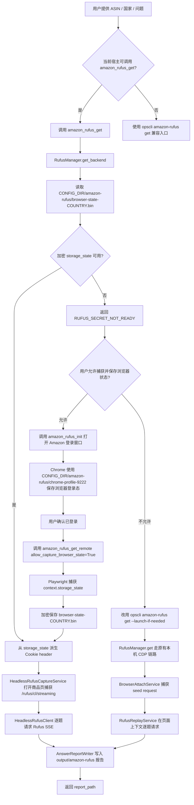

# ops-amazon-rufus Research

## 2026-06-04 MCP 默认获取链路改为 headless 后端研究

### 本轮需求

用户指出当前 `amazon_rufus_get` MCP 服务实现有问题：默认获取 Rufus 时不应该打开或连接可见浏览器页面，也不应该依赖 Chrome CDP 调试窗口。参考实现位于 `E:/code/work/extension/python/app/contexts/rufus/application/account_runner.py`，正确方向应是“无头浏览器捕获上下文 + 纯后端 httpx streaming 请求”，而不是通过 CDP 打开浏览器页获取。

### 当前仓库证据

当前 MCP 调用链如下：

```text
opscli/mcp/tools/amazon_rufus.py:amazon_rufus_get
  -> RufusManager.get
  -> BrowserAttachService.capture_seed_request
  -> playwright.chromium.connect_over_cdp(cdp_url)
  -> page.goto(product_url)
  -> page.on("request") 捕获 /rufus/cl/streaming
  -> RufusReplayService.replay_with_page(page, seed, questions)
```

这说明 `amazon_rufus_get` 默认路径仍是 CDP attach + 可见页面路径。`launch_if_needed`、`new_chrome`、`cdp_url`、`chrome_path` 等参数进一步证明 MCP 默认入口暴露的是本机浏览器控制心智。

仓库中已经存在 headless 能力，但只挂在远程/显式路径：

```text
RufusManager.get_headless
RufusManager.get_remote_from_storage_state
RufusManager.get_remote_from_browser
HeadlessRufusCaptureService
HeadlessRufusClient
RufusBrowserStateStore
```

问题不是“没有 headless 代码”，而是默认 MCP 工具没有把 headless 后端作为首选执行路径。

### 参考实现结论

`E:/code/work/extension/python` 的 runner 链路不是连接用户打开的 Chrome。核心模式是：

1. 从账号 secret 读取 `ParsedCurlRufusRequest(url, headers, cookies, payload_template)`。
2. 调用 `capture_rufus_payload_context_for_asin(asin, cookie, origin_url=...)`。
3. 该函数通过 Playwright headless 访问 Amazon 商品页，拦截 `rufus/cl/streaming` 请求与响应：
   - 从请求 body 提取 `impressionsContext`。
   - 从 SSE response 的 `event: context` 提取 `requestContext`。
   - 捕获失败时可回退固定上下文，避免队列永久卡死。
4. 调用 `build_rufus_payload_from_template(...)`，基于 `payload_template` 覆盖问题、ASIN、页面上下文、impressions/request context。
5. 调用 `query_rufus(...)`，用 `httpx.AsyncClient.stream(POST ...)` 请求 Rufus SSE。
6. 解析 SSE 后只持久化答案，不回显 cookie/header 明文。

该实现的关键不是“打开浏览器给用户登录”，而是使用已保存的 Rufus 账号 secret，在后端 headless 环境中短暂访问详情页补齐上下文，再用 HTTP 客户端请求 Rufus。

### 官方资料核验

Playwright Python 官方文档支持 `browser.new_context(storage_state=...)`，可用 cookies 与 localStorage 初始化上下文。官方文档也说明 Chromium headless 场景会使用独立 headless shell，运行环境需要安装对应浏览器二进制。参考：

- https://playwright.dev/python/docs/api/class-browser
- https://playwright.dev/python/docs/browsers

这与参考实现和当前仓库 `HeadlessRufusCaptureService` 的方向一致：headless browser 只用于后端捕获页面上下文，不需要 CDP 连接用户可见 Chrome。

### 根因判断

根因是 MCP 工具职责边界偏移：

1. `amazon_rufus_get` 的业务名是“获取 Rufus 回答”，但实现默认绑定本机 CDP。
2. `amazon_rufus_get_remote` 名义上是远程/headless，但仍先调用 `get_remote_from_browser()`，会打开 CDP Chrome 捕获 storage_state。
3. 真正接近参考实现的 `get_headless()` 需要 `cookie`、`headers`、`payload_template` 等输入，却没有被设计成 MCP 默认后端路径。
4. 现有 Skill 文档也继续推荐 `amazon_rufus_get(..., launch_if_needed=True)`，进一步强化了错误默认路径。

### 方案判断

推荐采用“后端 Rufus secret + headless context capture + httpx streaming”的默认 MCP 方案：

1. `amazon_rufus_get` 默认不再调用 `RufusManager.get()`，而是调用新的后端/headless 编排入口。
2. 新入口从本地加密状态或 ops 后端获取 Rufus secret，结构对齐参考实现的 `url/headers/cookies/payload_template`。
3. 无头浏览器仅用于访问商品页并捕获 Rufus payload 上下文；不连接 CDP，不打开可见页面，不要求用户在运行中登录。
4. Rufus 问题请求由后端 HTTP client 完成，按问题列表逐题请求 SSE 并解析答案。
5. CDP 相关工具只保留为可选辅助：
   - `amazon_rufus_init`：仅用于人工登录或重新捕获本地账号状态。
   - `amazon_rufus_get_remote`：如继续存在，应明确是“捕获/更新本地授权状态”，不是默认获取路径。
   - `launch_if_needed`、`chrome_path` 不应出现在默认获取推荐流程中。
6. 敏感字段不返回、不写报告、不写 feedback：cookie、headers、storage_state、seed request、payload_template 都只在服务层内部流转。

该方案符合 KISS/YAGNI：复用现有 `HeadlessRufusCaptureService`、`HeadlessRufusClient`、`RufusReplayService.build_payload()` 与参考实现思路，只改默认入口和 secret 输入边界，不新增可见 UI 或 CDP 浏览器管理复杂度。

## 2026-06-04 Skill 主文档瘦身与 references 拆分研究

### 本轮需求

用户要求继续优化 `ops-amazon-rufus` Skill 文档结构：`SKILL.md` 应只保存前置条件、主流程、文件说明等核心功能；Rufus 获取细节、MCP 调用流程、远程授权细则、错误处理规范等应拆分到 `references/` 下。

### 本地现状

当前模板目录与已安装目录都具备 reference 结构：

```text
ops-amazon-rufus/
├── README.md
├── SKILL.md
├── data/
│   ├── VERSION.json
│   └── question_templates.json
└── references/
    ├── question-templates.md
    └── rufus-report-formatting.md
```

但 `SKILL.md` 当前仍承载了过多细节：

1. MCP 工具完整参数列表。
2. `amazon_rufus_get`、`amazon_rufus_get_remote` 的详细调用顺序。
3. Chrome CDP 自动启动排障细节。
4. 远程授权提示文案与拒绝分支。
5. 临时问题、默认题库、拒答重试和输出隐藏规则。
6. 获取实现文件边界。

这些内容都重要，但不应全部留在主 `SKILL.md`。主文档过长会让 Agent 首屏难以判断“先做什么”，也会把稳定前置条件和可演进的工具调用细则耦合在一起。

### 方案判断

推荐采用“主文档索引化 + references 专题化”的最小方案：

1. `SKILL.md` 只保留：
   - Skill 定位。
   - 触发范围。
   - 前置条件。
   - 精简主流程。
   - 数据文件说明。
   - references 索引。
   - 文件边界。
2. 新增 `references/rufus-mcp-workflow.md`：
   - MCP 工具说明。
   - 单题、多题、默认题库模式。
   - Chrome CDP 自动启动与登录初始化。
   - report_path 输出规则。
3. 新增 `references/remote-authorization.md`：
   - 远程授权偏好保存规则。
   - 用户同意后仍需 Amazon 登录确认。
   - 用户回复“已登录”后再调用 `amazon_rufus_get_remote`。
   - 敏感信息禁止输出。
4. 现有 `references/rufus-report-formatting.md` 继续承载报告格式化、拒答改写、输出隐藏规则。
5. 现有 `references/question-templates.md` 继续承载题库数据结构和题库维护说明。

该方案符合 KISS/YAGNI：只调整文档信息架构，不改 MCP 工具 schema，不新增 Python 获取脚本，也不把 Skill 变成执行层。

## 2026-06-04 远程授权偏好记忆研究

### 本轮需求

用户反馈 `ops-amazon-rufus` 当前在获取 Rufus 的中途没有出现远程授权确认，因此 Agent 没有机会调用 `amazon_rufus_get_remote`。新要求是：当流程判断“需要获取 Rufus”时，必须先确定用户是否使用远程授权；若之前已经保存过该选择，则直接按保存值执行，不再反复询问。

### 本地现状

当前仓库已经具备远程授权执行能力，但偏好决策只停留在文档分支：

1. `opscli/mcp/tools/amazon_rufus.py` 已提供 `amazon_rufus_get_remote(..., allow_capture_browser_state=True)`，并在未授权时返回 `RUFUS_REMOTE_CONSENT_REQUIRED`。
2. `opscli/amazon_rufus/services/manager.py` 已有 `get_remote_from_browser()` 与 `get_remote_from_storage_state()`，可以捕获并复用 Playwright `storage_state`。
3. `opscli/skills/templates/ops-amazon-rufus/SKILL.md` 只写了“仅在用户明确同意后才允许调用远程授权工具”，但没有规定在每次 Rufus 获取入口先检查偏好。
4. 当前 Skill 的推荐工作流优先调用 `amazon_rufus_get`，只有在 `RUFUS_LOGIN_REQUIRED` 或 `SEED_REQUEST_NOT_CAPTURED` 后才引导本机登录；这解释了为什么用户中途看不到远程授权询问。
5. 仓库已有 `RufusBrowserStateStore` 用于保存敏感浏览器状态，但没有一个轻量的“远程授权偏好”保存点。

### 外部资料校验

MCP Tools 规范将工具调用定义为模型与外部系统交互的能力，客户端和宿主需要在工具调用前处理用户可理解的确认与拒绝路径。参考：<https://modelcontextprotocol.io/specification/2025-06-18/server/tools>

Playwright Authentication 文档说明认证状态可能包含 cookies 和 localStorage，`storage_state` 文件可能携带可冒充账号的敏感信息，不应提交到仓库。参考：<https://playwright.dev/python/docs/auth>

因此“是否允许远程授权”应作为显式用户偏好保存；“浏览器状态”仍必须由现有加密状态链路保存，二者不能混为一个普通配置项。

### 方案判断

推荐采用“获取前偏好门禁 + 本地偏好文件 + MCP 分支”的最小方案：

1. 在 Skill 工作流中新增“远程授权偏好检查”作为 Rufus 获取前置步骤。
2. 偏好存在时直接复用：`true` 先进入 Amazon 登录检测/确认流程，用户回复已登录后再调用 `amazon_rufus_get_remote(..., allow_capture_browser_state=True)`；`false` 调用 `opscli amazon-rufus get ... --launch-if-needed` 走原有本机 CDP 获取链路。
3. 偏好不存在时，先询问用户是否使用远程授权，并说明会捕获并加密保存当前 Amazon 浏览器状态。
4. 用户回答后保存偏好；若用户确认使用远程授权，应继续打开或检查目标国家站点 Amazon 登录页，请用户完成登录并回复“已登录”，再调用 MCP 获取 Rufus。
5. 后续同一 Skill 流程不再重复询问远程授权偏好，但远程授权路径仍要确认 Amazon 已登录。
6. 偏好只保存布尔值和必要元数据，例如 `country`、`updated_at`、`source`；不得保存 cookie、localStorage 或 `storage_state`。
7. 偏好建议按 `opscli.config.CONFIG_DIR / "amazon-rufus" / "remote-consent.json"` 保存，避免写入仓库、Skill 目录或 `output/`。
8. 本轮不引入账号池、租户级共享偏好、自动撤销策略或复杂 UI；用户需要变更选择时，可通过后续显式命令或删除偏好文件重置。

该方案符合 KISS/YAGNI：只补齐缺失的决策记忆点，复用现有 MCP 与 storage_state 能力，不重写 Rufus 获取链路。

## 2026-06-04 CDP 未启动时自动发现并启动 Chrome 研究

### 本轮需求

用户反馈 Rufus CLI 当前会出现 Chrome CDP 没启动的问题，希望在 `ops-amazon-rufus` Skill 编排中处理该问题：先检查 CDP 状态；如果 CDP 不可用，再搜索用户已安装的 Chrome；最后用 Python 脚本启动带 CDP 的 Chrome，帮助用户继续 Rufus 获取流程。

### 本地现状

当前仓库已经有部分预留能力，但没有完整闭环：

1. `opscli/amazon_rufus/services/browser.py` 的 `BrowserAttachService._wait_for_cdp()` 会请求 `{cdp_url}/json/version`，但只在 `--new-chrome` 或 `init` 已经启动 Chrome 后等待。
2. `_start_new_chrome()` 目前固定通过 PowerShell `Start-Process chrome.exe` 启动，依赖系统 PATH 中存在 `chrome.exe`。
3. `opscli amazon-rufus get` 已有 `--chrome-path` 与 `--launch-if-needed` 参数，但 help 文案仍标注“预留”，`RufusManager.get()` 也没有把这两个参数传给 `BrowserAttachService.capture_seed_request()`。
4. MCP `amazon_rufus_get` 暂未暴露 `chrome_path` 或 `launch_if_needed`，Agent 只能显式传 `new_chrome=True`，不能表达“先探测 CDP，不通再启动”。
5. Skill 文档当前推荐登录/获取流程，但没有对 `CHROME_CDP_UNAVAILABLE` 做专门分支，也没有告诉 Agent 优先尝试自动启动 CDP。

### 外部资料校验

Playwright Python 官方文档说明，`browser_type.connect_over_cdp()` 用于通过 Chrome DevTools Protocol 连接已有 Chromium 浏览器，参数可以是 `http://localhost:9222/` 这类 HTTP endpoint；默认 browser context 可通过 `browser.contexts[0]` 访问。参考：<https://playwright.dev/python/docs/api/class-browsertype#browser-type-connect-over-cdp>

Chrome for Developers 在 2025-03-17 发布的 remote debugging 安全变更说明中明确：从 Chrome 136 开始，`--remote-debugging-port` 和 `--remote-debugging-pipe` 不能再用于默认 Chrome data directory，必须配合 `--user-data-dir` 指向非默认目录。参考：<https://developer.chrome.com/blog/remote-debugging-port>

Chrome DevTools Protocol 文档说明，当 Chrome 设置 `--remote-debugging-port=9222` 后，可通过 `localhost:9222/json/protocol` 等 HTTP endpoint 获取协议信息；这支持当前用 `json/version` 或等价 endpoint 做 CDP 存活探测的做法。参考：<https://chromedevtools.github.io/devtools-protocol/>

### 方案判断

推荐采用“CDP 探测 + Chrome 路径发现 + 独立 profile 启动 + Skill 分支提示”的最小方案：

1. Python 实现不放入 `ops-amazon-rufus` Skill 目录，避免违反 Skill 文件边界；应落在 `opscli/amazon_rufus/services/browser.py` 或新的轻量服务模块，例如 `chrome_cdp.py`。
2. `BrowserAttachService.capture_seed_request()` 增加 `chrome_path` 与 `launch_if_needed` 参数；当 `launch_if_needed=True` 时，先探测 CDP，若不可用再启动 Chrome。
3. Chrome 路径发现只做本机查找，不联网、不安装 Chrome、不修改系统环境变量。
4. Windows 优先搜索常见安装路径、注册表 App Paths、PATH；macOS/Linux 作为跨平台兜底路径处理。
5. 启动参数必须包含 `--remote-debugging-port=<port>`、`--remote-debugging-address=127.0.0.1`、`--user-data-dir=<opscli 专用 profile>`、`--no-first-run`、`--no-default-browser-check`。
6. 仍保留 `--new-chrome` 的显式行为；`--launch-if-needed` 是“已有 CDP 优先，否则启动”的更柔和路径。
7. Skill 中只更新编排规则：遇到 `CHROME_CDP_UNAVAILABLE` 或用户未显式说明已有 CDP 时，优先调用支持自动启动 CDP 的 CLI/MCP 参数，而不是要求用户手写 PowerShell。

该方案符合 KISS/YAGNI：复用现有 CLI 参数和 CDP attach 链路，不新增浏览器管理命令，不引入全局安装/依赖更新，不把采集脚本散落到 Skill 目录。

## 2026-06-04 CLI `-q/--question` 多问题能力核查

### 本轮需求

用户询问 `amazon-rufus` CLI 是否已经支持类似 `-q` 的参数，并希望一次输入多个临时问题来提问，同时不使用默认问题模板。

目标语义可以拆成两层：

1. 用户传入明确问题时跳过 `ops-amazon-rufus/data/question_templates.json` 默认题库。
2. 同一次 CLI 调用允许传入多个临时问题，例如多次 `-q "问题"`，并按传入顺序逐题获取 Rufus 回答。

### 本地现状

当前仓库已经具备“单题跳过题库”的基础能力，但没有完整支持“`-q` 多题”。

已具备：

1. `opscli/amazon_rufus/commands/cli.py` 的 `get` 命令已有 `--question` 选项。
2. `RufusManager._resolve_questions(question=...)` 在 `question is not None` 时会去空白、校验非空，并返回单元素列表 `[question]`。
3. 单题模式不会调用 `QuestionBankService.load_templates()`，因此可以跳过默认问题模板。
4. `RufusReplayService`、报告 writer 和 upload payload 已经面向 `questions: list[str]` 工作，底层逐题 replay 天然支持多问题列表。
5. MCP Tool `amazon_rufus_get` 也已有 `question: str | None` 单题参数。

缺口：

1. CLI 只有 `--question`，没有 `-q` 简写。
2. CLI 参数类型是 `str | None`，不是 `list[str] | None`，不能多次传入。
3. `RufusManager.get()`、`get_headless()`、`get_remote_from_browser()`、`get_remote_from_storage_state()` 只接收单个 `question` 字符串。
4. MCP Tool 当前也只接收单题 `question`，多个临时问题只能由 Agent 逐条调用，或回退默认题库。
5. `ops-amazon-rufus` Skill 当前明确写着“单题模式一次只传入一个问题”，这与本轮目标相冲突。

### 官方资料校验

Typer 官方 Option Name 文档说明，若要保留默认长选项并增加短选项，需要在 `typer.Option()` 中显式声明两个名称，例如 `typer.Option("--user-name", "-n")`。参考：https://typer.tiangolo.com/tutorial/options/name/

Typer 官方 Multiple CLI Options 文档说明，使用 `list[str] | None` 类型的 option 可以让同一选项在一次命令中传入多次并收集所有值。参考：https://typer.tiangolo.com/tutorial/multiple-values/multiple-options/

因此本轮推荐用 Typer 原生能力实现多问题参数，不需要自定义字符串分隔符、JSON 参数或问题文件。

### 方案判断

推荐采用“保留 `--question` + 新增 `-q` + 允许多次传入”的最小方案：

```powershell
opscli amazon-rufus get B0TEST1234 US `
  -q "这个商品适合送礼吗？" `
  -q "差评主要集中在哪些方面？" `
  -q "这个商品更适合什么使用场景？"
```

设计要点：

1. CLI 层将 `question` 参数改为 `list[str] | None`，选项名保留 `--question` 并新增 `-q`。
2. Manager 层新增内部 `questions: list[str] | None` 参数，保留现有 `question: str | None` 兼容旧调用。
3. 问题来源优先级：显式临时问题列表优先；无临时问题时才读取默认题库。
4. 多题模式应一次捕获 seed request，并在同一运行里按传入顺序 replay 多个问题，避免用户多次启动浏览器。
5. 空白问题应稳定报错，不静默过滤后继续执行，避免用户误以为问题被执行。
6. CLI 与 MCP 的能力需要对齐：MCP 可新增 `questions: list[str] | None`，同时保留 `question` 单题兼容。
7. Skill 文档同步改为：用户给出多个临时问题时，优先一次性传 `questions` 或多次 `-q`，不再建议逐条调用。

该方案符合 KISS/YAGNI：复用底层已有 `questions` 列表执行链路，只扩展参数解析和问题来源选择；不新增命令、不引入问题文件、不实现复杂分隔语法。

## 2026-06-03 登录缺失时远程获取授权与 Rufus MCP 研究

### 本轮需求

用户要求调整 Rufus CLI Skill 的登录失败体验：当系统发现用户未登录 Amazon 时，不再只进入人工登录中断，而是先询问用户是否同意使用远程 Rufus 获取方式。该方式需要用户提供一个干净、未绑定信用卡的 Amazon 账户；该账户仅用户本人使用，不共享给其他用户。

分支规则：

1. 用户不同意远程获取时，继续走现有本机 Chrome/CDP 流程；系统需提示本机获取期间可能出现卡顿。
2. 用户同意远程获取时，仍打开 Amazon 页面并检查登录状态；用户完成登录后，系统获取该站点的 cookie 和 localStorage，保存到本地，再调用 Rufus MCP 工具。
3. Rufus MCP 工具通过传入 cookie 和 localStorage 获取 Rufus 信息；获取完成后继续原有 Skill 流程，包括问题选择、报告生成、拒答改写和格式化输出。

### 本地现状

当前 `open-opscli` 的 Rufus 链路仍以本机浏览器为主：

1. `opscli/amazon_rufus/commands/cli.py` 的 `get` 命令只透传 `--question`、Chrome/CDP 参数和报告输出参数，没有远程获取 consent 参数或交互提示。
2. `RufusManager.get()` 通过 `BrowserAttachService.capture_seed_request()` 捕获 `/rufus/cl/streaming` seed request，再在页面上下文里 replay。
3. 当答案为空或未捕获 seed request 时，现有逻辑返回 `RUFUS_LOGIN_REQUIRED` 或 `SEED_REQUEST_NOT_CAPTURED`，Skill 文档要求用户登录后说“继续”。
4. 当前没有保存 Amazon cookie/localStorage 的本地状态文件，也没有 Rufus MCP tool 注册代码；`opscli/mcp/tools/amazon.py` 目前未注册 Rufus 工具。

### 官方资料校验

Playwright 官方 Authentication 文档说明，Web 应用认证状态可能保存在 cookies、localStorage 或 IndexedDB 中，并可通过 `browser_context.storage_state()` 取出并复用。官方同时提醒，浏览器状态文件可能包含可冒充用户或测试账号的敏感 cookies/headers，不应提交到仓库。

Playwright `BrowserContext.storage_state()` API 文档显示，返回结构包含 `cookies` 与 `origins[].localStorage`，并可选择保存到文件。这正好覆盖用户要求的 cookie 与 localStorage 捕获，不需要手写浏览器脚本逐项拼接。

MCP 官方工具规范说明，工具调用应有明确参数 schema；对于安全和信任场景，客户端应向用户展示确认提示并让用户可拒绝敏感工具调用。这与本轮必须先询问用户是否同意远程获取一致。

Amazon 官方资料显示，Rufus 是面向商品详情、评论和社区问答的购物助手；Amazon 在 2026 年将 Rufus 与 Alexa+ 能力组合到 Alexa for Shopping。仓库命令和 Skill 名称继续保持 `ops-amazon-rufus`，本轮只改获取链路，不做命名迁移。

参考：

- https://playwright.dev/python/docs/auth
- https://playwright.dev/python/docs/api/class-browsercontext#browser-context-storage-state
- https://modelcontextprotocol.io/specification/2025-06-18/server/tools
- https://www.aboutamazon.com/news/retail/how-to-use-amazon-rufus
- https://www.aboutamazon.com/news/retail/alexa-for-shopping-ai-assistant

### 方案判断

采用“显式 consent + Playwright storage_state + 本地加密保存 + Rufus MCP 获取 + 原报告链路复用”的最小方案：

1. 不替换现有本机 Chrome/CDP 流程；拒绝远程获取时完全沿用当前流程。
2. 同意远程获取后，使用 Playwright `storage_state()` 作为 cookie/localStorage 的标准载体，避免重复发明状态格式。
3. 状态文件不得写入 `output/`、`.agents/skills/` 或仓库目录；应保存在 `opscli.config.CONFIG_DIR` 下，并按现有凭证存储策略做加密或等价保护。
4. Rufus MCP 工具返回结构应与 `RufusManager.get()` 兼容，确保 `AnswerReportFormatter`、拒答改写和报告落地不重复实现。
5. 不做账号池、多用户共享、自动注册 Amazon 账号、信用卡校验或支付能力；“干净且未绑定信用卡”只作为用户 consent 前置说明和使用约束。

该方案符合 KISS/YAGNI：只在未登录场景增加一个远程获取分支，保留现有成功路径和报告结构；敏感状态用官方 Playwright storage_state 表达，避免自定义 cookie/localStorage 格式造成维护成本。

## 2026-06-03 Python 端 headless 获取 Rufus 数据研究

### 本轮需求

用户要求修改 Rufus CLI，并先提供 Python 端获取 Rufus 数据的调用方法。参考实现位于 `E:/code/work/extension/python`，其核心不是连接用户已打开的 Chrome，而是用 Playwright headless browser 访问 Amazon 商品页，捕获 `rufus/cl/streaming` 请求与响应上下文，再用该上下文构造 Rufus 问题请求。

### 本地现状

当前 `open-opscli` 的 Rufus 获取链路是 CDP attach 模式：

1. `opscli/amazon_rufus/services/browser.py` 的 `BrowserAttachService` 使用 `playwright.chromium.connect_over_cdp(cdp_url)` 连接固定 Chrome 调试端口。
2. `amazon-rufus init <country>` 打开登录窗口，要求用户在可见 Chrome 中完成 Amazon 登录。
3. `amazon-rufus get <asin> <country>` 打开商品页并监听首个 `/rufus/cl/streaming` request。
4. `RufusReplayService.replay_with_page()` 在页面上下文中 `fetch()` 重放问题，复用浏览器登录态。

该链路适合本地人工登录，但不是纯 Python/headless 获取方式。

### 外部参考实现结论

`E:/code/work/extension/python` 的关键调用链如下：

1. `app/contexts/rufus/infrastructure/amazon_rufus/payload_builder.py`
   - `capture_rufus_payload_context_for_asin(asin, cookie, origin_url=None)`
   - 调用 `get_playwright_target_request_captor().capture(...)`
   - 返回 `impressions_context`、`request_context`、`final_page_url`
2. `app/contexts/web_capture/infrastructure/playwright_captor.py`
   - `_BrowserManager.get_browser()` 使用 `async_playwright().start()` 和 `playwright.chromium.launch(headless=True)`。
   - `capture()` 新建 browser context，并用 `context.add_cookies()` 注入 Amazon cookie。
   - `page.route("**/*", handle_route)` 拦截请求，命中 `rufus/cl/streaming` 后保存 request body、headers、response body excerpt。
3. `build_rufus_payload_from_template(...)`
   - 基于保存的 `payload_template` 覆盖 `queryContext.query`、ASIN metadata、`impressionsContext` 和 `requestCancellationTokens`。
4. `app/contexts/rufus/infrastructure/amazon_rufus/client.py`
   - `query_rufus(...)` 用 `httpx.AsyncClient.stream("POST", ...)` 请求 `/rufus/cl/streaming`。
   - SSE events 经过 `text_extractor` 输出 Rufus 文本答案。

### 官方资料校验

Playwright 官方 Python API 说明 `browserType.launch()` 用于启动浏览器实例，`headless` 选项默认值为 `true`；这与外部项目 `_BrowserManager` 的 headless browser 设计一致。Playwright Network 文档也说明可通过 `page.on("request")` / `page.on("response")` 监听网络事件，并通过 `page.route()` 处理请求。

参考：

- https://playwright.dev/python/docs/api/class-browsertype#browser-type-launch
- https://playwright.dev/python/docs/network#network-events
- https://playwright.dev/python/docs/network#handle-requests

### 方案判断

本轮应新增 Python 端 headless 获取入口，但不应替换现有 CDP attach 链路：

1. 保留现有 `RufusManager.get()` 和 `opscli amazon-rufus get` 的可见 Chrome 登录模式，避免破坏已验证流程。
2. 新增独立 Python 方法，例如 `RufusManager.get_headless(...)`，接收 `streaming_url`、`headers`、`cookie`、`payload_template` 等来自 Copy as cURL 或上游账号配置的数据；`cookie` 是必传的 Amazon 登录态输入。
3. headless 方法内部先将 `cookie` 注入 Playwright browser context，访问商品页并抓动态上下文，再用同一个 `cookie` 发起 Rufus streaming 请求，最终返回与现有 `get()` 相同的数据结构，便于复用 `AnswerReportFormatter`。
4. 不在 CLI 中直接暴露 `--cookie` 这类敏感参数。若后续需要 CLI 调用，应优先使用 `--curl-file` 或 `--secrets-file` 读取本地文件。
5. 测试只 mock Playwright/httpx，不访问真实 Amazon，不读取真实浏览器 profile。

### 拟定调用方法

首选 Python SDK 调用：

```python
from opscli.amazon_rufus.services.manager import RufusManager

data = RufusManager().get_headless(
    asin="B0TEST1234",
    country="US",
    question="这个商品适合送礼吗？",
    streaming_url="https://www.amazon.com/rufus/cl/streaming?tabId=...",
    headers=headers,
    cookie=amazon_cookie,
    payload_template=payload_template,
    timeout_seconds=90,
)
```

其中 `amazon_cookie` 是完整 Amazon Cookie header 字符串，来自用户 Copy as cURL 解析结果或上游账号配置。实现时应参考外部 `capture_rufus_payload_context_for_asin(asin, cookie, origin_url)`：先用该 `cookie` 在 headless browser 中建立 Amazon 登录态并捕获 `rufus/cl/streaming` 上下文，再用同一个 `cookie` 请求 Rufus 数据。方法返回结构与当前 `RufusManager.get()` 保持兼容，包含 `asin`、`country`、`questions`、`answers`、`seed_request` 或等价捕获上下文。

## 2026-05-14 Rufus 拒答检测与问题改写研究

### 本轮反馈

用户补充说明：本轮不只是校验空白问题，还要在拿到 Rufus 答案后分析答案是否属于拒绝回答。如果被拒绝回答，需要在保持原有语义的前提下修改问题，并且改写后的问题限制在 180 字以内。

2026-05-14 新增约束：用户进一步要求 `ops-amazon-rufus` Skill 在拒答后重新生成问题时，改写后的问题必须使用中文。该规则应作为 Skill 执行规范中的硬约束，而不是仅作为示例文案。

### 本地链路观察

当前最合适的接入点不是 CLI 参数解析层，而是 Rufus replay 后的答案解析层：

1. `RufusReplayService.replay_with_page()` 已经逐题调用 `page.evaluate()` 并把 SSE 文本交给 `RufusParserService.parse()`。
2. `RufusParserService.parse()` 返回 `AnswerData`，包含 `text`、`summaryText`、`blocks`、`isSuccess` 和 `threadId`。
3. `AnswerReportFormatter` 基于 `answers[]` 和 `questions[]` 输出报告标题和正文。
4. 因此拒答检测应在每次 `AnswerData` 生成后执行：先判断回答是否拒答，再决定是否改写问题并重试。
5. 单题模式与题库模式都应走同一套拒答处理，避免只有 `--question` 才具备重试能力。

### 拒答判断结论

首版采用保守启发式，不引入外部模型依赖：

1. 检测范围包括 `answer.text`、`answer.summaryText` 和可转文本的 `answer.blocks`。
2. 命中明确拒答短语时判定为拒答，例如“我无法回答”“不能提供”“无法提供”“不方便回答”“I can't answer”“I cannot answer”“I'm unable to”“not able to assist”。
3. 不把普通失败、超时、空答案直接等同于拒答；这些仍按现有失败逻辑处理。
4. 检测逻辑应集中在独立服务中，例如 `QuestionRefusalService`，避免把字符串规则散落在 replay 或 formatter 中。

### 问题改写结论

首版改写策略应满足四个约束：

1. 保持原问题的业务语义，不改变目标 ASIN、比较对象、评价维度或用户意图。
2. 改写后问题长度限制在 180 字以内；建议按 Python `len()` 对去空白后的 Unicode 字符串计数。
3. 改写后的问题必须使用中文，即使原问题包含英文，也应在保留商品对象、比较对象和分析维度的前提下转写为中文问句。
4. 每个问题最多自动改写并重试 3 次；加上原问题首次执行，单题最多 4 次尝试，避免 Rufus 连续拒答时陷入无限循环或生成大量不可控请求。

推荐改写原则：

1. 去掉容易触发拒答的命令式或敏感化表达，例如“必须”“保证”“是否违规”等绝对化措辞。
2. 保留核心对象和分析维度，例如“适合送礼”“差评风险”“广告投放价值”。
3. 改成面向商品公开信息的中性问法，例如“基于商品页面和公开评价，分析该商品是否适合送礼，并说明理由”。
4. 如果原问题是英文或中英混合，应将核心意图翻译/转写为自然中文，避免直接生成英文重试问题。
5. 如果改写结果仍超过 180 字，优先压缩修饰语和重复背景，而不是截断核心业务词。

### 2026-05-14 外部资料补充

Amazon 官方资料说明 Rufus/Alexa for Shopping 的核心场景是回答商品问题、基于商品页面、评论、社区问答和目录信息辅助购买决策。该定位支持本轮采用“中文、中性、基于商品页面和公开评价”的改写方向。

官方资料同时显示 Amazon 已在 2026-05-13 将 Rufus 重新命名为 Alexa for Shopping。当前仓库中的 CLI、Skill、模块名仍为 `ops-amazon-rufus`，本轮仅增加拒答后中文改写规则，不做命名迁移，避免扩大影响面。

参考：

- https://www.aboutamazon.com/news/retail/how-to-use-amazon-rufus
- https://www.aboutamazon.com/news/retail/amazon-agentic-ai-gen-ai-shopping/
- https://www.aboutamazon.com/news/retail/alexa-for-shopping-ai-assistant

### 方案判断

采用“拒答检测 + 语义改写 + 最多 3 次重试”的最小方案：

1. 空白 `--question` 仍应提前报错，但这只是输入校验，不是本轮核心。
2. 每个问题先按原文执行一次。
3. 若回答被判定为拒答，则生成 180 字以内的改写问题，并立即用同一 seed/page 上下文重试；最多重试 3 次。
4. 若 3 次改写重试后仍拒答，则保留最后一次结果，并在结构化数据与报告中标记“已改写 3 次后仍拒答”。
5. 输出数据增加拒答与改写元信息，例如 `refusalDetected`、`refusalRetryApplied`、`originalQuestion`、`rewrittenQuestion`、`attemptCount`。
6. 报告中默认展示最终答案；发生改写时补充一行改写说明，不展示完整内部请求或 seed 数据。

该方案符合 KISS/YAGNI：不新增多轮自我优化、不引入外部 LLM、不改变 Chrome/seed/replay 主链路，只在单题执行的结果判定后增加一次可审计的重试。

## 2026-05-14 CLI 传入问题与题库双模式研究

### 本轮需求

用户要求修改 `amazon-rufus` CLI 和 `ops-amazon-rufus` Skill：获取 Rufus 答案需要支持两种方式。

1. 题库模式：继续读取 `ops-amazon-rufus/data/question_templates.json`，按模板问题逐题获取答案。
2. 单题模式：调用 CLI 时直接传入一个问题，只获取该问题对应的 Rufus 答案。

Skill 文档也要同步调整，避免 Agent 在用户已经给出明确问题时仍强制跑完整题库。

### 本地链路观察

当前代码路径：

- `opscli/amazon_rufus/commands/cli.py`
- `opscli/amazon_rufus/services/manager.py`
- `opscli/amazon_rufus/services/question_bank.py`
- `opscli/amazon_rufus/services/replay.py`
- `opscli/skills/templates/ops-amazon-rufus/SKILL.md`
- `opscli/skills/templates/ops-amazon-rufus/README.md`

现状结论：

1. CLI `get` 只有必填位置参数 `asin`、`country`，没有问题参数。
2. `RufusManager.get()` 总是通过 `QuestionBankService.load_templates()` 读取题库，再把模板问题扁平化成 `questions`。
3. 题库文件缺失或为空会抛出 `QuestionBankNotReadyError`，因此当前即使用户只想问一个问题，也必须先安装并升级题库。
4. `RufusReplayService.replay_with_page()` 已经接收 `questions: list[str]`，底层重放链路天然支持传入任意问题列表。
5. `AnswerReportFormatter` 从 `data["questions"]` 或 `upload_payload.records[0].questions` 提取题目标题，因此只要 `data["questions"]` 是单题列表，报告天然可以复用。
6. 现有测试已覆盖 CLI 写报告、manager 编排、replay 请求构造和 formatter 标题提取；本轮应补充单题模式测试，而不是重写底层 replay。

### 外部资料结论

Typer 官方文档说明，可选 CLI argument 会在 help 中显示为带方括号的位置参数；这适合兼容式扩展，但带空格的问题文本必须整体加引号，且会改变 `get <asin> <country>` 后续位置参数语义。参考：https://typer.tiangolo.com/tutorial/arguments/optional/

Typer 官方参数参考说明，CLI option 可以通过 `--name` 这类显式别名接收值，且 options 通常可省略；这更适合新增 `--question`，因为它不会改变既有两个位置参数的心智。参考：https://typer.tiangolo.com/reference/parameters/

Typer 还支持多次传入同一个 option 并获得 `list[str]`，说明后续如果要支持多条临时问题，可以扩展为多个 `--question`，但本轮用户只要求“传入参数问题”这一种直接问答方式，不应提前实现多题参数。参考：https://typer.tiangolo.com/tutorial/multiple-values/multiple-options/

### 方案判断

采用“显式 `--question` 单题模式 + 默认题库模式”的最小方案：

1. CLI 增加 `--question` 选项，而不是新增第三个位置参数。
2. 未传 `--question` 时保持现有题库模式，继续要求本地题库就绪。
3. 传入 `--question` 且去空白后非空时，跳过 `QuestionBankService.load_templates()`，直接使用 `[question]` 作为问题列表。
4. 单题模式仍复用 Chrome attach、seed request 捕获、Rufus replay、答案解析、报告落地和 `upload_payload` 构造。
5. 空字符串或全空白 `--question` 应视为无效输入，返回稳定错误；不应回退到题库模式，避免用户误以为执行了指定问题。
6. `data` 中增加轻量字段标识来源，例如 `question_source: "template" | "cli"`，便于报告与排障理解；现有字段 `questions` 保持不变。
7. Skill 文档同步为：用户提供明确问题时执行 `opscli amazon-rufus get <asin> <country> --question "<问题>" --new-chrome`；用户要求默认 Rufus 分析或未给问题时执行题库模式。

该方案符合 KISS/YAGNI：不新增命令、不新增问题文件、不引入多题临时参数、不改 replay 协议，只在 manager 的问题来源选择处增加一个清晰分支。

## 2026-05-14 问题模板 reference 拆分与保存接口研究

### 本轮需求

用户要求修改 `amazon-rufus` 相关 CLI / Skill 文档结构：

1. 将问题模板的获取拆到独立 `references` 文档中，不再和 Rufus 回答获取流程写在一起。
2. 独立 reference 文件后续只承载问题模板相关内容。
3. 问题模板能力不止获取，还应覆盖保存能力。
4. 保存接口参考 `E:/code/work/workspace-op/operation-frontend/packages/operation-frontend-core/src/pages/tools/index/opencalw-management/index.vue` 间接挂载的管理页调用链。

### 本地链路观察

当前 `ops-amazon-rufus` Skill 目录只有一个报告格式化 reference：

- `opscli/skills/templates/ops-amazon-rufus/README.md`
- `opscli/skills/templates/ops-amazon-rufus/SKILL.md`
- `opscli/skills/templates/ops-amazon-rufus/references/rufus-report-formatting.md`
- `opscli/skills/templates/ops-amazon-rufus/data/question_templates.json`

现状问题：

1. `README.md` 与 `SKILL.md` 主要服务 `amazon-rufus init/get` 使用流程，问题模板升级说明混在回答获取流程里。
2. `references/rufus-report-formatting.md` 已经是答案报告格式化规范，不应承载题库接口。
3. `QuestionBankService` 只读取 `.agents/skills/ops-amazon-rufus/data/question_templates.json`，不负责远端保存。
4. `SkillsUpdater.upgrade_ops_amazon_rufus()` 当前只调用默认题库读取接口，将返回的 `items` 写入本地 `question_templates.json`。
5. 内置模板 `data/question_templates.json` 现在是空 `items`，真实题库依赖 `opscli skills upgrade ops-amazon-rufus` 同步。

前端真实调用链：

1. `opencalw-management/index.vue` 只挂载 `QuestionTemplatesTab` 和 `ConfigTab`，默认激活 `question-templates`。
2. `QuestionTemplatesTab.vue` 负责列表刷新、新增模板、修改描述、配置问题列表、删除模板。
3. `QuestionTemplateDescriptionDialog.vue` 调用创建与更新模板描述 mutation。
4. `QuestionTemplateQuestionsDialog.vue` 调用追加问题、整体保存问题列表、单题更新、单题删除。
5. `project/tools/api/modules/opencalw.ts` 是接口定义源头；`project/tools/services/opencalw.ts` 只是在 Vue Query 层封装缓存失效。

前端接口清单：

| 能力 | 方法 | 路径 | 请求体 |
|---|---|---|---|
| 列出模板 | `GET` | `/admin/opencalw/question-templates` | 无 |
| 获取模板详情 | `GET` | `/admin/opencalw/question-templates/{templateId}` | 无 |
| 新增模板 | `POST` | `/admin/opencalw/question-templates` | `{ "description": "..." }` |
| 修改模板描述 | `PATCH` | `/admin/opencalw/question-templates/{templateId}` | `{ "description": "..." }` |
| 删除模板 | `DELETE` | `/admin/opencalw/question-templates/{templateId}` | 无 |
| 整体保存问题列表 | `PUT` | `/admin/opencalw/question-templates/{templateId}/questions` | `{ "questions": ["..."] }` |
| 追加问题 | `PUT` | `/admin/opencalw/question-templates/{templateId}/questions/append` | `{ "questions": ["..."] }` |
| 修改单题 | `PUT` | `/admin/opencalw/question-templates/{templateId}/questions/{questionId}` | `{ "text": "..." }` |
| 删除单题 | `DELETE` | `/admin/opencalw/question-templates/{templateId}/questions/{questionId}` | 无 |
| 获取默认题库 | `GET` | `/opencalw/default-question-templates` | 无 |

`extensionInterceptors.ts` 会在请求前将 data/params 转为 snake_case，并在响应后将 `data` 转为 camelCase。因此前端类型是 `preferredVersionIndex`、`questionsCount`、`createdAt`、`updatedAt`，但本地题库文件与后端 wire JSON 应继续按 snake_case 文档化，例如 `preferred_version_index`、`questions_count`、`created_at`、`updated_at`。

### 外部资料结论

同类 API 文档有两个可借鉴点：

1. GitHub REST 的 repository contents 文档按资源聚合 get / create-or-update / delete 操作，并为每个操作列出 path、参数、状态码和示例；这适合本轮把“问题模板”作为独立资源 reference 维护。参考：https://docs.github.com/en/rest/repos/contents?apiVersion=2022-11-28
2. OpenAPI / Swagger 支持用 tags 对 operations 分组，Swagger UI 会按 tag 展示操作；这说明“问题模板”应作为独立文档分组，而不是混在 `amazon-rufus get` 回答流程里。参考：https://swagger.io/docs/specification/v3_0/grouping-operations-with-tags/

### 方案判断

采用“新增独立 reference，现有主文档只保留跳转”的最小方案：

1. 新增 `opscli/skills/templates/ops-amazon-rufus/references/question-templates.md`。
2. 新文件只写问题模板数据模型、获取接口、保存接口、保存工作流、本地题库文件关系和注意事项。
3. `README.md` 与 `SKILL.md` 只保留题库升级和 MCP 编排入口，并链接到 `references/question-templates.md`。
4. 不把 Rufus 回答获取、Chrome 登录、seed request、报告格式化写入新 reference。
5. 不新增 CLI 子命令，不改变 `amazon-rufus get` 运行链路。
6. 不让 Skill 脚本直接调用后端接口；如后续需要命令化保存，应新增正式 `opscli` 命令入口，而不是在 Skill 文档里指导直接 `curl` 生产接口。

该方案符合 KISS/YAGNI：本轮需求是文档结构和接口调用说明，不扩展题库管理运行能力；保存接口先精确文档化，避免把管理端 mutation 误写成回答获取流程的一部分。

## 2026-05-07 登录前置提示与 streaming 捕获失败研究

### 本轮需求

用户要求为 `ops-amazon-rufus` 增加两处登录引导：

1. 安装 `ops-amazon-rufus` 后，提示用户该 Skill 需要先登录 Amazon 才能使用。
2. 获取 Rufus 答案时，如果 Python 采集脚本没有拦截到 `/rufus/cl/streaming` 请求，必须报错，并明确让用户执行 `opscli amazon-rufus init <country>` 去登录 Amazon。

### 本地链路观察

相关路径：

- `opscli/skills/commands/cli.py`
- `opscli/skills/services/manager.py`
- `opscli/skills/domain/models.py`
- `opscli/amazon_rufus/services/browser.py`
- `opscli/amazon_rufus/domain/exceptions.py`
- `.agents/skills/ops-amazon-rufus/SKILL.md`
- `opscli/skills/templates/ops-amazon-rufus/README.md`

当前行为：

1. `opscli skills install <name>` 成功后输出稳定 JSON：`success`、`command`、`data`、`error`。
2. `SkillBatchInstallResult.to_dict()` 只包含 `name`、`version`、`installed_paths`，没有 Skill 专属安装后提示。
3. `ops-amazon-rufus` 的 Skill 文档已经说明使用前必须登录对应国家站点，并推荐 `opscli amazon-rufus init <country>`。
4. `BrowserAttachService.capture_seed_request()` 未捕获 `/rufus/cl/streaming` 时抛出 `SeedRequestNotCapturedError`。
5. 现有错误码为 `SEED_REQUEST_NOT_CAPTURED`，错误信息只提示“请确认已登录 Amazon 且站点支持 Rufus”，没有明确给出下一条命令。

### 外部资料结论

同类 CLI 对登录前置条件的处理有三个可借鉴点：

1. GitHub CLI 把认证作为显式命令 `gh auth login`，并在文档中说明认证完成后凭证会写入系统凭证存储或回退文件。参考：https://cli.github.com/manual/gh_auth_login
2. Stripe CLI 安装文档在安装步骤后紧接着要求执行 `stripe login`，并输出浏览器确认链接和 pairing code。参考：https://docs.stripe.com/stripe-cli/install
3. AWS CLI 的 `configure` 命令在首次配置时提示用户输入凭证，同时文档也提示可通过 `aws login` 使用 Console session 传递临时凭证。参考：https://docs.aws.amazon.com/cli/latest/reference/configure/
4. Amazon 官方说明 Rufus 可在 Amazon Shopping app 和 desktop 上使用，并依赖 Amazon 购物页面中的 Rufus 入口。参考：https://www.aboutamazon.com/news/retail/how-to-use-amazon-rufus

这些产品共同特点是：登录不是隐式失败后让用户猜，而是通过安装后文档、专门命令或失败提示给出明确下一步。`ops-amazon-rufus` 因依赖浏览器页面登录态，不应尝试在 CLI 内保存 Amazon 凭证；正确路径是把登录动作显式收敛到 `amazon-rufus init <country>`。

### 方案判断

采用“安装结果内嵌 next steps + 捕获失败明确 init 指令”的最小方案：

1. `skills install ops-amazon-rufus` 成功时，在 JSON `data` 中增加 Amazon 登录前置提示和下一步命令。
2. 非交互安装不额外输出 JSON 之外的散文本，避免破坏脚本解析。
3. 交互安装可以复用同一份 `data` 结构；是否额外打印人类可读行由实现阶段再按现有 TUI 输出风格最小处理。
4. 其他 Skill 的安装输出不增加 Rufus 专属字段。
5. `SeedRequestNotCapturedError` 的 message 明确包含 `opscli amazon-rufus init <country>`。
6. 不做自动登录、不自动打开 `init`、不检测 Amazon 用户身份、不读取或保存 Amazon 凭证。

### 研究结论

本轮应只改两个用户可见边界：

1. 安装成功后的 `ops-amazon-rufus` 专属 `next_steps`。
2. 未捕获 `/rufus/cl/streaming` 时的错误文案。

不应改变 `get` 的核心采集链路、题库读取、Rufus replay、报告格式化或上传 payload。该方案符合 KISS/YAGNI：把失败后的“下一步”从隐含经验变成稳定契约，不扩展认证体系。

## 2026-04-30 新增输出落地文件研究

### 触发背景

用户在实际运行 `amazon-rufus get` 时已尝试扩大 PowerShell `RawUI.BufferSize`，但长报告仍可能被 IDE 终端、宿主工具返回长度或 Agent 输出窗口截断。该问题不属于 Rufus parser 或 formatter 主动删减，而是 stdout 展示链路的承载边界。

### 本地链路观察

当前实现中，`commands/cli.py` 成功路径通过 `AnswerReportFormatter().format_data(data)` 生成完整报告，然后直接 `typer.echo()` 到 stdout。该链路有两个问题：

1. 报告内容仍完整存在于 CLI 进程内，但 stdout 消费方可能截断。
2. Agent 执行 CLI 后只能读取工具返回文本，无法保证拿到完整 stdout 历史。

### 结论

本轮应把成功报告从 stdout 改为运行时文件落地：

1. 输出目录固定为当前运行目录下的 `output/amazon-rufus`。
2. 文件名使用 `<ASIN>-YYYYMMDD-HHMMSS.md`，时间精确到秒。
3. 文件内容仍是现有 formatter 生成的 Markdown-like 答案报告。
4. stdout 只输出保存路径和状态，不再承载完整报告正文。
5. 不新增可配置 `--output` 参数，避免扩大命令心智负担。

该方案符合 KISS/YAGNI：保留现有 formatter，新增最小文件写入边界；不引入分页器、剪贴板、临时文件清理协议或交互式查看器。

## 2026-04-30 新增前端渲染对齐输出格式化研究

### 本轮需求

用户提供 `output/1.txt` 作为 `opscli amazon-rufus get` 的终端输出样例，并要求参考 `E:\code\work\operation-frontend - 1\packages\operation-frontend-core\src\project\tools\components\asinRufusView` 中的前端渲染方式，对 CLI 输出数据进行格式化。若需要其他参数，可参考 CLI 输出前拿到的全量数据结构。

样例文件使用 UTF-8 读取后有 1024 行，首行从 `4. 易用性` 开始，说明当前可见内容本身已经不是完整回答开头；同时存在以下可读性问题：

1. 连续空行过多，很多段落被拉开成“单行文本 + 多个空行”。
2. 表格内容退化为一列一行，例如“问题 / 影响 / 严重程度”和具体值被拆散；前端已有结构化表格渲染模型可参考。
3. 项目符号存在独立成行的情况，例如 `•` 单独一行，真正内容在下一行；前端已有 list block 合并模型可参考。
4. 当前 CLI 已隐藏 `seed_request` 与 `upload_payload`，但 `_emit_answers_text()` 只是 `strip()` 后拼接文本，没有格式化边界。
5. 终端滚动缓冲或宿主输出窗口导致的截断属于运行环境限制，本轮不处理。

### 当前 CLI 代码结论

相关路径：

- `opscli/amazon_rufus/commands/cli.py`
- `opscli/amazon_rufus/services/parser.py`
- `opscli/amazon_rufus/domain/models.py`
- `tests/amazon_rufus/test_core.py`

当前输出链路：

1. `RufusParserService.parse()` 从 SSE 中产出 `AnswerData.text`。
2. `RufusManager.get()` 将 `AnswerData` 转为 `answers[]`。
3. CLI `_emit_answers_text()` 遍历 `answers[]`，直接输出每个 `text.strip()`。

因此本轮格式化不应放进 parser。parser 的职责是还原 Rufus 原始回答；格式化属于 CLI 展示层，应新增独立 report formatter，读取 CLI 输出前的完整 `data`，避免污染内部结构化数据和上传 payload。

### 前端渲染结论

参考路径：

- `AsinRufusDetailBody.vue`
- `AsinRufusSectionCard.vue`
- `AsinRufusAnswerBlocks.vue`
- `utils/asinRufus/answerBlocks.ts`
- `utils/asinRufus/toSections.ts`
- `api/types/intercept.ts`

前端渲染的数据模型：

1. `AnswerData` 包含 `text`、`summaryText`、`productLinks`、`recommendedAsins`、`blocks`、`isSuccess`。
2. `AnswerBlockData` 支持 `heading`、`paragraph`、`list_item`、`table_row`，其中 `table_row` 可带 `cells`。
3. `AsinRufusSectionCard` 的展示顺序是：
   - 相关产品 `productLinks`
   - 答案正文 `AsinRufusAnswerBlocks`
   - 推荐 ASIN `recommendedAsins`
   - 总结 `summaryText`
4. `AsinRufusAnswerBlocks` 优先消费结构化 `blocks`；缺失时才解析 `text`。
5. `answerBlocks.ts` 的回退解析支持：
   - Markdown 标题 `#`
   - 无序列表 `-/*/•`
   - 有序列表 `1.` / `1)`
   - Markdown 表格，且必须存在 delimiter 行才识别为表格
   - 缩进行作为上一条列表项的续行
6. `toSections.ts` 会按 `sort`、`questionId`、`question` 排序，并对失败答案做 status 识别；CLI 当前没有前端完整 record detail，但可用 `data.answers[]` 和 `data.upload_payload.records[0].questions[]` 形成近似 section。

### 外部资料结论

1. Python 标准库 `textwrap` 提供换行、填充、缩进等文本处理能力；其中 `shorten()` 会折叠并截断文本，不适合本需求。参考：https://docs.python.org/3/library/textwrap.html
2. AWS CLI 将机器可读 JSON 与用户可读 text/table 输出区分，说明 CLI 可以为人工阅读单独设计展示层。参考：https://docs.aws.amazon.com/cli/latest/userguide/cli-usage-output-format.html
3. Typer 官方测试建议使用 `CliRunner` 校验 stdout/stderr，可用于新增格式化输出回归测试。参考：https://typer.tiangolo.com/tutorial/testing/

### 方案判断

采用“前端渲染对齐的确定性文本报告”方案：

1. 不使用 LLM 对答案二次总结或改写，避免改变 Rufus 原意。
2. 不使用会主动丢弃内容的 `textwrap.shorten()`、`max_lines` 或固定行数限制。
3. 新增 formatter 读取完整 `data`，而不是只读取 `answers[].text`。
4. 输出按“问题 section”组织，展示问题标题、相关产品、正文、推荐 ASIN、总结。
5. 正文渲染优先使用 `answer.blocks`，按前端 block 模型输出 heading/list/table/text；缺失时再按 `answer.text` 解析 Markdown-like 文本。
6. 表格只在结构化 `table_row` 或标准 Markdown 表格中渲染，不猜测 `output/1.txt` 这种已退化的一列文本为表格，避免误伤正文。
7. CLI 默认将格式化文本写入 `output/amazon-rufus` 报告文件，不新增可配置文件输出参数。
8. 终端滚动缓冲或宿主输出窗口造成的截断通过文件落地规避，不再由 stdout 承载完整报告。
9. `--pretty` 继续只影响错误 JSON，不参与成功答案格式化。

### 研究结论

本轮不应修改 Rufus replay、parser、题库或上传 payload。最小可维护实现是新增展示层 report formatter，并让 `amazon-rufus get` 的成功输出传入完整 `data` 调用它。这样符合 KISS/YAGNI：复用前端已验证的数据展示规则，只解决 CLI stdout 可读性问题，不引入额外输出通道、GUI、分页器默认行为或新的业务协议。

## 2026-04-29 新增 init 命令研究

### 本轮需求

为 `opscli amazon-rufus` 增加初始化命令：

```bash
opscli amazon-rufus init <country>
```

命令接收一个“国家”参数，使用与现有 `get --new-chrome` 相同的 Chrome 打开方式，打开对应国家站点的 Amazon 首页，提示用户“请在新窗口中登录亚马逊”，随后结束命令。

### 现有流程复用点

参考路径：

- `opscli/amazon_rufus/services/browser.py`
- `opscli/amazon_rufus/runtime/country_map.py`
- `opscli/amazon_rufus/services/manager.py`
- `opscli/amazon_rufus/commands/cli.py`

现有 `get` 链路已经具备以下可复用能力：

1. `BrowserAttachService.DEFAULT_NEW_CHROME_ARGUMENTS` 定义固定 Chrome 调试 profile 与端口。
2. `BrowserAttachService._start_new_chrome()` 通过 PowerShell `Start-Process chrome.exe` 打开独立 Chrome 窗口。
3. `BrowserAttachService._wait_for_cdp()` 等待 `http://127.0.0.1:9222/json/version` 可用。
4. `resolve_marketplace(country)` 将 `US/UK/DE/JP` 映射到对应 Amazon 站点。
5. `get --new-chrome` 已使用独立 profile，适合承载用户 Amazon 登录态。

### 差距分析

`get` 当前会立即访问商品详情页并捕获 `/rufus/cl/streaming`，适合执行采集；但首次使用者需要先在相同 Chrome profile 中完成 Amazon 登录。若直接执行 `get`，用户常见失败点是：

- Chrome 未登录 Amazon。
- 新开的 `E:\chrome-profiles\opscli-rufus` profile 与用户默认 Chrome 登录态隔离。
- 用户不知道应该登录哪个国家站点。

因此 `init` 应作为低风险准备命令，只打开站点并保留窗口，不捕获 Rufus 请求、不读取题库、不执行 replay。

### 外部信息约束

Amazon Rufus 是 Amazon 购物体验中的 AI 购物助手，登录态与站点地域会影响用户能否看到完整购物上下文与个性化能力。公开资料只描述 Rufus 的产品能力，不提供私有 `/rufus/cl/streaming` 接口契约，因此本轮仍应复用现有浏览器 profile 与站点映射，不新增未验证的接口参数。

参考资料：

- https://www.aboutamazon.com/news/retail/amazon-rufus
- https://advertising.amazon.com/library/guides/getting-started-with-rufus
- https://sell.amazon.com/blog/amazon-rufus

### 研究结论

本轮采用“浏览器初始化最小闭环”方案：

1. 新增 `opscli amazon-rufus init <country>`。
2. 国家解析复用 `resolve_marketplace(country)`，打开该国家 Amazon 首页。
3. Chrome 打开方式复用 `BrowserAttachService` 中 `get --new-chrome` 使用的固定调试 profile 与 CDP 等待逻辑。
4. 命令打开页面后输出提示：`请在新窗口中登录亚马逊`。
5. 命令结束时不关闭 Chrome，确保登录态写入固定 profile，供后续 `get --new-chrome` 或同 CDP profile 使用。
6. 不读取题库、不捕获 seed request、不执行 Rufus replay，避免初始化命令承担采集职责。

## 2026-04-29 复刻扩展端 Rufus 行为研究

### 本轮需求

让 `opscli amazon-rufus get <asin> <country>` 尽量复刻扩展端 `AsinRufusDialog` 的“使用问题获取 Rufus 回答”行为，优先对齐请求参数，而不是改变命令形态或引入新的产品能力。

### 扩展端关键实现结论

参考路径：

- `E:/code/work/extension/frontend/packages/extensions/src/content/features/amazon/components/FloatMenu/AsinRufusDialog/composables/useAsinRufusQuery.ts`
- `E:/code/work/extension/frontend/packages/extensions/src/content/features/amazon/components/FloatMenu/AsinRufusDialog/composables/createAsinRufusRunner.ts`
- `E:/code/work/extension/frontend/packages/extensions/src/shared/api/rufus.ts`

扩展端请求模型：

1. 从已拦截记录中选择同 ASIN 的 `/rufus/cl/streaming` seed request。
2. 用 seed request 的 `requestBody` 作为基础 payload。
3. 替换 `queryContext.query` 为当前问题。
4. 显式补齐 `queryContext.actionType = "SEARCH"` 与 `queryContext.qis = "NileCLTextInput"`。
5. 显式补齐 `pageContext.originPageType = "DETAIL_PAGE"`。
6. 将 `pageContext.targetPageMetadata` 与 `pageContext.originPageMetadata` 中的 `ASIN` 对齐到目标 ASIN；不存在则追加。
7. 显式设置 `bottomSheetContext.previousTurnsBottomSheetSize = "expanded"`。
8. 显式设置 `impressionsContext.FIRST_TIME_USER_MESSAGE_SEEN_STATUS = "SEEN"`。
9. 请求 URL 以真实 `requestUrl/pageUrl` 的 origin 为基础重建 `/rufus/cl/streaming`，并设置：
   - `tabId`
   - `programId = "NILE_CLASSIC:desktop-cl"`
   - `ref = "nl_cl_dsk_csq"`
10. 请求 headers 近似完整复用拦截 headers，并使用浏览器凭证上下文。

### 当前 CLI 行为差距

参考路径：

- `opscli/amazon_rufus/services/replay.py`
- `opscli/amazon_rufus/services/browser.py`
- `opscli/amazon_rufus/services/manager.py`

当前 CLI 已具备 seed 捕获与页面内 fetch 重放能力，但参数对齐不足：

1. `build_payload()` 只替换 `queryContext.query`。
2. 不补 `actionType`、`qis`、`pageContext.originPageType`。
3. 不修正 `targetPageMetadata/originPageMetadata` 中的 ASIN。
4. 不补 `bottomSheetContext` 与 `impressionsContext`。
5. 重放 URL 直接使用 `seed.request_url`，不保证 `programId/ref` 存在。
6. headers 仅保留 `anti-csrftoken-a2z`、`content-type`、`x-amz-is-papyrus`，比扩展端更保守。
7. CLI 会把上一题解析出的 `threadId` 注入后续题，扩展端当前主流程没有动态传入该上下文；这是 CLI 已有增强，但可能影响“逐题独立复刻”的一致性。

### 外部信息约束

Amazon 官方对 Rufus 的公开定位是“购物助手”，能力包括回答商品问题、做推荐与辅助比较；这与扩展端围绕商品详情页上下文构造请求的做法一致。公开资料没有提供 `/rufus/cl/streaming` 私有接口契约，因此本需求应以内部扩展端实现作为参数基准，不应臆造未观察到的新字段。

官方资料：

- https://www.aboutamazon.com/news/retail/amazon-rufus
- https://advertising.amazon.com/library/guides/getting-started-with-rufus
- https://sell.amazon.com/blog/amazon-rufus

### 研究结论

本轮应采用“最小参数对齐”方案：

1. 在 CLI payload 构造层复刻扩展端 `buildPayloadFromRecord()` 的字段修正规则。
2. 在 CLI URL 构造层保证 `tabId/programId/ref` 与扩展端一致。
3. headers 先保持当前 allowlist，避免浏览器禁止脚本设置的 header 导致请求失败；如实测缺 header，再按 allowlist 扩展。
4. 保留 CLI 现有 `threadId` 串联能力，但把 `threadState` 补齐为扩展端默认值 `THREAD_STATE_UNKNOWN`，并在后续 Spec 中明确是否提供开关控制独立问答。

## 研究目标

为 `opscli` 增加一条新的 Amazon Rufus 能力链路，满足以下目标：

- 新增 CLI 命令：`opscli amazon-rufus get <asin> <country>`
- 新增可安装 Skill：`ops-amazon-rufus`
- Skill 支持远端升级，用于同步题库与运行参数
- 运行时复用已登录 Amazon 的本地 Chrome 会话，通过 Playwright 连接 Chrome
- 打开商品页后尽早拦截 `/rufus/cl/streaming` seed request
- 参考现有前端 `AsinRufusDialog` / `asin_rufus_batch` 的实现，重放问题并解析回答
- 上传接口本期不真正执行，但上传 payload 结构需要与现有前端口径对齐
- 上传部分需要保留真实发请求代码，默认以注释状态留在实现中

---

## 本地现状

### 当前仓库已有能力

1. `opscli amazon` 已具备 Playwright 抓取能力，但定位是商品页与搜索页采样，不包含 Rufus。
2. 现有 `amazon` 模块默认直连新开的 Chromium，会话与用户本地已登录 Chrome 隔离。
3. 现有 `ops-amazon` Skill 仅指导 AI 使用 `opscli amazon scrape/payload/search/schema/history`，没有 Rufus 工作流。
4. `opscli skills` 已支持“模板安装 + 远端升级”模式，当前 `ops-dataset-query` 是唯一远端升级样例。

### 与本需求最相关的内部 prior art

#### 仓库内 prior art

- `opscli/amazon/scraping/scraper.py`
  - 现有 Playwright 异步抓取骨架可复用。
  - 但当前实现绑定 `amazon.com` 和独立浏览器实例，不满足“复用本地 Chrome 登录态”。

#### 外部前端 prior art

主要参考以下路径：

- `E:/code/work/extension/frontend/packages/extensions/src/content/features/amazon/components/FloatMenu/AsinRufusDialog/`
- `E:/code/work/extension/frontend/packages/extensions/src/content/features/amazon/components/FloatMenu/ProductRufusAnalysisDialog/composables/runAsinRufusBatchRefetch.ts`

研究结论：

1. `AsinRufusDialog` 的核心不是直接使用拦截到的回答，而是：
   - 先从已拦截记录中选择一个 seed request
   - 基于该 request 生成新的 Rufus payload
   - 再主动重放流式请求获得回答
2. `useAsinRufusQuery.ts` 中的关键能力包括：
   - `selectAsinRufusSeedRecord()`：选择 seed request
   - `buildPayloadFromRecord()`：在原始 requestBody 基础上替换 query，并补齐 ASIN / thread context
   - `getTabIdFromRecord()`：从请求字段或 URL 提取 `tabId`
3. `shared/api/rufus.ts` 已验证前端侧可通过：
   - 复用拦截请求的 URL / headers / payload / tabId
   - 再次 `POST /rufus/cl/streaming`
   - 读取 SSE 流并解析 `inference` / `close` 事件
4. `runAsinRufusBatchRefetch.ts` 比 `AsinRufusDialog` 更接近这次 CLI 需求，但 CLI 一期应按新接口收敛数据面：
   - 拉取合并后的默认题目模板
   - 模板内直接包含题目列表
   - 逐题回放 Rufus
   - 将结果按统一 record + answer 结构上传
5. 现有前端的上传口径分两层：
   - `collectInterceptRecordsApi()`：上传一条 record 壳
   - `updateRecordAnswerApi()`：按题逐条回写结构化答案

---

## 外部官方技术约束

### Playwright 连接本地 Chrome

官方文档确认：

- Playwright Python 支持 `browser_type.connect_over_cdp()` 连接到已有 Chromium/Chrome 实例。
- 官方明确说明该方式是“较低保真”的 CDP 连接，优先用于 attach 到已有浏览器，而不是替代标准 `launch()`。
- 默认上下文会通过 `browser.contexts[0]` 暴露出来。

来源：

- https://playwright.dev/python/docs/api/class-browsertype

结论：

- 本需求可以合法走“用户手动打开 Chrome + `--remote-debugging-port=9222` + Playwright attach”的路线。
- 但实现上要尽量使用稳定、收敛的能力集合：
  - attach 到现有 Chrome
  - 复用已有 context/page
  - 做 request 监听
  - 必要时补 CDP session

### Playwright 网络监听能力

官方文档确认：

- Playwright 提供 `page.on("request")`、`page.on("response")`、`page.on("requestfinished")` 等网络事件。
- `Request.post_data()` 可读取 POST body。
- `Request.headers` 并不保证包含安全相关头和 cookie；需要使用更完整的 header 读取方法时应使用完整 header API。

来源：

- https://playwright.dev/python/docs/events
- https://playwright.dev/python/docs/network
- https://playwright.dev/python/docs/api/class-request

结论：

- seed request 的捕获应基于 Playwright request 事件完成。
- 为了得到尽可能完整的重放上下文，运行时不应只依赖简化 headers。

### Playwright 请求上下文与 cookie 共享

官方文档确认：

- `APIRequestContext` 可以与浏览器上下文共享 cookie 存储。

来源：

- https://playwright.dev/python/docs/api/class-apirequestcontext

结论：

- 理论上可以用 `browser_context.request` 做 Rufus replay。
- 但考虑到 Amazon Rufus 对浏览器环境更敏感，优先建议在已打开商品页的浏览器上下文里完成 replay，而不是切到独立 HTTP 客户端。

---

## 关键业务判断

### 1. 这不是 `ops-amazon` 的简单追加子命令

虽然 Rufus 属于 Amazon 域，但它与现有 `amazon scrape/search` 的运行模型显著不同：

- `amazon scrape/search`
  - 独立起浏览器
  - 不依赖用户本地登录态
  - 面向页面结构抓取
- `amazon-rufus get`
  - 必须 attach 到用户已登录 Chrome
  - 必须捕获并复用真实 Rufus 请求上下文
  - 面向会话化流式问答

推荐将其落成新命令模块 `amazon-rufus`，对应 Python 包目录 `opscli/amazon_rufus/`，以及新 Skill `ops-amazon-rufus`。

### 2. 运行时不能依赖宿主 Chrome MCP

用户要求里提到了“agent 使用 chrome mcp 连接 chrome”，但这属于宿主调试/观察能力，不应成为 `opscli` 运行时硬依赖。

结论：

- `opscli amazon-rufus get` 必须在纯本地 CLI 环境可运行
- Chrome MCP 只作为开发/排障辅助，不进入正式运行链路

### 3. 题库应走 Skill 远端升级，而不是运行时直连后端

项目铁律要求 Skill 不可直接直连业务后端，所有远端动作必须经由 `opscli` 正式入口。

结论：

- `ops-amazon-rufus` 采用“远端升级型 Skill”
- 运行时 `opscli amazon-rufus get` 只读本地 Skill 数据
- 题库通过 `opscli skills upgrade ops-amazon-rufus` 预同步，国家站点映射固定在代码中

### 4. 当前最接近的上传口径是 `asin_rufus_batch`

`runAsinRufusBatchRefetch.ts` 已经给出一套稳定的数据形状：

- `requestBody` 记录本次运行的业务上下文
- `questions[]` 记录题目列表
- `updateRecordAnswerApi()` 按 `{ question, answer }` 上传结构化答案

结论：

- `opscli` 一期不真正调用上传接口
- 但必须输出与该结构兼容的 payload，便于后续接真实 API
- 同时实现中要保留真实发请求代码，并默认注释掉

---

## 推荐方案

### 推荐方向

采用“新 CLI 模块 + 新远端升级 Skill + 本地 Chrome attach + seed request 重放”方案。

### 推荐命名

- CLI 名称：`amazon-rufus`
- Python 包目录：`amazon_rufus`
- 命令入口：`opscli amazon-rufus get <asin> <country>`
- Skill 名称：`ops-amazon-rufus`

### 推荐数据面

`ops-amazon-rufus` 本地数据目录建议至少包含：

- `data/VERSION.json`
- `data/question_templates.json`

`data/question_templates.json` 采用 `default-question-templates` 接口结构，模板与题目列表合并在同一 JSON 中：

```json
{
  "items": [
    {
      "id": 56,
      "description": "测试",
      "preferred_version_index": 0,
      "questions": [
        {
          "id": 3172,
          "text": "问题1",
          "position": 1
        }
      ],
      "created_at": "2026-04-28T09:25:05",
      "updated_at": "2026-04-28T09:25:12"
    }
  ]
}
```

### 推荐运行链路

1. 用户执行 `opscli amazon-rufus get <asin> <country> --new-chrome` 时，命令先新开 Chrome 调试窗口。
2. 自动启动命令固定为 `Start-Process chrome.exe -ArgumentList '--remote-debugging-port=9222 --user-data-dir="E:\chrome-profiles\opscli-rufus" --no-first-run --no-default-browser-check'`。
3. 用户在新开的 Chrome 窗口中登录 Amazon，或复用该 profile 中已有登录态。
4. 命令 attach 到 `http://127.0.0.1:9222`。
5. 在进入商品页前注册 `/rufus/cl/streaming` request 监听器。
6. 打开对应站点商品页。
7. 捕获第一个可用 seed request。
8. 从本地 Skill 数据读取合并后的默认题目模板。
9. 逐题重放 Rufus 请求并解析 SSE。
10. 返回答案结果，并同时构造标准上传 payload。

兼容模式：未传 `--new-chrome` 时，仍按既有逻辑直接连接 `--cdp-url` 指向的已启动 Chrome。

---

## 风险与对策

### 风险 1：页面打开后没有自动出现 seed request

原因：

- 某些站点或页面未自动触发 Rufus
- 用户未登录 Amazon
- 当前商品页未渲染 Rufus 区块

对策：

- 明确错误信息：请登录 Amazon、刷新页面、确认当前站点支持 Rufus
- 命令内部允许有限次页面刷新 / 等待策略

### 风险 2：仅靠 Playwright 高层 API 拿不到足够的请求上下文

对策：

- 第一实现优先使用 Playwright request 事件
- 若 headers / tabId / requestBody 不完整，再补 CDP 事件作为兜底

### 风险 3：不同国家站点 URL / 语言 / 文案差异

对策：

- 将国家映射固定在代码中，并按 `US` 等国家名维护最小可控映射
- 将题库通过 Skill 升级同步，不再拆分 runner config 与 `questions/<template_id>` 文件

### 风险 4：上传接口尚未定义

对策：

- 一期默认只构造 upload payload，不真正发请求
- 同时在代码中保留上传 HTTP 调用实现，并以注释方式禁用
- 输出结构与现有前端 `collect record + update answer` 口径保持一致

---

## 2026-06-03 研究增量：Rufus 获取能力从 Skill 下沉到 MCP Tool

### 用户新约束

本轮需求明确调整边界：

- MCP 应包含之前已经创建的 Python 获取 Rufus 功能。
- Python 获取 Rufus 的实现细节不应该出现在 `ops-amazon-rufus` Skill 中。
- 获取 Rufus 的 `.py` 脚本文件应归 MCP 工具模块所有，例如 `opscli/mcp/tools/amazon_rufus.py`；不应放在 Skill 目录中。
- Skill 应保留用户授权判断规则：当用户同意保存 cookie / browser state 时，Agent 通过 MCP Tool 获取 Rufus。
- 使用 Super Dev 流程先完成 research、PRD、architecture、UIUX 文档确认，再进入 Spec 和实现。

本节为最新约束，后续 Spec 和实现以本节为准；旧章节中出现的 CLI 获取示例只保留历史背景，不再作为 Skill 交互入口。

### 本地知识发现

本轮检查了 `knowledge/`、`output/knowledge-cache/*-knowledge-bundle.json`、`.super-dev/SESSION_BRIEF.md` 与 `.super-dev/WORKFLOW.md`，当前仓库没有可读取的本地知识包或会话摘要。因此本轮以仓库现状和既有 `output/ops-amazon-rufus-*` 文档作为本地知识来源。

### 仓库现状

当前 Rufus 能力需要分清三类位置：

1. 正式 Python 业务模块：
   - `opscli/amazon_rufus/services/manager.py`
   - `opscli/amazon_rufus/services/headless_capture.py`
   - `opscli/amazon_rufus/services/headless_client.py`
   - `opscli/amazon_rufus/services/browser_state_store.py`
   - `opscli/amazon_rufus/services/answer_report_formatter.py`
2. MCP 工具文件归属位置：
   - `opscli/mcp/tools/amazon_rufus.py`
3. Skill 文档与数据：
   - `opscli/skills/templates/ops-amazon-rufus/SKILL.md`
   - `.agents/skills/ops-amazon-rufus/SKILL.md`
   - `opscli/skills/templates/ops-amazon-rufus/data/question_templates.json`

按本轮约束，后续不在以下目录新增 Rufus 获取脚本：

```text
opscli/skills/templates/ops-amazon-rufus/scripts/
.agents/skills/ops-amazon-rufus/scripts/
```

如果需要 Python 文件承载 MCP 调用逻辑，应落在：

```text
opscli/mcp/tools/amazon_rufus.py
```

`RufusManager` 已有可复用的 Python 入口：

- `init()`：打开对应国家 Amazon 登录页。
- `get()`：本机 Chrome/CDP 方式获取 Rufus 答案。
- `get_headless()`：使用 cookie 或 storage state 走 headless 获取。
- `get_remote_from_browser()`：捕获 storage state 后走远程/headless 获取。
- `get_remote_from_storage_state()`：保存 storage state 后复用 headless 获取。

这些能力已经属于 Python 业务代码，不应再被 Skill 文档描述为 CLI 或 Python 脚本执行流程。Skill 可以继续承载题库数据与 Agent 决策规则：当用户明确同意保存 cookie / browser state 后，Skill 指导 Agent 调用 MCP Tool，而不是执行 `opscli amazon-rufus get` 或 Python headless 代码。

### MCP 现状

仓库已经有统一 MCP Server：

- `opscli/mcp/server.py`
- `opscli/mcp/tools/auth.py`
- `opscli/mcp/tools/query.py`
- `opscli/mcp/tools/skills.py`
- `opscli/mcp/tools/amazon.py`

`amazon.py` 当前存在但 `_ALL_TOOLS` 为空，说明 Amazon MCP 模块结构已预留，但抓取工具未启用。Rufus 可以接入现有 MCP Server，不需要新建独立服务。

推荐新增专门模块：

```text
opscli/mcp/tools/amazon_rufus.py
```

而不是继续把 Rufus 获取实现流程写进 `opscli/skills/templates/ops-amazon-rufus/SKILL.md`。Skill 中可以保留“同意保存 cookie 后调用 `amazon_rufus_get_remote`”这类 MCP 编排规则。
该 `.py` 文件属于 MCP 工具层，不属于 Skill 文件。

### 官方资料结论

MCP 官方 Tools 规范说明，Tool 是服务器暴露给模型调用的能力，适用于查询数据库、调用 API、执行计算等外部系统交互；工具定义包含名称、描述、输入 schema、输出 schema 和 annotations。该定义与“把 Rufus 获取封装为 `amazon_rufus_*` MCP Tool”一致。来源：Model Context Protocol Tools 规范，2025-06-18 版，https://modelcontextprotocol.io/specification/2025-06-18/server/tools。

同一规范还强调工具调用应有人类可拒绝的交互能力。Rufus 远程授权、Amazon 登录态捕获、storage state 保存都属于需要明确用户授权的操作，不能隐藏在自动执行中。Skill 可以负责提示 Agent 先征得用户同意；MCP Tool 通过显式参数表达 `allow_capture_browser_state` 等选择，并在工具描述中要求用户授权。

FastMCP 文档说明，FastMCP 默认通过 Python 函数签名和类型注解生成 MCP Tool schema。因此本项目继续采用现有 `register(mcp)` 模式即可，不需要引入新的协议层或脚手架。来源：FastMCP Tools 文档，https://gofastmcp.com/v2/servers/tools。

MCP tool annotations 资料说明，`readOnlyHint`、`destructiveHint`、`idempotentHint`、`openWorldHint` 是风险提示，不是安全合约。Rufus 工具访问 Amazon 外部站点并可能写入本地加密 storage state，应设置为 open world 且非 read-only；真正的安全约束仍应由参数校验、敏感字段过滤和用户授权流程保证。来源：MCP Tool Annotations blog，2026-03-16，https://blog.modelcontextprotocol.io/posts/2026-03-16-tool-annotations/。

### 边界调整结论

新的产品边界应调整为：

```text
MCP Tool = Rufus 获取能力执行入口
opscli/amazon_rufus = Python 业务实现
opscli/mcp/tools/amazon_rufus.py = 获取 Rufus 的 MCP Python 工具文件
ops-amazon-rufus Skill = 题库数据包 + Agent 授权决策规则，不承载 Python/CLI 获取实现或 .py 脚本
```

这比“Skill 指导 Agent 调 CLI / Python 脚本”更符合项目架构：

- 减少 Agent 对终端命令和交互文案的依赖。
- 让 Rufus 能力被所有 MCP 客户端统一调用。
- 把 cookie、localStorage、storage_state 等敏感数据控制在 Python/MCP 实现内。
- Skill 保留可升级的题库数据和授权判断规则，避免把 Python 获取实现或获取脚本散落在 Skill 文件中。

### 风险与对策

| 风险 | 影响 | 对策 |
|------|------|------|
| MCP Tool 内部调用同步 Playwright 阻塞事件循环 | MCP 请求卡死或超时 | 首版可用同步函数直接封装，但应限制工具超时；如出现阻塞，再用线程包装同步 RufusManager 调用 |
| 返回结构泄露 seed/header/cookie/storage_state | 敏感数据暴露给 Agent 或报告 | 默认返回报告路径和摘要，调试字段仅在显式 `include_debug=false/true` 中受控，首版建议不暴露 debug |
| Skill 仍包含 CLI/Python 获取实现或 `.py` 获取脚本 | 与新边界冲突 | Skill 只保留题库升级、数据文件描述和 MCP 调用规则，不放 `scripts/get_rufus.py` 之类文件 |
| 登录中断被当作工具 bug 反馈 | 反馈噪声和隐私风险 | `RUFUS_LOGIN_REQUIRED`、`SEED_REQUEST_NOT_CAPTURED` 返回可恢复状态，不自动生成反馈草案 |
| MCP 远程授权缺少用户确认 | 账号和登录态风险 | 远程捕获工具必须要求显式参数，例如 `remote_rufus=True`、`allow_capture_browser_state=True` |

## 研究结论

这次需求的正确落地方式不是“在 Skill 里直接写一堆 Playwright 脚本”，而是：

- 在 `opscli` 中新增正式命令模块 `amazon-rufus`，对应包目录 `amazon_rufus`
- 在 `skills/templates/` 中新增远端升级 Skill `ops-amazon-rufus`
- 让 `opscli amazon-rufus get` 负责浏览器 attach、seed request 捕获、Rufus replay、答案解析与上传 payload 构造
- 让 `opscli skills upgrade ops-amazon-rufus` 负责题库远端同步，国家站点映射固定在代码中

这样才能同时满足：

- 仓库规范
- Skill 远端升级模型
- 与现有前端口径对齐
- 后续可接真实上传 API 的扩展性

## 2026-06-04 诊断增量：远程 Rufus 获取 headless Chromium 启动失败

### 用户反馈

MCP 远程获取 Rufus 时返回：

```text
RUFUS_HEADLESS_CAPTURE_ERROR: 无法启动 headless Chromium
```

用户要求检查 MCP 服务做了什么，并确认 MCP 是否通过 Python 脚本获取 Rufus 问题结果。

### 本地调用链结论

当前 MCP Rufus 工具并没有在 Skill 目录执行脚本。实际调用链为：

```text
opscli/mcp/server.py
  -> opscli/mcp/tools/amazon_rufus.py:amazon_rufus_get_remote
  -> RufusManager.get_remote_from_browser
  -> RufusBrowserStateStore.capture_from_browser
  -> RufusManager.get_remote_from_storage_state
  -> RufusManager.get_headless
  -> HeadlessRufusCaptureService.capture_seed_request
  -> playwright.chromium.launch(headless=True)
  -> HeadlessRufusClient.query
  -> AnswerReportWriter.write
```

因此，MCP 是通过 `opscli/amazon_rufus` 的 Python 服务层执行 Rufus 获取，MCP 工具文件只是入口与响应包装。Skill 目录只保存题库和编排文档。

### 复现证据

在当前仓库环境执行最小 Playwright 启动脚本：

```powershell
$env:PYTHONUTF8='1'
$env:PYTHONIOENCODING='utf-8'
uv run --extra amazon python -c "from playwright.sync_api import sync_playwright; p=sync_playwright().start(); b=p.chromium.launch(headless=True, args=['--disable-dev-shm-usage','--disable-gpu'])"
```

实际底层错误为：

```text
BrowserType.launch: Executable doesn't exist at C:\Users\A\AppData\Local\ms-playwright\chromium_headless_shell-1217\chrome-headless-shell-win64\chrome-headless-shell.exe
Looks like Playwright was just installed or updated. Please run the following command to download new browsers: playwright install
```

当前 `.venv` 中 Playwright 可导入，`python -m playwright --version` 返回 `1.59.0`。本机缓存存在其他版本目录：

```text
chromium_headless_shell-1200
chromium_headless_shell-1208
chromium_headless_shell-1223
chromium-1200
chromium-1208
chromium-1223
```

但缺少当前 Playwright 期望的 `chromium_headless_shell-1217`。

### 官方资料校验

Playwright Python 官方文档说明，每个 Playwright 版本都需要对应版本的浏览器二进制，并且更新 Playwright 后可能需要重新执行 `install` 命令安装浏览器。参考：<https://playwright.dev/python/docs/browsers>

文档还说明 headless 模式默认使用单独的 Chromium headless shell。当前错误正是缺少该 headless shell 二进制。

### 根因判断

根因是环境依赖不完整：Python 包 `playwright` 已安装，但当前版本对应的 Chromium headless shell 未安装。不是 Amazon 登录态问题，不是 Chrome CDP 问题，也不是 MCP 没有调用 Python 获取链路。

### 当前代码暴露的问题

`HeadlessRufusCaptureService.capture_seed_request()` 在 `playwright.chromium.launch(...)` 失败时只抛出：

```python
HeadlessRufusCaptureError("无法启动 headless Chromium")
```

这隐藏了 Playwright 给出的可操作原因，导致用户只能看到通用错误码，无法判断需要安装浏览器二进制。

### 最小处理建议

用户已确认期望默认自动修复一次，不新增 CLI/MCP 参数。因此推荐方案调整为：

1. 首次 `playwright.chromium.launch(headless=True)` 失败时，先判断底层异常是否为 Playwright 浏览器二进制缺失，例如包含 `Executable doesn't exist` 或 `playwright install`。
2. 若命中该明确场景，使用当前 Python 解释器执行 `python -m playwright install chromium`，确保安装到 MCP/opscli 实际运行环境。
3. 安装完成后只重试一次 `chromium.launch()`。
4. 重试成功则继续原 Rufus headless 捕获链路，用户无感继续获取。
5. 安装失败或重试仍失败时，保留 `RUFUS_HEADLESS_CAPTURE_ERROR`，并在 message 中附加短的底层原因和手动安装命令。
6. 测试增强：新增“首次 launch 缺浏览器 -> 自动 install -> 重试成功”和“install 后仍失败 -> 返回可读错误”两类单元测试。

该处理符合 KISS/YAGNI：不重写远程 Rufus 链路，不新增公开参数，不引入长期浏览器管理抽象，只对明确的环境依赖缺失做一次可控修复。

## 2026-06-05 研究增量：RUFUS_HEADLESS_CAPTURE_ERROR 页面重开重试

### 本轮需求

用户反馈 Rufus MCP 工具有时会返回 `RUFUS_HEADLESS_CAPTURE_ERROR`，希望在该错误场景增加重试机制：重新打开 Amazon 页面，最多重试 3 次。

### 本地证据

当前 `HeadlessRufusCaptureService.capture_seed_request()` 的页面捕获链路是单次尝试：

```text
sync_playwright()
  -> _launch_headless_browser_with_repair()
  -> browser.new_context(...)
  -> context.add_cookies(...)
  -> context.new_page()
  -> page.on("request", on_request)
  -> page.goto(page_url, wait_until="domcontentloaded", timeout=deadline_ms)
  -> page.wait_for_timeout(min(deadline_ms, 1000))
  -> 未捕获则直接 raise HeadlessRufusCaptureError
```

已有自动修复只覆盖 Playwright 浏览器二进制缺失：

```text
_launch_headless_browser_with_repair()
  -> launch 失败且明确缺浏览器
  -> python -m playwright install chromium
  -> launch 重试一次
```

这说明当前缺口不是“浏览器启动重试”，而是“页面打开与 Rufus streaming 捕获重试”。一旦 Amazon 商品页首轮未触发 `/rufus/cl/streaming`、导航临时失败或页面初始化慢，MCP 会直接把该次偶发失败暴露为 `RUFUS_HEADLESS_CAPTURE_ERROR`。

### 官方资料核验

Playwright 官方 `Page.goto` 文档说明页面导航会等待指定状态并受 timeout 约束；网络事件文档说明可以通过 `page.on("request", handler)` 监听请求；Browser API 文档说明可通过 `browser.new_context(storage_state=...)` 创建带登录状态的上下文。

参考：

- https://playwright.dev/python/docs/api/class-page
- https://playwright.dev/python/docs/events
- https://playwright.dev/python/docs/api/class-browser

这些资料支持本轮方案：同一个 headless browser/context 内可以重新创建页面并再次导航到商品页，监听新的 request 事件，以处理临时未捕获场景。

### 根因判断

`RUFUS_HEADLESS_CAPTURE_ERROR` 当前覆盖多类捕获失败，其中一类是 Amazon 商品页打开后的 transient failure：

1. 页面首轮未触发 Rufus streaming 请求。
2. 商品页导航或渲染临时超时。
3. 请求监听已注册，但 Amazon 侧异步触发时间不稳定。
4. 页面实例进入异常状态后没有第二次打开机会。

这些场景与 cookie 空、Playwright 缺失、secret 缺失不同，不应让用户重新授权或手动处理。更合适的处理是服务内部用同一份 cookie/storage_state 重新打开商品页，做有限次捕获重试。

### 方案判断

推荐采用“同一 browser/context 内新建 page 重试”的最小方案：

1. 保留 `_launch_headless_browser_with_repair()`，浏览器启动失败不进入页面重试。
2. context 只创建一次，继续复用 cookie 或 storage_state，避免每次重试重新注入状态。
3. 将当前页面捕获逻辑拆为一次性 helper，例如 `_capture_seed_request_once(...)`。
4. 捕获失败时关闭当前 page，再 `context.new_page()` 重新打开 Amazon 商品页。
5. 首次尝试失败后最多重试 3 次，即最多 4 次页面打开尝试。
6. `timeout_seconds` 仍作为 headless 捕获总预算；重试使用剩余预算，避免单次 MCP 调用因重试线性放大到不可控时长。
7. 最终仍失败时抛出 `HeadlessRufusCaptureError`，错误码保持 `RUFUS_HEADLESS_CAPTURE_ERROR`，message 说明已重试打开 Amazon 商品页 3 次。
8. 不新增 MCP/CLI 参数，不把重试次数暴露给 Agent，避免增加调用心智。

该方案符合 KISS/YAGNI：只在现有 headless capture 边界内增加有限重试，不改 `RufusManager`、MCP schema、题库、报告、Rufus SSE 请求和远程授权流程。

## 2026-06-05 研究增量：移除 MCP CDP 链路与 amazon_rufus_get_remote

### 本轮需求

用户要求去掉 Rufus MCP 工具里的 CDP 链路，以及 `amazon_rufus_get_remote` 这条链路；同时询问“答案是否需要登录恢复”是什么判断。

### 本地现状

当前 MCP 文件 `opscli/mcp/tools/amazon_rufus.py` 暴露 3 个工具：

```text
amazon_rufus_init
amazon_rufus_get
amazon_rufus_get_remote
```

其中：

1. `amazon_rufus_get` 已经默认调用 `RufusManager.get_backend()`，不走 CDP。
2. `amazon_rufus_init` 调用 `RufusManager.init()`，用于打开 Amazon 登录窗口，底层依赖 Chrome CDP。
3. `amazon_rufus_get_remote` 调用 `RufusManager.get_remote_from_browser()`，先通过 CDP 捕获浏览器 `storage_state`，再进入 headless 获取。
4. `amazon_rufus_get` 参数里仍保留 `new_chrome`、`keep_chrome_open`、`chrome_path`、`launch_if_needed`、`cdp_url` 等兼容参数，但默认后端路径不使用。

因此，MCP 层“CDP 残留”主要是两个公开工具和一组兼容参数，而不是默认获取主链路。

### 答案是否需要登录恢复的现有判断

现有判断位于 `RufusManager._answers_require_login_resume()`：

```python
if not answers:
    return True
return all(not self._answer_has_content(answer) for answer in answers)
```

`_answer_has_content()` 的判断是：

```python
answer.text.strip()
or answer.html.strip()
or answer.summary_text.strip()
or answer.blocks
```

也就是说：

1. Rufus 一题答案都没有返回时，判定需要登录恢复。
2. 返回了答案对象，但所有答案都没有 `text`、`html`、`summary_text`、`blocks` 任何可展示内容时，也判定需要登录恢复。
3. 只要任意一题有可展示内容，就不判定为登录恢复。

该判断本质是“空答案兜底判断”，不是严格的 Amazon 登录态检测。它把空答案、登录态失效、Rufus 未返回可解析内容都归入 `RUFUS_LOGIN_REQUIRED`。

### 现有判断的问题

移除 CDP 和 remote 之后，`RUFUS_LOGIN_REQUIRED` 不能再提示调用 `amazon_rufus_init` 或 `amazon_rufus_get_remote`。否则错误恢复路径会指向已经移除的工具。

更合理的语义应调整为：

```text
空答案 / 全部无可展示内容
  -> 授权状态可能失效或 Rufus 返回空内容
  -> 返回 RUFUS_LOGIN_REQUIRED 或更准确的授权状态错误
  -> next_action 指向刷新后端 Rufus secret / 联系授权状态维护流程
```

### 推荐方案

首版推荐只移除 MCP 公共入口，不立即删除 CLI 和服务层旧代码：

1. MCP `_ALL_TOOLS` 只注册 `amazon_rufus_get`。
2. 删除或不再暴露 `amazon_rufus_init`。
3. 删除或不再暴露 `amazon_rufus_get_remote`。
4. 精简 `amazon_rufus_get` 函数签名，移除 CDP 兼容参数。
5. `_rufus_error()` 不再把登录恢复 next_action 指向 `amazon_rufus_init`，改成提示刷新 Rufus 后端授权状态。
6. Skill 文档删除 CDP 兼容入口、remote authorization 和 `amazon_rufus_get_remote` 调用规则。
7. 服务层 `RufusManager.get()`、`init()`、`get_remote_from_browser()`、`BrowserAttachService` 可暂时保留给 CLI 旧入口和历史测试，后续单独治理。

该方案符合 KISS/YAGNI：先切断 MCP 对外可见的 CDP/remote 能力，避免一次性删除 CLI 兼容代码带来大范围测试和用户迁移风险。

## 2026-06-05 研究增量：宿主未暴露 Rufus MCP 工具时的兼容入口

### 本轮需求

用户要求优化 `ops-amazon-rufus` Skill：当当前宿主没有暴露 Rufus MCP 服务或工具时，需要有兜底流程，但不能使用粗粒度直译表述。需要先检查 Skill 当前做了什么，再用更贴合现有边界的方式说明。

### 本地证据

当前 `ops-amazon-rufus/SKILL.md` 已经完成主文档瘦身，核心定位是：

1. Skill 只承载默认题库、编排规则和 references。
2. Rufus 获取能力由 `amazon_rufus_*` MCP Tool 提供。
3. 获取实现归属 `opscli/amazon_rufus/` 与 `opscli/mcp/tools/amazon_rufus.py`，不得放到 Skill 目录。
4. 默认 `amazon_rufus_get` 已调用 `RufusManager.get_backend()`，即后端/headless 链路，不再使用本机 CDP。

同时，仓库仍保留正式 CLI 兼容入口：

```text
opscli amazon-rufus init <country>
opscli amazon-rufus get <asin> <country> --launch-if-needed
```

CLI `get` 会调用 `RufusManager.get()`，该路径使用 `BrowserAttachService.capture_seed_request()` 连接本机 Chrome CDP，并支持：

1. `--launch-if-needed`：CDP 不可用时自动搜索并启动 Chrome。
2. `--chrome-path`：自动搜索失败时由用户指定 Chrome 路径。
3. `-q/--question`：显式临时问题，且可多次传入。
4. `--skills-dir`：读取已安装 Skill 题库。

### 问题判断

“没有对应 MCP 服务”应拆成两类，不应混写：

1. 当前宿主工具列表未暴露 `amazon_rufus_*`。这是宿主能力不可见或 MCP Server 未接入，不代表 Rufus 后端授权失败。
2. `amazon_rufus_get` 已可调用但返回 `RUFUS_SECRET_NOT_READY`、`RUFUS_LOGIN_REQUIRED` 等业务错误。此时应进入授权初始化或刷新，不应直接改走 CDP。

如果不区分这两类，Agent 可能在后端授权缺失时错误地尝试 CDP 参数，也可能在 MCP 工具完全不可见时卡在“确认 MCP Server 可用”这一步。

### 方案判断

推荐采用“宿主能力分流”的表述：

1. 当前宿主能看到 `amazon_rufus_*` 工具时，默认走 MCP `amazon_rufus_get`。
2. 当前宿主没有暴露 Rufus MCP 工具时，改用 `opscli amazon-rufus` 正式 CLI 入口触发本机 CDP 兼容链路。
3. CLI 兼容入口仍属于 opscli 正式运行层，不是在 Skill 目录执行 Python 脚本。
4. 授权缺失、登录中断、CDP 不可用分别按 reference 中的独立分支处理。
5. 最终输出仍只展示报告路径，不输出 cookie、storage_state、headers、seed request 或 upload payload。

该方案符合 KISS/YAGNI：只补充文档分流规则，不改 MCP schema、不新增工具、不把实现脚本放入 Skill。

## 2026-06-05 研究增量：RUFUS_HEADLESS_CAPTURE_ERROR 后的 CDP 登录恢复流程

### 本轮需求

用户要求继续优化 `ops-amazon-rufus` Skill：当 MCP 服务返回 `RUFUS_HEADLESS_CAPTURE_ERROR`，导致获取 Rufus 出错时，不应只停留在 headless 错误提示；应先走 CDP 登录流程，让用户完成目标国家站点 Amazon 登录，再按原有问题来源重新走 MCP 或 CDP 获取 Rufus 流程。

### 本地现状

现有文档已经区分了几类分支：

1. `amazon_rufus_get` 默认走 MCP 后端/headless 链路。
2. 当前宿主未暴露 `amazon_rufus_*` 工具时，走 `opscli amazon-rufus get` 本机 CDP 兼容入口。
3. `RUFUS_SECRET_NOT_READY` 转入 `remote-authorization.md` 完成授权初始化或刷新。
4. `CHROME_CDP_UNAVAILABLE` 走本机兼容 CDP 排障。

但 `RUFUS_HEADLESS_CAPTURE_ERROR` 目前只被说明为不适用“MCP 工具不可见时的兼容入口”，缺少恢复动作。Agent 看到该错误后容易出现三种错误反应：

1. 把它当作 MCP 工具不可见，错误改走 CLI。
2. 把它当作 CDP 未启动，错误处理 `chrome_path`。
3. 直接向用户暴露 headless 错误，不刷新登录态。

### 根因判断

`RUFUS_HEADLESS_CAPTURE_ERROR` 与 `CHROME_CDP_UNAVAILABLE` 不同。前者表示 MCP/headless 链路已经进入后端捕获阶段，但未能稳定捕获商品页 Rufus 上下文，常见原因包括：

1. 已保存的浏览器状态失效。
2. 目标国家站点 Amazon 登录态不可用。
3. 商品页首次打开未触发 Rufus streaming。
4. headless 页面上下文异常。

因此恢复方向不是立即改 Chrome 路径，而是先让用户通过 CDP 可见登录窗口刷新目标国家站点登录态，再按原入口重试。

### 方案判断

推荐新增“headless 捕获失败恢复”文档分支：

1. 保留原 ASIN、国家、单题/多题/默认题库来源。
2. 当前宿主可调用 MCP 工具时，先调用 `amazon_rufus_init(country=...)` 打开目标国家站点登录窗口。
3. 用户完成 Amazon 登录并明确回复“已登录”后，调用 `amazon_rufus_get_remote(..., allow_capture_browser_state=True)`，让 MCP 捕获或刷新浏览器状态并继续获取 Rufus。
4. 如果当前宿主未暴露 MCP 工具，使用 `opscli amazon-rufus init <COUNTRY>` 打开 CDP 登录窗口；用户确认登录后重新执行原 `opscli amazon-rufus get ...` 命令。
5. 如果 MCP 远程刷新后仍返回 `RUFUS_HEADLESS_CAPTURE_ERROR`，再提示用户可改走本机 CDP 兼容入口或重新确认目标站点是否支持 Rufus。

该方案符合 KISS/YAGNI：只补齐 Agent 恢复流程，不改 MCP schema、不新增 CLI 参数、不把获取脚本放到 Skill 目录。

## 2026-06-05 研究增量：Amazon 登录态保存位置与 Rufus 获取流程核查

### 本轮问题

用户要求检查 `ops-amazon-rufus` Skill 与当前实现，确认登录后的 cookie 保存位置，并给出整体流程图。

### 当前代码结论

当前实现中有两层状态保存，需要区分：

1. `amazon_rufus_init(country=...)` 只负责打开目标国家站点的 Amazon 登录窗口。该窗口使用 opscli 专用 Chrome profile，路径为 `CONFIG_DIR / "amazon-rufus" / "chrome-profile-<port>"`，默认端口为 `9222`。
2. 用户登录完成后，只有调用 `amazon_rufus_get_remote(..., allow_capture_browser_state=True)`，才会通过 Playwright `context.storage_state()` 捕获 cookies 与 localStorage，并由 `RufusBrowserStateStore.save()` 加密保存。

当前 `CONFIG_DIR` 定义为：

```text
Path.home() / ".config" / "opscli"
```

因此在当前 Windows 用户环境下，实际 Rufus 登录态保存位置是：

```text
C:/Users/A/.config/opscli/amazon-rufus/browser-state-<COUNTRY>.bin
C:/Users/A/.config/opscli/amazon-rufus/.browser-state-key
C:/Users/A/.config/opscli/amazon-rufus/chrome-profile-9222/
```

其中：

- `browser-state-<COUNTRY>.bin`：加密后的 Rufus 浏览器状态，包含 Playwright `storage_state`，也就是 cookies 与 localStorage。
- `.browser-state-key`：AES-256-GCM 密钥文件，用于加解密上述浏览器状态。
- `chrome-profile-9222/`：`amazon_rufus_init` 或 CDP 兼容链路打开的 Chrome 独立 profile，由 Chrome 自身保存浏览器 cookie；它不是 MCP 默认后端获取读取的主凭证文件。

### 默认获取流程

当前 `amazon_rufus_get` 不走 CDP，不打开可见浏览器。MCP 工具调用 `RufusManager.get_backend()`，后者通过 `RufusBackendSecretProvider.load()` 读取本地加密 `storage_state`，再派生 Cookie header，进入 headless 捕获与 HTTP streaming 请求。

### 授权刷新流程

当 `amazon_rufus_get` 返回 `RUFUS_SECRET_NOT_READY` 或登录态失效时，才进入授权选择：

1. 用户允许捕获并保存浏览器状态时，调用 `amazon_rufus_init(country=...)` 打开目标国家 Amazon 登录窗口。
2. 用户完成登录并明确确认后，调用 `amazon_rufus_get_remote(..., allow_capture_browser_state=True)`。
3. `RufusBrowserStateStore.capture_from_browser()` 捕获 `storage_state`。
4. `RufusBrowserStateStore.save()` 加密写入 `browser-state-<COUNTRY>.bin`。
5. 随后复用 headless 链路生成 Rufus 报告。
6. 用户不允许捕获并保存浏览器状态时，不调用 `amazon_rufus_get_remote`，改用 `opscli amazon-rufus get ... --launch-if-needed`，也就是原有 `RufusManager.get()` 本机 CDP 获取链路。

### 流程图



### 边界说明

Skill 目录只保存文档与题库，不保存 cookie、localStorage 或 `storage_state`。`output/amazon-rufus/*.md` 只保存答案报告，不应包含 cookie、headers、seed request 或 `storage_state`。当前代码中 `remote-consent.json` 仍只是 Super Dev 文档里的规划项，未在服务层落地。

## 2026-06-05 研究修正：Rufus CDP 全量删除与空答案正常返回

### 本轮最新要求

用户明确要求“彻底删除 CDP”，并要求去掉 `if not answers` 判断，空答案按正常结果处理。该要求覆盖前文所有“CLI 兼容 CDP 暂留”“通过 CDP 登录窗口恢复”“`amazon_rufus_get_remote` 刷新浏览器状态”的结论。

### 最新范围结论

Rufus 模块后续只保留一条正式获取链路：

```text
amazon_rufus_get
  -> RufusManager.get_backend
  -> RufusBackendSecretProvider
  -> HeadlessRufusCaptureService
  -> HeadlessRufusClient
  -> AnswerReportWriter
  -> report_path
```

需要删除的范围：

1. MCP 工具：删除 `amazon_rufus_init`、`amazon_rufus_get_remote`，`_ALL_TOOLS` 只保留 `amazon_rufus_get`。
2. MCP 参数：`amazon_rufus_get` 删除 `cdp_url`、`new_chrome`、`keep_chrome_open`、`chrome_path`、`launch_if_needed` 等兼容参数。
3. CLI 命令：删除 `opscli amazon-rufus init`，删除 `get` 中的 `--cdp-url`、`--new-chrome`、`--keep-chrome-open`、`--chrome-path`、`--launch-if-needed`、`--remote-rufus`。
4. Service 层：删除 `BrowserAttachService`、`RufusManager.get()` 的 CDP 主链路、`get_remote_from_browser()`、`get_remote_from_storage_state()` 和 CDP browser state 捕获入口。
5. Skill 文档：删除 CDP 登录、远程授权、`amazon_rufus_get_remote`、`amazon_rufus_init`、`opscli amazon-rufus init`、`--launch-if-needed`、`chrome_path` 等说明。
6. 测试：删除或改写所有依赖 CDP/remote/init 的测试，新增工具暴露、CLI help、空答案正常返回的契约测试。

### 空答案判断修正

当前 `_answers_require_login_resume()` 会把以下情况归为需要登录恢复：

1. `answers` 为空。
2. 所有 answer 都没有正文、HTML、摘要或结构化 blocks。

最新要求是取消这层推断。后续实现中，空 `answers` 不再抛 `RUFUS_LOGIN_REQUIRED`，而是按正常结果进入报告生成与 MCP 返回：

```text
question_count = 原问题数量
answer_count = 0
report_path = 已生成的报告路径
next_action = 读取报告并继续分析
```

只有明确的底层异常才作为失败处理，例如 secret 缺失、headless 捕获异常、Rufus HTTP 请求异常。不能再通过“没有答案内容”推断登录态。

## 2026-06-05 研究增量：三类 MCP 错误后的单次 CDP 登录恢复

### 本轮最新要求

用户要求优化 `ops-amazon-rufus` Skill 项目：当 MCP 服务返回以下错误时，不再只提示刷新后端授权或稍后重试，而是统一进入 CDP 登录流程：

```text
RUFUS_HEADLESS_REQUEST_ERROR
RUFUS_HEADLESS_CAPTURE_ERROR
RUFUS_SECRET_NOT_READY
```

同时需要记录本次 Skill 调用已经触发过登录。每次 Skill 调用最多触发一次登录；如果登录后仍失败，不再重复打开登录窗口，应直接报错。

### 本地证据

当前 MCP Rufus 工具只暴露 `amazon_rufus_get`。`tests/mcp/test_amazon_rufus_tools.py` 断言 `amazon_rufus_get_remote` 不暴露，MCP schema 也排除了 `cdp_url`、`new_chrome`、`keep_chrome_open`、`chrome_path`、`launch_if_needed` 等 CDP 参数。

当前 CLI 仍保留正式 CDP 兼容入口：

```text
opscli amazon-rufus init <COUNTRY>
opscli amazon-rufus get <ASIN> <COUNTRY> --skills-dir ".agents/skills" --launch-if-needed
```

因此本轮更现实的恢复路径不是让 MCP 重新暴露 CDP 参数，而是在 Skill 编排层做分流：默认先调用 MCP `amazon_rufus_get`；若命中三类错误且本次 Skill 调用尚未触发登录，则转入 CLI CDP 登录和 CLI CDP 获取。

### 外部资料校验

MCP 工具规范把工具调用结果作为模型可读取的结构化结果，工具失败应由调用方根据结果分支处理。参考：<https://modelcontextprotocol.io/specification/2025-06-18/server/tools>

Playwright 认证文档说明 storage state 会包含 cookies 与 localStorage，属于可复用登录态，不应进入仓库或普通报告。参考：<https://playwright.dev/python/docs/auth>

HTTP 403 表示服务端理解请求但拒绝授权，本轮将其视为 `RUFUS_HEADLESS_REQUEST_ERROR` 下的可恢复授权/上下文问题，而不是 MCP 传输层错误。参考：<https://developer.mozilla.org/en-US/docs/Web/HTTP/Status/403>

### 冲突修正

此前文档曾有“彻底删除 Rufus CDP 与 remote 链路”的结论。该结论不再适用于当前 Skill 编排需求。新的覆盖结论是：

1. MCP 默认链路仍只调用 `amazon_rufus_get`，不重新暴露 CDP 参数。
2. CDP 作为三类错误后的 Skill 恢复路径存在。
3. CDP 登录恢复优先使用 opscli 正式 CLI，不在 Skill 目录新增脚本。
4. 单次 Skill 调用内只允许触发一次登录窗口，避免无限登录循环。

### 方案判断

推荐采用“默认 MCP + 一次性 CDP 登录恢复”的最小方案：

1. 进入 Skill 时初始化运行态：`login_recovery_attempted = false`。
2. 解析 ASIN、国家和问题来源，优先调用 `amazon_rufus_get`。
3. 如果 MCP 成功，返回 `report_path`。
4. 如果 MCP 返回三类错误之一，且 `login_recovery_attempted = false`，将其置为 `true`，记录原 ASIN、国家、问题来源和本轮错误码。
5. 调用 `opscli amazon-rufus init <COUNTRY>` 打开目标国家站点 Amazon 登录窗口。
6. 等待用户明确回复“已登录”或等价确认。
7. 按原问题来源重新执行 `opscli amazon-rufus get ... --launch-if-needed`。
8. 如果 CDP 获取成功，最终只展示报告路径。
9. 如果登录后仍失败，或再次命中三类错误，不再触发第二次登录，直接报错并说明“本次 Skill 调用已完成一次登录恢复”。

### 记录边界

“记录这次登录”应先定义为当前 Skill 调用的内存态，而不是持久配置文件：

```text
login_recovery_attempted = true
login_recovery_error_code = 原始 MCP 错误码
login_recovery_country = COUNTRY
```

不得保存到：

- Skill 目录
- `output/`
- 报告文件
- feedback 的敏感字段

CDP 登录态由 Chrome profile 自身维护；Skill 只记录“本轮是否已经触发过登录恢复”，不保存 cookie、localStorage、`storage_state` 或 seed request。

### Skill 文档落点

`SKILL.md` 只保留精简规则：三类 MCP 错误进入一次性 CDP 登录恢复，最多一次，超过报错。详细命令、问题来源拼装、错误分流和敏感信息边界放入 `references/rufus-mcp-workflow.md`。

## 2026-06-05 研究修正：登录态闭环、题库接口环境现状与 CLI 指引统一

### 用户确认范围

本轮只处理上一轮问题清单中的 1、5、6：

1. 闭环 Amazon 登录态：判断未登录或登录态不可用，用户完成登录后捕获 cookie/localStorage，保存到本地加密状态，再让 `amazon_rufus_get` 使用该状态继续 MCP 获取。
2. 统一 CLI 与 Skill 指引，避免 `--new-chrome` 和 `--launch-if-needed` 两套推荐入口并存。
3. 补齐当前仅测试覆盖、生产链路未接入的浏览器状态保存能力。

以下问题本轮不处理，只记录边界：

1. 默认题库为空时继续报错，不新增兜底题库或静默跳过。
2. `answer_count=0` 或空报告不处理。
3. 发布配置中 `ops-amazon-rufus` 未进入公开产物不处理。

### 题库升级接口环境结论

当前 `opscli/skills/sync/updater.py` 中 `RUFUS_DEFAULT_QUESTION_TEMPLATES_ENDPOINT` 硬编码为：

```text
http://127.0.0.1:8000/api/opencalw/default-question-templates
```

该路径不读取 `.env`，也不复用 `OPS_URL`。仓库中 `opscli/auth/config.py` 支持从项目根 `.env` 读取 `OPSCLI_OPS_URL` 等变量，`seller_sprite` 也有自己的 `.env` 读取逻辑，但 Rufus 题库升级目前没有接入这些配置来源。

因此对用户问题“题库升级接口有区分线上环境吗？例如读取 .env 等”的结论是：当前没有。它只是本地接口硬编码。本轮按用户要求不处理，只在文档中作为已知风险保留。

### 官方资料校验

Playwright Python 官方文档说明 `browser_context.storage_state()` 返回的状态包含 cookies 与 origins 下的 localStorage，可用于后续创建带登录信息的新 browser context；`browser.new_context(storage_state=...)` 可以复用该登录态。参考：

- https://playwright.dev/python/docs/auth
- https://playwright.dev/python/docs/api/class-browsercontext

这支持本轮采用 Playwright `storage_state` 作为标准载体，而不是手写 cookie/localStorage 采集格式。

### 新推荐链路

推荐将登录态闭环拆成四步：

```text
amazon_rufus_get
  -> RufusBackendSecretProvider.load(country)
  -> 未找到或登录态不可用
  -> opscli amazon-rufus init <COUNTRY> --launch-if-needed [--chrome-path <PATH>]
  -> 用户在目标国家站点完成 Amazon 登录
  -> opscli amazon-rufus save-state <COUNTRY>
  -> RufusBrowserStateStore.save(country, storage_state)
  -> 重新调用 amazon_rufus_get
  -> RufusBackendSecretProvider 从 storage_state 派生 Cookie header
  -> HeadlessRufusCaptureService + HeadlessRufusClient 使用同一 Cookie 获取 Rufus
  -> AnswerReportWriter 写 report_path
```

关键点：

1. MCP `amazon_rufus_get` 不新增 cookie 参数，避免把敏感信息暴露给 Agent 调用层。
2. cookie 由 `RufusBackendSecretProvider` 从本地加密 `storage_state` 派生，继续在服务层内部流转。
3. `opscli amazon-rufus save-state` 是登录完成后的生产入口，补齐当前 `RufusBrowserStateStore.save()` 只有测试覆盖的问题。
4. 登录恢复后不再改跑 `opscli amazon-rufus get`，而是重新调用 MCP `amazon_rufus_get`，符合“调用 MCP 时带上 cookie”的目标。

### #5 的处理结论

上一轮指出安装后指引推荐 `--new-chrome`，而 Skill 恢复流程推荐 `--launch-if-needed`。本轮建议：

1. 用户文档、Skill 文档、安装后 next_steps 统一推荐 `--launch-if-needed`。
2. `--new-chrome` 保留为底层调试兼容参数，不作为默认用户路径。
3. `opscli amazon-rufus init` 暴露 `--chrome-path`，因为底层 `RufusManager.init()` 已支持该参数；CLI 不暴露会导致 Chrome 自动发现失败时无解。
4. 新增 `opscli amazon-rufus save-state <COUNTRY>`，让“登录完成后保存状态”成为显式动作，而不是混在 `get` 中隐式发生。
5. Skill 的登录恢复提示从“登录后执行 CLI get”改为“登录后保存状态，再重试 MCP get”。
