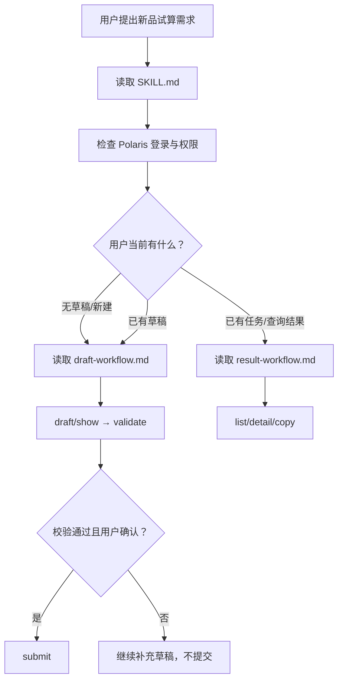

# 新品计算器 Skill 优化架构

## 1. 架构目标

将当前单文件说明重构为“核心路由 + 条件参考”的三文件结构，让 Agent 在不同任务分支只加载必要内容。

## 2. 目标结构

```text
opscli/skills/templates/ops-new-product-calculator/
├── SKILL.md
├── references/
│   ├── draft-workflow.md
│   └── result-workflow.md
└── data/
    └── VERSION.json
```

不新增脚本和资产。

## 3. 组件职责

### 3.1 SKILL.md

职责：

- 声明触发条件。
- 识别用户处于新建草稿、继续草稿或查询/复用任务。
- 执行认证、反馈、提交确认和敏感信息保护等全局门禁。
- 给出命令速查。
- 给出创建页、列表页和结果详情页的 Web 路由速查。
- 指示何时读取对应参考文件。

禁止承载：

- 完整 JSON 示例。
- 全量字段映射。
- 长费用结果模板。
- 分支专属排障细节。

### 3.2 references/draft-workflow.md

职责：

- 新建草稿和继续草稿的详细步骤。
- 第一阶段下拉项及默认值。
- CSV 与 `draft.json` 的关系。
- 字段约束和可验证 JSON 示例。
- `show`、`validate`、`submit` 的详细用法。
- Web 创建页入口。

加载条件：

- 用户要新建、填写、查看、校验或提交草稿。

### 3.3 references/result-workflow.md

职责：

- 已有任务的列表、详情和复制流程。
- 完整结果回复格式。
- Web 详情页和敏感 `sudo` 处理。
- Web 列表页入口。
- 结果查询排障。

加载条件：

- 用户要查询最终结果、查找任务或复制既有试算。

### 3.4 tests/skills/test_ops_new_product_calculator_skill.py

职责：

- 验证主文件结构和引用边界。
- 验证参考文件存在及关键命令覆盖。
- 从草稿参考文件读取 JSON 并调用真实校验函数。
- 防止版本号被本次优化意外修改。

## 4. 运行数据流



## 5. 错误处理

全局错误处理留在主文件，确保任何分支都能看到：

| 条件 | 行为 |
|---|---|
| 未登录、Token 过期、401、Polaris JWT 无效 | 使用 `ops-auth` 处理，不提交失败反馈 |
| 任意其他 `opscli calculator` 命令失败 | 立即使用 `ops-feedback` 提交结构化反馈，再继续诊断 |
| `validate` 返回业务校验错误 | 提交反馈后解释最关键问题，不允许进入 `submit` |
| 输出目录已有草稿 | 停止并改用新的空目录 |
| `detail` 超时 | 使用 `list` 查看状态，稍后重试 |

## 6. 测试策略

### RED

先增加以下断言并观察预期失败：

- 两个参考文件必须存在。
- 主文件必须包含三类入口和条件加载指令。
- 草稿参考必须覆盖 `show`。
- 结果参考必须覆盖 `copy`。
- 主文件不得包含完整 JSON 代码块。
- 主文件行数满足精简上限。
- 主文件及分支参考包含三个完整 Web 路由。

### GREEN

创建参考文件并最小化重写主文件，直到新增和既有契约通过。

### REFACTOR

- 删除跨文件重复规则。
- 校验所有命令与 CLI 源码一致。
- 运行聚焦测试和相关 Skill 测试。
- 审查 `VERSION.json` 未发生变化。

## 7. 兼容性

- Skill 名称和安装路径不变。
- frontmatter 仍只使用 `name`、`description`。
- CLI 命令和用户操作路径不变。
- 原有完整 JSON 示例迁移但不删除，真实校验继续有效。
- 版本保持 `v0.0.1`。
