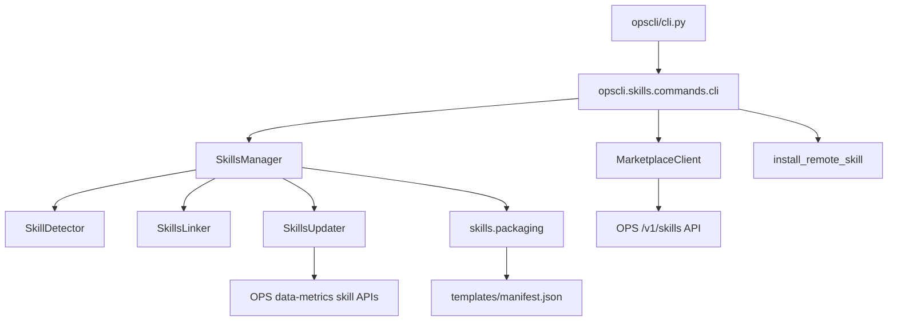
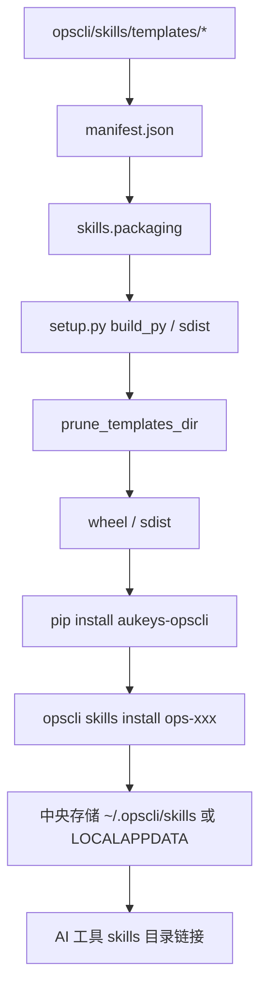
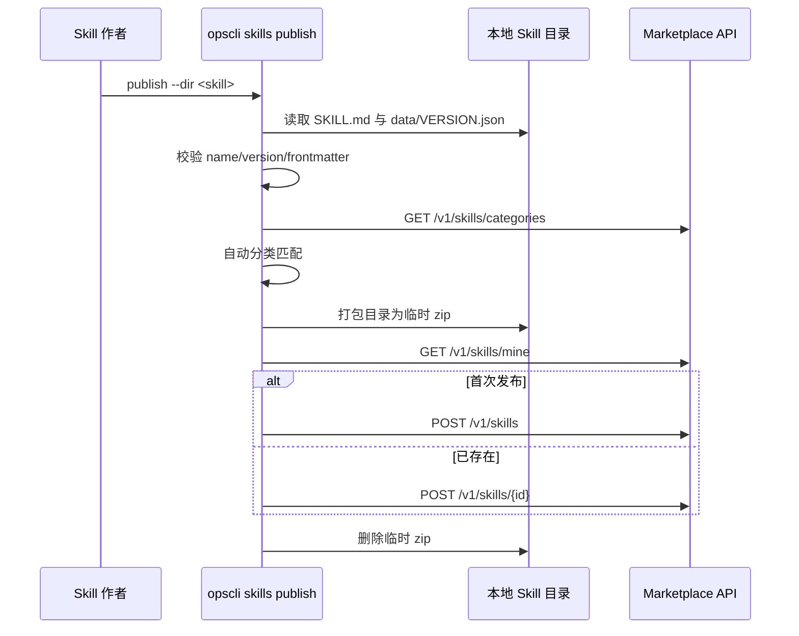
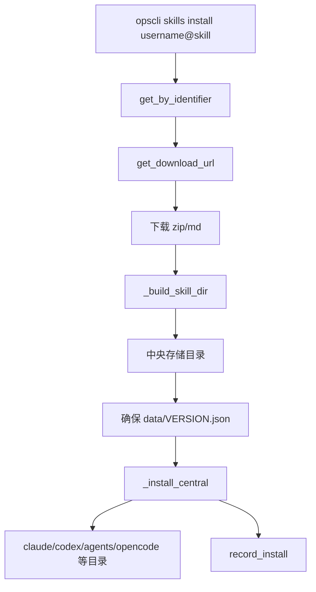
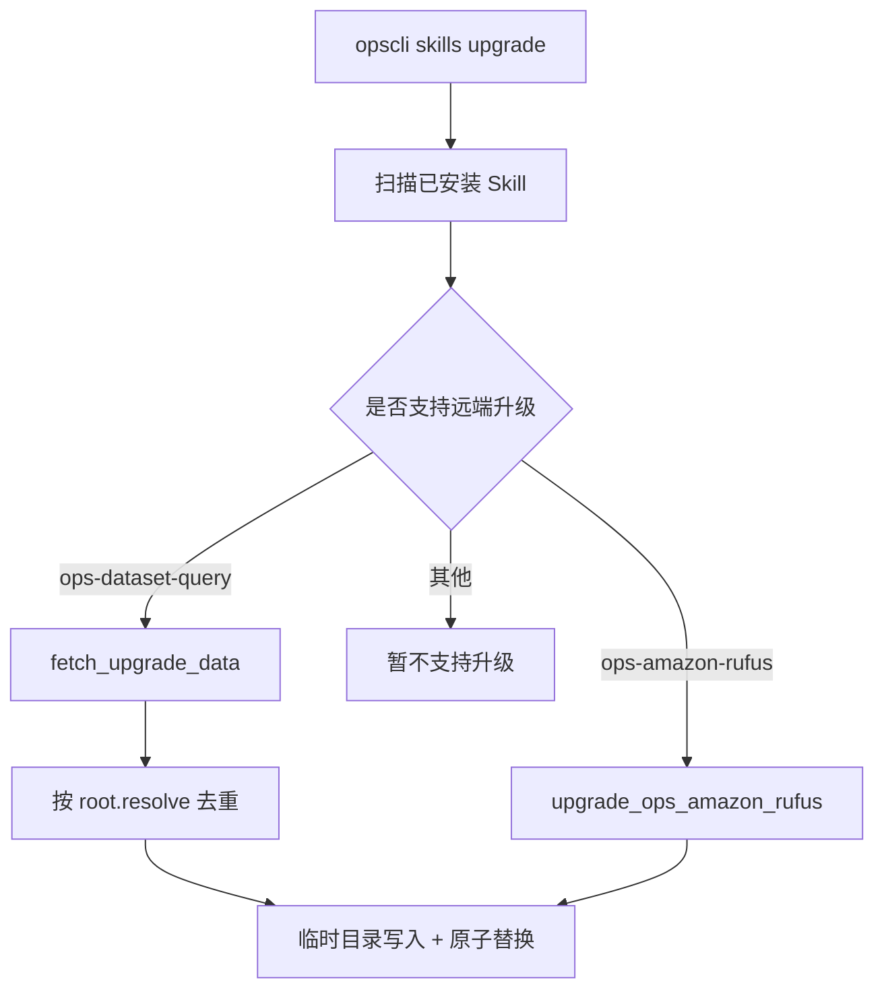

# opscli Skills 发布架构

## 模块分层

## 本地模板发布到发行包

关键点：

- `manifest.json` 控制准入。
- `setup.py` 只负责根据准入裁剪，不定义业务白名单。
- 运行时 `SkillsManager.list_templates()` 只扫描当前发行包实际存在的模板，因此构建裁剪直接决定可安装项。

## 技能广场发布

接口映射：

- `MarketplaceClient.create_skill()` -> `POST /v1/skills`
- `MarketplaceClient.full_update_skill()` -> `POST /v1/skills/{id}`
- `MarketplaceClient.delete_skill()` -> `DELETE /v1/skills/{id}`
- `MarketplaceClient.get_download_url()` -> `GET /v1/skills/{id}/download[/version]`

## 广场远程安装

## 远端数据升级

当前 `status()` 只对 `ops-dataset-query` 补远端 manifest 摘要；`upgrade()` 明确限制在 `ops-dataset-query` 和 `ops-amazon-rufus`。

## 数据模型

本地安装识别条件：

- 目录名等于 Skill 名称。
- `data/VERSION.json` 存在时读取版本。
- 若 `data/` 存在但版本文件缺失，兜底为 `v0.0.0`。

安装结果：

- `SkillInstallResult` 记录目标 runtime、目标路径、版本、是否覆盖、中央目录、链接方式。
- `SkillBatchInstallResult` 聚合一个 Skill 安装到多个工具的结果。

升级结果：

- `SkillUpgradeResult` 记录 from/to version、runtime、目标目录、是否更新、字段数。
- `SkillBatchUpgradeResult` 按版本变化和字段数聚合多个工具结果。

## 发布链路建议

纯本地模板：

- 只需要目录和 manifest，不需要改业务代码。
- 验证重点是 `tests/skills/test_packaging.py` 和安装测试。

远端可升级模板：

- 需要后端提供 manifest/export 类接口。
- 需要 `SkillsUpdater` 和 `SkillsManager` 显式分发。
- 需要覆盖远端错误、原子写入、同版本刷新、缺失接口兼容等测试。

广场共享：

- 走 `opscli skills publish`，不等于进入 `aukeys-opscli` 包。
- 版本来源是 Skill 自己的 `data/VERSION.json`，不是 `pyproject.toml`。

