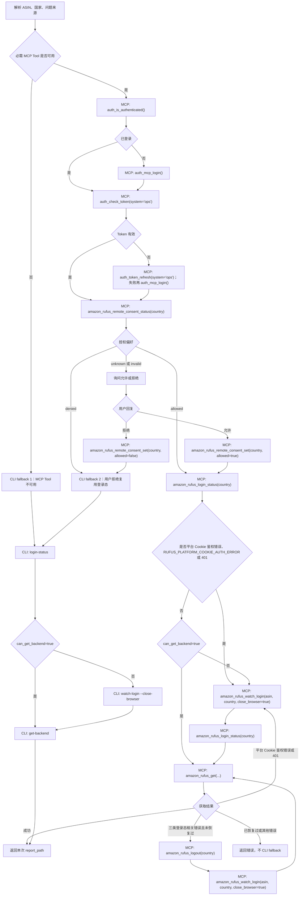

# Rufus CLI Fallback 限域流程架构

日期：2026-06-10

## 总体设计

本次变更不新增 Rufus 核心能力，而是调整 Agent 编排规则：

```text
MCP 优先
  -> 仅两个白名单场景允许 CLI fallback
  -> 其他错误保持 MCP 内恢复或直接失败
```

核心原则：

1. CLI fallback 是 Skill 编排层行为，不扩展 MCP schema。
2. CLI fallback 只调用已有脱敏 CLI 指令。
3. 平台 Cookie 鉴权错误按用户要求进入 MCP `amazon_rufus_watch_login`。
4. 所有路径最终只输出本次 `report_path`。

## 决策表

| 条件 | 主动作 | 后续动作 | CLI fallback |
| --- | --- | --- | --- |
| 必需 MCP Tool 不可用 | 使用 CLI | `login-status -> watch-login -> get-backend` | 允许 |
| 用户拒绝 remote-consent | 保存拒绝偏好 | CLI `login-status -> watch-login -> get-backend` | 允许 |
| 用户允许 remote-consent | MCP 获取 | `login-status -> amazon_rufus_get` | 不允许 |
| `RUFUS_PLATFORM_COOKIE_AUTH_ERROR` | MCP 登录采集 | `amazon_rufus_watch_login -> amazon_rufus_get` | 不允许 |
| HTTP 401 | MCP 登录采集 | `amazon_rufus_watch_login -> amazon_rufus_get` | 不允许 |
| `RUFUS_SECRET_NOT_READY` | MCP 一次恢复 | `logout -> watch_login -> get` | 不允许 |
| Headless capture/request 错误 | MCP 一次恢复 | `logout -> watch_login -> get` | 不允许 |
| 其他错误 | 返回错误 | 无 | 不允许 |

## 流程图



## CLI fallback 子流程

### 入口

CLI fallback 只由两个入口调用：

- `fallback_reason="mcp_tools_unavailable"`
- `fallback_reason="remote_consent_denied"`

实现文档和测试应避免使用泛化文案，例如“失败后使用 CLI”。

### 登录态检查

```powershell
uv run opscli amazon-rufus login-status <COUNTRY> --pretty
```

若 `can_get_backend=false`：

```powershell
uv run opscli amazon-rufus watch-login <ASIN> <COUNTRY> --close-browser --pretty
```

### 获取

默认题库：

```powershell
uv run opscli amazon-rufus get-backend <ASIN> <COUNTRY> --skills-dir ".agents/skills"
```

单题：

```powershell
uv run opscli amazon-rufus get-backend <ASIN> <COUNTRY> -q "<问题>"
```

多题：

```powershell
uv run opscli amazon-rufus get-backend <ASIN> <COUNTRY> -q "<问题1>" -q "<问题2>"
```

## MCP 平台 Cookie 鉴权错误处理

用户要求：当判断为 OPS 平台 Cookie 鉴权错误、`RUFUS_PLATFORM_COOKIE_AUTH_ERROR` 或 401 时，走：

```text
amazon_rufus_watch_login(asin, country, close_browser=true)
```

因此新文档需要删除旧规则：

```text
RUFUS_PLATFORM_COOKIE_AUTH_ERROR 时不得 watch_login
```

新规则：

1. 不执行 CLI fallback。
2. 不直接重复 `amazon_rufus_get`。
3. 执行一次 `amazon_rufus_watch_login`。
4. 采集后按原问题来源重试 `amazon_rufus_get`。
5. 如果 `watch_login` 或重试仍失败，直接报错。

## 需要修改的文件

### Skill 模板和安装副本

- `opscli/skills/templates/ops-amazon-rufus/SKILL.md`
- `opscli/skills/templates/ops-amazon-rufus/README.md`
- `opscli/skills/templates/ops-amazon-rufus/references/rufus-mcp-workflow.md`
- `.agents/skills/ops-amazon-rufus/SKILL.md`
- `.agents/skills/ops-amazon-rufus/README.md`
- `.agents/skills/ops-amazon-rufus/references/rufus-mcp-workflow.md`

### 安装后引导

- `opscli/skills/commands/cli.py`

需要把 `_AMAZON_RUFUS_NEXT_STEPS` 改成 bounded CLI fallback。

### 测试

- `tests/skills/test_ops_amazon_rufus_updater.py`
- `tests/skills/test_cli.py`
- 可能涉及 `tests/amazon_rufus/test_transport.py`
- 可能涉及 `tests/amazon_rufus/test_core.py`

旧断言需要调整：

- 不再断言 `MCP-only` 是绝对规则。
- 不再禁止所有 `opscli amazon-rufus get-backend/watch-login/login-status` 文案。
- 不再断言 `RUFUS_PLATFORM_COOKIE_AUTH_ERROR` 必须阻止 `watch_login`。

新断言应覆盖：

- 只允许两个 CLI fallback 原因。
- 文档中不得出现“任意失败后使用 CLI”。
- 401 分支进入 MCP watch_login。

## 质量门禁

实现阶段建议执行：

```powershell
.venv/Scripts/python.exe -m pytest "tests/skills/test_ops_amazon_rufus_updater.py" -q
.venv/Scripts/python.exe -m pytest "tests/skills/test_cli.py" -q
.venv/Scripts/python.exe -m pytest "tests/mcp/test_amazon_rufus_tools.py" -q
```

如果修改了 Python 逻辑，再追加：

```powershell
.venv/Scripts/python.exe -m pytest "tests/amazon_rufus/test_transport.py" "tests/amazon_rufus/test_core.py" -q
```

## 风险

1. 401 走 `watch_login` 可能无法修复真实 OPS 鉴权失效，因为 `watch_login` 保存远端 content 仍可能依赖 OPS 平台 Cookie API。
2. CLI fallback 会重新引入本机环境差异，需要文档明确使用项目 uv 环境。
3. 文档契约测试当前禁止 CLI 指令，需要成组更新，避免模板和 `.agents` 副本不一致。
