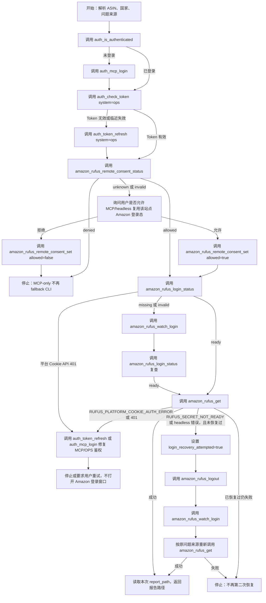

# Rufus Skill MCP 全链路改造架构

日期：2026-06-09

## 总体设计

本次改造采用“业务逻辑不复制，MCP 工具补齐”的方式。

已有业务层：

- `RufusManager.get_backend()`
- `RufusManager.login_status()`
- `RufusManager.watch_login()`
- `RufusManager.logout()`
- `RemoteConsentStore.status()`
- `RemoteConsentStore.save()`

新增 MCP 工具只做四件事：

1. 绑定当前 MCP 请求的隔离凭证目录。
2. 调用已有 manager/store 方法。
3. 转换为统一 MCP 成功/失败结构。
4. 返回脱敏 allowlist，不暴露敏感材料。

## MCP 工具清单

| MCP Tool | 节点职责 | 底层实现 | 输出要求 |
| --- | --- | --- | --- |
| `amazon_rufus_remote_consent_status` | 读取国家站点授权偏好 | `RemoteConsentStore.status()` | 只返回国家、状态、布尔偏好、更新时间、来源 |
| `amazon_rufus_remote_consent_set` | 保存允许/拒绝偏好 | `RemoteConsentStore.save(source="mcp")` | 只返回授权摘要 |
| `amazon_rufus_login_status` | 检查 Rufus 获取前登录态 | `RufusManager.login_status()` | 只返回脱敏状态摘要 |
| `amazon_rufus_watch_login` | 打开/连接 Chrome，等待用户登录并保存 seed | `RufusManager.watch_login()` | 只返回保存摘要 |
| `amazon_rufus_logout` | 清理远端 Rufus 状态和可选调试 profile | `RufusManager.logout()` | 只返回清理摘要 |
| `amazon_rufus_get` | 获取 Rufus 回答并写报告 | `RufusManager.get_backend()` | 只返回 `report_path` 与计数摘要 |

不新增公开 `platform_cookie_get` MCP Tool。平台 Cookie content 只允许 manager 内部读写。

## 凭证和偏好隔离

### RufusManager 工厂

继续使用现有 `_rufus_manager_for_current_request()`：

```text
_get_credential_dir()
  -> HTTP/SSE: API Key + Agent 名称隔离目录
  -> stdio: None，复用默认 CLI 凭证目录
AuthClient(base_dir=cred_dir)
RufusTransportClient(auth_client=auth_client)
RufusManager(transport_client=transport)
```

### RemoteConsentStore 工厂

新增 MCP 专用工厂：

```text
_rufus_remote_consent_store_for_current_request()
  -> cred_dir = _get_credential_dir()
  -> HTTP/SSE: RemoteConsentStore(base_dir=cred_dir / "amazon-rufus")
  -> stdio: RemoteConsentStore()
```

原因：

1. remote-consent 是当前用户偏好，虽然不含登录态，也不能被多用户 MCP Server 共享。
2. stdio 模式仍保持与本机 CLI 兼容，复用默认 `~/.config/opscli/amazon-rufus/remote-consent.json`。
3. HTTP/SSE 模式按 API Key + Agent 名称隔离，匹配 MCP auth/query 现有凭证隔离策略。

## 主流程图



## 节点说明

### A：解析输入

职责：

- 提取 ASIN。
- 提取国家站点，如 `US`、`DE`、`JP`。
- 判断问题来源：
  - 单题传 `question`。
  - 多题传 `questions`。
  - 用户未给问题时传 `skills_dir=".agents/skills"`。
- 初始化本轮内存状态 `login_recovery_attempted=false`。

禁止：

- 不读取历史报告路径。
- 不把多个问题拼成一个字符串。

### B-C：MCP 登录检查

职责：

- `auth_is_authenticated()` 判断当前 MCP 会话是否有有效 session。
- 未登录时调用 `auth_mcp_login()`。

处理：

- `auth_mcp_login` 成功后继续。
- 若 MCP 认证仍失败，停止本次 Rufus 流程。

禁止：

- 不执行 `opscli auth login`。
- 不让用户切换到 CLI 刷新 Token。

### D-E：OPS Token 检查和刷新

职责：

- 使用 `auth_check_token(system="ops")` 检查 JWT。
- 失效时调用 `auth_token_refresh(system="ops")`。

处理：

- 刷新成功后继续。
- 刷新失败时可再次 `auth_mcp_login()`，仍失败则停止。

### F-H：远程授权偏好

职责：

- `amazon_rufus_remote_consent_status(country)` 读取偏好。
- `unknown/invalid` 时询问用户。
- 用户允许时 `amazon_rufus_remote_consent_set(country, allowed=true)`。

输出：

- 偏好状态，不含任何 Amazon 登录态。

### I-J：用户拒绝授权

职责：

- 保存拒绝偏好。
- 停止 Rufus 获取。

原因：

- MCP-only 模式不再允许用 CLI `get-backend` 绕过该分支。
- 用户拒绝复用登录态时，系统没有合规的无登录态 Rufus 获取路径。

### K：登录态检查

职责：

- `amazon_rufus_login_status(country)` 读取平台 Cookie content 的脱敏可用性摘要。

分支：

- `ready`：继续获取。
- `missing/invalid`：进入登录采集。
- `RUFUS_PLATFORM_COOKIE_AUTH_ERROR` 或 401：进入 MCP/OPS 鉴权修复，不进入登录采集。

### N-O：Amazon 登录采集

职责：

- `amazon_rufus_watch_login(asin, country, close_browser=true)` 打开或连接 Chrome。
- 用户在浏览器中完成 Amazon 登录。
- 工具捕获 `/rufus/cl/streaming` 请求种子并保存到 OPS 平台 Cookie content。
- 采集后再次 `amazon_rufus_login_status(country)` 确认 ready。

输出：

- `login_detected`
- `streaming_request_saved`
- cookie 数量和 origin 数量

禁止：

- 不返回 cookie、headers、payload、`storage_state`、seed request。

### P：Rufus 获取

职责：

- `amazon_rufus_get(...)` 调用后端/headless 链路获取答案。
- 写入 `output/amazon-rufus/<ASIN>-YYYYMMDD-HHMMSS.md`。
- 返回本次 `report_path`。

禁止：

- 不按 ASIN 查历史报告兜底。
- 不输出 upload payload。

### R-U：一次恢复

触发条件：

- `RUFUS_SECRET_NOT_READY`
- `RUFUS_HEADLESS_CAPTURE_ERROR`
- `RUFUS_HEADLESS_REQUEST_ERROR`
- 且 `login_recovery_attempted=false`

步骤：

1. 设置 `login_recovery_attempted=true`。
2. 调用 `amazon_rufus_logout(country)`。
3. 调用 `amazon_rufus_watch_login(asin, country, close_browser=true)`。
4. 按原问题来源重新调用 `amazon_rufus_get`。

禁止：

- 不对 OPS/MCP 鉴权错误执行恢复。
- 不打开第二次登录窗口。

## 需要修改的文件

### MCP 工具层

- `opscli/mcp/tools/amazon_rufus.py`

改动：

- 新增 5 个 MCP Tool。
- 新增 remote-consent store 工厂。
- 新增各工具 allowlist payload builder。
- 将新工具加入 `_ALL_TOOLS`。

### Skill 文档层

- `opscli/skills/templates/ops-amazon-rufus/SKILL.md`
- `opscli/skills/templates/ops-amazon-rufus/README.md`
- `opscli/skills/templates/ops-amazon-rufus/references/rufus-mcp-workflow.md`
- `.agents/skills/ops-amazon-rufus/SKILL.md`
- `.agents/skills/ops-amazon-rufus/README.md`
- `.agents/skills/ops-amazon-rufus/references/rufus-mcp-workflow.md`

改动：

- 替换 CLI 命令为 MCP Tool。
- 删除拒绝远程授权后的 CLI fallback。
- 删除 MCP 不可见时用 CLI 兼容入口。
- 保留敏感字段禁止输出规则。

### 安装引导

- `opscli/skills/commands/cli.py`

改动：

- `_AMAZON_RUFUS_NEXT_STEPS` 改为 MCP Tool 链路。
- 不再输出 `opscli amazon-rufus watch-login` 或 `opscli amazon-rufus get-backend`。

### 测试

- `tests/mcp/test_amazon_rufus_tools.py`
- `tests/skills/test_ops_amazon_rufus_updater.py`
- `tests/skills/test_cli.py`

改动：

- 断言新 MCP 工具暴露。
- 断言敏感字段过滤。
- 断言 Skill 文档不含运行期 CLI fallback。
- 断言安装后引导为 MCP-only。

## 测试策略

1. MCP 工具注册：
   - `amazon_rufus_get`
   - `amazon_rufus_remote_consent_status`
   - `amazon_rufus_remote_consent_set`
   - `amazon_rufus_login_status`
   - `amazon_rufus_watch_login`
   - `amazon_rufus_logout`

2. MCP wrapper 行为：
   - monkeypatch manager/store，验证参数传递。
   - 验证 `watch_login` 和 `logout` 在线程中执行，不阻塞事件循环。
   - 验证 `_get_credential_dir()` 在 RemoteConsentStore 中生效。

3. 安全过滤：
   - `amazon_rufus_get` 不返回敏感字段。
   - `watch_login` 不返回 `storage_state` 或 seed request。
   - `login_status` 不返回 content。

4. 文档约束：
   - Skill 主流程不出现 `opscli amazon-rufus get-backend`。
   - Skill 主流程不出现 `opscli auth login`。
   - 文档明确 denied 状态停止。

## 实施顺序

1. 更新 MCP 工具和单测。
2. 更新 Skill 模板和 `.agents` 副本。
3. 更新安装引导和单测。
4. 运行定向测试。
5. 修改代码后追加 `docs/change-log-pending.md`。

## 风险和处理

1. 风险：MCP Tool 打开 Chrome 的行为可能被部分宿主超时截断。
   - 处理：保留 `timeout_seconds`，并在 Skill 文档说明该工具是阻塞采集工具；后续如需要再设计异步 job。

2. 风险：用户拒绝授权后没有 CLI fallback。
   - 处理：这是新需求的直接结果。Skill 必须停止并说明 MCP-only 需要授权。

3. 风险：remote-consent 从默认本机目录迁移到 MCP 隔离目录后，HTTP/SSE 用户需要重新确认一次偏好。
   - 处理：这是正确隔离带来的预期行为，文档中说明不同 MCP 用户偏好互相独立。
