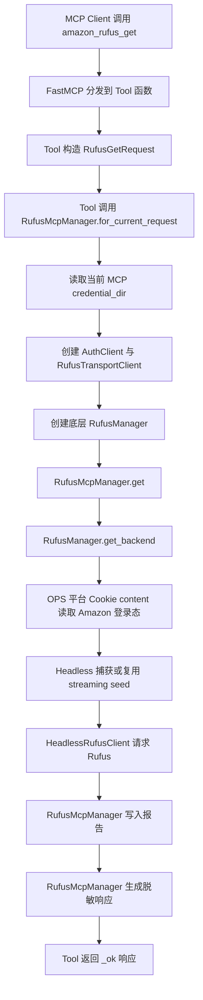
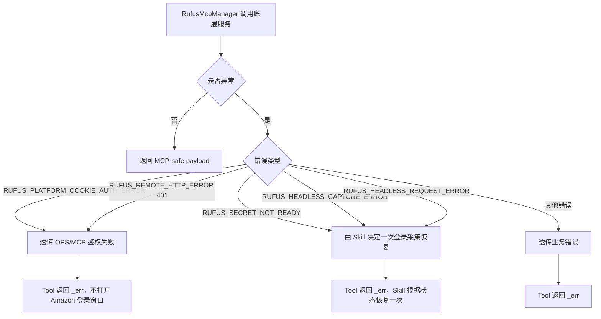

# Rufus MCP 标准架构对齐方案

日期：2026-06-10

## 架构原则

1. MCP Tool 是入口，不是业务层。
2. CLI 和 MCP 共享底层 `RufusManager`，但不能共享输出策略。
3. MCP-facing 响应必须集中脱敏。
4. 凭证隔离由 MCP façade 统一处理。
5. 敏感状态只存在于 OPS 平台 Cookie content 和内部 service 链路。

## 目标分层

```text
opscli/mcp/server.py
  -> opscli/mcp/tools/amazon_rufus.py
       只注册 FastMCP Tool
       只构造 request
       只调用 RufusMcpManager
       只做 _ok/_err

opscli/amazon_rufus/services/mcp_manager.py
  -> RufusMcpManager
       处理 MCP 凭证目录
       创建 AuthClient / RufusTransportClient
       创建 RufusManager / RemoteConsentStore
       统一调用底层业务
       统一生成 MCP-safe payload
       统一写报告

opscli/amazon_rufus/services/manager.py
  -> RufusManager
       保留现有 Rufus 业务编排
       不感知 MCP response schema

opscli/amazon_rufus/transport/client.py
  -> RufusTransportClient
       访问 OPS 平台 Cookie API 和 Rufus upload API
```

## 目标流程图



## 推荐新增模型

路径建议：

```text
opscli/amazon_rufus/domain/mcp_models.py
```

### `RufusGetRequest`

字段：

- `asin: str`
- `country: str`
- `question: str | None`
- `questions: list[str] | None`
- `skills_dir: str | None`
- `timeout_seconds: int`

说明：

- 不包含 `cookie`、`headers`、`storage_state`、`payload_template`。
- 不包含 CDP 选项，CDP 只属于登录采集工具。

### `RufusWatchLoginRequest`

字段：

- `asin: str`
- `country: str`
- `timeout_seconds: int`
- `chrome_path: str | None`
- `launch_if_needed: bool`
- `close_browser: bool`

说明：

- 允许 `chrome_path`，因为这是登录采集入口。
- 不允许传 cookie 或 curl。

### `RufusRemoteConsentRequest`

字段：

- `country: str`
- `allowed: bool | None`

说明：

- `allowed is None` 表示读取状态。
- `allowed is not None` 表示保存偏好。

### `RufusMcpResult`

字段建议：

- `payload: dict`

方法：

- `to_dict() -> dict`

约束：

- `payload` 只能是 MCP-safe 字段。
- 构造时执行敏感字段 denylist 检查。

## 推荐新增服务

路径建议：

```text
opscli/amazon_rufus/services/mcp_manager.py
```

接口草案：

```python
class RufusMcpManager:
    """Rufus MCP-facing 编排服务。"""

    @classmethod
    def for_current_request(cls, credential_dir: Path | None = None) -> "RufusMcpManager":
        """按当前 MCP 请求创建隔离 manager。"""

    def remote_consent_status(self, country: str) -> dict:
        """读取授权偏好脱敏摘要。"""

    def remote_consent_set(self, country: str, allowed: bool) -> dict:
        """保存授权偏好并返回脱敏摘要。"""

    def login_status(self, country: str) -> dict:
        """返回登录态脱敏摘要。"""

    def watch_login(self, request: RufusWatchLoginRequest) -> dict:
        """执行登录采集并返回脱敏摘要。"""

    def logout(self, country: str, include_browser_profile: bool = True) -> dict:
        """清理状态并返回脱敏摘要。"""

    def get(self, request: RufusGetRequest) -> dict:
        """获取 Rufus 回答，写报告，只返回报告摘要。"""
```

## MCP Tool 目标形态

以 `amazon_rufus_get` 为例：

```python
async def amazon_rufus_get(...):
    try:
        request = RufusGetRequest(...)
        data = await asyncio.to_thread(
            lambda: _rufus_mcp_manager_for_current_request().get(request)
        )
        return _ok(data)
    except Exception as exc:
        return _rufus_error("amazon_rufus_get", exc, call_params)
```

Tool 层允许保留：

- `asyncio.to_thread`
- call_params
- `_ok/_err`
- `_ALL_TOOLS`
- `register(mcp)`

Tool 层不再保留：

- `AnswerReportWriter`
- `RemoteConsentStore`
- `RufusTransportClient`
- payload allowlist 函数

## 凭证隔离

目标工厂逻辑：

```text
Tool 层：
  _get_credential_dir()
  -> 传给 RufusMcpManager.for_current_request(credential_dir)

RufusMcpManager：
  credential_dir is None
    -> stdio 模式，AuthClient()，RemoteConsentStore()
  credential_dir exists
    -> HTTP/SSE 模式，AuthClient(base_dir=credential_dir)
    -> RemoteConsentStore(base_dir=credential_dir / "amazon-rufus")
```

这样保持：

1. HTTP/SSE 多用户隔离。
2. stdio 与 CLI 共享默认本机凭证。
3. Rufus 状态读写仍通过 OPS 平台 Cookie content。

## 错误流程



## 敏感字段治理

集中放在 `RufusMcpManager`：

```text
禁止出现在 MCP response：
  cookie
  authorization
  localStorage
  storage_state
  headers
  payload
  payload_template
  seed_request
  request_body
  request_headers
  upload_payload
  platform cookie content
```

建议实现：

1. allowlist builder 继续存在，但移动到 `mcp_manager.py`。
2. 新增 `_assert_no_sensitive_keys(payload)`，仅在测试或开发模式中启用也可以。
3. 测试覆盖所有 Tool 成功响应。

## 改造步骤

1. 新增 `domain/mcp_models.py`。
2. 新增 `services/mcp_manager.py`。
3. 将 `amazon_rufus.py` 中的：
   - `_rufus_manager_for_current_request`
   - `_remote_consent_store_for_current_request`
   - `_build_*_payload`
   - `_build_success_payload`
   迁移到 `RufusMcpManager`。
4. `amazon_rufus.py` 改成薄 Tool。
5. 调整测试：
   - 旧 Tool 测试中 monkeypatch `_rufus_manager_for_current_request` 的部分，改为 monkeypatch `_rufus_mcp_manager_for_current_request`。
   - 新增 `test_mcp_manager.py` 测 manager 内部行为。
6. 跑定向测试。
7. 更新 `docs/change-log-pending.md`。

## 与当前 MCP-only 文档关系

已有 `output/rufus-mcp-only-flow-architecture.md` 描述的是“补齐 MCP-only 能力”。本方案描述的是下一层“架构收敛”：

```text
MCP-only 能力补齐
  -> 确保 Skill 不再使用 CLI

标准架构对齐
  -> 确保 MCP Tool 层像 Keepa/SellerSprite 一样薄
```

两者不是互斥关系。当前代码已经基本完成第一步，下一步应做第二步。
