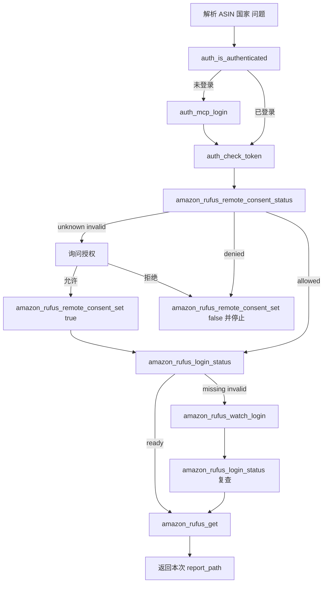

# Rufus MCP 标准架构对齐交互规范

日期：2026-06-10

## 说明

本需求没有前端页面。这里的 UIUX 指 Agent/MCP Tool 交互体验、Tool schema、返回结构和错误提示规范。

## 交互目标

1. Agent 只看到必要工具，不看到内部实现细节。
2. 用户只被要求确认授权或完成 Amazon 登录，不被要求复制 cookie、headers、curl 或本地文件。
3. 失败时能明确区分 OPS/MCP 鉴权失败与 Amazon 登录态失效。
4. 成功时只返回本次 `report_path` 和必要摘要。

## Tool 命名保留

保持当前 Tool 名称稳定：

- `amazon_rufus_remote_consent_status`
- `amazon_rufus_remote_consent_set`
- `amazon_rufus_login_status`
- `amazon_rufus_watch_login`
- `amazon_rufus_logout`
- `amazon_rufus_get`

不新增面向 Agent 的底层工具：

- 不新增 `amazon_rufus_platform_cookie_get`
- 不新增 `amazon_rufus_save_cookie`
- 不新增 `amazon_rufus_save_curl`
- 不新增 `amazon_rufus_get_headless_raw`

## 输入体验

### `amazon_rufus_get`

允许字段：

- `asin`
- `country`
- `question`
- `questions`
- `skills_dir`
- `timeout_seconds`

禁止字段：

- `cookie`
- `headers`
- `payload_template`
- `raw_curl`
- `storage_state`
- `seed_request`
- `cdp_url`
- `new_chrome`
- `keep_chrome_open`
- `launch_if_needed`

原因：

- 获取入口必须是后端/headless 默认链路。
- 登录采集相关能力只能由 `amazon_rufus_watch_login` 承担。

### `amazon_rufus_watch_login`

允许字段：

- `asin`
- `country`
- `timeout_seconds`
- `chrome_path`
- `launch_if_needed`
- `close_browser`

交互要求：

- Tool 内部打开或连接 Chrome。
- 用户只需要在浏览器完成 Amazon 登录。
- Agent 不要求用户回填“已登录”。
- Tool 完成后返回脱敏摘要。

## 成功响应规范

### `amazon_rufus_get`

返回：

```json
{
  "report_path": "output/amazon-rufus/B0TEST1234-YYYYMMDD-HHMMSS.md",
  "asin": "B0TEST1234",
  "country": "US",
  "question_count": 2,
  "answer_count": 2,
  "next_action": "已生成 Rufus 报告，请读取 report_path 查看完整答案。"
}
```

不得返回：

- Rufus 原始响应
- seed request
- upload payload
- cookie
- headers
- storage_state

### `amazon_rufus_login_status`

返回：

```json
{
  "country": "US",
  "status": "ready",
  "has_login_state": true,
  "can_get_backend": true,
  "session_cookie_count": 3,
  "has_streaming_request": true
}
```

不得返回平台 Cookie content。

### `amazon_rufus_watch_login`

返回：

```json
{
  "country": "US",
  "asin": "B0TEST1234",
  "saved": true,
  "login_detected": true,
  "cookie_count": 5,
  "origin_count": 1,
  "streaming_request_saved": true,
  "has_payload_template": true
}
```

不得返回完整 storage state 或 seed request。

## 错误提示规范

### OPS/MCP 鉴权失败

错误码：

- `RUFUS_PLATFORM_COOKIE_AUTH_ERROR`
- `RUFUS_REMOTE_HTTP_ERROR` 且 `status_code=401`
- `AUTH_NOT_LOGGED_IN`

Agent 行为：

```text
先调用 auth_token_refresh(system="ops") 或 auth_mcp_login()。
本轮不得执行 amazon_rufus_watch_login。
本轮不得重复调用 amazon_rufus_get。
```

用户提示：

```text
当前失败发生在 OPS/MCP 平台接口认证，不是 Amazon 未登录。请先完成 MCP 登录或刷新 OPS token。
```

### Amazon 登录态缺失或失效

错误码：

- `RUFUS_SECRET_NOT_READY`
- `RUFUS_HEADLESS_CAPTURE_ERROR`
- `RUFUS_HEADLESS_REQUEST_ERROR`

Agent 行为：

```text
当前 Skill 调用最多恢复一次：
amazon_rufus_logout -> amazon_rufus_watch_login -> amazon_rufus_get
```

用户提示：

```text
当前 Amazon 登录态不可用于 Rufus 获取，将打开目标站点登录窗口。请在浏览器中完成登录，工具会自动保存脱敏摘要。
```

## 授权确认文案

当 `remote_consent_status` 返回 `unknown` 或 `invalid` 时，使用固定文案：

```text
本次 Rufus 获取需要 Amazon 登录态。是否允许当前 MCP/headless 链路保存并复用该站点的 Amazon 登录状态？

说明：
- 保存的登录态仅供当前 MCP 用户和当前 Agent 隔离凭证使用，不会写入报告或对话回复。
- 登录态相当于已登录会话，请使用独立、干净的 Amazon 账号。
- 不建议在该 Amazon 账号中绑定信用卡或其他支付方式。
- 如果拒绝，本次 MCP-only Rufus 获取将停止，不会改用 opscli CLI。

请明确回复“允许”或“拒绝”。
```

## Agent 可见流程



## 可维护性要求

1. 文档只描述 Agent 调 MCP Tool，不描述 CLI fallback。
2. Tool docstring 使用中文，保持现有项目风格。
3. 错误文案必须稳定，便于 Skill 根据错误码分支。
4. 所有示例都使用 MCP Tool 名称，不使用 `opscli amazon-rufus ...`。
