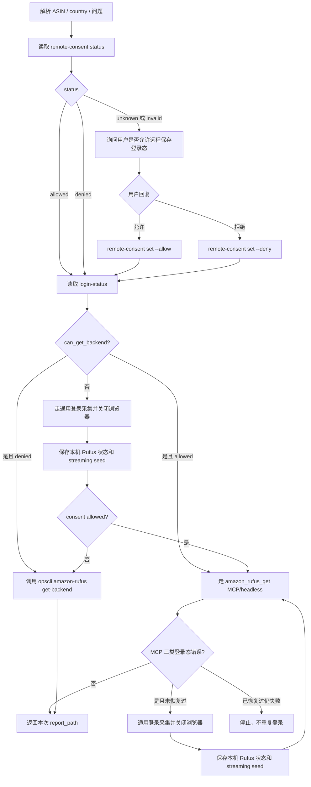

# Rufus 远程授权同意流程架构

日期：2026-06-08

## 总体设计

本次变更以最小改动接入现有 Rufus 模块：

1. 在 `opscli/amazon_rufus/services/` 下增加 consent 存储服务。
2. 在 `opscli amazon-rufus` CLI 下增加只读/写 consent 的正式入口。
3. 在 `opscli amazon-rufus` CLI 下增加脱敏登录态检查入口，供 Agent 在发起 Rufus 获取前判断是否需要登录采集。
4. 在 `opscli amazon-rufus` CLI 下增加复用 MCP/headless 获取逻辑的正式获取入口。
5. 更新 `ops-amazon-rufus` Skill 文档和 reference，使 Agent 先读取 consent，再检查本地登录态，最后选择 MCP 获取或 CLI 获取。
6. 不改 `amazon_rufus_get` MCP 入参，避免把 CDP、cookie、storage_state 等敏感或本地浏览器参数重新暴露给 MCP。

## 数据模型

沿用现有 `remote-consent.json` 的轻量结构：

```json
{
  "use_remote_authorization": true,
  "country": "US",
  "updated_at": "2026-06-08T00:00:00Z",
  "source": "codex-agent"
}
```

字段说明：

| 字段 | 类型 | 说明 |
|---|---|---|
| `use_remote_authorization` | bool | 是否允许保存并复用 Amazon 登录态供 MCP/headless 链路使用 |
| `country` | string | 本次用户确认适用的国家站点 |
| `updated_at` | string | UTC ISO 时间 |
| `source` | string | 写入来源，默认 `codex-agent` 或 `opscli` |

读取规则：

- 文件不存在：返回 unknown。
- JSON 无效：返回 invalid，Skill 按 unknown 处理并重新询问。
- country 不匹配：返回 unknown。
- `use_remote_authorization` 不是 bool：返回 invalid。

## 新增模块

建议新增：

- `opscli/amazon_rufus/services/remote_consent.py`

职责：

- 通过 `CONFIG_DIR / "amazon-rufus" / "remote-consent.json"` 定位文件。
- `load(country)` 返回脱敏摘要，不返回任何登录态。
- `save(country, allowed, source)` 原子写入 JSON。
- 只处理 consent，不读取 `browser-state-<COUNTRY>.json`。

## CLI 入口

建议新增 Typer 子命令组用于 consent：

```powershell
opscli amazon-rufus remote-consent status <COUNTRY> --pretty
opscli amazon-rufus remote-consent set <COUNTRY> --allow --pretty
opscli amazon-rufus remote-consent set <COUNTRY> --deny --pretty
```

返回示例：

```json
{
  "success": true,
  "command": "amazon-rufus remote-consent status",
  "data": {
    "country": "US",
    "status": "allowed",
    "use_remote_authorization": true,
    "updated_at": "2026-06-08T00:00:00Z"
  },
  "error": null
}
```

状态枚举：

- `allowed`：已同意且 country 匹配。
- `denied`：已拒绝且 country 匹配。
- `unknown`：未询问、文件缺失或 country 不匹配。
- `invalid`：文件存在但格式无效。

建议新增 Rufus CLI 获取命令：

```powershell
opscli amazon-rufus get-backend <ASIN> <COUNTRY> --skills-dir ".agents/skills"
opscli amazon-rufus get-backend <ASIN> <COUNTRY> --skills-dir ".agents/skills" -q "这是什么商品？"
opscli amazon-rufus get-backend <ASIN> <COUNTRY> --skills-dir ".agents/skills" -q "这是什么商品？" -q "这个商品评价如何？"
```

`get-backend` 的职责：

- 直接调用 `RufusManager.get_backend()`，与 MCP `amazon_rufus_get` 共享同一套后端凭证读取、headless 捕获和 streaming 请求逻辑。
- 写入 `AnswerReportWriter` 报告，并像现有 `get` 一样只输出报告文件路径。
- 支持 `--timeout`、`--skills-dir`、可重复 `-q/--question`、`--submit-upload` 等与现有 `get` 一致的业务参数。
- 不接收 cookie、headers、payload、`storage_state`、CDP URL 或 seed request 作为命令行参数。

建议新增脱敏登录态检查命令：

```powershell
opscli amazon-rufus login-status <COUNTRY> --pretty
```

返回示例：

```json
{
  "success": true,
  "command": "amazon-rufus login-status",
  "data": {
    "country": "US",
    "status": "ready",
    "has_login_state": true,
    "can_get_backend": true,
    "session_cookie_count": 6,
    "has_streaming_request": true
  },
  "error": null
}
```

状态枚举：

- `ready`：存在可用于后端/headless 获取的本地 Amazon 登录态。
- `missing`：未找到该国家站点的本地登录态。
- `invalid`：本地登录态文件存在但格式不可用，需要重新登录采集。

约束：

- `login-status` 只返回脱敏摘要，不返回 cookie 值、localStorage、`storage_state`、headers、payload、seed request 或完整状态 JSON。
- `login-status` 是 Skill 暴露的正式检查入口；Skill 不使用也不描述底层 `cookie status` 调试命令。

## Skill 编排流程



## 获取前登录态检查

发起任何 Rufus 获取前，必须先执行：

```powershell
opscli amazon-rufus login-status <COUNTRY> --pretty
```

判断规则：

- `can_get_backend=true`：说明本地已有可用于 Rufus 后端/headless 获取的 Amazon 登录态；继续按 consent 分支获取。
- `can_get_backend=false`：先执行通用登录采集 `watch-login <ASIN> <COUNTRY> --launch-if-needed --close-browser`，成功后再继续按 consent 分支获取。
- `status=invalid`：按无可用登录态处理，重新登录采集。

该检查只判断本机状态是否可用，不等价于用户是否同意远程授权；远程授权仍以 `remote-consent` 为准。

## 通用登录采集流程

同意和拒绝都复用同一个登录采集能力：

```powershell
opscli amazon-rufus watch-login <ASIN> <COUNTRY> --launch-if-needed --close-browser
```

流程要求：

- `watch-login` 负责打开或连接目标国家站点 Amazon 页面，等待用户完成登录，打开目标商品页并捕获 `/rufus/cl/streaming`。
- 捕获完成后保存本机 Rufus 状态和 streaming seed，供紧随其后的 MCP 或 CLI 获取使用。
- `--close-browser` 只关闭由 opscli 本次启动的调试浏览器；若连接的是用户已有浏览器，不强制关闭整个浏览器。
- 输出仅包含保存摘要，不展示 cookie、localStorage、headers、payload、seed request 或完整 `storage_state`。

## 同意路径

同意路径保持当前 MCP/headless 主线：

- 调用 `amazon_rufus_get(asin, country, question/questions/skills_dir)`。
- 若成功，写报告并返回 `report_path`。
- 若命中三类登录态错误，执行通用登录采集流程。
- 登录采集成功后重试 `amazon_rufus_get`。

实现选择：

- 优先给 `watch-login` 增加 `--close-browser/--keep-browser-open` 选项，默认保持现有行为以降低兼容风险。
- Skill 在同意远程授权的恢复路径使用 `--close-browser`。

## 拒绝路径

拒绝路径使用通用登录采集 + Rufus CLI 获取：

- 先执行 `opscli amazon-rufus login-status <COUNTRY> --pretty`。
- 如果 `can_get_backend=false`，执行 `opscli amazon-rufus watch-login <ASIN> <COUNTRY> --launch-if-needed --close-browser`。
- 登录采集成功后执行 `opscli amazon-rufus get-backend <ASIN> <COUNTRY> --skills-dir ".agents/skills"`。
- 单题使用 `-q "<问题>"`。
- 多题重复 `-q`。

关键约束：

- 拒绝路径不调用 `amazon_rufus_get` MCP 工具，不把 Rufus 获取委托给 MCP。
- 拒绝路径仍可复用本机登录采集产物，因为关闭浏览器后 CLI 需要读取本机状态继续请求 Rufus。
- CLI 获取结果与 MCP 一样只落报告并返回本次报告路径。

## 测试策略

遵循 TDD，先写失败测试再实现：

1. `RemoteConsentStore`：
   - 文件不存在返回 unknown。
   - country 匹配且 bool 合法返回 allowed/denied。
   - country 不匹配返回 unknown。
   - JSON 无效返回 invalid。
   - 写入不包含任何 cookie、headers、storage_state。

2. CLI：
   - `remote-consent status` 输出安全摘要。
   - `remote-consent set --allow/--deny` 写入预期 JSON。
   - `--allow` 和 `--deny` 不能同时传。
   - `get-backend` 调用 `RufusManager.get_backend()` 而不是 CDP `get()`。
   - `get-backend` 支持单题、多题和默认题库。
   - `get-backend` 输出报告路径并过滤敏感字段。
   - `login-status` 缺失状态返回 `can_get_backend=false`。
   - `login-status` 可用状态返回 `can_get_backend=true`，并过滤敏感字段。

3. Skill 文档：
   - updater 测试断言包含 remote-consent 读取、获取前 login-status 检查、未知时询问、允许走 MCP、拒绝走通用登录采集 + CLI `get-backend`。
   - 继续断言不出现 `amazon_rufus_get_remote` 和 `--remote-rufus`。

4. MCP/CLI 行为：
   - MCP schema 仍不暴露 CDP 和敏感字段。
   - `watch-login --close-browser` 成功后只关闭 opscli 本次启动的调试浏览器。
   - 登录恢复后的报告路径必须使用重试返回的最新 `report_path`。

5. 安装与子代理测试：
   - 执行 `opscli skills install ops-amazon-rufus --skills-dir ".agents/skills" --force`。
   - 启动子代理运行指定 `$ops-amazon-rufus` 提示词。
   - 覆盖至少两类配置：`use_remote_authorization=true` 和 `false`。

## 变更记录

正式编码修改 Python 或 Skill 文件后，需要按项目铁律追加变更记录到 `docs/change-log-pending.md`。当前阶段尚未编码，因此不写变更记录。
