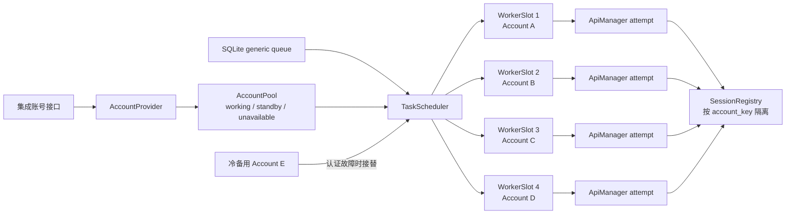
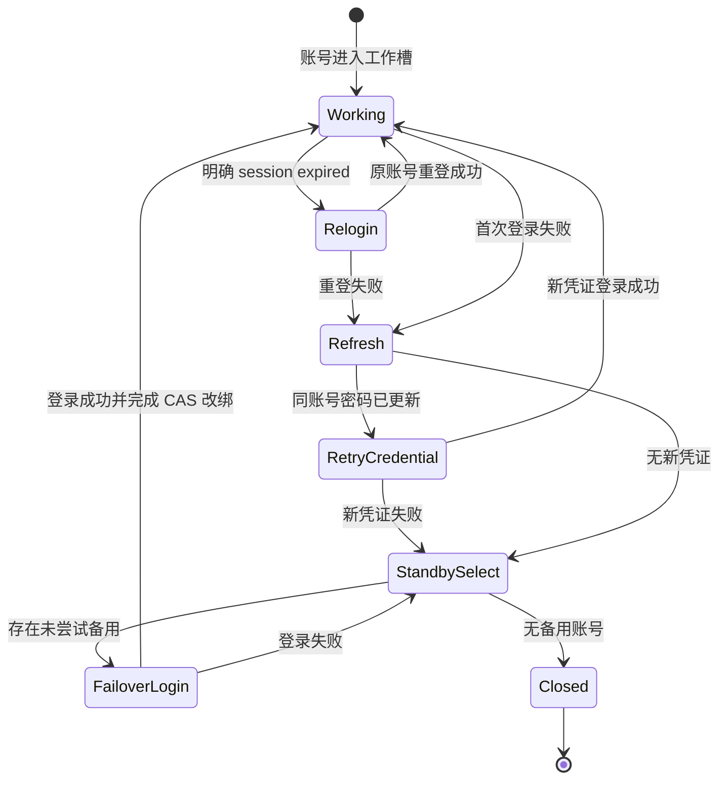

# 卖家精灵多账号并行与故障接替 Architecture

## 架构结论

在现有持久队列上增加进程内 `AccountPool`、最多 4 个 `WorkerSlot` 和按账号管理的 `SessionRegistry`。调度器是唯一编排者；AccountProvider 只提供账号，ApiManager 只执行显式账号的一次 attempt，QueueStore 负责原子领取和 generation CAS。



## 组件职责

### AccountProvider

扩展：

```python
list_accounts(*, refresh: bool = False) -> list[SellerSpriteAccount]
```

职责仅限：

- 调用现有集成账号接口；
- 保持接口顺序；
- 使用现有 TTL 缓存；
- 返回内存凭证对象；
- 对外摘要继续脱敏。

### AccountPool

新增进程内深模块，持有：

- 当前账号凭证版本；
- `working`、`standby`、`unavailable`、`removed` 状态；
- 账号接口顺序；
- 账号到 slot 的绑定；
- 本任务已尝试账号集合。

账号身份使用 `name.strip().casefold()` 和 `username.strip().casefold()` 规范化后加 domain prefix 计算 SHA-256 `account_key`，不把密码或完整用户名写入数据库。

### WorkerSlot

每个工作槽拥有：

- 稳定 slot id / worker key；
- 当前账号及凭证版本；
- 一个长期消费 task；
- 当前 `job_id/account_key/generation` 执行令牌；
- draining/closed 状态。

slot 循环一次只领取一个 generic 任务。账号失效后可改绑备用账号；备用耗尽则退出该 slot task。

### ApiManager

执行接口改为接收显式账号和 attempt root，不再在执行中调用 `get_default()`：

```python
await manager.run(request, account=account, attempt_root=attempt_root)
```

manager 负责同账号的登录、一次 session relogin、请求、解析和导出；通过结构化异常携带失败阶段和“是否为可安全重放的认证失败”。manager 不访问备用池。

### SessionRegistry

按 `account_key` 维护独立 API/browser 会话：

```python
await session_registry.close_account(account_key, purge_auth_state=False)
```

browser-route 关闭时必须：

1. 等待或取消该账号未完成的内部 queue；
2. 关闭 page/context/playwright；
3. 从 `_WORKERS` registry 移除；
4. 仅在凭证失效、移除或密码变化时清理旧认证状态；
5. 正常 scheduler close 只释放资源，不删除有效登录态。

### QueueStore

新增字段：

```text
task_kind
assigned_account_key
assignment_generation
failover_count
last_error_code
last_failed_account_key
retry_reason
```

新增账号事件表 `seller_sprite_account_events`，只保存脱敏登录/故障事件。

### AccountEventRecorder

登录与故障记录由一个窄接口统一写入，避免 scheduler、manager 和 session registry 各自拼装不同格式：

```python
record_account_event(
    event_type="account_login_failed",
    account=account,
    job_id=job_id,
    worker_key=worker_key,
    assignment_generation=generation,
    execution_mode=mode,
    login_stage="initial",
    error=exc,
    duration_ms=duration_ms,
    failover_count=failover_count,
    next_action="refresh_accounts",
)
```

Recorder 的写入顺序为：

1. 构造白名单字段并完成用户名、异常摘要脱敏；
2. 写结构化运行日志；
3. 写 `seller_sprite_account_events`；
4. SQLite 写入失败时仅补写 `account_audit_persistence_failed` 运行日志，不抛出覆盖业务异常。

登录失败事件的固定关联字段为：

| 字段 | 用途 |
| --- | --- |
| `account_key` | 跨事件关联同一脱敏账号身份 |
| `account_name` / `masked_username` | 运维识别，不暴露完整用户名 |
| `job_id` / `worker_key` | 关联任务与工作槽 |
| `assignment_generation` | 区分 failover 前后的执行代际 |
| `execution_mode` | 区分 `api-direct` 与 `browser-route` |
| `login_stage` | 区分首次登录、重登、新凭证和备用接替 |
| `error_code` / `error_summary` | 保存结构化、脱敏、限长错误 |
| `duration_ms` | 定位登录超时或快速拒绝 |
| `failover_count` / `next_action` | 还原失败后的接替决策 |

不得把异常对象原样序列化，也不得写登录请求/响应正文、密码、Cookie、JWT、API Key、完整用户名或请求头。

## 账号池规则

```python
working_count = 0 if not accounts else min(4, max(1, len(accounts) - 1))
working = accounts[:working_count]
standby = accounts[working_count:]
```

刷新协调：

- 健康账号身份和密码未变化：保留会话；
- unavailable 账号密码未变化：保持 unavailable；
- 密码变化：视为新凭证版本，可恢复使用；
- 新账号：先补空槽，剩余进入 standby；
- 被移除账号：当前任务结束后关闭；
- 接口失败：不修改现有池。

## 原子领取与代际隔离

### 领取

每个 slot 调用：

```python
claim_next_generic_for_account(
    queue_scope="seller_sprite",
    account_key=account_key,
    assigned_account=account.name,
    worker_key=slot.worker_key,
)
```

在 `BEGIN IMMEDIATE` 中：

1. 确认该账号没有 running；
2. 选择最早 generic queued；
3. 条件更新为 running；
4. 写入账号和 worker；
5. 增加 generation；
6. 返回执行令牌。

数据库使用 UNIQUE partial index 兜底同账号并发。

### CAS

以下操作必须同时匹配 `job_id + assigned_account_key + assignment_generation + status='running'`：

- finish task；
- fail task；
- MCP run 状态同步；
- failover 改绑；
- 成功 attempt 提升。

CAS 失败表示执行者已过期，只能丢弃自己的结果。

## 故障接替状态机



关键顺序：先通过 CAS 改绑任务，再创建 replacement 会话；replacement 登录失败则继续用新的 generation 改绑下一个候选。每账号每任务最多一个完整 attempt，保证有限终止。

## 任务与输出隔离

generic 和 Listing Analysis 使用 `task_kind` 分流。generic worker 不得领取 Listing Analysis。

每次执行写入：

```text
job-root/
  .attempts/
    1/
    2/
  params.json
  raw.json
  result.json
  export.*
```

job root 只包含当前 generation 成功提升的文件。

## Schema 迁移

迁移在一个事务内：

1. 增加新列及默认值；
2. 从 legacy `request_json` 回填 `task_kind`；
3. malformed queued 行标记 failed 并记录明确迁移错误；
4. legacy running 行不伪造账号键，阻止自动消费并提示人工 requeue/fail；
5. 校验无重复 running account key；
6. 创建部分唯一索引和账号事件表；
7. 更新 schema version 并提交。

## 计划修改面

主要文件：

```text
opscli/seller_sprite/accounts.py
opscli/seller_sprite/services/account_pool.py
opscli/seller_sprite/services/session_registry.py
opscli/seller_sprite/services/task_scheduler.py
opscli/seller_sprite/services/task_queue_store.py
opscli/seller_sprite/services/api_manager.py
opscli/seller_sprite/browser_route/worker.py
opscli/seller_sprite/domain/exceptions.py
tests/seller_sprite/test_accounts.py
tests/seller_sprite/test_account_pool.py
tests/seller_sprite/test_task_queue_store.py
tests/seller_sprite/test_task_scheduler.py
tests/seller_sprite/test_browser_route_worker.py
```

实现时以最小 diff 为准；只有被测试证明需要的模块才新增。

## 验证顺序

1. AccountProvider/AccountPool 单文件测试。
2. QueueStore schema、claim 和 CAS 测试。
3. Scheduler 并行与 failover 测试。
4. AccountEventRecorder 的登录失败字段、脱敏和审计降级测试。
5. Browser worker 关闭/registry 清理测试。
6. `pytest tests/seller_sprite -v`。
7. 全量 `pytest tests -v`。
8. 双轴 code review：项目规范与本 PRD。
